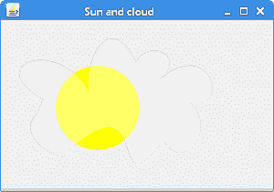

# 组成

> 原文： [https://zetcode.com/gfx/java2d/composition/](https://zetcode.com/gfx/java2d/composition/)

在 Java 2D 编程教程的这一部分中，我们定义了合成操作。

合成是将来自不同来源的视觉元素组合成单个图像。 它们被用来创建一种幻觉，即所有这些元素都是同一场景的一部分。 合成在电影行业中被广泛使用来创造人群，否则将是昂贵或不可能创造的整个新世界。 （wikipedia.org）

## 运作方式

有几种合成操作。 我们在下一个代码示例中展示其中的一些。 `AlphaComposite`类实现基本的 alpha 合成规则，用于组合源色和目标色，以实现图形和图像的混合和透明效果。

假设我们要在面板上绘制两个对象。 绘制的第一个对象称为目标，第二个称为源。 `AlphaComposite`类确定如何将这两个对象混合在一起。 如果我们有`AlphaComposite.SRC_OVER`规则，则将在两个对象重叠的位置绘制源对象的像素。

`CompositionEx.java`

```
package com.zetcode;

import java.awt.AlphaComposite;
import java.awt.Color;
import java.awt.EventQueue;
import java.awt.Graphics;
import java.awt.Graphics2D;
import java.awt.image.BufferedImage;
import javax.swing.JFrame;
import javax.swing.JPanel;

class Surface extends JPanel {

    private final int rules[] = {
        AlphaComposite.DST,
        AlphaComposite.DST_ATOP,
        AlphaComposite.DST_OUT,
        AlphaComposite.SRC,
        AlphaComposite.SRC_ATOP,
        AlphaComposite.SRC_OUT
    };    

    private void doDrawing(Graphics g) {

        Graphics2D g2d = (Graphics2D) g.create();

        for (int x = 20, y = 20, i = 0; i < rules.length; x += 60, i++) {

            AlphaComposite ac = AlphaComposite.getInstance(rules[i], 0.8f);

            BufferedImage buffImg = new BufferedImage(60, 60,
                    BufferedImage.TYPE_INT_ARGB);
            Graphics2D gbi = buffImg.createGraphics();

            gbi.setPaint(Color.blue);
            gbi.fillRect(0, 0, 40, 40);
            gbi.setComposite(ac);

            gbi.setPaint(Color.green);
            gbi.fillRect(5, 5, 40, 40);

            g2d.drawImage(buffImg, x, y, null);
            gbi.dispose();
        }

        g2d.dispose();
    }

    @Override
    public void paintComponent(Graphics g) {

        super.paintComponent(g);
        doDrawing(g);
    }
}

public class CompositionEx extends JFrame {

    public CompositionEx() {

        add(new Surface());

        setTitle("Composition");
        setSize(400, 120);
        setLocationRelativeTo(null);
        setDefaultCloseOperation(JFrame.EXIT_ON_CLOSE);
    }

    public static void main(String[] args) {

        EventQueue.invokeLater(new Runnable() {
            @Override
            public void run() {

                CompositionEx ex = new CompositionEx();
                ex.setVisible(true);
            }
        });
    }
}

```

我们绘制两个矩形，并将它们与六个不同的合成操作合并。

```
private final int rules[] = {
    AlphaComposite.DST,
    AlphaComposite.DST_ATOP,
    AlphaComposite.DST_OUT,
    AlphaComposite.SRC,
    AlphaComposite.SRC_ATOP,
    AlphaComposite.SRC_OUT
}; 

```

在这里，我们有六个不同的合成规则。

```
AlphaComposite ac = AlphaComposite.getInstance(rules[i], 0.8f);

```

在这里，我们得到`AlphaComposite`类。

```
BufferedImage buffImg = new BufferedImage(60, 60,
        BufferedImage.TYPE_INT_ARGB);

```

我们使用缓冲图像执行合成操作。

```
Graphics2D gbi = buffImg.createGraphics();

```

使用`createGraphics()`方法从缓冲的图像创建`Graphics2D`对象。

```
gbi.setComposite(ac);

```

`setComposite()`方法为`Graphics2D`上下文设置组合。

```
g2d.drawImage(buffImg, x, y, null);

```

使用`drawImage()`方法在面板上绘制缓冲图像。

```
gbi.dispose();

```

必须处理创建的图形对象。


Figure: Composition

## 太阳和云

在下一个示例中，我们显示太阳来自云层后面。 我们将在此动画中使用合成技术。

`SunAndCloudEx.java`

```
package com.zetcode;

import java.awt.AlphaComposite;
import java.awt.EventQueue;
import java.awt.Graphics;
import java.awt.Graphics2D;
import java.awt.Image;
import java.awt.event.ActionEvent;
import java.awt.event.ActionListener;
import java.awt.image.BufferedImage;
import javax.swing.ImageIcon;
import javax.swing.JFrame;
import javax.swing.JPanel;
import javax.swing.Timer;

class Surface extends JPanel implements ActionListener {

    private Image sun;
    private Image cloud;
    private Timer timer;
    private float alpha = 1f;

    private final int DELAY = 600;

    public Surface() {

        loadImages();
        initTimer();
    }

    private void loadImages() {

        sun = new ImageIcon("sun.png").getImage();
        cloud = new ImageIcon("cloud.png").getImage();
    }

    private void initTimer() {

        timer = new Timer(DELAY, this);
        timer.start();
    }

    private void doDrawing(Graphics g) {

        Graphics2D g2d = (Graphics2D) g.create();

        BufferedImage buffImg = new BufferedImage(220, 140,
                BufferedImage.TYPE_INT_ARGB);
        Graphics2D gbi = buffImg.createGraphics();

        AlphaComposite ac = AlphaComposite.getInstance(
                AlphaComposite.SRC_OVER, alpha);

        gbi.drawImage(sun, 40, 30, null);
        gbi.setComposite(ac);
        gbi.drawImage(cloud, 0, 0, null);

        g2d.drawImage(buffImg, 20, 20, null);

        gbi.dispose();
        g2d.dispose();
    }

    @Override
    public void paintComponent(Graphics g) {

        super.paintComponent(g);
        doDrawing(g);
    }

    private void step() {

        alpha -= 0.1;

        if (alpha <= 0) {

            alpha = 0;
            timer.stop();
        }
    }

    @Override
    public void actionPerformed(ActionEvent e) {

        step();
        repaint();
    }
}

public class SunAndCloudEx extends JFrame {

    public SunAndCloudEx() {

        initUI();
    }

    private void initUI() {

        add(new Surface());

        setTitle("Sun and cloud");
        setSize(300, 210);
        setLocationRelativeTo(null);
        setDefaultCloseOperation(JFrame.EXIT_ON_CLOSE);
    }

    public static void main(String[] args) {

        EventQueue.invokeLater(new Runnable() {
            @Override
            public void run() {

                SunAndCloudEx ex = new SunAndCloudEx();
                ex.setVisible(true);
            }
        });
    }
}

```

太阳来自云层背后。 云终于消失了。

```
private void loadImages() {

    sun = new ImageIcon("sun.png").getImage();
    cloud = new ImageIcon("cloud.png").getImage();
}

```

我们从磁盘加载两个映像。

```
private void initTimer() {

    timer = new Timer(DELAY, this);
    timer.start();
}

```

在`initTimer()`方法内部，计时器被激活。

```
AlphaComposite ac = AlphaComposite.getInstance(
        AlphaComposite.SRC_OVER, alpha);

```

我们使用`AlphaComposite.SRC_OVER`规则-源与目标混合并覆盖空白像素。

```
gbi.drawImage(sun, 40, 30, null);
gbi.setComposite(ac);
gbi.drawImage(cloud, 0, 0, null);

g2d.drawImage(buffImg, 20, 20, null);

```

图像被渲染到`BufferedImage`中，随后被复制到屏幕上。 `setComposite()`指定在渲染过程中如何将新像素与图形设备上的现有像素合并。



Figure: Sun & cloud

## 聚光灯

聚光灯是只照亮很小区域的强光束，特别用于将注意力集中在舞台表演者身上。

`SpotlightEx.java`

```
package com.zetcode;

import java.awt.AlphaComposite;
import java.awt.Color;
import java.awt.EventQueue;
import java.awt.Graphics;
import java.awt.Graphics2D;
import java.awt.Image;
import java.awt.event.MouseAdapter;
import java.awt.event.MouseEvent;
import java.awt.image.BufferedImage;
import javax.swing.ImageIcon;
import javax.swing.JFrame;
import javax.swing.JPanel;

class Surface extends JPanel {

    private final int RADIUS = 50;
    private Image image;
    private int iw;
    private int ih;
    private int x;
    private int y;
    private boolean mouseIn;

    public Surface() {

        initUI();
    }

    private void initUI() {

        loadImage();

        iw = image.getWidth(null);
        ih = image.getHeight(null);

        addMouseMotionListener(new MyMouseAdapter());
        addMouseListener(new MyMouseAdapter());
    }

    private void loadImage() {

        image = new ImageIcon("penguin.png").getImage();
    }

    @Override
    protected void paintComponent(Graphics g) {

        super.paintComponent(g);
        doDrawing(g);
    }

    private void doDrawing(Graphics g) {

        Graphics2D g2d = (Graphics2D) g.create();

        int midX = (getWidth() - iw) / 2;
        int midY = (getHeight() - ih) / 2;

        BufferedImage bi = new BufferedImage(getWidth(),
                getHeight(), BufferedImage.TYPE_INT_ARGB);
        Graphics2D bigr = bi.createGraphics();

        if (mouseIn) {
            bigr.setPaint(Color.white);
            bigr.fillOval(x - RADIUS, y - RADIUS, RADIUS * 2,
                    RADIUS * 2);
            bigr.setComposite(AlphaComposite.SrcAtop);
            bigr.drawImage(image, midX, midY, iw, ih, this);
        }

        bigr.setComposite(AlphaComposite.SrcOver.derive(0.1f));
        bigr.drawImage(image, midX, midY, iw, ih, this);
        bigr.dispose();

        g2d.drawImage(bi, 0, 0, getWidth(), getHeight(), this);

        g2d.dispose();
    }

    private class MyMouseAdapter extends MouseAdapter {

        @Override
        public void mouseExited(MouseEvent e) {
            mouseIn = false;
            repaint();
        }

        @Override
        public void mouseEntered(MouseEvent e) {
            mouseIn = true;
        }

        @Override
        public void mouseMoved(MouseEvent e) {

            x = e.getX();
            y = e.getY();

            repaint();
        }
    }
}

public class SpotlightEx extends JFrame {

    public SpotlightEx() {

        initUI();
    }

    private void initUI() {

        add(new Surface());

        setSize(350, 300);
        setTitle("Spotlight");
        setLocationRelativeTo(null);
        setDefaultCloseOperation(JFrame.EXIT_ON_CLOSE);
    }

    public static void main(String[] args) {

        EventQueue.invokeLater(new Runnable() {

            @Override
            public void run() {
                SpotlightEx ex = new SpotlightEx();
                ex.setVisible(true);
            }
        });
    }
}

```

使用构图规则和 Alpha 透明度值创建聚光灯效果。 还必须注意，我们的图像具有透明背景。

```
BufferedImage bi = new BufferedImage(getWidth(),
        getHeight(), BufferedImage.TYPE_INT_ARGB);

```

创建了`BufferedImage`。 它的尺寸等于面板的尺寸。 我们的 PNG 文件具有透明背景； 因此，我们使用`BufferedImage.TYPE_INT_ARGB`图像类型。

```
if (mouseIn) {
    bigr.fillOval(x - RADIUS, y - RADIUS, RADIUS * 2,
            RADIUS * 2);
    bigr.setComposite(AlphaComposite.SrcAtop);
    bigr.drawImage(image, midX, midY, iw, ih, this);
}

```

如果鼠标在面板区域中，则`AlphaComposite.SrcAtop`规则用于在鼠标指针周围绘制一个完全不透明的圆圈。

```
bigr.setComposite(AlphaComposite.SrcOver.derive(0.1f));
bigr.drawImage(image, midX, midY, iw, ih, this);

```

这两行描绘了图像的其余部分。 `AlphaComposite.SrcOver`规则用于创建高度透明的图像，并将其与背景混合。

```
g2d.drawImage(bi, 0, 0, getWidth(), getHeight(), this);

```

在最后一步中，缓冲的图像将在面板的整个区域上绘制。


Figure: Spotlight

在 Java 2D 教程的这一部分中，我们讨论了图像合成。