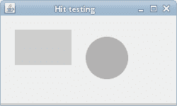
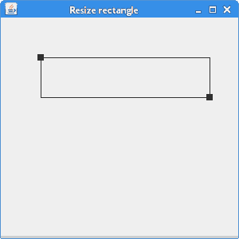

# 命中测试，移动物体

> 原文： [https://zetcode.com/gfx/java2d/hitmove/](https://zetcode.com/gfx/java2d/hitmove/)

在 Java 2D 编程教程的这一部分中，我们首先讨论命中测试。 我们展示了如何确定是否在面板上的某个形状内单击。 在第二个示例中，我们创建两个形状，可以用鼠标在面板上移动它们，并用鼠标滚轮调整它们的大小。 在最后一个示例中，我们将调整具有两个控制点的矩形的大小。

## 命中测试

命中测试确定我们是否已经用鼠标指针单击了`Shape`内部。 每个`Shape`都有`contains()`方法。 该方法测试指定的`Point2D`是否在`Shape`的边界内。

`HitTestingEx.java`

```
package com.zetcode;

import java.awt.AlphaComposite;
import java.awt.Color;
import java.awt.EventQueue;
import java.awt.Graphics;
import java.awt.Graphics2D;
import java.awt.RenderingHints;
import java.awt.event.MouseAdapter;
import java.awt.event.MouseEvent;
import java.awt.geom.Ellipse2D;
import java.awt.geom.Rectangle2D;
import java.util.logging.Level;
import java.util.logging.Logger;
import javax.swing.JFrame;
import javax.swing.JPanel;

class Surface extends JPanel {

    private Rectangle2D rect;
    private Ellipse2D ellipse;
    private float alpha_rectangle;
    private float alpha_ellipse;

    public Surface() {

        initSurface();
    }

    private void initSurface() {

        addMouseListener(new HitTestAdapter());

        rect = new Rectangle2D.Float(20f, 20f, 80f, 50f);
        ellipse = new Ellipse2D.Float(120f, 30f, 60f, 60f);

        alpha_rectangle = 1f;
        alpha_ellipse = 1f;        
    }

    private void doDrawing(Graphics g) {

        Graphics2D g2d = (Graphics2D) g.create();

        g2d.setPaint(new Color(50, 50, 50));

        RenderingHints rh = new RenderingHints(RenderingHints.KEY_ANTIALIASING,
                RenderingHints.VALUE_ANTIALIAS_ON);

        rh.put(RenderingHints.KEY_RENDERING,
                RenderingHints.VALUE_RENDER_QUALITY);

        g2d.setRenderingHints(rh);

        g2d.setComposite(AlphaComposite.getInstance(AlphaComposite.SRC_OVER,
                alpha_rectangle));
        g2d.fill(rect);

        g2d.setComposite(AlphaComposite.getInstance(AlphaComposite.SRC_OVER,
                alpha_ellipse));
        g2d.fill(ellipse);

        g2d.dispose();
    }

    @Override
    public void paintComponent(Graphics g) {

        super.paintComponent(g);
        doDrawing(g);
    }

    class RectRunnable implements Runnable {

        private Thread runner;

        public RectRunnable() {

            initThread();
        }

        private void initThread() {

            runner = new Thread(this);
            runner.start();
        }

        @Override
        public void run() {

            while (alpha_rectangle >= 0) {

                repaint();
                alpha_rectangle += -0.01f;

                if (alpha_rectangle < 0) {
                    alpha_rectangle = 0;
                }

                try {

                    Thread.sleep(50);
                } catch (InterruptedException ex) {

                     Logger.getLogger(Surface.class.getName()).log(Level.SEVERE, 
                             null, ex);
                }
            }
        }
    }

    class HitTestAdapter extends MouseAdapter
            implements Runnable {

        private RectRunnable rectAnimator;
        private Thread ellipseAnimator;

        @Override
        public void mousePressed(MouseEvent e) {

            int x = e.getX();
            int y = e.getY();

            if (rect.contains(x, y)) {

                rectAnimator = new RectRunnable();
            }

            if (ellipse.contains(x, y)) {

                ellipseAnimator = new Thread(this);
                ellipseAnimator.start();
            }
        }

        @Override
        public void run() {

            while (alpha_ellipse >= 0) {

                repaint();
                alpha_ellipse += -0.01f;

                if (alpha_ellipse < 0) {

                    alpha_ellipse = 0;
                }

                try {

                    Thread.sleep(50);
                } catch (InterruptedException ex) {

                    Logger.getLogger(Surface.class.getName()).log(Level.SEVERE, 
                        null, ex);
                }
            }
        }
    }
}

public class HitTestingEx extends JFrame {

    public HitTestingEx() {

        add(new Surface());

        setTitle("Hit testing");
        setSize(250, 150);
        setDefaultCloseOperation(JFrame.EXIT_ON_CLOSE);
        setLocationRelativeTo(null);           
    }

    public static void main(String[] args) {

        EventQueue.invokeLater(new Runnable() {

            @Override
            public void run() {
                HitTestingEx ex = new HitTestingEx();
                ex.setVisible(true);
            }
        });     
    }
}

```

在我们的示例中，我们有两个`Shapes`：一个矩形和一个圆形。 通过单击它们，它们逐渐开始消失。 在此示例中，我们使用线程。

```
private Rectangle2D rect;
private Ellipse2D ellipse;

```

我们使用矩形和椭圆形。

```
private float alpha_rectangle;
private float alpha_ellipse;

```

这两个变量控制两个几何对象的透明度。

```
g2d.setComposite(AlphaComposite.getInstance(AlphaComposite.SRC_OVER,
                                            alpha_rectangle));
g2d.fill(rect);

```

在`doDrawing()`方法内部，我们设置矩形的透明度。 `alpha_rectangle`在专用的`Thread`内部进行计算。

`HitTestAdapter`类负责处理鼠标事件。 它确实实现了`Runnable`接口，这意味着它还创建了第一个线程。

```
if (ellipse.contains(x, y)) {

    ellipseAnimator = new Thread(this);
    ellipseAnimator.start();
}

```

如果我们在椭圆内按下，将创建一个新的`Thread`。 该线程调用`run()`方法。 在我们的例子中，它是类本身的`run()`方法（`HitTestAdapter`）。

```
if (rect.contains(x, y)) {

    rectAnimator = new RectRunnable();
}

```

对于矩形，我们有一个单独的内部类-`RectRunnable`类。 此类在构造函数中创建自己的线程。

```
public void run() {

    while (alpha_ellipse >= 0) {

        repaint();
        alpha_ellipse += -0.01f;
        ...
    }

```

请注意，`run()`方法仅被调用一次。 要实际执行某项操作，我们必须实现一个 while 循环。 while 循环重新绘制面板并减小`alpha_ellipse`变量。



Figure: Hit testing

## 移动和缩放

在下一部分中，我们将学习如何使用面板上的鼠标移动和缩放图形对象。 它可用于在我们的应用中移动和缩放图表，图表或其他各种对象。

`MovingScalingEx.java`

```
package com.zetcode;

import java.awt.Color;
import java.awt.EventQueue;
import java.awt.Font;
import java.awt.Graphics;
import java.awt.Graphics2D;
import java.awt.RenderingHints;
import java.awt.event.MouseAdapter;
import java.awt.event.MouseEvent;
import java.awt.event.MouseWheelEvent;
import java.awt.event.MouseWheelListener;
import java.awt.geom.Ellipse2D;
import java.awt.geom.Rectangle2D;
import javax.swing.JFrame;
import javax.swing.JPanel;

class Surface extends JPanel {

    private ZRectangle zrect;
    private ZEllipse zell;

    public Surface() {

        initUI();
    }

    private void initUI() {

        MovingAdapter ma = new MovingAdapter();

        addMouseMotionListener(ma);
        addMouseListener(ma);
        addMouseWheelListener(new ScaleHandler());

        zrect = new ZRectangle(50, 50, 50, 50);
        zell = new ZEllipse(150, 70, 80, 80);
    }

    private void doDrawing(Graphics g) {

        Graphics2D g2d = (Graphics2D) g;

        Font font = new Font("Serif", Font.BOLD, 40);
        g2d.setFont(font);

        g2d.setRenderingHint(RenderingHints.KEY_ANTIALIASING,
                        RenderingHints.VALUE_ANTIALIAS_ON);
        g2d.setRenderingHint(RenderingHints.KEY_TEXT_ANTIALIASING,
                        RenderingHints.VALUE_TEXT_ANTIALIAS_ON);

        g2d.setPaint(new Color(0, 0, 200));
        g2d.fill(zrect);
        g2d.setPaint(new Color(0, 200, 0));
        g2d.fill(zell);        
    }

    @Override
    public void paintComponent(Graphics g) {
        super.paintComponent(g);

        doDrawing(g);        
    }

    class ZEllipse extends Ellipse2D.Float {

        public ZEllipse(float x, float y, float width, float height) {

            setFrame(x, y, width, height);
        }

        public boolean isHit(float x, float y) {

            return getBounds2D().contains(x, y);
        }

        public void addX(float x) {

            this.x += x;
        }

        public void addY(float y) {

            this.y += y;
        }

        public void addWidth(float w) {

            this.width += w;
        }

        public void addHeight(float h) {

            this.height += h;
        }
    }

    class ZRectangle extends Rectangle2D.Float {

        public ZRectangle(float x, float y, float width, float height) {

            setRect(x, y, width, height);
        }

        public boolean isHit(float x, float y) {

            return getBounds2D().contains(x, y);
        }

        public void addX(float x) {

            this.x += x;
        }

        public void addY(float y) {

            this.y += y;
        }

        public void addWidth(float w) {

            this.width += w;
        }

        public void addHeight(float h) {

            this.height += h;
        }
    }

    class MovingAdapter extends MouseAdapter {

        private int x;
        private int y;

        @Override
        public void mousePressed(MouseEvent e) {

            x = e.getX();
            y = e.getY();
        }

        @Override
        public void mouseDragged(MouseEvent e) {

            doMove(e);
        }   

        private void doMove(MouseEvent e) {

            int dx = e.getX() - x;
            int dy = e.getY() - y;

            if (zrect.isHit(x, y)) {

                zrect.addX(dx);
                zrect.addY(dy);
                repaint();
            }

            if (zell.isHit(x, y)) {

                zell.addX(dx);
                zell.addY(dy);
                repaint();
            }

            x += dx;
            y += dy;            
        }
    }

    class ScaleHandler implements MouseWheelListener {

        @Override
        public void mouseWheelMoved(MouseWheelEvent e) {

            doScale(e);
        }

        private void doScale(MouseWheelEvent e) {

            int x = e.getX();
            int y = e.getY();

            if (e.getScrollType() == MouseWheelEvent.WHEEL_UNIT_SCROLL) {

                if (zrect.isHit(x, y)) {

                    float amount =  e.getWheelRotation() * 5f;
                    zrect.addWidth(amount);
                    zrect.addHeight(amount);
                    repaint();
                }

                if (zell.isHit(x, y)) {

                    float amount =  e.getWheelRotation() * 5f;
                    zell.addWidth(amount);
                    zell.addHeight(amount);
                    repaint();
                }
            }            
        }
    }
}

public class MovingScalingEx extends JFrame {

    public MovingScalingEx() {

        initUI();
    }

    private void initUI() {

        add(new Surface());

        setTitle("Moving and scaling");
        setSize(300, 300);
        setDefaultCloseOperation(JFrame.EXIT_ON_CLOSE);
        setLocationRelativeTo(null);        
    }

    public static void main(String[] args) {        

        EventQueue.invokeLater(new Runnable() {

            @Override
            public void run() {
                MovingScalingEx ex = new MovingScalingEx();
                ex.setVisible(true);
            }
        });
    }
}

```

在我们的代码示例中，我们有两个图形对象：一个矩形和一个圆形。 我们可以通过单击它们并拖动它们来移动它们。 我们还可以通过将鼠标光标放在对象上并移动鼠标滚轮来放大或缩小它们。

```
private ZRectangle zrect;
private ZEllipse zell;

```

正如我们已经提到的，面板上有一个矩形和一个椭圆。 这两个类都扩展了 Java AWT 包中内置类的功能。

```
addMouseMotionListener(ma);
addMouseListener(ma);
addMouseWheelListener(new ScaleHandler());

```

我们注册了三个侦听器。 这些侦听器捕获鼠标按下，鼠标拖动和鼠标滚轮事件。

```
class ZEllipse extends Ellipse2D.Float {

    public ZEllipse(float x, float y, float width, float height) {

        setFrame(x, y, width, height);
    }

    public boolean isHit(float x, float y) {

        return getBounds2D().contains(x, y);
    }
...
}

```

这段代码摘录显示了`ZEllipse`类。 它扩展了内置的`Ellipse2D.Float`类。 它增加了缩放和移动椭圆的功能。 例如，`isHit()`方法确定鼠标指针是否在椭圆区域内。

`MovingAdapter`类处理鼠标按下和鼠标拖动事件。

```
@Override
public void mousePressed(MouseEvent e) {

    x = e.getX();
    y = e.getY();
}

```

在`mousePressed()`方法中，我们存储对象的初始 x 和 y 坐标。

```
int dx = e.getX() - x;
int dy = e.getY() - y;

```

在`doMove()`方法内部，我们计算拖动对象的距离。

```
if (zrect.isHit(x, y)) {

    zrect.addX(dx);
    zrect.addY(dy);
    repaint();
}

```

如果在矩形区域内，则更新矩形的 x 和 y 坐标并重新绘制面板。

```
x += dx;
y += dy;

```

初始坐标将更新。

`ScaleHandler`类处理对象的缩放。

```
if (e.getScrollType() == MouseWheelEvent.WHEEL_UNIT_SCROLL) {

    if (zrect.isHit(x, y)) {

        float amount =  e.getWheelRotation() * 5f;
        zrect.addWidth(amount);
        zrect.addHeight(amount);
        repaint();
    }
...
}

```

如果移动鼠标滚轮，并且光标位于矩形区域内，则将调整矩形大小并重新绘制面板。 通过`getWheelRotation()`方法计算缩放比例，该方法返回车轮旋转量。

## Resizig 矩形

在下一个示例中，我们显示如何调整形状的大小。 我们的形状是一个矩形。 在矩形上，我们绘制了两个小的黑色矩形。 通过单击这些小矩形并拖动它们，我们可以调整主矩形的大小。

`ResizingRectangleEx.java`

```
package com.zetcode;

import java.awt.EventQueue;
import java.awt.Graphics;
import java.awt.Graphics2D;
import java.awt.Point;
import java.awt.event.MouseAdapter;
import java.awt.event.MouseEvent;
import java.awt.geom.Point2D;
import java.awt.geom.Rectangle2D;
import javax.swing.JFrame;
import javax.swing.JPanel;

class Surface extends JPanel {

    private Point2D[] points;
    private final int SIZE = 8;
    private int pos;

    public Surface() {

        initUI();
    }

    private void initUI() {

        addMouseListener(new ShapeTestAdapter());
        addMouseMotionListener(new ShapeTestAdapter());
        pos = -1;

        points = new Point2D[2];
        points[0] = new Point2D.Double(50, 50);
        points[1] = new Point2D.Double(150, 100);
    }

    private void doDrawing(Graphics g) {

        Graphics2D g2 = (Graphics2D) g;

        for (Point2D point : points) {
            double x = point.getX() - SIZE / 2;
            double y = point.getY() - SIZE / 2;
            g2.fill(new Rectangle2D.Double(x, y, SIZE, SIZE));
        }

        Rectangle2D r = new Rectangle2D.Double();
        r.setFrameFromDiagonal(points[0], points[1]);

        g2.draw(r);        
    }

    @Override
    public void paintComponent(Graphics g) {
        super.paintComponent(g);

        doDrawing(g);
    }

    private class ShapeTestAdapter extends MouseAdapter {

        @Override
        public void mousePressed(MouseEvent event) {

            Point p = event.getPoint();

            for (int i = 0; i < points.length; i++) {

                double x = points[i].getX() - SIZE / 2;
                double y = points[i].getY() - SIZE / 2;

                Rectangle2D r = new Rectangle2D.Double(x, y, SIZE, SIZE);

                if (r.contains(p)) {

                    pos = i;
                    return;
                }
            }
        }

        @Override
        public void mouseReleased(MouseEvent event) {

            pos = -1;
        }

        @Override
        public void mouseDragged(MouseEvent event) {

            if (pos == -1) {
                return;
            }

            points[pos] = event.getPoint();
            repaint();
        }
    }
}

public class ResizingRectangleEx extends JFrame {

    public ResizingRectangleEx()  {

        initUI();
    }

    private void initUI() {

        add(new Surface());

        setTitle("Resize rectangle");
        setSize(300, 300);
        setDefaultCloseOperation(JFrame.EXIT_ON_CLOSE);
        setLocationRelativeTo(null);                  
    }

    public static void main(String[] args) {

        EventQueue.invokeLater(new Runnable() {

            @Override
            public void run() {
                ResizingRectangleEx ex = new ResizingRectangleEx();
                ex.setVisible(true);
            }
        });
    }
}

```

有两种创建矩形的方法。 一种方法是提供左上角点的 x 和 y 坐标以及矩形的宽度和高度。 另一种方法是提供左上角和右下角点。 在我们的代码示例中，我们将同时使用这两种方法。

```
private Point2D[] points;

```

在此数组中，我们存储构成矩形的点。

```
private final int SIZE = 8;

```

这是黑色小矩形的大小。

```
points = new Point2D[2];
points[0] = new Point2D.Double(50, 50);
points[1] = new Point2D.Double(150, 100);

```

这些是矩形的初始坐标。

```
for (int i = 0; i < points.length; i++) {

    double x = points[i].getX() - SIZE / 2;
    double y = points[i].getY() - SIZE / 2;
    g2.fill(new Rectangle2D.Double(x, y, SIZE, SIZE));
}

```

此代码绘制了两个小的控制矩形。

```
Rectangle2D s = new Rectangle2D.Double();
s.setFrameFromDiagonal(points[0], points[1]);

g2.draw(s);

```

在这里，我们从这些点绘制一个矩形。

```
@Override
public void mousePressed(MouseEvent event) {

    Point p = event.getPoint();

    for (int i = 0; i < points.length; i++) {

        double x = points[i].getX() - SIZE / 2;
        double y = points[i].getY() - SIZE / 2;

        Rectangle2D r = new Rectangle2D.Double(x, y, SIZE, SIZE);

        if (r.contains(p)) {

            pos = i;
            return;
        }
    }
}

```

在`mousePressed()`方法中，我们确定是否单击了两个控制点之一。 如果我们点击其中一个，则`pos`变量将存储其中的哪个。

```
@Override
public void mouseDragged(MouseEvent event) {

    if (pos == -1) {
        return;
    }

    points[pos] = event.getPoint();
    repaint();
}

```

在这里，矩形是动态调整大小的。 在`mouseDragged()`事件期间，我们获取当前点，更新点数组并重新绘制面板。



Figure: Resizing a rectangle

在 Java 2D 教程的这一部分中，我们介绍了命中测试和移动对象。