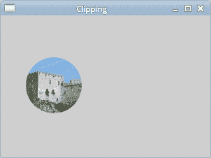
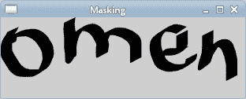

# 在 PyCairo 中剪切&遮罩

> 原文： [https://zetcode.com/gfx/pycairo/clipmask/](https://zetcode.com/gfx/pycairo/clipmask/)

在 PyCairo 教程的这一部分中，我们将讨论剪切和遮罩操作。

## 剪裁

剪裁是将绘图限制为特定区域。 这样做是出于效率方面的考虑，并会产生有趣的效果。 PyCairo 具有`clip()`方法来设置裁剪。

```
#!/usr/bin/python

'''
ZetCode PyCairo tutorial 

This program shows how to perform
clipping in PyCairo.

author: Jan Bodnar
website: zetcode.com 
last edited: August 2012
'''

from gi.repository import Gtk, GLib
import cairo
import math
import random

class Example(Gtk.Window):

    def __init__(self):
        super(Example, self).__init__()

        self.init_ui()
        self.load_image()
        self.init_vars()

    def init_ui(self):    

        self.darea = Gtk.DrawingArea()
        self.darea.connect("draw", self.on_draw)
        self.add(self.darea)

        GLib.timeout_add(100, self.on_timer)

        self.set_title("Clipping")
        self.resize(300, 200)
        self.set_position(Gtk.WindowPosition.CENTER)
        self.connect("delete-event", Gtk.main_quit)
        self.show_all()

    def load_image(self):

        self.image = cairo.ImageSurface.create_from_png("beckov.png")

    def init_vars(self):    

        self.pos_x = 128
        self.pos_y = 128
        self.radius = 40

        self.delta = [3, 3]        

    def on_timer(self):

        self.pos_x += self.delta[0]
        self.pos_y += self.delta[1]        

        self.darea.queue_draw()
        return True           

    def on_draw(self, wid, cr):

        w, h = self.get_size()

        if (self.pos_x < 0 + self.radius):
            self.delta[0] = random.randint(5, 9)
        elif (self.pos_x > w - self.radius):
            self.delta[0] = -random.randint(5, 9)

        if (self.pos_y < 0 + self.radius): 
            self.delta[1] = random.randint(5, 9)
        elif (self.pos_y > h - self.radius):
            self.delta[1] = -random.randint(5, 9)        

        cr.set_source_surface(self.image, 1, 1)
        cr.arc(self.pos_x, self.pos_y, self.radius, 0, 2*math.pi)
        cr.clip()
        cr.paint()        

def main():

    app = Example()
    Gtk.main()

if __name__ == "__main__":    
    main()

```

在此示例中，我们将裁剪图像。 圆圈在窗口区域上移动并显示基础图像的一部分。 这就像我们从孔中看一样。

```
def load_image(self):

    self.image = cairo.ImageSurface.create_from_png("beckov.png")

```

这是基础图像。 每个计时器周期，我们都会看到此图像的一部分。

```
if (self.pos_x < 0 + self.radius):
    self.delta[0] = random.randint(5, 9)
elif (self.pos_x > w - self.radius):
    self.delta[0]= -random.randint(5, 9) 

```

如果圆碰到窗口的左侧或右侧，则圆的移动方向会随机变化。 顶部和底部也一样。

```
cr.arc(self.pos_x, self.pos_y, self.radius, 0, 2*math.pi)

```

此行为开罗上下文添加了一条循环路径。

```
cr.clip()

```

`clip()`设置剪切区域。 裁剪区域是当前使用的路径。 当前路径是通过`arc()`方法调用创建的。

```
cr.paint()

```

`paint()`在当前剪辑区域内的任何地方绘制当前源。



Figure: Clipping

## 掩蔽

在将源应用于表面之前，先对其进行过滤。 遮罩用作过滤器。 遮罩确定在哪里应用源，在哪里不应用。 遮罩的不透明部分允许复制源。 透明零件不允许将源复制到表面。

```
#!/usr/bin/python

'''
ZetCode PyCairo tutorial 

This program demonstrates masking.

author: Jan Bodnar
website: zetcode.com 
last edited: August 2012
'''

from gi.repository import Gtk
import cairo

class Example(Gtk.Window):

    def __init__(self):
        super(Example, self).__init__()

        self.init_ui()
        self.load_image()

    def init_ui(self):    

        darea = Gtk.DrawingArea()
        darea.connect("draw", self.on_draw)
        self.add(darea)

        self.set_title("Masking")
        self.resize(310, 100)
        self.set_position(Gtk.WindowPosition.CENTER)
        self.connect("delete-event", Gtk.main_quit)
        self.show_all()

    def load_image(self):    

        self.ims = cairo.ImageSurface.create_from_png("omen.png")

    def on_draw(self, wid, cr):

        cr.mask_surface(self.ims, 0, 0);
        cr.fill()

def main():

    app = Example()
    Gtk.main()

if __name__ == "__main__":    
    main()

```

在该示例中，遮罩确定在哪里绘画和在哪里不绘画。

```
cr.mask_surface(self.ims, 0, 0);
cr.fill()

```

我们使用图像作为遮罩，从而将其显示在窗口上。



Figure: Masking

## 蒙蔽效果

在此代码示例中，我们将忽略图像。 这类似于我们使用卷帘所做的。

```
#!/usr/bin/python

'''
ZetCode PyCairo tutorial 

This program creates a blind down
effect using masking operation.

author: Jan Bodnar
website: zetcode.com 
last edited: August 2012
'''

from gi.repository import Gtk, GLib
import cairo
import math

class Example(Gtk.Window):

    def __init__(self):
        super(Example, self).__init__()

        self.init_ui()
        self.load_image()
        self.init_vars()

    def init_ui(self):    

        self.darea = Gtk.DrawingArea()
        self.darea.connect("draw", self.on_draw)
        self.add(self.darea)

        GLib.timeout_add(35, self.on_timer)

        self.set_title("Blind down")
        self.resize(325, 250)
        self.set_position(Gtk.WindowPosition.CENTER)
        self.connect("delete-event", Gtk.main_quit)
        self.show_all()

    def load_image(self):

        self.image = cairo.ImageSurface.create_from_png("beckov.png")        

    def init_vars(self):        

        self.timer = True
        self.h = 0
        self.iw = self.image.get_width()
        self.ih = self.image.get_height()   

        self.ims = cairo.ImageSurface(cairo.FORMAT_ARGB32, 
            self.iw, self.ih)           

    def on_timer(self):

        if (not self.timer):
            return False

        self.darea.queue_draw()
        return True           

    def on_draw(self, wid, cr):

        ic = cairo.Context(self.ims)

        ic.rectangle(0, 0, self.iw, self.h)
        ic.fill()

        self.h += 1

        if (self.h == self.ih): 
            self.timer = False

        cr.set_source_surface(self.image, 10, 10)
        cr.mask_surface(self.ims, 10, 10)        

def main():

    app = Example()
    Gtk.main()

if __name__ == "__main__":    
    main()

```

盲目效应背后的想法很简单。 图像高度为 h 像素。 我们绘制高度为 1px 的 0、1、2 ...线。 每个周期，图像的一部分高 1px，直到整个图像可见为止。

```
def load_image(self):

    self.image = cairo.ImageSurface.create_from_png("beckov.png")            

```

在`load_image()`方法中，我们从 PNG 图像创建图像表面。

```
def init_vars(self):        

    self.timer = True
    self.h = 0
    self.iw = self.image.get_width()
    self.ih = self.image.get_height()   

    self.ims = cairo.ImageSurface(cairo.FORMAT_ARGB32, 
        self.iw, self.ih)               

```

在 init_vars（）方法中，我们初始化一些变量。 我们启动 self.timer 和 self.h 变量。 我们得到加载图像的宽度和高度。 然后我们创建一个空的图像表面。 它将用我们之前创建的图像表面的像素线填充。

```
ic = cairo.Context(self.ims)

```

我们从空图像源创建一个 cairo 上下文。

```
ic.rectangle(0, 0, self.iw, self.h)
ic.fill()

```

我们在最初为空的图像中绘制一个矩形。 矩形每个周期将高出 1 像素。 以这种方式创建的图像稍后将用作遮罩。

```
self.h += 1

```

要显示的图像高度增加一个单位。

```
if (self.h == self.ih): 
    self.timer = False

```

当我们在 GTK 窗口上绘制整个图像时，我们将停止 timer 方法。

```
cr.set_source_surface(self.image, 10, 10)
cr.mask_surface(self.ims, 10, 10)

```

城堡的图像被设置为绘画的来源。 `mask_surface()`使用表面的 Alpha 通道作为遮罩来绘制电流源。

本章介绍了 PyCairo 中的剪辑和遮罩。