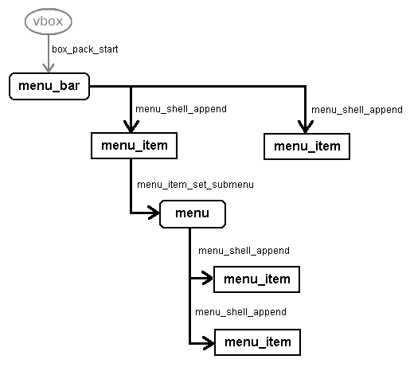
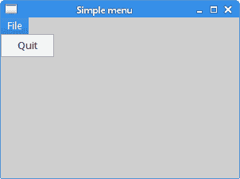
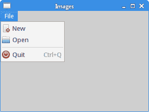
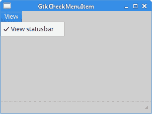
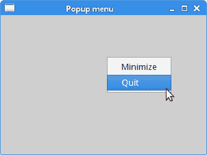
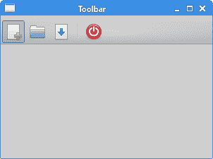
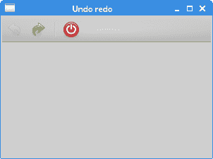

# GTK +中的菜单和工具栏

> 原文： [http://zetcode.com/gui/gtk2/menusandtoolbars/](http://zetcode.com/gui/gtk2/menusandtoolbars/)

在 GTK +编程教程的这一部分中，我们使用菜单和工具栏。 _ 菜单栏 _ 是 GUI 应用程序的常见部分。 它是位于各个菜单中的一组命令。

`GtkMenuBar`是创建菜单栏的窗口小部件。 它包含一对多`GtkMenuItems`。 菜单项是用户可以选择的对象。 `GtkMenu`实现了一个由`GtkMenuItem`对象列表组成的下拉菜单，用户可以对其进行导航和激活以执行应用程序功能。 `GtkMenu`附加到菜单栏的菜单项或另一个菜单的菜单项。



Figure: Menus

该图显示了菜单栏及其菜单的结构。

## 简单菜单示例

在第一个示例中，我们创建带有一个“文件”菜单的菜单栏。

`simplemenu.c`

```
#include <gtk/gtk.h>

int main(int argc, char *argv[]) {

  GtkWidget *window;
  GtkWidget *vbox;

  GtkWidget *menubar;
  GtkWidget *fileMenu;
  GtkWidget *fileMi;
  GtkWidget *quitMi;

  gtk_init(&argc, &argv);

  window = gtk_window_new(GTK_WINDOW_TOPLEVEL);
  gtk_window_set_position(GTK_WINDOW(window), GTK_WIN_POS_CENTER);
  gtk_window_set_default_size(GTK_WINDOW(window), 300, 200);
  gtk_window_set_title(GTK_WINDOW(window), "Simple menu");

  vbox = gtk_vbox_new(FALSE, 0);
  gtk_container_add(GTK_CONTAINER(window), vbox);

  menubar = gtk_menu_bar_new();
  fileMenu = gtk_menu_new();

  fileMi = gtk_menu_item_new_with_label("File");
  quitMi = gtk_menu_item_new_with_label("Quit");

  gtk_menu_item_set_submenu(GTK_MENU_ITEM(fileMi), fileMenu);
  gtk_menu_shell_append(GTK_MENU_SHELL(fileMenu), quitMi);
  gtk_menu_shell_append(GTK_MENU_SHELL(menubar), fileMi);
  gtk_box_pack_start(GTK_BOX(vbox), menubar, FALSE, FALSE, 0);

  g_signal_connect(G_OBJECT(window), "destroy",
        G_CALLBACK(gtk_main_quit), NULL);

  g_signal_connect(G_OBJECT(quitMi), "activate",
        G_CALLBACK(gtk_main_quit), NULL);

  gtk_widget_show_all(window);

  gtk_main();

  return 0;
}

```

示例中的菜单具有一个菜单项。 通过选择项目，应用程序退出。

```
menubar = gtk_menu_bar_new();

```

`gtk_menu_bar_new()`创建一个新的`GtkMenuBar`。

```
filemenu = gtk_menu_new();

```

`gtk_menu_new()`函数创建一个新的`GtkMenu`。

```
gtk_menu_item_set_submenu(GTK_MENU_ITEM(fileMi), fileMenu);

```

通过`gtk_menu_item_set_submenu()`功能将`fileMenu`设置为 File 菜单项。 菜单是容纳菜单项的容器。 它们本身已插入特定的菜单项。

```
gtk_menu_shell_append(GTK_MENU_SHELL(fileMenu), quitMi);

```

通过`gtk_menu_shell_append()`功能将`quitMi`添加到文件菜单。

```
gtk_menu_shell_append(GTK_MENU_SHELL(menubar), fileMi);

```

使用`gtk_menu_shell_append()`功能将文件菜单项添加到菜单栏。 `GtkMenu`和`GtkMenuBar`均来自`GtkMenuShell`。

```
g_signal_connect(G_OBJECT(quitMi), "activate",
    G_CALLBACK(gtk_main_quit), NULL);

```

通过选择退出菜单项，我们终止了该应用程序。



Figure: Simple menu

## 子菜单

下一个示例演示如何创建子菜单。 子菜单是另一个菜单中的菜单。

`submenu.c`

```
#include <gtk/gtk.h>

int main(int argc, char *argv[]) {

  GtkWidget *window;
  GtkWidget *vbox;

  GtkWidget *menubar;
  GtkWidget *fileMenu;
  GtkWidget *imprMenu;
  GtkWidget *sep;
  GtkWidget *fileMi;
  GtkWidget *imprMi;
  GtkWidget *feedMi;
  GtkWidget *bookMi;
  GtkWidget *mailMi;
  GtkWidget *quitMi;

  gtk_init(&argc, &argv);

  window = gtk_window_new(GTK_WINDOW_TOPLEVEL);
  gtk_window_set_position(GTK_WINDOW(window), GTK_WIN_POS_CENTER);
  gtk_window_set_default_size(GTK_WINDOW(window), 300, 200);
  gtk_window_set_title(GTK_WINDOW(window), "Submenu");

  vbox = gtk_vbox_new(FALSE, 0);
  gtk_container_add(GTK_CONTAINER(window), vbox);

  menubar = gtk_menu_bar_new();

  fileMenu = gtk_menu_new();
  fileMi = gtk_menu_item_new_with_label("File");

  imprMenu = gtk_menu_new();
  imprMi = gtk_menu_item_new_with_label("Import");
  feedMi = gtk_menu_item_new_with_label("Import news feed...");
  bookMi = gtk_menu_item_new_with_label("Import bookmarks...");
  mailMi = gtk_menu_item_new_with_label("Import mail...");

  gtk_menu_item_set_submenu(GTK_MENU_ITEM(imprMi), imprMenu);
  gtk_menu_shell_append(GTK_MENU_SHELL(imprMenu), feedMi);
  gtk_menu_shell_append(GTK_MENU_SHELL(imprMenu), bookMi);
  gtk_menu_shell_append(GTK_MENU_SHELL(imprMenu), mailMi);
  sep = gtk_separator_menu_item_new();  
  quitMi = gtk_menu_item_new_with_label("Quit");

  gtk_menu_item_set_submenu(GTK_MENU_ITEM(fileMi), fileMenu);
  gtk_menu_shell_append(GTK_MENU_SHELL(fileMenu), imprMi);
  gtk_menu_shell_append(GTK_MENU_SHELL(fileMenu), sep);
  gtk_menu_shell_append(GTK_MENU_SHELL(fileMenu), quitMi);
  gtk_menu_shell_append(GTK_MENU_SHELL(menubar), fileMi);
  gtk_box_pack_start(GTK_BOX(vbox), menubar, FALSE, FALSE, 0);

  g_signal_connect(G_OBJECT(window), "destroy",
        G_CALLBACK(gtk_main_quit), NULL);

  g_signal_connect(G_OBJECT(quitMi), "activate",
        G_CALLBACK(gtk_main_quit), NULL);

  gtk_widget_show_all(window);

  gtk_main();

  return 0;
}

```

该示例在另一个菜单内创建一个菜单。 子菜单具有三个菜单项。 我们还添加了一个水平分隔符。

```
imprMenu = gtk_menu_new();
imprMi = gtk_menu_item_new_with_label("Import");
feedMi = gtk_menu_item_new_with_label("Import news feed...");
bookMi = gtk_menu_item_new_with_label("Import bookmarks...");
mailMi = gtk_menu_item_new_with_label("Import mail...");

```

这是带有菜单项的子菜单。

```
gtk_menu_item_set_submenu(GTK_MENU_ITEM(imprMi), imprMenu);

```

`imprMenu`子菜单被添加到其自己的菜单项中。

```
gtk_menu_shell_append(GTK_MENU_SHELL(imprMenu), feedMi);
gtk_menu_shell_append(GTK_MENU_SHELL(imprMenu), bookMi);
gtk_menu_shell_append(GTK_MENU_SHELL(imprMenu), mailMi);

```

使用`gtk_menu_shell_append()`功能将三个菜单项添加到子菜单。

```
sep = gtk_separator_menu_item_new();

```

使用`gtk_separator_menu_item_new()`功能创建水平菜单分隔符。

```
gtk_menu_shell_append(GTK_MENU_SHELL(fileMenu), imprMi);
gtk_menu_shell_append(GTK_MENU_SHELL(fileMenu), sep);

```

`imprMi`和分隔符通过`gtk_menu_shell_append()`功能添加到文件菜单。


Figure: Submenu

## 图像菜单，助记符&加速器

`GtkImageMenuItem`是一个菜单项，在文本标签旁边带有一个图标。 由于用户可以禁用菜单图标的显示，因此我们仍然需要填写文本标签。 _ 加速器 _ 是用于激活菜单项的键盘快捷键。 _ 助记符 _ 是 GUI 元素的键盘快捷键。 它们以带下划线的字符表示。 请注意，在某些环境中，我们首先需要按无鼠标修饰符（通常为`Alt`）以显示带下划线的字符。

我们可能还配置了不显示菜单图像的环境。 要打开菜单图像，我们启动`gconf-editor`并转到`/desktop/gnome/interface/menus_have_icons`并检查选项。

`imagemenu.c`

```
#include <gtk/gtk.h>
#include <gdk/gdkkeysyms.h>

int main(int argc, char *argv[]) {

  GtkWidget *window;
  GtkWidget *vbox;

  GtkWidget *menubar;
  GtkWidget *fileMenu;
  GtkWidget *fileMi;
  GtkWidget *newMi;
  GtkWidget *openMi;
  GtkWidget *quitMi;

  GtkWidget *sep;

  GtkAccelGroup *accel_group = NULL;

  gtk_init(&argc, &argv);

  window = gtk_window_new(GTK_WINDOW_TOPLEVEL);
  gtk_window_set_position(GTK_WINDOW(window), GTK_WIN_POS_CENTER);
  gtk_window_set_default_size(GTK_WINDOW(window), 300, 200);
  gtk_window_set_title(GTK_WINDOW(window), "Images");

  vbox = gtk_vbox_new(FALSE, 0);
  gtk_container_add(GTK_CONTAINER(window), vbox);

  menubar = gtk_menu_bar_new();
  fileMenu = gtk_menu_new();

  accel_group = gtk_accel_group_new();
  gtk_window_add_accel_group(GTK_WINDOW(window), accel_group);

  fileMi = gtk_menu_item_new_with_mnemonic("_File");
  newMi = gtk_image_menu_item_new_from_stock(GTK_STOCK_NEW, NULL);
  openMi = gtk_image_menu_item_new_from_stock(GTK_STOCK_OPEN, NULL);
  sep = gtk_separator_menu_item_new();
  quitMi = gtk_image_menu_item_new_from_stock(GTK_STOCK_QUIT, accel_group);

  gtk_widget_add_accelerator(quitMi, "activate", accel_group, 
      GDK_q, GDK_CONTROL_MASK, GTK_ACCEL_VISIBLE); 

  gtk_menu_item_set_submenu(GTK_MENU_ITEM(fileMi), fileMenu);
  gtk_menu_shell_append(GTK_MENU_SHELL(fileMenu), newMi);
  gtk_menu_shell_append(GTK_MENU_SHELL(fileMenu), openMi);
  gtk_menu_shell_append(GTK_MENU_SHELL(fileMenu), sep);
  gtk_menu_shell_append(GTK_MENU_SHELL(fileMenu), quitMi);
  gtk_menu_shell_append(GTK_MENU_SHELL(menubar), fileMi);
  gtk_box_pack_start(GTK_BOX(vbox), menubar, FALSE, FALSE, 0);

  g_signal_connect(G_OBJECT(window), "destroy",
      G_CALLBACK(gtk_main_quit), NULL);

  g_signal_connect(G_OBJECT(quitMi), "activate",
      G_CALLBACK(gtk_main_quit), NULL);

  gtk_widget_show_all(window);

  gtk_main();

  return 0;
}

```

该示例包含三个带有图标的菜单项。 菜单项可以用助记符选择。 退出菜单项具有键盘加速器。

```
accel_group = gtk_accel_group_new();
gtk_window_add_accel_group(GTK_WINDOW(window), accel_group);
...
quitMi = gtk_image_menu_item_new_from_stock(GTK_STOCK_QUIT, accel_group);

gtk_widget_add_accelerator(quitMi, "activate", accel_group, 
    GDK_q, GDK_CONTROL_MASK, GTK_ACCEL_VISIBLE); 

```

加速器组是一组键盘加速器，通常附加到顶层窗口。 在这里，我们创建 &lt;kbd&gt;Ctrl&lt;/kbd&gt; + &lt;kbd&gt;Q&lt;/kbd&gt; 键盘加速器。

```
fileMi = gtk_menu_item_new_with_mnemonic("_File");

```

`gtk_menu_item_new_with_mnemonic()`创建一个可以带有助记符的菜单项。 标签中的下划线表示菜单项的助记符。 该字符与无鼠标修饰符（通常为`Alt`）结合在一起。 在我们的情况下，我们创建了 &lt;kbd&gt;Alt&lt;/kbd&gt; + &lt;kbd&gt;F&lt;/kbd&gt; 助记符。

```
newMi = gtk_image_menu_item_new_from_stock(GTK_STOCK_NEW, NULL);
openMi = gtk_image_menu_item_new_from_stock(GTK_STOCK_OPEN, NULL);

```

`gtk_image_menu_item_new_from_stock()`创建一个`GtkImageMenuItem`，其中包含来自库存项目的图像和文本。



Figure: Menu items with icons

## CheckMenuItem

`GtkCheckMenuItem`是带有复选框的菜单项。

`checkmenuitem.c`

```
#include <gtk/gtk.h>

void toggle_statusbar(GtkWidget *widget, gpointer statusbar) {

  if (gtk_check_menu_item_get_active(GTK_CHECK_MENU_ITEM(widget))) {

    gtk_widget_show(statusbar);
  } else {

    gtk_widget_hide(statusbar);
  }
}

int main(int argc, char *argv[]) {

  GtkWidget *window;
  GtkWidget *vbox;

  GtkWidget *menubar;
  GtkWidget *viewmenu;
  GtkWidget *view;
  GtkWidget *tog_stat;
  GtkWidget *statusbar;

  gtk_init(&argc, &argv);

  window = gtk_window_new(GTK_WINDOW_TOPLEVEL);
  gtk_window_set_position(GTK_WINDOW(window), GTK_WIN_POS_CENTER);
  gtk_window_set_default_size(GTK_WINDOW(window), 300, 200);
  gtk_window_set_title(GTK_WINDOW(window), "GtkCheckMenuItem");

  vbox = gtk_vbox_new(FALSE, 0);
  gtk_container_add(GTK_CONTAINER(window), vbox);

  menubar = gtk_menu_bar_new();
  viewmenu = gtk_menu_new();

  view = gtk_menu_item_new_with_label("View");
  tog_stat = gtk_check_menu_item_new_with_label("View statusbar");
  gtk_check_menu_item_set_active(GTK_CHECK_MENU_ITEM(tog_stat), TRUE);

  gtk_menu_item_set_submenu(GTK_MENU_ITEM(view), viewmenu);
  gtk_menu_shell_append(GTK_MENU_SHELL(viewmenu), tog_stat);
  gtk_menu_shell_append(GTK_MENU_SHELL(menubar), view);
  gtk_box_pack_start(GTK_BOX(vbox), menubar, FALSE, FALSE, 0);

  statusbar = gtk_statusbar_new();
  gtk_box_pack_end(GTK_BOX(vbox), statusbar, FALSE, TRUE, 0);

  g_signal_connect(G_OBJECT(window), "destroy",
        G_CALLBACK(gtk_main_quit), NULL);

  g_signal_connect(G_OBJECT(tog_stat), "activate", 
        G_CALLBACK(toggle_statusbar), statusbar);

  gtk_widget_show_all(window);

  gtk_main();

  return 0;
}

```

该示例在“查看”菜单中包含一个`GtkCheckMenuItem`。 如果该复选框已激活，则显示状态栏小部件。

```
tog_stat = gtk_check_menu_item_new_with_label("View statusbar");

```

`gtk_check_menu_item_new_with_label()`函数创建一个新的`CheckMenuItem`。

```
statusbar = gtk_statusbar_new();

```

`gtk_statusbar_new()`函数创建一个新的`GtkStatusbar`小部件。 它用于向用户报告次要消息。

```
if (gtk_check_menu_item_get_active(GTK_CHECK_MENU_ITEM(widget))) {

  gtk_widget_show(statusbar);
} else {

  gtk_widget_hide(statusbar);
}

```

如果菜单项中的复选框被激活，我们将显示状态栏小部件。 否则状态栏将被隐藏。



Figure: GtkCheckMenuItem

## 弹出菜单

在下一个示例中，我们创建一个弹出菜单。 弹出菜单也称为上下文菜单。 当我们右键单击 GUI 对象时，通常会显示这种类型的菜单。

`popupmenu.c`

```
#include <gtk/gtk.h>

int show_popup(GtkWidget *widget, GdkEvent *event) {

  const gint RIGHT_CLICK = 3;

  if (event->type == GDK_BUTTON_PRESS) {

      GdkEventButton *bevent = (GdkEventButton *) event;

      if (bevent->button == RIGHT_CLICK) {      

          gtk_menu_popup(GTK_MENU(widget), NULL, NULL, NULL, NULL,
              bevent->button, bevent->time);
          }

      return TRUE;
  }

  return FALSE;
}

int main(int argc, char *argv[]) {

  GtkWidget *window;
  GtkWidget *ebox;
  GtkWidget *pmenu;
  GtkWidget *hideMi;
  GtkWidget *quitMi;

  gtk_init(&argc, &argv);

  window = gtk_window_new(GTK_WINDOW_TOPLEVEL);
  gtk_window_set_position(GTK_WINDOW(window), GTK_WIN_POS_CENTER);
  gtk_window_set_default_size(GTK_WINDOW(window), 300, 200);
  gtk_window_set_title(GTK_WINDOW(window), "Popup menu");

  ebox = gtk_event_box_new();
  gtk_container_add(GTK_CONTAINER(window), ebox);

  pmenu = gtk_menu_new();

  hideMi = gtk_menu_item_new_with_label("Minimize");
  gtk_widget_show(hideMi);
  gtk_menu_shell_append(GTK_MENU_SHELL(pmenu), hideMi);

  quitMi = gtk_menu_item_new_with_label("Quit");
  gtk_widget_show(quitMi);
  gtk_menu_shell_append(GTK_MENU_SHELL(pmenu), quitMi);

  g_signal_connect_swapped(G_OBJECT(hideMi), "activate", 
      G_CALLBACK(gtk_window_iconify), GTK_WINDOW(window));    

  g_signal_connect(G_OBJECT(quitMi), "activate", 
      G_CALLBACK(gtk_main_quit), NULL);  

  g_signal_connect(G_OBJECT(window), "destroy",
      G_CALLBACK(gtk_main_quit), NULL);

  g_signal_connect_swapped(G_OBJECT(ebox), "button-press-event", 
      G_CALLBACK(show_popup), pmenu);  

  gtk_widget_show_all(window);

  gtk_main();

  return 0;
}

```

在代码示例中，我们创建带有两个菜单项的弹出菜单。 第一个最小化窗口，第二个终止应用程序。

```
ebox = gtk_event_box_new();
gtk_container_add(GTK_CONTAINER(window), ebox);

```

为了处理按钮按下事件，我们创建了一个`GtkEventBox`。

```
pmenu = gtk_menu_new();

```

弹出菜单是`GtkMenu`。

```
hideMi = gtk_menu_item_new_with_label("Minimize");
gtk_widget_show(hideMi);
gtk_menu_shell_append(GTK_MENU_SHELL(pmenu), hideMi);

```

第一个菜单项已添加到弹出菜单。

```
g_signal_connect_swapped(G_OBJECT(hideMi), "activate", 
    G_CALLBACK(gtk_window_iconify), GTK_WINDOW(window)); 

```

选择第一个菜单项将使窗口最小化。 我们将“隐藏”菜单项的`activate`信号连接到`gtk_window_iconify()`功能。 术语“图标化”是“最小化”的同义词。

```
g_signal_connect_swapped(G_OBJECT(ebox), "button_press_event", 
    G_CALLBACK(show_popup), pmenu);   

```

当按下鼠标按钮时，会发出`button-press-event`信号。 我们将信号连接到`show_popup()`功能，然后将其传递给弹出菜单。

```
if (event->type == GDK_BUTTON_PRESS) {

```

在事件处理程序内部，我们检查按钮按下事件的类型。

```
if (bevent->button == RIGHT_CLICK) {      

    gtk_menu_popup(GTK_MENU(widget), NULL, NULL, NULL, NULL,
        bevent->button, bevent->time);
}

```

当触发信号的按钮是鼠标右键时，我们将显示带有`gtk_menu_popup()`功能的弹出菜单。



Figure: Popup menu

## 工具栏

菜单将我们可以在应用程序中使用的命令分组。 使用工具栏可以快速访问最常用的命令。 `GtkToolbar`是 GTK +中的工具栏小部件。 工具栏可以包含`GtkToolItem`子类的实例，例如 `GtkToolButton`或`GtkSeparatorToolItem`。

`toolbar.c`

```
#include <gtk/gtk.h>

int main(int argc, char *argv[]) {

  GtkWidget *window;
  GtkWidget *vbox;

  GtkWidget *toolbar;
  GtkToolItem *newTb;
  GtkToolItem *openTb;
  GtkToolItem *saveTb;
  GtkToolItem *sep;
  GtkToolItem *exitTb;

  gtk_init(&argc, &argv);

  window = gtk_window_new(GTK_WINDOW_TOPLEVEL);
  gtk_window_set_position(GTK_WINDOW(window), GTK_WIN_POS_CENTER);
  gtk_window_set_default_size(GTK_WINDOW(window), 300, 200);
  gtk_window_set_title(GTK_WINDOW(window), "toolbar");

  vbox = gtk_vbox_new(FALSE, 0);
  gtk_container_add(GTK_CONTAINER(window), vbox);

  toolbar = gtk_toolbar_new();
  gtk_toolbar_set_style(GTK_TOOLBAR(toolbar), GTK_TOOLBAR_ICONS);

  newTb = gtk_tool_button_new_from_stock(GTK_STOCK_NEW);
  gtk_toolbar_insert(GTK_TOOLBAR(toolbar), newTb, -1);

  openTb = gtk_tool_button_new_from_stock(GTK_STOCK_OPEN);
  gtk_toolbar_insert(GTK_TOOLBAR(toolbar), openTb, -1);

  saveTb = gtk_tool_button_new_from_stock(GTK_STOCK_SAVE);
  gtk_toolbar_insert(GTK_TOOLBAR(toolbar), saveTb, -1);

  sep = gtk_separator_tool_item_new();
  gtk_toolbar_insert(GTK_TOOLBAR(toolbar), sep, -1); 

  exitTb = gtk_tool_button_new_from_stock(GTK_STOCK_QUIT);
  gtk_toolbar_insert(GTK_TOOLBAR(toolbar), exitTb, -1);

  gtk_box_pack_start(GTK_BOX(vbox), toolbar, FALSE, FALSE, 5);

  g_signal_connect(G_OBJECT(exitTb), "clicked", 
        G_CALLBACK(gtk_main_quit), NULL);

  g_signal_connect(G_OBJECT(window), "destroy",
        G_CALLBACK(gtk_main_quit), NULL);

  gtk_widget_show_all(window);

  gtk_main();

  return 0;
}

```

该代码示例创建了简单的工具栏示例。

```
toolbar = gtk_toolbar_new();

```

`gtk_toolbar_new()`函数创建一个新的`GtkToolBar`小部件。

```
gtk_toolbar_set_style(GTK_TOOLBAR(toolbar), GTK_TOOLBAR_ICONS)

```

`gtk_toolbar_set_style()`功能将工具栏的视图更改为仅显示图标，仅显示文本或同时显示两者。 传递`GTK_TOOLBAR_ICONS`常量可使工具栏仅显示图标。

```
newTb = gtk_tool_button_new_from_stock(GTK_STOCK_NEW);

```

`gtk_tool_button_new_from_stock()`功能创建一个新的`GtkToolButton`，其中包含来自库存项目的图像和文本。

```
gtk_toolbar_insert(GTK_TOOLBAR(toolbar), new, -1);

```

`gtk_toolbar_insert()`功能将`GtkToolItem`插入工具栏的指定位置。 如果位置为负，则该项目将附加到工具栏的末尾。

```
sep = gtk_separator_tool_item_new();
gtk_toolbar_insert(GTK_TOOLBAR(toolbar), sep, -1); 

```

`gtk_separator_tool_item_new()`函数创建一个新的`GtkSeparatorToolItem`。 它通过`gtk_toolbar_insert()`功能插入到工具栏中。



Figure: Toolbar

## 撤销重做

下面的示例演示如何禁用工具栏上的工具栏按钮。 这是 GUI 编程中的常见做法。 例如，保存按钮； 如果我们将文档的所有更改都保存到磁盘上，则在大多数文本编辑器中，“保存”按钮均处于禁用状态。 这样，应用程序会向用户指示所有更改都已保存。

`undoredo.c`

```
#include <gtk/gtk.h>

void undo_redo(GtkWidget *widget,  gpointer item) {

  static gint count = 2;
  const gchar *name = gtk_widget_get_name(widget);

  if (g_strcmp0(name, "undo") ) {
    count++;
  } else {
    count--;
  }

  if (count < 0) {
     gtk_widget_set_sensitive(widget, FALSE);
     gtk_widget_set_sensitive(item, TRUE);
  } 

  if (count > 5) {
     gtk_widget_set_sensitive(widget, FALSE);
     gtk_widget_set_sensitive(item, TRUE);
  }
}

int main(int argc, char *argv[]) {

  GtkWidget *window;
  GtkWidget *vbox;

  GtkWidget *toolbar;
  GtkToolItem *undo;
  GtkToolItem *redo;
  GtkToolItem *sep;
  GtkToolItem *exit;

  gtk_init(&argc, &argv);

  window = gtk_window_new(GTK_WINDOW_TOPLEVEL);
  gtk_window_set_position(GTK_WINDOW(window), GTK_WIN_POS_CENTER);
  gtk_window_set_default_size(GTK_WINDOW(window), 300, 200);
  gtk_window_set_title(GTK_WINDOW(window), "Undo redo");

  vbox = gtk_vbox_new(FALSE, 0);
  gtk_container_add(GTK_CONTAINER(window), vbox);

  toolbar = gtk_toolbar_new();
  gtk_toolbar_set_style(GTK_TOOLBAR(toolbar), GTK_TOOLBAR_ICONS);

  gtk_container_set_border_width(GTK_CONTAINER(toolbar), 2);

  undo = gtk_tool_button_new_from_stock(GTK_STOCK_UNDO);
  gtk_widget_set_name(GTK_WIDGET(undo), "undo");
  gtk_toolbar_insert(GTK_TOOLBAR(toolbar), undo, -1);

  redo = gtk_tool_button_new_from_stock(GTK_STOCK_REDO);
  gtk_toolbar_insert(GTK_TOOLBAR(toolbar), redo, -1);

  sep = gtk_separator_tool_item_new();
  gtk_toolbar_insert(GTK_TOOLBAR(toolbar), sep, -1); 

  exit = gtk_tool_button_new_from_stock(GTK_STOCK_QUIT);
  gtk_toolbar_insert(GTK_TOOLBAR(toolbar), exit, -1);

  gtk_box_pack_start(GTK_BOX(vbox), toolbar, FALSE, FALSE, 0);

  g_signal_connect(G_OBJECT(undo), "clicked", 
        G_CALLBACK(undo_redo), redo);

  g_signal_connect(G_OBJECT(redo), "clicked", 
        G_CALLBACK(undo_redo), undo);

  g_signal_connect(G_OBJECT(exit), "clicked", 
        G_CALLBACK(gtk_main_quit), NULL);

  g_signal_connect(G_OBJECT(window), "destroy",
        G_CALLBACK(gtk_main_quit), NULL);

  gtk_widget_show_all(window);

  gtk_main();

  return 0;
}

```

我们的示例从 GTK +库存资源创建撤消和重做按钮。 单击几下后，每个按钮均被禁用。 按钮显示为灰色。

```
if (count < 0) {
   gtk_widget_set_sensitive(widget, FALSE);
   gtk_widget_set_sensitive(item, TRUE);
} 

if (count > 5) {
   gtk_widget_set_sensitive(widget, FALSE);
   gtk_widget_set_sensitive(item, TRUE);
}

```

`gtk_widget_set_sensitive()`功能用于激活或禁用工具栏按钮。



Figure: Undo redo

在本章中，我们介绍了 GTK +中的菜单和工具栏。