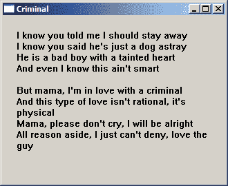
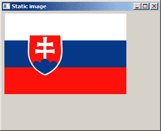
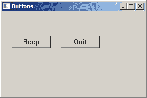
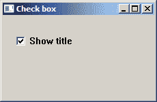
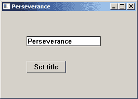

# Windows API 控件 I

> 原文： [http://zetcode.com/gui/winapi/controls/](http://zetcode.com/gui/winapi/controls/)

控件是 Windows 应用程序的基本构建块。 （控件在 UNIX 中称为小部件。）Windows API 教程的这一部分涵盖了静态控件，按钮，复选框和编辑框。

控件也是窗口。 它们是使用`CreateWindowW()`或`CreateWindowExW()`功能创建的。 这些函数分别将窗口类名称作为其第一个和第二个参数。 控件具有其特定的预定义窗口类名称； 因此，在创建控件时，我们不会调用`RegisterClassW()`或`RegisterClassExW()`。

## 静态控件

静态控件显示文本和图形。 无法选择静态控件。 它还不能具有键盘焦点。

### 静态文字

在第一个示例中，我们创建一个静态文本控件。

`static_text.c`

```
#include <windows.h>

LRESULT CALLBACK WndProc(HWND, UINT, WPARAM, LPARAM);

int WINAPI wWinMain(HINSTANCE hInstance, HINSTANCE hPrevInstance,
                    PWSTR lpCmdLine, int nCmdShow) {

    MSG  msg;    
    WNDCLASSW wc = {0};
    wc.lpszClassName = L"Static Control";
    wc.hInstance     = hInstance;
    wc.hbrBackground = GetSysColorBrush(COLOR_3DFACE);
    wc.lpfnWndProc   = WndProc;
    wc.hCursor       = LoadCursor(0, IDC_ARROW);

    RegisterClassW(&wc);
    CreateWindowW(wc.lpszClassName, L"Criminal",
                  WS_OVERLAPPEDWINDOW | WS_VISIBLE,
                  100, 100, 330, 270, 0, 0, hInstance, 0);

    while (GetMessage(&msg, NULL, 0, 0)) {

        TranslateMessage(&msg);
        DispatchMessage(&msg);
    }

    return (int) msg.wParam;
}

LRESULT CALLBACK WndProc(HWND hwnd, UINT msg, 
    WPARAM wParam, LPARAM lParam) {

    static wchar_t *lyrics =  L"I know you told me I should stay away\n\
I know you said he's just a dog astray\n\
He is a bad boy with a tainted heart\n\
And even I know this ain't smart\n\
\n\
But mama, I'm in love with a criminal\n\
And this type of love isn't rational, it's physical\n\
Mama, please don't cry, I will be alright\n\
All reason aside, I just can't deny, love the guy\n\
";

    switch(msg) {

        case WM_CREATE:

            CreateWindowW(L"Static", lyrics, 
                WS_CHILD | WS_VISIBLE | SS_LEFT,
                20, 20, 300, 230, 
                hwnd, (HMENU) 1, NULL, NULL);
            break;

        case WM_DESTROY:

            PostQuitMessage(0);
            break;
    }

    return DefWindowProcW(hwnd, msg, wParam, lParam);
}

```

该示例在窗口上显示歌曲的歌词。

```
CreateWindowW(L"Static", lyrics, 
    WS_CHILD | WS_VISIBLE | SS_LEFT,
    20, 20, 300, 230,
    hwnd, (HMENU) 1, NULL, NULL);
break;

```

静态控件是使用`L"Static"`类创建的。 文本以`SS_LEFT`样式向左对齐。



Static text control

### 静态影像

第二个示例创建一个静态图像控件。

`static_image.c`

```
#include <windows.h>

LRESULT CALLBACK WndProc(HWND, UINT, WPARAM, LPARAM);
void LoadMyImage(void);

HBITMAP hBitmap;

int WINAPI wWinMain(HINSTANCE hInstance, HINSTANCE hPrevInstance,
                    PWSTR lpCmdLine, int nCmdShow) {

    MSG  msg;    
    WNDCLASSW wc = {0};
    wc.lpszClassName = L"Static image";
    wc.hInstance     = hInstance;
    wc.hbrBackground = GetSysColorBrush(COLOR_3DFACE);
    wc.lpfnWndProc   = WndProc;
    wc.hCursor       = LoadCursor(0,IDC_ARROW);

    RegisterClassW(&wc);
    CreateWindowW(wc.lpszClassName, L"Static image",
                  WS_OVERLAPPEDWINDOW | WS_VISIBLE,
                  100, 100, 330, 270, 0, 0, hInstance, 0);

    while (GetMessage(&msg, NULL, 0, 0)) {

        TranslateMessage(&msg);
        DispatchMessage(&msg);
    }

  return (int) msg.wParam;
}

LRESULT CALLBACK WndProc(HWND hwnd, UINT msg, 
    WPARAM wParam, LPARAM lParam) {

    HWND hsti;

    switch(msg) {

        case WM_CREATE:

            LoadMyImage();
            hsti = CreateWindowW(L"Static", L"", 
                WS_CHILD | WS_VISIBLE | SS_BITMAP,
                5, 5, 300, 300, hwnd, (HMENU) 1, NULL, NULL);

            SendMessage(hsti, STM_SETIMAGE,
                (WPARAM) IMAGE_BITMAP, (LPARAM) hBitmap); 
            break;

        case WM_DESTROY:

            DeleteObject(hBitmap);
            PostQuitMessage(0);
            break;
    }

    return DefWindowProcW(hwnd, msg, wParam, lParam);
}

void LoadMyImage(void) {

    hBitmap = LoadImageW(NULL, L"C:\\prog\\slovakia.bmp", IMAGE_BITMAP,
        0, 0, LR_LOADFROMFILE);
}

```

该示例在窗口上显示了 BMP 图像。

```
hsti = CreateWindowW(L"Static", L"", 
        WS_CHILD | WS_VISIBLE | SS_BITMAP,
        5, 5, 300, 300, hwnd, (HMENU) 1, NULL, NULL);

```

`SS_BITMAP`常量使静态控件显示位图。

```
SendMessage(hsti, STM_SETIMAGE,
        (WPARAM) IMAGE_BITMAP, (LPARAM) hBitmap); 

```

发送`STM_SETIMAGE`消息以将新图像与静态控件关联。

```
void LoadMyImage(void) {

    hBitmap = LoadImageW(NULL, L"C:\\prog\\slovakia.bmp", IMAGE_BITMAP,
        0, 0, LR_LOADFROMFILE);
}

```

`LoadImageW()`函数从文件系统加载位图。 如果函数成功，则返回值是新加载的图像的句柄。



Static image control

## 按钮

按钮是带有文本标签的简单控件。 用于触发动作。 当我们单击一个按钮时，它会向其父窗口发送`WM_COMMAND`消息。 `wParam`参数的低位字包含控件标识符。

`button.c`

```
#include <windows.h>

LRESULT CALLBACK WndProc(HWND, UINT, WPARAM, LPARAM);

#define ID_BEEP 1
#define ID_QUIT 2

int WINAPI wWinMain(HINSTANCE hInstance, HINSTANCE hPrevInstance,
                    PWSTR lpCmdLine, int nCmdShow) {

    MSG  msg;
    WNDCLASSW wc = {0};
    wc.lpszClassName = L"Buttons";
    wc.hInstance     = hInstance;
    wc.hbrBackground = GetSysColorBrush(COLOR_3DFACE);
    wc.lpfnWndProc   = WndProc;
    wc.hCursor       = LoadCursor(0, IDC_ARROW);

    RegisterClassW(&wc);
    CreateWindowW(wc.lpszClassName, L"Buttons",
                  WS_OVERLAPPEDWINDOW | WS_VISIBLE,
                  150, 150, 300, 200, 0, 0, hInstance, 0);

    while (GetMessage(&msg, NULL, 0, 0)) {

        TranslateMessage(&msg);
        DispatchMessage(&msg);
    }

    return (int) msg.wParam;
}

LRESULT CALLBACK WndProc(HWND hwnd, UINT msg, 
    WPARAM wParam, LPARAM lParam) {

    switch(msg) {

        case WM_CREATE:

            CreateWindowW(L"Button", L"Beep",
                WS_VISIBLE | WS_CHILD ,
                20, 50, 80, 25, hwnd, (HMENU) ID_BEEP, NULL, NULL);

            CreateWindowW(L"Button", L"Quit",
                WS_VISIBLE | WS_CHILD ,
                120, 50, 80, 25, hwnd, (HMENU) ID_QUIT, NULL, NULL);
            break;

        case WM_COMMAND:

            if (LOWORD(wParam) == ID_BEEP) {

                MessageBeep(MB_OK);
            }

            if (LOWORD(wParam) == ID_QUIT) {

                PostQuitMessage(0);
            }

            break;

        case WM_DESTROY:

            PostQuitMessage(0);
            break;
    }

    return DefWindowProcW(hwnd, msg, wParam, lParam);
}

```

在我们的示例中，我们创建了两个按钮。 一键鸣音。 另一个将关闭窗口。

```
CreateWindowW(L"Button", L"Beep",
    WS_VISIBLE | WS_CHILD ,
    20, 50, 80, 25, hwnd, (HMENU) ID_BEEP, NULL, NULL);

```

按钮控件是使用`L"Button"`类创建的。

```
case WM_COMMAND:

    if (LOWORD(wParam) == ID_BEEP) {

        MessageBeep(MB_OK);
    }

    if (LOWORD(wParam) == ID_QUIT) {

        PostQuitMessage(0);
    }

    break;

```

控件的 ID 在`wParam`的`LOWORD`中。 根据 ID，我们称为`MessageBeep()`函数或`PostQuitMessage()`函数。



Button controls

## 复选框

_ 复选框控件 _ 是可以单击以打开或关闭选项的框。

`checkbox.c`

```
#include <windows.h>
#include <stdbool.h>

LRESULT CALLBACK WndProc(HWND, UINT, WPARAM, LPARAM);

int WINAPI wWinMain(HINSTANCE hInstance, HINSTANCE hPrevInstance,
                    PWSTR lpCmdLine, int nCmdShow) {

    MSG  msg;    
    WNDCLASSW wc = {0};
    wc.lpszClassName = L"Check Box";
    wc.hInstance     = hInstance ;
    wc.hbrBackground = GetSysColorBrush(COLOR_3DFACE);
    wc.lpfnWndProc   = WndProc;
    wc.hCursor       = LoadCursor(0, IDC_ARROW);

    RegisterClassW(&wc);
    CreateWindowW(wc.lpszClassName, L"Check Box",
                  WS_OVERLAPPEDWINDOW | WS_VISIBLE,
                  150, 150, 230, 150, 0, 0, hInstance, 0);

    while (GetMessage(&msg, NULL, 0, 0)) {

        TranslateMessage(&msg);
        DispatchMessage(&msg);
    }

    return (int) msg.wParam;
}

LRESULT CALLBACK WndProc(HWND hwnd, UINT msg, 
    WPARAM wParam, LPARAM lParam) {

    bool checked = true;

    switch(msg) {

        case WM_CREATE:

            CreateWindowW(L"button", L"Show Title",
                WS_VISIBLE | WS_CHILD | BS_CHECKBOX,
                20, 20, 185, 35, hwnd, (HMENU) 1, 
                NULL, NULL);

            CheckDlgButton(hwnd, 1, BST_CHECKED);
            break;

        case WM_COMMAND:

            checked = IsDlgButtonChecked(hwnd, 1);

            if (checked) {

                CheckDlgButton(hwnd, 1, BST_UNCHECKED);
                SetWindowTextW(hwnd, L"");

            } else {

               CheckDlgButton(hwnd, 1, BST_CHECKED);
               SetWindowTextW(hwnd, L"Check Box");
            }

            break;

       case WM_DESTROY:

            PostQuitMessage(0);
            break;
    }

    return DefWindowProcW(hwnd, msg, wParam, lParam);
}

```

在我们的示例中，我们根据复选框的状态显示或隐藏窗口标题。

```
CreateWindowW(L"button", L"Show Title",
    WS_VISIBLE | WS_CHILD | BS_CHECKBOX,
    20, 20, 185, 35, hwnd, (HMENU) 1, 
    NULL, NULL);

```

复选框是一种特殊的按钮。 它是用`BS_CHECKBOX`标志创建的。

```
checked = IsDlgButtonChecked(hwnd, 1);

```

我们使用`IsDlgButtonChecked()`功能确定复选框的状态。

```
CheckDlgButton(hwnd, 1, BST_UNCHECKED);

```

我们使用`CheckDlgButton()`功能选中并取消选中该复选框。

```
SetWindowTextW(hwnd, L"");

```

`SetWindowTextW()`功能设置窗口的标题。



Checkbox control

## 编辑控件

编辑控件是一个矩形子窗口，用于输入和编辑文本。 它可以是单行或多行。

`edit.c`

```
#include <windows.h>

#define ID_EDIT 1
#define ID_BUTTON 2

LRESULT CALLBACK WndProc(HWND, UINT, WPARAM, LPARAM);

int WINAPI wWinMain(HINSTANCE hInstance, HINSTANCE hPrevInstance,
                    PWSTR lpCmdLine, int nCmdShow) {

    MSG  msg;    
    WNDCLASSW wc = {0};
    wc.lpszClassName = L"Edit control";
    wc.hInstance     = hInstance;
    wc.hbrBackground = GetSysColorBrush(COLOR_3DFACE);
    wc.lpfnWndProc   = WndProc;
    wc.hCursor       = LoadCursor(0, IDC_ARROW);

    RegisterClassW(&wc);
    CreateWindowW(wc.lpszClassName, L"Edit control",
                  WS_OVERLAPPEDWINDOW | WS_VISIBLE,
                  220, 220, 280, 200, 0, 0, hInstance, 0);  

    while (GetMessage(&msg, NULL, 0, 0)) {

      TranslateMessage(&msg);
      DispatchMessage(&msg);
    }

    return (int) msg.wParam;
}

LRESULT CALLBACK WndProc(HWND hwnd, UINT msg, 
    WPARAM wParam, LPARAM lParam) {

    static HWND hwndEdit;
    HWND hwndButton;

    switch(msg) {

        case WM_CREATE:

            hwndEdit = CreateWindowW(L"Edit", NULL, 
                WS_CHILD | WS_VISIBLE | WS_BORDER,
                50, 50, 150, 20, hwnd, (HMENU) ID_EDIT,
                NULL, NULL);

            hwndButton = CreateWindowW(L"button", L"Set title",
                WS_VISIBLE | WS_CHILD, 50, 100, 80, 25,
                hwnd, (HMENU) ID_BUTTON, NULL, NULL);

            break;

        case WM_COMMAND:	

            if (HIWORD(wParam) == BN_CLICKED) {

                int len = GetWindowTextLengthW(hwndEdit) + 1;
                wchar_t text[len];

                GetWindowTextW(hwndEdit, text, len);
                SetWindowTextW(hwnd, text);
            }

            break;

        case WM_DESTROY:
            PostQuitMessage(0);
            break;
    }

    return DefWindowProcW(hwnd, msg, wParam, lParam);
}

```

在我们的示例中，我们有一个编辑控件和一个按钮。 我们可以将一些文本放入编辑控件中。 如果单击按钮，则输入的文本将显示在主窗口的标题栏中。

```
hwndEdit = CreateWindowW(L"Edit", NULL, 
    WS_CHILD | WS_VISIBLE | WS_BORDER,
    50, 50, 150, 20, hwnd, (HMENU) ID_EDIT,
    NULL, NULL);

```

编辑控件是使用`L"Edit"`窗口类创建的。 `WS_BORDER`窗口样式在控件周围创建细线边框。

```
if (HIWORD(wParam) == BN_CLICKED) {

   int len = GetWindowTextLengthW(hwndEdit) + 1;
   wchar_t text[len];

   GetWindowTextW(hwndEdit, text, len);
   SetWindowTextW(hwnd, text);
}

```

`GetWindowTextLengthW()`返回输入文本的长度。 注意，我们在长度上加 1。 这将包括零终止符。 尝试忽略它，看看会发生什么。 `GetWindowTextW()`从编辑控件接收文本。 该函数的第一个参数是包含文本的窗口或控件的句柄。 `SetWindowTextW()`设置窗口的文本。 在这种情况下，它是主窗口的标题。



Figure: Edit control

在 Windows API 教程的这一部分中，我们介绍了四个基本的 Windows 控件。