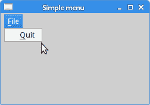
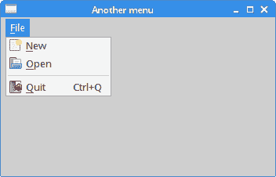
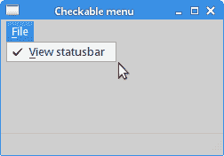
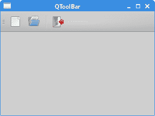
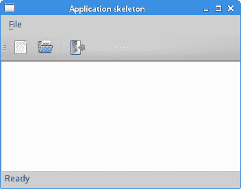

# Qt4 中的菜单和工具栏

> 原文： [http://zetcode.com/gui/qt4/menusandtoolbars/](http://zetcode.com/gui/qt4/menusandtoolbars/)

在 Qt4 C++ 编程教程的这一部分中，我们将讨论 Qt4 应用中的菜单和工具栏。

菜单栏是 GUI 应用的常见部分。 它是位于各个位置（称为菜单）的一组命令。 菜单将我们可以在应用中使用的命令分组。 使用工具栏可以快速访问最常用的命令。

## 简单菜单

第一个示例显示了一个简单的菜单。

`simplemenu.h`

```
#pragma once

#include <QMainWindow>
#include <QApplication>

class SimpleMenu : public QMainWindow {

  public:
    SimpleMenu(QWidget *parent = 0);
};

```

这是我们的代码示例的头文件。

`simplemenu.cpp`

```
#include "simplemenu.h"
#include <QMenu>
#include <QMenuBar>

SimpleMenu::SimpleMenu(QWidget *parent)
    : QMainWindow(parent) {

  QAction *quit = new QAction("&Quit", this);

  QMenu *file;
  file = menuBar()->addMenu("&File");
  file->addAction(quit);

  connect(quit, SIGNAL(triggered()), qApp, SLOT(quit()));
}

```

我们有一个菜单栏，一个菜单和一个动作。 为了使用菜单，我们必须从`QMainWindow`小部件继承。

```
QAction *quit = new QAction("&Quit", this);

```

此代码行创建一个`QAction`。 每个`QMenu`具有一个或多个动作对象。

```
QMenu *file;
file = menuBar()->addMenu("&File");

```

我们创建一个`QMenu`对象。

```
file->addAction(quit);

```

我们使用`addAction()`方法在菜单中放置一个动作。

```
connect(quit, SIGNAL(triggered()), qApp, SLOT(quit()));

```

当我们从菜单中选择此选项时，应用退出。

`main.cpp`

```
#include "simplemenu.h"

int main(int argc, char *argv[]) {

  QApplication app(argc, argv);  

  SimpleMenu window;

  window.resize(250, 150);
  window.setWindowTitle("Simple menu");
  window.show();

  return app.exec();
}

```

主文件。



Figure: Simple menu

## 图标，快捷方式和分隔符

在以下示例中，我们将进一步增强以前的应用。 我们将图标添加到菜单，使用快捷方式和分隔符。

`anothermenu.h`

```
#pragma once

#include <QMainWindow>
#include <QApplication>

class AnotherMenu : public QMainWindow {

  public:
    AnotherMenu(QWidget *parent = 0);
};

```

该示例的头文件。

`anothermenu.cpp`

```
#include "anothermenu.h"
#include <QMenu>
#include <QMenuBar>

AnotherMenu::AnotherMenu(QWidget *parent)
    : QMainWindow(parent) {

  QPixmap newpix("new.png");
  QPixmap openpix("open.png");
  QPixmap quitpix("quit.png");

  QAction *newa = new QAction(newpix, "&New", this);
  QAction *open = new QAction(openpix, "&Open", this);
  QAction *quit = new QAction(quitpix, "&Quit", this);
  quit->setShortcut(tr("CTRL+Q"));

  QMenu *file;
  file = menuBar()->addMenu("&File");
  file->addAction(newa);
  file->addAction(open);
  file->addSeparator();
  file->addAction(quit);

  qApp->setAttribute(Qt::AA_DontShowIconsInMenus, false);

  connect(quit, SIGNAL(triggered()), qApp, SLOT(quit()));
}

```

在我们的示例中，我们有一个包含三个动作的菜单。 如果我们选择退出操作，则实际上只有退出操作才可以执行某些操作。 我们还创建一个分隔符和`CTRL+Q`快捷方式，以终止应用。

```
QPixmap newpix("new.png");
QPixmap openpix("open.png");
QPixmap quitpix("quit.png");

```

这些是我们在菜单中使用的图像。 请注意，某些桌面环境可能不会在菜单中显示图像。

```
QAction *newa = new QAction(newpix, "&New", this);
QAction *open = new QAction(openpix, "&Open", this);
QAction *quit = new QAction(quitpix, "&Quit", this);

```

在此代码中，我们将`QAction`构造函数与像素映射用作第一个参数。

```
quit->setShortcut(tr("CTRL+Q"));

```

在这里，我们创建键盘快捷键。 通过按下此快捷方式，我们将运行 quit 操作，该操作将退出应用。

```
file->addSeparator();

```

我们创建一个分隔符。 分隔符是一条水平线，使我们能够将菜单操作分组为一些逻辑组。

```
qApp->setAttribute(Qt::AA_DontShowIconsInMenus, false);

```

在某些环境中，默认情况下不显示菜单图标。 在这种情况下，我们可以禁用`Qt::AA_DontShowIconsInMenus`属性。

`main.cpp`

```
#include "anothermenu.h"

int main(int argc, char *argv[]) {

  QApplication app(argc, argv);  

  AnotherMenu window;

  window.resize(350, 200);
  window.move(300, 300);  
  window.setWindowTitle("Another menu");
  window.show();

  return app.exec();
}

```

这是主文件。



Figure: Another menu example

## 复选菜单

在下一个示例中，我们创建一个复选菜单。 这将是带有复选框的操作。 该选项可切换状态栏的可见性。

`checkable.h`

```
#pragma once

#include <QMainWindow>
#include <QApplication>

class Checkable : public QMainWindow {

  Q_OBJECT  

  public:
    Checkable(QWidget *parent = 0);

  private slots:
    void toggleStatusbar();

  private:
    QAction *viewst;
};

```

该示例的头文件。

`checkable.cpp`

```
#include "checkable.h"
#include <QMenu>
#include <QMenuBar>
#include <QStatusBar>

Checkable::Checkable(QWidget *parent)
    : QMainWindow(parent) {

  viewst = new QAction("&View statusbar", this);
  viewst->setCheckable(true);
  viewst->setChecked(true);

  QMenu *file;
  file = menuBar()->addMenu("&File");
  file->addAction(viewst);

  statusBar();

  connect(viewst, SIGNAL(triggered()), this, SLOT(toggleStatusbar()));
}

void Checkable::toggleStatusbar() {

  if (viewst->isChecked()) {

      statusBar()->show();
  } else {

      statusBar()->hide();
  }
}

```

复选菜单项切换状态栏的可见性。

```
viewst = new QAction("&View statusbar", this);
viewst->setCheckable(true);
viewst->setChecked(true);

```

我们创建一个 actiona，并使用`setCheckable()`方法对其进行检查。 `setChecked()`方法进行检查。

```
if (viewst->isChecked()) {

    statusBar()->show();
} else {

    statusBar()->hide();
}

```

在`toggleStatusbar()`方法内部，我们确定菜单项是否已选中，并相应地隐藏或显示状态栏。

`main.cpp`

```
#include "checkable.h"

int main(int argc, char *argv[]) {

  QApplication app(argc, argv);  

  Checkable window;

  window.resize(250, 150);
  window.setWindowTitle("Checkable menu");
  window.show();

  return app.exec();
}

```

这是主文件。



Figure: Checkable menu

## `QToolBar`

`QToolBar`类提供了一个可移动面板，其中包含一组控件，这些控件可快速访问应用动作。

`toolbar.h`

```
#pragma once

#include <QMainWindow>
#include <QApplication>

class Toolbar : public QMainWindow {

  Q_OBJECT  

  public:
    Toolbar(QWidget *parent = 0);
};

```

该示例的头文件。

`toolbar.cpp`

```
#include "toolbar.h"
#include <QToolBar>
#include <QIcon>
#include <QAction>

Toolbar::Toolbar(QWidget *parent)
    : QMainWindow(parent) {

  QPixmap newpix("new.png");
  QPixmap openpix("open.png");
  QPixmap quitpix("quit.png");

  QToolBar *toolbar = addToolBar("main toolbar");
  toolbar->addAction(QIcon(newpix), "New File");
  toolbar->addAction(QIcon(openpix), "Open File");
  toolbar->addSeparator();
  QAction *quit = toolbar->addAction(QIcon(quitpix), 
      "Quit Application");

  connect(quit, SIGNAL(triggered()), qApp, SLOT(quit()));
}

```

要创建工具栏，我们从`QMainWindow`小部件继承。

```
QToolBar *toolbar = addToolBar("main toolbar");

```

`addToolBar()`方法创建一个工具栏并返回指向它的指针。

```
toolbar->addAction(QIcon(newpix), "New File");
toolbar->addAction(QIcon(openpix), "Open File");
toolbar->addSeparator();

```

在这里，我们向工具栏添加了两个动作和一个分隔符。

`main.cpp`

```
#include "toolbar.h"

int main(int argc, char *argv[]) {

  QApplication app(argc, argv);  

  Toolbar window;

  window.resize(300, 200);
  window.setWindowTitle("QToolBar");
  window.show();

  return app.exec();
}

```

这是主文件。



Figure: QToolBar

## 应用框架

在 C++  Qt4 教程的这一部分的最后，我们将创建一个应用框架。 该示例主要基于`QMainWindow`小部件。

`skeleton.h`

```
#pragma once

#include <QMainWindow>
#include <QApplication>

class Skeleton : public QMainWindow {

  Q_OBJECT  

  public:
    Skeleton(QWidget *parent = 0);
};

```

该示例的头文件。

`skeleton.cpp`

```
#include "skeleton.h"
#include <QToolBar>
#include <QIcon>
#include <QAction>
#include <QMenu>
#include <QMenuBar>
#include <QStatusBar>
#include <QTextEdit>

Skeleton::Skeleton(QWidget *parent)
    : QMainWindow(parent) {

  QPixmap newpix("new.png");
  QPixmap openpix("open.png");
  QPixmap quitpix("quit.png");

  QAction *quit = new QAction("&Quit", this);

  QMenu *file;
  file = menuBar()->addMenu("&File");
  file->addAction(quit);

  connect(quit, SIGNAL(triggered()), qApp, SLOT(quit()));

  QToolBar *toolbar = addToolBar("main toolbar");
  toolbar->addAction(QIcon(newpix), "New File");
  toolbar->addAction(QIcon(openpix), "Open File");
  toolbar->addSeparator();

  QAction *quit2 = toolbar->addAction(QIcon(quitpix), 
      "Quit Application");
  connect(quit2, SIGNAL(triggered()), qApp, SLOT(quit()));

  QTextEdit *edit = new QTextEdit(this);  

  setCentralWidget(edit);

  statusBar()->showMessage("Ready");
}

```

在这里，我们创建一个菜单，一个工具栏和一个状态栏。

```
QTextEdit *edit = new QTextEdit(this);  

setCentralWidget(edit);

```

我们创建一个`QTextEdit`小部件，并将其放入`QMainWindow`小部件的中央部分。

`main.cpp`

```
#include "skeleton.h"

int main(int argc, char *argv[]) {

  QApplication app(argc, argv);  

  Skeleton window;

  window.resize(350, 250);
  window.setWindowTitle("Application skeleton");
  window.show();

  return app.exec();
}

```

这是主文件。



Figure: Application skeleton

在 Qt4 教程的这一部分中，我们介绍了菜单和工具栏。