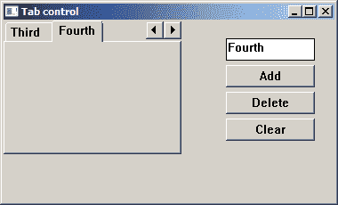
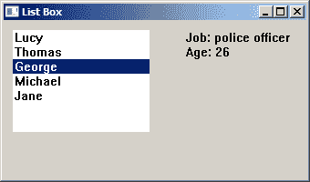

# Windows API 中的高级控件

> 原文： [http://zetcode.com/gui/winapi/advancedcontrols/](http://zetcode.com/gui/winapi/advancedcontrols/)

在 Windows API 教程的这一部分中，我们将详细讨论两个高级 Windows 控件：选项卡控件和列表框控件。

## 标签控件

选项卡控件将具有相应选项卡的多个窗口合并在一起。

`tabcontrol.c`

```
#include <windows.h>
#include <commctrl.h>
#include <wchar.h>

#define ID_TABCTRL 1
#define ID_EDIT 2
#define BTN_ADD 3
#define BTN_DEL 4
#define BTN_CLR 5
#define MAX_TAB_LEN 15

LRESULT CALLBACK WndProc(HWND, UINT, WPARAM, LPARAM);
HWND hTab, hEdit;

int WINAPI wWinMain(HINSTANCE hInstance, HINSTANCE hPrevInstance, 
    PWSTR pCmdLine, int nCmdShow) {

    MSG  msg ;    
    WNDCLASSW wc = {0};
    wc.lpszClassName = L"Tab control";
    wc.hInstance     = hInstance;
    wc.hbrBackground = GetSysColorBrush(COLOR_3DFACE);
    wc.lpfnWndProc   = WndProc;
    wc.hCursor       = LoadCursor(0, IDC_ARROW);

    RegisterClassW(&wc);
    CreateWindowW(wc.lpszClassName, L"Tab control",
                  WS_OVERLAPPEDWINDOW | WS_VISIBLE,
                  100, 100, 380, 230, 0, 0, hInstance, 0);  

    while (GetMessage(&msg, NULL, 0, 0)) {

        TranslateMessage(&msg);
        DispatchMessage(&msg);
    }

    return (int) msg.wParam;
}

LRESULT CALLBACK WndProc(HWND hwnd, UINT msg, 
    WPARAM wParam, LPARAM lParam) {

    TCITEMW tie;
    wchar_t text[4];
    LRESULT count, id;
    INITCOMMONCONTROLSEX icex;

    switch(msg) {

        case WM_CREATE:

            icex.dwSize = sizeof(INITCOMMONCONTROLSEX);
            icex.dwICC = ICC_TAB_CLASSES;
            InitCommonControlsEx(&icex);

            hTab = CreateWindowW(WC_TABCONTROLW, NULL, WS_CHILD | WS_VISIBLE,
                0, 0, 200, 150, hwnd,(HMENU) ID_TABCTRL, NULL, NULL);

            hEdit = CreateWindowW(WC_EDITW, NULL, WS_CHILD | WS_VISIBLE | WS_BORDER,
                250, 20, 100, 25, hwnd, (HMENU) ID_EDIT, NULL, NULL);

            SendMessage(hEdit, EM_SETLIMITTEXT, MAX_TAB_LEN, 0);

            CreateWindowW(WC_BUTTONW, L"Add", WS_CHILD | WS_VISIBLE | BS_PUSHBUTTON,
                250, 50, 100, 25, hwnd, (HMENU) BTN_ADD, NULL, NULL);

            CreateWindowW(WC_BUTTONW, L"Delete", WS_CHILD | WS_VISIBLE | BS_PUSHBUTTON,
                250, 80, 100, 25, hwnd, (HMENU) BTN_DEL, NULL, NULL);

            CreateWindowW(WC_BUTTONW, L"Clear", WS_CHILD | WS_VISIBLE | BS_PUSHBUTTON,
                250, 110, 100, 25, hwnd, (HMENU) BTN_CLR, NULL, NULL);
            break;

        case WM_COMMAND:

            switch(LOWORD(wParam)) {

                case BTN_ADD:

                    GetWindowTextW(hEdit, text, 250);

                    if (lstrlenW(text) != 0 ) {

                        tie.mask = TCIF_TEXT;
                        tie.pszText = text;
                        count = SendMessageW(hTab, TCM_GETITEMCOUNT, 0, 0);
                        SendMessageW(hTab, TCM_INSERTITEMW, count, 
                            (LPARAM) (LPTCITEM) &tie);
                    }
                    break;

                case BTN_DEL:

                    id = SendMessageW(hTab, TCM_GETCURSEL, 0, 0);

                    if (id != -1) {

                       SendMessageW(hTab, TCM_DELETEITEM, 0, id);
                    }
                    break;

                case BTN_CLR:

                    SendMessageW(hTab, TCM_DELETEALLITEMS, 0, 0);
                    break;
            } 
            break;

        case WM_DESTROY:

            PostQuitMessage(0);
            break;
    }

    return(DefWindowProcW(hwnd, msg, wParam, lParam));
}

```

在我们的例子中，我们使用一个标签控件，一个编辑控件，以及三个按钮。 我们将在选项卡控件上动态创建和删除选项卡。

```
hTab = CreateWindowW(WC_TABCONTROLW, NULL, WS_CHILD | WS_VISIBLE,
    0, 0, 200, 150, hwnd,(HMENU) ID_TABCTRL, NULL, NULL);

```

我们使用`WC_TABCONTROL`窗口类创建一个选项卡控件。

```
hEdit = CreateWindowW(WC_EDITW, NULL, WS_CHILD | WS_VISIBLE | WS_BORDER,
    250, 20, 100, 25, hwnd, (HMENU) ID_EDIT, NULL, NULL);

SendMessage(hEdit, EM_SETLIMITTEXT, MAX_TAB_LEN, 0);

```

我们创建一个编辑控件，并通过`EM_SETLIMITTEXT`消息设置其最大大小。

```
if (lstrlenW(text) != 0 ) {

    tie.mask = TCIF_TEXT;
    tie.pszText = text;
    count = SendMessageW(hTab, TCM_GETITEMCOUNT, 0, 0);
    SendMessageW(hTab, TCM_INSERTITEMW, count, 
       (LPARAM) (LPTCITEM) &tie);
}

```

要添加新标签，我们填充`TCITEMW`结构。 我们提供要设置的数据类型（在我们的示例中为`TCIF_TEXT`）和实际文本。 然后，我们发送两条消息。 `TCM_GETITEMCOUNT`消息获取选项卡的数量。 它将在第二条消息中使用。 `TCM_INSERTITEMW`消息使用`count`变量和`TCITEMW`结构在控件中插入新标签。

```
id = SendMessageW(hTab, TCM_GETCURSEL, 0, 0);

if (id != -1) {

   SendMessageW(hTab, TCM_DELETEITEM, 0, id);
}

```

要删除特定标签，我们需要当前选择的标签。 我们通过将`TCM_GETCURSEL`消息发送到选项卡控件来解决。 要删除选项卡，我们发送`TCM_DELETEITEM`消息，并在`wParam`参数中指定要删除的项目。

```
SendMessageW(hTab, TCM_DELETEALLITEMS, 0, 0);

```

要从标签控件中删除所有标签，我们发送`TCM_DELETEALLITEMS`消息。



Figure: Tab control

## 列表框

`List Box`包含一个简单的列表，用户通常可以从中选择一个或多个项目。 所选项目被标记。

`listbox.c`

```
#include <windows.h>
#include <commctrl.h>
#include <strsafe.h>

#define IDC_LIST 1
#define IDC_STATIC 2

LRESULT CALLBACK WndProc(HWND, UINT, WPARAM, LPARAM);

typedef struct {

    wchar_t name[30]; 
    wchar_t job[20]; 
    int age; 

} Friends; 

Friends friends[] = {

    {L"Lucy", L"waitress", 18}, 
    {L"Thomas", L"programmer", 25}, 
    {L"George", L"police officer", 26}, 
    {L"Michael", L"producer", 38}, 
    {L"Jane", L"steward", 28}, 
}; 

int WINAPI wWinMain(HINSTANCE hInstance, HINSTANCE hPrevInstance, 
    PWSTR pCmdLine, int nCmdShow) {

    MSG  msg ;    
    WNDCLASSW wc = {0};
    wc.lpszClassName = L"MyListBox";
    wc.hInstance     = hInstance;
    wc.hbrBackground = GetSysColorBrush(COLOR_3DFACE);
    wc.lpfnWndProc   = WndProc;
    wc.hCursor       = LoadCursor(0, IDC_ARROW);

    RegisterClassW(&wc);
    CreateWindowW(wc.lpszClassName, L"List Box",
                  WS_OVERLAPPEDWINDOW | WS_VISIBLE,
                  100, 100, 340, 200, 0, 0, hInstance, 0);  

    while (GetMessage(&msg, NULL, 0, 0)) {

        TranslateMessage(&msg);
        DispatchMessage(&msg);
    }

    return (int) msg.wParam;
}

LRESULT CALLBACK WndProc(HWND hwnd, UINT msg, 
    WPARAM wParam, LPARAM lParam) {

    static HWND hwndList, hwndStatic;
    wchar_t buf[128];

    switch(msg) {

        case WM_CREATE:

            hwndList = CreateWindowW(WC_LISTBOXW , NULL, WS_CHILD 
                | WS_VISIBLE | LBS_NOTIFY, 10, 10, 150, 120, hwnd, 
                (HMENU) IDC_LIST, NULL, NULL);

            hwndStatic = CreateWindowW(WC_STATICW , NULL, WS_CHILD | WS_VISIBLE,
               200, 10, 120, 45, hwnd, (HMENU) IDC_STATIC, NULL, NULL);

            for (int i = 0; i < ARRAYSIZE(friends); i++)  { 
                 SendMessageW(hwndList, LB_ADDSTRING, 0, (LPARAM) friends[i].name);
            } 

            break;

        case WM_COMMAND:

            if (LOWORD(wParam) == IDC_LIST) {        
                if (HIWORD(wParam) == LBN_SELCHANGE) {                   
                    int sel = (int) SendMessageW(hwndList, LB_GETCURSEL, 0, 0);
                    StringCbPrintfW(buf, ARRAYSIZE(buf), L"Job: %ls\nAge: %d", 
                        friends[sel].job, friends[sel].age);
                    SetWindowTextW(hwndStatic, buf);
               }
            }            

            break;

        case WM_DESTROY:

            PostQuitMessage(0);
            break;
    }

    return (DefWindowProcW(hwnd, msg, wParam, lParam));
}

```

在此示例中，我们显示一个列表框控件和一个静态文本控件。 通过从列表框中选择一个人，我们可以在静态控件中显示他的工作和年龄。

```
hwndList = CreateWindowW(WC_LISTBOXW , NULL, WS_CHILD 
        | WS_VISIBLE | LBS_NOTIFY, 10, 10, 150, 120, hwnd, 
        (HMENU) IDC_LIST, g_hinst, NULL);

```

`WC_LISTBOXW`窗口类用于创建列表框控件。 每当用户单击列表框项目（`LBN_SELCHANGE`），双击项目（`LBN_DBLCLK`）或取消选择（`LBN_SELCANCEL`时，`LBS_NOTIFY`标志都会使列表框将通知代码发送到父窗口 ]）。

```
for (int i = 0; i < ARRAYSIZE(friends); i++)  { 
    SendMessageW(hwndList, LB_ADDSTRING, 0, (LPARAM) friends[i].name);
} 

```

通过发送多个`LB_ADDSTRING`消息，列表框中填充了数据。

```
if (HIWORD(wParam) == LBN_SELCHANGE) {                   
        int sel = (int) SendMessageW(hwndList, LB_GETCURSEL, 0, 0);
        StringCbPrintfW(buf, ARRAYSIZE(buf), L"Job: %ls\nAge: %d", 
                friends[sel].job, friends[sel].age);
        SetWindowTextW(hwndStatic, buf);
}

```

如果我们从列表框中选择一个项目，则窗口过程会收到`LBN_SELCHANGE`消息。 首先，我们通过向列表框中发送`LB_GETCURSEL`消息来确定当前选择的项目。 然后，我们将工作名称和年龄从好友结构复制到`buf`数组中。 最后，我们通过`SetWindowTextW()`函数调用来设置静态文本。



Figure: List Box

在 Windows API 教程的这一部分中，我们介绍了两个更高级的 Windows 控件。