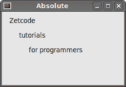
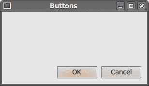
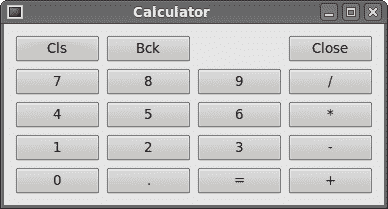

# PySide 中的布局管理

> 原文： [http://zetcode.com/gui/pysidetutorial/layoutmanagement/](http://zetcode.com/gui/pysidetutorial/layoutmanagement/)

GUI 编程中的重要事项是布局管理。 布局管理是我们将小部件放置在窗口上的方式。 管理可以通过两种方式完成。 我们可以使用绝对定位或布局类。

## 绝对定位

程序员以像素为单位指定每个小部件的位置和大小。 使用绝对定位时，您必须了解几件事。

*   如果我们调整窗口大小，则小部件的大小和位置不会改变
*   各种平台上的应用程序看起来可能有所不同
*   在我们的应用程序中更改字体可能会破坏布局
*   如果我们决定更改布局，则必须完全重做布局，这既繁琐又耗时

```
#!/usr/bin/python
# -*- coding: utf-8 -*-

"""
ZetCode PySide tutorial 

This example shows three labels on a window
using absolute positioning. 

author: Jan Bodnar
website: zetcode.com 
last edited: August 2011
"""

import sys
from PySide import QtGui

class Example(QtGui.QWidget):

    def __init__(self):
        super(Example, self).__init__()

        self.initUI()

    def initUI(self):

        label1 = QtGui.QLabel('Zetcode', self)
        label1.move(15, 10)

        label2 = QtGui.QLabel('tutorials', self)
        label2.move(35, 40)

        label3 = QtGui.QLabel('for programmers', self)
        label3.move(55, 70)        

        self.setGeometry(300, 300, 250, 150)
        self.setWindowTitle('Absolute')    
        self.show()

def main():

    app = QtGui.QApplication(sys.argv)
    ex = Example()
    sys.exit(app.exec_())

if __name__ == '__main__':
    main()

```

我们只需调用`move()`方法来定位小部件。 在我们的例子中，这些小部件是标签。 我们通过提供 x 和 y 坐标来定位它们。 坐标系的起点在左上角。 x 值从左到右增长。 y 值从上到下增长。



Figure: Absolute positioning

## 盒子布局

具有布局类的布局管理更加灵活和实用。 这是在窗口上放置小部件的首选方法。 基本布局类是`QtGui.QHBoxLayout`和`QtGui.QVBoxLayout`。 他们水平和垂直排列小部件。

想象一下，我们想在右下角放置两个按钮。 为了创建这样的布局，我们将使用一个水平框和一个垂直框。 为了创建必要的空间，我们将添加一个`stretch factor`。

```
#!/usr/bin/python
# -*- coding: utf-8 -*-

"""
ZetCode PySide tutorial 

In this example, we position two push
buttons in the bottom-right corner 
of the window. 

author: Jan Bodnar
website: zetcode.com 
last edited: August 2011
"""

import sys
from PySide import QtGui

class Example(QtGui.QWidget):

    def __init__(self):
        super(Example, self).__init__()

        self.initUI()

    def initUI(self):

        okButton = QtGui.QPushButton("OK")
        cancelButton = QtGui.QPushButton("Cancel")

        hbox = QtGui.QHBoxLayout()
        hbox.addStretch(1)
        hbox.addWidget(okButton)
        hbox.addWidget(cancelButton)

        vbox = QtGui.QVBoxLayout()
        vbox.addStretch(1)
        vbox.addLayout(hbox)

        self.setLayout(vbox)    

        self.setGeometry(300, 300, 300, 150)
        self.setWindowTitle('Buttons')    
        self.show()

def main():

    app = QtGui.QApplication(sys.argv)
    ex = Example()
    sys.exit(app.exec_())

if __name__ == '__main__':
    main()

```

该示例在窗口的右下角放置了两个按钮。 当我们调整应用程序窗口的大小时，它们会停留在该位置。 我们同时使用`QtGui.HBoxLayout`和`QtGui.QVBoxLayout`。

```
okButton = QtGui.QPushButton("OK")
cancelButton = QtGui.QPushButton("Cancel")

```

在这里，我们创建两个按钮。

```
hbox = QtGui.QHBoxLayout()
hbox.addStretch(1)
hbox.addWidget(okButton)
hbox.addWidget(cancelButton)

```

我们创建一个水平框布局。 添加一个拉伸因子和两个按钮。 拉伸在两个按钮之前增加了可拉伸的空间。 这会将它们推到窗口的右侧。

```
vbox = QtGui.QVBoxLayout()
vbox.addStretch(1)
vbox.addLayout(hbox)

```

为了创建必要的布局，我们将水平布局放入垂直布局。 垂直框中的拉伸因子会将带有按钮的水平框推到窗口底部。

```
self.setLayout(vbox)

```

最后，我们设置窗口的基本布局。 它是垂直框。



Figure: Buttons example

## 网格布局

PySide 中最通用的布局类是网格布局。 此布局将空间分为行和列。 要创建网格布局，我们使用`QtGui.QGridLayout`类。

```
#!/usr/bin/python
# -*- coding: utf-8 -*-

"""
ZetCode PySide tutorial 

In this example, we create a skeleton
of a calculator using a QGridLayout.

author: Jan Bodnar
website: zetcode.com 
last edited: August 2011
"""

import sys
from PySide import QtGui

class Example(QtGui.QWidget):

    def __init__(self):
        super(Example, self).__init__()

        self.initUI()

    def initUI(self):

        names = ['Cls', 'Bck', '', 'Close', '7', '8', '9', '/',
                '4', '5', '6', '*', '1', '2', '3', '-',
                '0', '.', '=', '+']

        grid = QtGui.QGridLayout()

        j = 0
        pos = [(0, 0), (0, 1), (0, 2), (0, 3),
                (1, 0), (1, 1), (1, 2), (1, 3),
                (2, 0), (2, 1), (2, 2), (2, 3),
                (3, 0), (3, 1), (3, 2), (3, 3 ),
                (4, 0), (4, 1), (4, 2), (4, 3)]

        for i in names:
            button = QtGui.QPushButton(i)
            if j == 2:
                grid.addWidget(QtGui.QLabel(''), 0, 2)
            else: grid.addWidget(button, pos[j][0], pos[j][1])
            j = j + 1

        self.setLayout(grid)   

        self.move(300, 150)
        self.setWindowTitle('Calculator')    
        self.show()

def main():

    app = QtGui.QApplication(sys.argv)
    ex = Example()
    sys.exit(app.exec_())

if __name__ == '__main__':
    main()

```

在我们的示例中，我们创建了一个按钮网格。 为了填补一个空白，我们还添加了一个`QtGui.QLabel`小部件。

```
grid = QtGui.QGridLayout()

```

在这里，我们创建一个网格布局。

```
if j == 2:
    grid.addWidget(QtGui.QLabel(''), 0, 2)
else: grid.addWidget(button, pos[j][0], pos[j][1])

```

要将小部件添加到网格，我们调用`addWidget()`方法。 参数是小部件，行和列号。



Figure: Calculator skeleton

## 审查范例

小部件可以跨越网格中的多个列或行。 在下一个示例中，我们将对此进行说明。

```
#!/usr/bin/python
# -*- coding: utf-8 -*-

"""
ZetCode PySide tutorial 

In this example, we create a bit
more complicated window layout using
the QGridLayout manager. 

author: Jan Bodnar
website: zetcode.com 
last edited: August 2011
"""

import sys
from PySide import QtGui

class Example(QtGui.QWidget):

    def __init__(self):
        super(Example, self).__init__()

        self.initUI()

    def initUI(self):

        title = QtGui.QLabel('Title')
        author = QtGui.QLabel('Author')
        review = QtGui.QLabel('Review')

        titleEdit = QtGui.QLineEdit()
        authorEdit = QtGui.QLineEdit()
        reviewEdit = QtGui.QTextEdit()

        grid = QtGui.QGridLayout()
        grid.setSpacing(10)

        grid.addWidget(title, 1, 0)
        grid.addWidget(titleEdit, 1, 1)

        grid.addWidget(author, 2, 0)
        grid.addWidget(authorEdit, 2, 1)

        grid.addWidget(review, 3, 0)
        grid.addWidget(reviewEdit, 3, 1, 5, 1)

        self.setLayout(grid) 

        self.setGeometry(300, 300, 350, 300)
        self.setWindowTitle('Review')    
        self.show()

def main():

    app = QtGui.QApplication(sys.argv)
    ex = Example()
    sys.exit(app.exec_())

if __name__ == '__main__':
    main()

```

我们创建一个窗口，其中有三个标签，两个行编辑和一个文本编辑小部件。 使用`QtGui.QGridLayout`完成布局。

```
grid = QtGui.QGridLayout()
grid.setSpacing(10)

```

我们创建网格布局并设置小部件之间的间距。

```
grid.addWidget(reviewEdit, 3, 1, 5, 1)

```

如果我们将小部件添加到网格，则可以提供小部件的行跨度和列跨度。 在我们的例子中，我们使`reviewEdit`小部件跨越 5 行。


Figure: Review example

PySide 教程的这一部分专门用于布局管理。