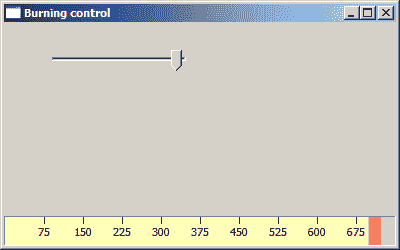

# Windows API 中的自定义控件

> 原文： [http://zetcode.com/gui/winapi/customcontrols/](http://zetcode.com/gui/winapi/customcontrols/)

在这里，我们将演示如何创建自己的自定义控件。 Windows API 具有各种预先构建的控件的集合。 必须手动创建更多特定的控件。 我们使用 GDI 创建自定义控件。

## 刻录控件

可以在各种媒体刻录应用中找到此控件，例如 Nero Burning ROM。

```c
#include <windows.h>
#include <commctrl.h>
#include <wchar.h>

LRESULT CALLBACK PanelProc(HWND, UINT, WPARAM, LPARAM);
LRESULT CALLBACK WndProc(HWND, UINT, WPARAM, LPARAM);

HINSTANCE g_hinst;
LRESULT g_pos = 150;

int WINAPI wWinMain(HINSTANCE hInstance, HINSTANCE hPrevInstance, 
                    PWSTR lpCmdLine, int nCmdShow)
{
  HWND hwnd;
  MSG  msg;    
  WNDCLASSW wc = {0};

  wc.lpszClassName = L"Application";
  wc.hInstance     = hInstance;
  wc.hbrBackground = GetSysColorBrush(COLOR_3DFACE);
  wc.lpfnWndProc   = WndProc;
  wc.hCursor       = LoadCursor(0, IDC_ARROW);

  g_hinst = hInstance;

  RegisterClassW(&wc);
  hwnd = CreateWindowW(wc.lpszClassName, L"Burning control",
                WS_OVERLAPPEDWINDOW | WS_VISIBLE | WS_CLIPCHILDREN,
                100, 100, 400, 250, 0, 0, hInstance, 0);  

  while( GetMessage(&msg, NULL, 0, 0)) {
    DispatchMessage(&msg);
  }

  return (int) msg.wParam;
}

LRESULT CALLBACK WndProc(HWND hwnd, UINT msg, 
    WPARAM wParam, LPARAM lParam)
{

  static HWND hwndTrack, hwndBurn;
  WNDCLASSW rwc = {0};

  INITCOMMONCONTROLSEX InitCtrlEx;

  InitCtrlEx.dwSize = sizeof(INITCOMMONCONTROLSEX);
  InitCtrlEx.dwICC  = ICC_BAR_CLASSES;
  InitCommonControlsEx(&InitCtrlEx);

  switch(msg)  
  {
      case WM_CREATE:

          rwc.lpszClassName = L"BurningControl";

          rwc.hbrBackground = GetSysColorBrush(COLOR_BTNFACE);
          rwc.style         = CS_HREDRAW;
          rwc.lpfnWndProc   = PanelProc;
          rwc.hCursor       = LoadCursor(0, IDC_ARROW);
          RegisterClassW(&rwc);

          hwndBurn = CreateWindowExW(WS_EX_STATICEDGE , L"BurningControl", NULL,
              WS_CHILD | WS_VISIBLE, 0, 330, 490, 30, hwnd, (HMENU)1, NULL, NULL);

          hwndTrack = CreateWindowExW(0, TRACKBAR_CLASSW, NULL,
              WS_CHILD | WS_VISIBLE | TBS_FIXEDLENGTH | TBS_NOTICKS,
              40, 25, 150, 25, hwnd, (HMENU) 2, g_hinst, NULL);

          SendMessage(hwndTrack, TBM_SETRANGE,  TRUE,  MAKELONG(0, 750));
          SendMessage(hwndTrack, TBM_SETPAGESIZE, 0,  20); 
          SendMessage(hwndTrack, TBM_SETTICFREQ, 20, 0); 
          SendMessage(hwndTrack, TBM_SETPOS, TRUE, 150);  
          break;

      case WM_SIZE:

          SetWindowPos(hwndBurn, NULL, 0, HIWORD(lParam)-30, 
              LOWORD(lParam), 30, SWP_NOZORDER);
          break;

      case WM_HSCROLL:

          g_pos = SendMessage(hwndTrack, TBM_GETPOS, 0, 0);
          InvalidateRect(hwndBurn, NULL, TRUE);
          break;            

      case WM_DESTROY:

          PostQuitMessage(0);
          break; 
  }

  return DefWindowProcW(hwnd, msg, wParam, lParam);
}

LRESULT CALLBACK PanelProc(HWND hwnd, UINT msg, 
    WPARAM wParam, LPARAM lParam)
{
  HBRUSH hBrushYellow, hBrushRed, holdBrush;
  HPEN hPen, holdPen;
  HFONT hFont, holdFont;
  PAINTSTRUCT ps;
  RECT rect, rect2;

  wchar_t *cap[] = { L"75", L"150", L"225", L"300", L"375", L"450", 
      L"525", L"600", L"675"};

  HDC hdc;
  int till;
  int step, full;
  int i;

  switch(msg)  
  {
    case WM_PAINT:

        hdc = BeginPaint(hwnd, &ps);

        GetClientRect(hwnd, &rect);

        till = (rect.right / 750.0) * g_pos;
        step = rect.right / 10.0;
        full = (rect.right / 750.0) * 700;

        hBrushYellow = CreateSolidBrush(RGB(255, 255, 184));
        hBrushRed = CreateSolidBrush(RGB(255, 110, 110));

        hPen = CreatePen(PS_NULL, 1, RGB(0, 0, 0));
        holdPen = SelectObject(hdc, hPen);

        hFont = CreateFontW(13, 0, 0, 0, FW_MEDIUM, 0, 0, 0, 0, 
                0, 0, 0, 0, L"Tahoma");

        holdFont = SelectObject(hdc, hFont);

        if(till > full) {

            SelectObject(hdc, hBrushYellow);
            Rectangle(hdc, 0, 0, full, 30);
            holdBrush = SelectObject(hdc, hBrushRed);
            Rectangle(hdc, full, 0, till, 30);

        } else {

            holdBrush = SelectObject(hdc, hBrushYellow);
            Rectangle(hdc, 0, 0, till, 30);
        }

        SelectObject(hdc, holdPen);

        for ( i = 1; i < 10; i++) {

          MoveToEx(hdc, i*step, 0, NULL);
          LineTo(hdc, i*step, 7);

          rect2.bottom = 28;
          rect2.top = 8;
          rect2.left = i*step-10;
          rect2.right = i*step+10;

          SetBkMode(hdc, TRANSPARENT) ;
          DrawTextW(hdc, cap[i-1], wcslen(cap[i-1]), &rect2, DT_CENTER);
        }

        SelectObject(hdc, holdBrush);
        DeleteObject(hBrushYellow);
        DeleteObject(hBrushRed);

        DeleteObject(hPen);

        SelectObject(hdc, holdFont);
        DeleteObject(hFont);

        EndPaint(hwnd, &ps);
        break;
  }

  return DefWindowProcW(hwnd, msg, wParam, lParam);
}

```

在我们的示例中，我们显示一个轨迹栏控件和我们的自定义刻录控件。 跟踪栏控件用于控制刻录控件的状态。

刻录控件是一个简单的窗口。 它放置在父窗口的底部。 它在`WM_PAINT`消息期间被完全绘制。 使用 GDI 函数调用绘制线条，文本和背景。



Figure: Burning control

在 Windows API 教程的这一部分中，我们创建了 Burning 自定义控件。