# Windows API 中的 GDI

> 原文： [http://zetcode.com/gui/winapi/gdi/](http://zetcode.com/gui/winapi/gdi/)

图形设备接口（GDI）是用于处理图形的接口。 它用于与图形设备（例如监视器，打印机或文件）进行交互。 GDI 允许程序员在屏幕或打印机上显示数据，而不必担心特定设备的详细信息。 GDI 使程序员与硬件隔离。 从程序员的角度来看，GDI 是一组用于处理图形的 API 函数。 GDI 由 2D 向量图形，字体和图像组成。 要开始绘制图形，我们必须获得设备上下文（DC）对象。

每当需要重绘窗口时，都会生成`WM_PAINT`消息。 程序员在窗口的客户区域画图。 操作系统会自动绘制包括标题栏在内的周围框架。

```c
HDC BeginPaint(HWND hwnd, LPPAINTSTRUCT lpPaint);

```

`BeginPaint()`功能为指定的绘画准备窗口，并用绘画信息填充`PAINTSTRUCT`结构。 它返回设备上下文的句柄。 设备上下文是我们执行绘制操作所通过的对象。

```c
BOOL EndPaint(HWND hWnd, const PAINTSTRUCT *lpPaint);

```

每个绘画操作都以`EndPaint()`结束。 每次调用`BeginPaint()`函数都需要此函数，但是仅在绘制完成之后才需要。

## 像素点

像素是可以在视频显示系统中单独处理的图像的最小元素。 `SetPixel()`是在窗口上绘制单个像素的功能。

```c
COLORREF SetPixel(HDC hdc, int x, int y, COLORREF crColor);

```

函数的第一个参数是设备上下文的句柄。 接下来的两个参数是该点的 x 和 y 坐标。 最后一个参数是用于绘制点的颜色。 如果函数成功，则返回值为函数将像素设置为的 RGB 值。

`pixels.c`

```c
#include <windows.h>
#include <time.h>

LRESULT CALLBACK WndProc(HWND, UINT, WPARAM, LPARAM);
void DrawPixels(HWND hwnd);

int WINAPI wWinMain(HINSTANCE hInstance, HINSTANCE hPrevInstance,
    PWSTR lpCmdLine, int nCmdShow) {

    MSG  msg;
    WNDCLASSW wc = {0};

    wc.style = CS_HREDRAW | CS_VREDRAW;
    wc.lpszClassName = L"Pixels";
    wc.hInstance     = hInstance;
    wc.hbrBackground = GetSysColorBrush(COLOR_3DFACE);
    wc.lpfnWndProc   = WndProc;
    wc.hCursor       = LoadCursor(0, IDC_ARROW);

    RegisterClassW(&wc);
    CreateWindowW(wc.lpszClassName, L"Pixels",
                WS_OVERLAPPEDWINDOW | WS_VISIBLE,
                100, 100, 300, 250, NULL, NULL, hInstance, NULL);

    while (GetMessage(&msg, NULL, 0, 0)) {

        TranslateMessage(&msg);
        DispatchMessage(&msg);
    }

    srand(time(NULL));

    return (int) msg.wParam;
}

LRESULT CALLBACK WndProc(HWND hwnd, UINT msg,
    WPARAM wParam, LPARAM lParam) {

    switch(msg) {

        case WM_PAINT:

            DrawPixels(hwnd);
            break;

        case WM_DESTROY:

            PostQuitMessage(0);
            return 0;
    }

    return DefWindowProcW(hwnd, msg, wParam, lParam);
}

void DrawPixels(HWND hwnd) {

    PAINTSTRUCT ps;
    RECT r;

    GetClientRect(hwnd, &r);

    if (r.bottom == 0) {

        return;
    }

    HDC hdc = BeginPaint(hwnd, &ps);

    for (int i=0; i<1000; i++) {

        int x = rand() % r.right;
        int y = rand() % r.bottom;
        SetPixel(hdc, x, y, RGB(255, 0, 0));
    }

    EndPaint(hwnd, &ps);
}

```

在我们的示例中，我们在窗口的客户区域随机显示 1000 个红色像素。

```c
wc.style = CS_HREDRAW | CS_VREDRAW;

```

这两个标志会导致在调整窗口大小时重新绘制窗口。

```c
srand(time(NULL));

```

`srand()`函数为随机数生成器提供种子。

```c
case WM_PAINT:

    DrawPixels(hwnd);
    break;

```

绘制是对`WM_PAINT`消息的反应。 实际图形委托给`DrawPixels()`功能。

```c
HDC hdc = BeginPaint(hwnd, &ps);

```

`BeginPaint()`功能准备指定的窗口进行绘画。 它用有关绘画的信息填充`PAINTSTRUCT`结构。 它为指定窗口返回显示设备上下文的句柄。

```c
GetClientRect(hwnd, &r);

```

我们检索窗口客户区的坐标。 我们随机在窗口上绘制，我们需要知道当前可以在哪里绘制。

```c
for (int i=0; i<1000; i++) {

    int x = rand() % r.right;
    int y = rand() % r.bottom;
    SetPixel(hdc, x, y, RGB(255, 0, 0));
}

```

在窗口上随机绘制一千个点。 `SetPixel()`功能使用所选颜色在指定位置绘制像素。

```c
EndPaint(hwnd, &ps);

```

在绘画的结尾，我们调用`EndPaint()`函数。 该功能释放`BeginPaint()`检索到的显示设备上下文。

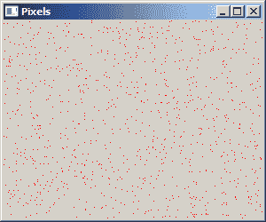

Figure: Pixels

## 直线

线是基本的图形基元。 它具有两个功能：`MoveToEx()`和`LineTo()`。

```c
BOOL MoveToEx(HDC hdc, int x, int y, LPPOINT lpPoint);

```

`MoveToEx()`功能将当前位置更新到指定点，并有选择地返回先前位置。

```c
BOOL LineTo(HDC hdc, int nXEnd, int nYEnd);

```

`LineTo()`功能从当前位置开始绘制一条线，但不包括指定点。

`lines.c`

```c
#include <windows.h>

LRESULT CALLBACK WndProc(HWND, UINT, WPARAM, LPARAM);

int WINAPI wWinMain(HINSTANCE hInstance, HINSTANCE hPrevInstance,
    PWSTR lpCmdLine, int nCmdShow) {

    MSG  msg;
    WNDCLASSW wc = {0};

    wc.style = CS_HREDRAW | CS_VREDRAW;
    wc.lpszClassName = L"Lines";
    wc.hInstance     = hInstance;
    wc.hbrBackground = GetSysColorBrush(COLOR_3DFACE);
    wc.lpfnWndProc   = WndProc;
    wc.hCursor       = LoadCursor(0, IDC_ARROW);

    RegisterClassW(&wc);
    CreateWindowW(wc.lpszClassName, L"Lines",
          WS_OVERLAPPEDWINDOW | WS_VISIBLE,
          100, 100, 300, 200, NULL, NULL, hInstance, NULL);

    while (GetMessage(&msg, NULL, 0, 0)) {

        TranslateMessage(&msg);
        DispatchMessage(&msg);
    }

    return (int) msg.wParam;
}

LRESULT CALLBACK WndProc(HWND hwnd, UINT msg,
    WPARAM wParam, LPARAM lParam) {

    HDC hdc;
    PAINTSTRUCT ps;

    switch(msg) {

        case WM_PAINT:

            hdc = BeginPaint(hwnd, &ps);

            MoveToEx(hdc, 50, 50, NULL);
            LineTo(hdc, 250, 50);

            HPEN hWhitePen = GetStockObject(WHITE_PEN);
            HPEN hOldPen = SelectObject(hdc, hWhitePen);

            MoveToEx(hdc, 50, 100, NULL);
            LineTo(hdc, 250, 100);

            SelectObject(hdc, hOldPen);

            EndPaint(hwnd, &ps);
            break;

        case WM_DESTROY:

            PostQuitMessage(0);
            return 0;
    }

    return DefWindowProcW(hwnd, msg, wParam, lParam);
}

```

这个例子画了两条线。 一种是黑色，另一种是白色。

```c
MoveToEx(hdc, 50, 50, NULL);
LineTo(hdc, 250, 50);

```

在点（50、50）和（250、50）之间绘制了一条线。 使用默认的`BLACK_PEN`。

```c
HPEN hWhitePen = GetStockObject(WHITE_PEN);

```

`GetStockObject()`函数检索用`WHITE_PEN`值指定的内置白笔的句柄。 通过调用`DeleteObject()`不必删除库存对象（但这不是有害的）。

```c
HPEN hOldPen = SelectObject(hdc, hWhitePen);

```

`SelectObject()`函数将一个对象选择到指定的设备上下文（DC）中。 新对象将替换相同类型的先前对象。

```c
SelectObject(hdc, hOldPen);

```

我们恢复到旧的`BLACK_PEN`笔。


Figure: Lines

## 长方形

要绘制矩形，我们使用`Rectangle()`函数。

```c
BOOL Rectangle(HDC hdc, int nLeftRect, int nTopRect, int nRightRect, 
    int nBottomRect);

```

函数的第一个参数是设备上下文的句柄。 接下来的两个参数是矩形左上角的 x 和 y 坐标。 最后两个参数是矩形右下角的 x，y 坐标。 如果函数失败，则返回值为零。 如果成功，则返回值为非零。

`rectangle.c`

```c
#include <windows.h>

LRESULT CALLBACK WndProc(HWND, UINT, WPARAM, LPARAM);

int WINAPI wWinMain(HINSTANCE hInstance, HINSTANCE hPrevInstance,
    PWSTR lpCmdLine, int nCmdShow) {

    MSG  msg;
    WNDCLASSW wc = {0};

    wc.style = CS_HREDRAW | CS_VREDRAW;
    wc.lpszClassName = L"Rectangle";
    wc.hInstance     = hInstance;
    wc.hbrBackground = GetSysColorBrush(COLOR_3DFACE);
    wc.lpfnWndProc   = WndProc;
    wc.hCursor       = LoadCursor(0, IDC_ARROW);

    RegisterClassW(&wc);
    CreateWindowW(wc.lpszClassName, L"Rectangle",
          WS_OVERLAPPEDWINDOW | WS_VISIBLE,
          100, 100, 250, 200, NULL, NULL, hInstance, NULL);

    while (GetMessage(&msg, NULL, 0, 0)) {

        TranslateMessage(&msg);
        DispatchMessage(&msg);
    }

    return (int) msg.wParam;
}

LRESULT CALLBACK WndProc(HWND hwnd, UINT msg,
    WPARAM wParam, LPARAM lParam) {

    HDC hdc;
    PAINTSTRUCT ps;

    switch(msg) {

        case WM_PAINT:

            hdc = BeginPaint(hwnd, &ps);
            Rectangle(hdc, 50, 50, 200, 100);
            EndPaint(hwnd, &ps);
            break;

        case WM_DESTROY:

            PostQuitMessage(0);
            return 0;
    }

    return DefWindowProcW(hwnd, msg, wParam, lParam);
}

```

使用当前的笔绘制矩形的轮廓。 使用当前画笔绘制背景。

```c
Rectangle(hdc, 50, 50, 200, 100);

```

使用`Rectangle()`功能绘制矩形。 我们使用两个点绘制矩形：左上角点和右下角点。

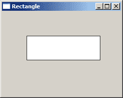

Figure: Rectangle

## 贝塞尔曲线

贝塞尔曲线是由数学公式定义的曲线。 绘制曲线的数学方法由 PierreBézier 在 1960 年代后期创建，用于雷诺的汽车制造。

```c
BOOL PolyBezier(HDC hdc, const POINT *lppt, DWORD cPoints);

```

函数的第一个参数是设备上下文的句柄。 第二个参数是指向`POINT`结构数组的指针，该数组包含曲线的端点和控制点。

`beziercurve.c`

```c
#include <windows.h>

LRESULT CALLBACK WndProc(HWND, UINT, WPARAM, LPARAM);

int WINAPI wWinMain(HINSTANCE hInstance, HINSTANCE hPrevInstance,
    PWSTR lpCmdLine, int nCmdShow) {

    MSG  msg;
    WNDCLASSW wc = {0};

    wc.style = CS_HREDRAW | CS_VREDRAW;
    wc.lpszClassName = L"BezierCurve";
    wc.hInstance     = hInstance;
    wc.hbrBackground = GetSysColorBrush(COLOR_3DFACE);
    wc.lpfnWndProc   = WndProc;
    wc.hCursor       = LoadCursor(0, IDC_ARROW);

    RegisterClassW(&wc);
    CreateWindowW(wc.lpszClassName, L"Beziér curve",
          WS_OVERLAPPEDWINDOW | WS_VISIBLE,
          100, 100, 500, 200, NULL, NULL, hInstance, NULL);

    while (GetMessage(&msg, NULL, 0, 0)) {

        TranslateMessage(&msg);
        DispatchMessage(&msg);
    }

    return (int) msg.wParam;
}

LRESULT CALLBACK WndProc(HWND hwnd, UINT msg,
    WPARAM wParam, LPARAM lParam) {

    HDC hdc;
    PAINTSTRUCT ps;

    POINT points[4] = { 20, 40, 320, 200, 330, 110, 450, 40 };

    switch(msg) {

        case WM_PAINT:

            hdc = BeginPaint(hwnd, &ps);

            PolyBezier(hdc, points, 4);

            EndPaint(hwnd, &ps);
            break;

        case WM_DESTROY:

            PostQuitMessage(0);
            return 0;
    }

    return DefWindowProcW(hwnd, msg, wParam, lParam);
}

```

在示例中，我们使用`PolyBezier()`函数绘制一条曲线。

```c
POINT points[4] = { 20, 40, 320, 200, 330, 110, 450, 40 };

```

这些点形成贝塞尔曲线。 第一点是起点。 接下来的两个点是控制点。 最后一点是曲线的终点。

```c
PolyBezier(hdc, points, 4);

```

`PolyBezier()`功能绘制曲线。

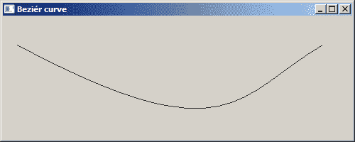

Figure: Bézier curve

## 钢笔

笔是基本图形对象。 它用于绘制矩形，椭圆形，多边形或其他形状的线，曲线和轮廓。

笔有两种类型：化妆笔和几何笔。化妆笔是固定宽度为 1 的简单笔。它们具有三个属性：宽度，样式和颜色。 它们比几何笔更有效。 可以使用`CreatePen()`，`CreatePenIndirect()`或`ExtCreatePen()`功能创建化妆笔。

几何笔比化妆笔复杂。 它们具有七个属性：宽度，样式，颜色，图案，剖面线，端盖和连接样式。 几何 pes 是使用`ExtCreatePen()`功能创建的。

```c
HPEN CreatePen(int fnPenStyle, int nWidth, COLORREF crColor);

```

`CreatePen()`功能创建具有指定样式，宽度和颜色的逻辑笔。

```c
HPEN ExtCreatePen(DWORD dwPenStyle, DWORD dwWidth, const LOGBRUSH *lplb, 
    DWORD dwStyleCount, const DWORD *lpStyle);

```

`ExtCreatePen()`功能创建逻辑的化妆笔或几何笔。 第一个参数是类型，样式，端盖和联接属性的组合。 第二个参数是笔的宽度。 第三个参数是指向`LOGBRUSH`结构的指针。 该结构定义了物理笔刷的样式，颜色和图案。 第四个参数是`lpStyle`数组的长度，以`DWORD`单位。 如果`dwPenStyle`不是`PS_USERSTYLE`，则此值必须为零。 样式计数限制为 16。最后一个参数是指向数组的指针。 第一个值以用户定义的样式指定第一个破折号的长度，第二个值指定第一个空格的长度，依此类推。 如果`dwPenStyle`不是`S_USERSTYLE`，则此指针必须为`NULL`。

创建笔后，我们使用`SelectObject()`功能将其选择到应用的设备上下文中。 从现在开始，应用使用此笔在其客户区中进行任何画线操作。

### 笔样式

笔样式是应用于线对象的特定图案。 有预定义的笔样式，例如`PS_SOLID`，`PS_DASH`，`PS_DOT`或`PS_DASHDOT`。 也可以创建自定义笔样式。

`penstyles.c`

```c
#include <windows.h>

LRESULT CALLBACK WndProc(HWND, UINT, WPARAM, LPARAM);
void DrawLines(HWND);

int WINAPI wWinMain(HINSTANCE hInstance, HINSTANCE hPrevInstance,
    PWSTR lpCmdLine, int nCmdShow) {

    MSG  msg;
    WNDCLASSW wc = {0};

    wc.style = CS_HREDRAW | CS_VREDRAW;
    wc.lpszClassName = L"Pen styles";
    wc.hInstance     = hInstance;
    wc.hbrBackground = (HBRUSH) GetStockObject(WHITE_BRUSH);
    wc.lpfnWndProc   = WndProc;
    wc.hCursor       = LoadCursor(0, IDC_ARROW);

    RegisterClassW(&wc);
    CreateWindowW(wc.lpszClassName, L"Pen styles",
          WS_OVERLAPPEDWINDOW | WS_VISIBLE,
          100, 100, 350, 180, NULL, NULL, hInstance, NULL);

    while (GetMessage(&msg, NULL, 0, 0)) {

        TranslateMessage(&msg);
        DispatchMessage(&msg);
    }

  return (int) msg.wParam;
}

LRESULT CALLBACK WndProc(HWND hwnd, UINT msg,
    WPARAM wParam, LPARAM lParam) {

    switch(msg) {

        case WM_PAINT:

            DrawLines(hwnd);
            break;

        case WM_DESTROY:

            PostQuitMessage(0);
            return 0;
    }

    return DefWindowProcW(hwnd, msg, wParam, lParam);
}

void DrawLines(HWND hwnd) {

    PAINTSTRUCT ps;

    HDC hdc = BeginPaint(hwnd, &ps);
    HPEN hPen1 = CreatePen(PS_SOLID, 1, RGB(0, 0, 0));
    HPEN hPen2 = CreatePen(PS_DASH, 1, RGB(0, 0, 0));
    HPEN hPen3 = CreatePen(PS_DOT, 1, RGB(0, 0, 0));
    HPEN hPen4 = CreatePen(PS_DASHDOT, 1, RGB(0, 0, 0));
    HPEN hPen5 = CreatePen(PS_DASHDOTDOT, 1, RGB(0, 0, 0));

    HPEN holdPen = SelectObject(hdc, hPen1);
    MoveToEx(hdc, 50, 30, NULL);
    LineTo(hdc, 300, 30);

    SelectObject(hdc, hPen2);
    MoveToEx(hdc, 50, 50, NULL);
    LineTo(hdc, 300, 50);

    SelectObject(hdc, hPen2);
    MoveToEx(hdc, 50, 70, NULL);
    LineTo(hdc, 300, 70);

    SelectObject(hdc, hPen3);
    MoveToEx(hdc, 50, 90, NULL);
    LineTo(hdc, 300, 90);

    SelectObject(hdc, hPen4);
    MoveToEx(hdc, 50, 110, NULL);
    LineTo(hdc, 300, 110);

    SelectObject(hdc, holdPen);
    DeleteObject(hPen1);
    DeleteObject(hPen2);
    DeleteObject(hPen3);
    DeleteObject(hPen4);
    DeleteObject(hPen5);

    EndPaint(hwnd, &ps);  
}

```

在我们的示例中，我们使用五种不同的笔样式绘制五根不同的线。

```c
case WM_PAINT:

    DrawLines(hwnd);
    break;

```

实际图形委托给`DrawLines()`功能。

```c
HPEN hPen1 = CreatePen(PS_SOLID, 1, RGB(0, 0, 0));

```

`CreatePen()`功能创建具有指定样式，宽度和颜色的逻辑笔。 `PS_SOLID`代表实心笔。 我们使用`RGB`宏为笔生成颜色。

```c
SelectObject(hdc, hPen1);

```

要激活笔，我们调用`SelectObject()`功能。

```c
MoveToEx(hdc, 50, 30, NULL);
LineTo(hdc, 300, 30);

```

要绘制线条，我们使用`MoveToEx()`和`LineTo()`功能。

```c
DeleteObject(hPen1);
DeleteObject(hPen2);
DeleteObject(hPen3);
DeleteObject(hPen4);
DeleteObject(hPen5);

```

最后，我们清理资源。

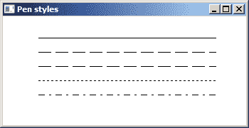

Figure: Pen styles

### 直线连接

可以使用三种不同的连接样式来连接线：`PS_JOIN_BEVEL`，`PS_JOIN_MITEl`和`PS_JOIN_ROUND`。

`linejoins.c`

```c
#include <windows.h>

LRESULT CALLBACK WndProc(HWND, UINT, WPARAM, LPARAM);
void DoDrawing(HWND);

int WINAPI wWinMain(HINSTANCE hInstance, HINSTANCE hPrevInstance,
    PWSTR lpCmdLine, int nCmdShow) {

    MSG  msg;
    WNDCLASSW wc = {0};

    wc.style = CS_HREDRAW | CS_VREDRAW;
    wc.lpszClassName = L"Pens";
    wc.hInstance     = hInstance;
    wc.hbrBackground = (HBRUSH) GetStockObject(WHITE_BRUSH);
    wc.lpfnWndProc   = WndProc;
    wc.hCursor       = LoadCursor(0, IDC_ARROW);

    RegisterClassW(&wc);
    CreateWindowW(wc.lpszClassName, L"Line joins",
          WS_OVERLAPPEDWINDOW | WS_VISIBLE,
          100, 100, 450, 200, NULL, NULL, hInstance, NULL);

    while (GetMessage(&msg, NULL, 0, 0)) {

        TranslateMessage(&msg);
        DispatchMessage(&msg);
    }

    return (int) msg.wParam;
}

LRESULT CALLBACK WndProc(HWND hwnd, UINT msg,
    WPARAM wParam, LPARAM lParam) {

    switch(msg) {

        case WM_PAINT:

            DoDrawing(hwnd);
            break;

        case WM_DESTROY:

            PostQuitMessage(0);
            return 0;
    }

    return DefWindowProcW(hwnd, msg, wParam, lParam);
}

void DoDrawing(HWND hwnd) {

    LOGBRUSH brush;
    COLORREF col = RGB(0, 0, 0);
    DWORD pen_style = PS_SOLID | PS_JOIN_MITER | PS_GEOMETRIC;

    brush.lbStyle = BS_SOLID;
    brush.lbColor = col;
    brush.lbHatch = 0;       

    PAINTSTRUCT ps;

    HDC hdc = BeginPaint(hwnd, &ps);

    HPEN hPen1 = ExtCreatePen(pen_style, 8, &brush, 0, NULL);
    HPEN holdPen = SelectObject(hdc, hPen1);

    POINT points[5] = { { 30, 30 }, { 130, 30 }, { 130, 100 }, 
        { 30, 100 }, { 30, 30}};
    Polygon(hdc, points, 5);

    pen_style = PS_SOLID | PS_GEOMETRIC | PS_JOIN_BEVEL;
    HPEN hPen2 = ExtCreatePen(pen_style, 8, &brush, 0, NULL);  

    SelectObject(hdc, hPen2);
    DeleteObject(hPen1);

    POINT points2[5] = { { 160, 30 }, { 260, 30 }, { 260, 100 }, 
        { 160, 100 }, {160, 30 }};
    MoveToEx(hdc, 130, 30, NULL);
    Polygon(hdc, points2, 5);

    pen_style = PS_SOLID | PS_GEOMETRIC | PS_JOIN_ROUND;
    HPEN hPen3 = ExtCreatePen(pen_style, 8, &brush, 0, NULL);  

    SelectObject(hdc, hPen3);
    DeleteObject(hPen2);

    POINT points3[5] = { { 290, 30 }, { 390, 30 }, { 390, 100 }, 
        { 290, 100 }, {290, 30 }};
    MoveToEx(hdc, 260, 30, NULL);
    Polygon(hdc, points3, 5);

    SelectObject(hdc, holdPen);
    DeleteObject(hPen3);

    EndPaint(hwnd, &ps);  
}

```

在示例中，我们显示了矩形上的三种类型的线连接。

```c
pen_style = PS_SOLID | PS_GEOMETRIC | PS_JOIN_BEVEL;
HPEN hPen2 = ExtCreatePen(pen_style, 8, &brush, 0, NULL); 

```

`ExtCreatePen()`功能创建一个带有`PS_JOIN_BEVEL`连接的实心几何笔。

```c
POINT points2[5] = { { 160, 30 }, { 260, 30 }, { 260, 100 }, 
    { 160, 100 }, {160, 30 }};
MoveToEx(hdc, 130, 30, NULL);
Polygon(hdc, points2, 5);

```

从提供的点开始，我们使用`Polygon()`函数创建一个矩形。

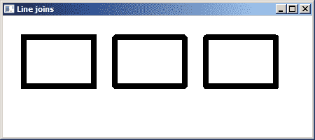

Figure: Line joins

## 笔刷

画笔是基本图形对象。 它用于绘制图形形状的背景，例如矩形，椭圆形或多边形。 笔刷可以是纯色，阴影线或自定义位图图案。

### 实心笔刷

实心画笔是一种颜色。 它是用`CreateSolidBrush()`功能创建的。

```c
HBRUSH CreateSolidBrush(COLORREF crColor);

```

`CreateSolidBrush()`功能创建具有指定纯色的画笔。

`solidbrush.c`

```c
#include <windows.h>

LRESULT CALLBACK WndProc(HWND, UINT, WPARAM, LPARAM);
void DrawRectangles(HWND);

int WINAPI wWinMain(HINSTANCE hInstance, HINSTANCE hPrevInstance,
    PWSTR lpCmdLine, int nCmdShow) {

    MSG  msg;
    WNDCLASSW wc = {0};

    wc.style = CS_HREDRAW | CS_VREDRAW;
    wc.lpszClassName = L"Brush";
    wc.hInstance     = hInstance;
    wc.hbrBackground = GetSysColorBrush(COLOR_3DFACE);
    wc.lpfnWndProc   = WndProc;
    wc.hCursor       = LoadCursor(0, IDC_ARROW);

    RegisterClassW(&wc);
    CreateWindowW(wc.lpszClassName, L"Solid Brush",
          WS_OVERLAPPEDWINDOW | WS_VISIBLE,
          100, 100, 220, 240, NULL, NULL, hInstance, NULL);

    while (GetMessage(&msg, NULL, 0, 0)) {

        TranslateMessage(&msg);
        DispatchMessage(&msg);
    }

  return (int) msg.wParam;
}

LRESULT CALLBACK WndProc(HWND hwnd, UINT msg,
    WPARAM wParam, LPARAM lParam) {

    switch(msg) {

        case WM_PAINT:

            DrawRectangles(hwnd);	    
            break;

        case WM_DESTROY:

            PostQuitMessage(0);
            return 0;
    }

    return DefWindowProcW(hwnd, msg, wParam, lParam);
}

void DrawRectangles(HWND hwnd) {

    PAINTSTRUCT ps;

    HDC hdc = BeginPaint(hwnd, &ps);
    HPEN hPen = CreatePen(PS_NULL, 1, RGB(0, 0, 0));
    HPEN holdPen = SelectObject(hdc, hPen);

    HBRUSH hBrush1 = CreateSolidBrush(RGB(121, 90, 0));
    HBRUSH hBrush2 = CreateSolidBrush(RGB(240, 63, 19));
    HBRUSH hBrush3 = CreateSolidBrush(RGB(240, 210, 18));
    HBRUSH hBrush4 = CreateSolidBrush(RGB(9, 189, 21));

    HBRUSH holdBrush = SelectObject(hdc, hBrush1);

    Rectangle(hdc, 30, 30, 100, 100);
    SelectObject(hdc, hBrush2);
    Rectangle(hdc, 110, 30, 180, 100);
    SelectObject(hdc, hBrush3);
    Rectangle(hdc, 30, 110, 100, 180);
    SelectObject(hdc, hBrush4);
    Rectangle(hdc, 110, 110, 180, 180);

    SelectObject(hdc, holdPen);
    SelectObject(hdc, holdBrush);

    DeleteObject(hPen);
    DeleteObject(hBrush1);
    DeleteObject(hBrush2);
    DeleteObject(hBrush3);
    DeleteObject(hBrush4);

    EndPaint(hwnd, &ps);
}

```

在示例中，我们创建了 4 个矩形，其中填充了 4 种不同的纯色。

```c
HBRUSH hBrush1 = CreateSolidBrush(RGB(121, 90, 0));

```

在这里，我们创建一个纯色笔刷。

```c
HBRUSH holdBrush = SelectObject(hdc, hBrush1);

```

在设备上下文中选择了一个新画笔。

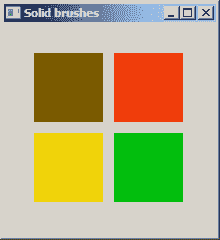

Figure: Solid brushes

### 舱口笔刷

有六种预定义的舱口笔刷。 在我们的示例中，我们展示了所有这些。

```c
HBRUSH CreateHatchBrush(int fnStyle, COLORREF clrref);

```

`CreateHatchBrush()`功能创建具有指定填充图案和颜色的画笔。

`hatchbrushes.c`

```c
#include <windows.h>

LRESULT CALLBACK WndProc(HWND, UINT, WPARAM, LPARAM);
void DrawRectangles(HWND hwnd);

int WINAPI wWinMain(HINSTANCE hInstance, HINSTANCE hPrevInstance,
    PWSTR lpCmdLine, int nCmdShow) {

    MSG  msg;
    WNDCLASSW wc = {0};

    wc.style = CS_VREDRAW | CS_HREDRAW;
    wc.lpszClassName = L"Brush";
    wc.hInstance     = hInstance;
    wc.hbrBackground = GetSysColorBrush(COLOR_3DFACE);
    wc.lpfnWndProc   = WndProc;
    wc.hCursor       = LoadCursor(0, IDC_ARROW);

    RegisterClassW(&wc);
    CreateWindowW(wc.lpszClassName, L"Hatch brushes",
          WS_OVERLAPPEDWINDOW | WS_VISIBLE,
          100, 100, 300, 220, NULL, NULL, hInstance, NULL);

    while (GetMessage(&msg, NULL, 0, 0)) {

        TranslateMessage(&msg);
        DispatchMessage(&msg);
    }

    return (int) msg.wParam;
}

LRESULT CALLBACK WndProc(HWND hwnd, UINT msg, 
    WPARAM wParam, LPARAM lParam) {

    switch(msg) {

      case WM_PAINT:

          DrawRectangles(hwnd);
          break;

      case WM_DESTROY:

          PostQuitMessage(0);
          return 0;
    }

    return DefWindowProcW(hwnd, msg, wParam, lParam);
}

void DrawRectangles(HWND hwnd) {

    PAINTSTRUCT ps;

    HDC hdc = BeginPaint(hwnd, &ps);
    HPEN hPen = CreatePen(PS_NULL, 1, RGB(0, 0, 0));
    HPEN holdPen = SelectObject(hdc, hPen);

    HBRUSH hBrush1 = CreateHatchBrush(HS_BDIAGONAL, RGB(0, 0, 0));
    HBRUSH hBrush2 = CreateHatchBrush(HS_FDIAGONAL, RGB(0, 0, 0));
    HBRUSH hBrush3 = CreateHatchBrush(HS_CROSS, RGB(0, 0, 0));
    HBRUSH hBrush4 = CreateHatchBrush(HS_HORIZONTAL, RGB(0, 0, 0));
    HBRUSH hBrush5 = CreateHatchBrush(HS_DIAGCROSS, RGB(0, 0, 0));
    HBRUSH hBrush6 = CreateHatchBrush(HS_VERTICAL, RGB(0, 0, 0));

    HBRUSH holdBrush = SelectObject(hdc, hBrush1);

    DWORD col = GetSysColor(COLOR_BTNFACE);
    SetBkColor(hdc, col);

    Rectangle(hdc, 30, 30, 100, 80);
    SelectObject(hdc, hBrush2);
    Rectangle(hdc, 110, 30, 180, 80);
    SelectObject(hdc, hBrush3);
    Rectangle(hdc, 190, 30, 260, 80);
    SelectObject(hdc, hBrush4);
    Rectangle(hdc, 30, 110, 100, 160);
    SelectObject(hdc, hBrush5);
    Rectangle(hdc, 110, 110, 180, 160);
    SelectObject(hdc, hBrush6);
    Rectangle(hdc, 190, 110, 260, 160);

    SelectObject(hdc, holdPen);
    SelectObject(hdc, holdBrush);

    DeleteObject(hPen);
    DeleteObject(hBrush1);
    DeleteObject(hBrush2);
    DeleteObject(hBrush3);
    DeleteObject(hBrush4);
    DeleteObject(hBrush5);
    DeleteObject(hBrush6);

    EndPaint(hwnd, &ps);
}

```

此示例与上一个示例非常相似。 我们仅使用一个新的函数调用`CreateHatchBrush()`。

```c
HBRUSH hBrush1 = CreateHatchBrush(HS_BDIAGONAL, RGB(0, 0, 0));

```

将创建对角线阴影笔刷。

```c
HBRUSH holdBrush = SelectObject(hdc, hBrush1);

```

画笔被选择到设备上下文中。 返回旧画笔的句柄。

```c
DeleteObject(hBrush1);

```

笔刷对象被删除。

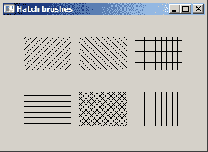

Figure: Hatch brushes

### 定制笔刷

可以使用`CreatePatternBrush()`功能创建自定义画笔。

```c
HBRUSH CreatePatternBrush(HBITMAP hbmp);

```

该函数获取要用于创建画笔的位图的句柄。

`custombrush.c`

```c
#include <windows.h>

LRESULT CALLBACK WndProc(HWND, UINT, WPARAM, LPARAM);

int WINAPI wWinMain(HINSTANCE hInstance, HINSTANCE hPrevInstance,
    PWSTR lpCmdLine, int nCmdShow) {

    MSG  msg;
    WNDCLASSW wc = {0};

    wc.style = CS_HREDRAW | CS_VREDRAW;
    wc.lpszClassName = L"Custom brush";
    wc.hInstance     = hInstance;
    wc.hbrBackground = GetSysColorBrush(COLOR_3DFACE);
    wc.lpfnWndProc   = WndProc;
    wc.hCursor       = LoadCursor(0, IDC_ARROW);

    RegisterClassW(&wc);
    CreateWindowW(wc.lpszClassName, L"Custom brush",
          WS_OVERLAPPEDWINDOW | WS_VISIBLE,
          100, 100, 300, 200, NULL, NULL, hInstance, NULL);

    while (GetMessage(&msg, NULL, 0, 0)) {

        TranslateMessage(&msg);
        DispatchMessage(&msg);
    }

    return (int) msg.wParam;
}

LRESULT CALLBACK WndProc(HWND hwnd, UINT msg,
    WPARAM wParam, LPARAM lParam) {

    HDC hdc;
    PAINTSTRUCT ps;
    static HBITMAP hBtm;

    UINT bits[8] = { 0x111111ff, 0xffffffff, 0xffffffff, 0xffffffff,
        0x00000000, 0x00000000, 0x00000000, 0x00000000 };

    switch(msg) {

        case WM_CREATE:

            hBtm = CreateBitmap(8, 8, 1, 1, (LPBYTE) bits);

            break;

        case WM_PAINT:

            hdc = BeginPaint(hwnd, &ps);

            HBRUSH hCustomBrush = CreatePatternBrush(hBtm);
            HBRUSH hOldBrush = SelectObject(hdc, hCustomBrush);

            SelectObject(hdc, GetStockObject(NULL_PEN));

            Rectangle(hdc, 20, 20, 250, 160);

            SelectObject(hdc, hOldBrush);
            DeleteObject(hCustomBrush);

            SelectObject(hdc, GetStockObject(BLACK_PEN));

            EndPaint(hwnd, &ps);
            break;

        case WM_DESTROY:

            DeleteObject(hBtm);
            PostQuitMessage(0);
            return 0;
    }

    return DefWindowProcW(hwnd, msg, wParam, lParam);
}

```

该示例绘制了一个矩形。 其内部充满了自定义的画笔图案。

```c
hBtm = CreateBitmap(8, 8, 1, 1, (LPBYTE) bits);

```

我们使用`CreateBitmap()`功能创建位图图案。

```c
HBRUSH hCustomBrush = CreatePatternBrush(hBtm);

```

`CreatePatternBrush()`函数从提供的位图创建画笔对象。

```c
HBRUSH hOldBrush = SelectObject(hdc, hCustomBrush);

```

我们使用`SelectObject()`功能选择自定义画笔。

```c
SelectObject(hdc, GetStockObject(NULL_PEN));

```

我们不会绘制矩形的轮廓。 当我们选择`NULL_PEN`时，没有画出轮廓。

```c
Rectangle(hdc, 20, 20, 250, 160);

```

矩形用`Rectangle()`功能绘制； 其内部使用选定的自定义画笔绘制。

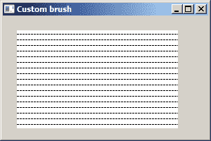

Figure: Custom brush

## 形状

形状是更复杂的几何对象。 在下面的示例中，我们将绘制各种几何形状。

`shapes.c`

```c
#include <windows.h>

LRESULT CALLBACK WndProc(HWND, UINT, WPARAM, LPARAM);

int WINAPI wWinMain(HINSTANCE hInstance, HINSTANCE hPrevInstance,
    PWSTR lpCmdLine, int nCmdShow) {

    MSG  msg;
    WNDCLASSW wc = {0};

    wc.style = CS_HREDRAW | CS_VREDRAW;
    wc.lpszClassName = L"Shapes";
    wc.hInstance     = hInstance;
    wc.hbrBackground = GetSysColorBrush(COLOR_3DFACE);
    wc.lpfnWndProc   = WndProc;
    wc.hCursor       = LoadCursor(0, IDC_ARROW);

    RegisterClassW(&wc);
    CreateWindowW(wc.lpszClassName, L"Shapes",
          WS_OVERLAPPEDWINDOW | WS_VISIBLE,
          100, 100, 390, 230, NULL, NULL, hInstance, NULL);

    while (GetMessage(&msg, NULL, 0, 0)) {

        TranslateMessage(&msg);
        DispatchMessage(&msg);
    }

    return (int) msg.wParam;
}

LRESULT CALLBACK WndProc(HWND hwnd, UINT msg, 
    WPARAM wParam, LPARAM lParam) {

    HDC hdc;
    PAINTSTRUCT ps;
    const POINT polygon[10] = { 30, 145, 85, 165, 105, 
        110, 65, 125, 30, 105 };

    switch(msg) {

        case WM_PAINT:

            hdc = BeginPaint(hwnd, &ps);

            Ellipse(hdc, 30, 30, 120, 90);
            RoundRect(hdc, 150, 30, 240, 90, 15, 20);
            Chord(hdc, 270, 30, 360, 90, 270, 45, 360, 45);
            Polygon(hdc, polygon, 5);
            Rectangle(hdc, 150, 110, 230, 160);

            EndPaint(hwnd, &ps);
            break;

        case WM_DESTROY:

            PostQuitMessage(0);
            return 0;
    }

    return DefWindowProcW(hwnd, msg, wParam, lParam);
}

```

在我们的示例中，我们创建了一个椭圆，一个圆角矩形，一个弦，一个多边形和一个矩形。

```c
Ellipse(hdc, 30, 30, 120, 90);

```

`Ellipse()`功能绘制一个椭圆。 `Ellipse()`的参数是边界矩形的左上角和右下角的 x 和 y 坐标。 在此矩形内绘制椭圆。

```c
RoundRect(hdc, 150, 30, 240, 90, 15, 20);

```

`RoundRect()`功能绘制带有圆角的矩形。 `RoundRect()`的参数是边界矩形的左上角和右下角的 x 和 y 坐标。 最后两个参数是用于绘制圆角的椭圆的宽度和高度。

```c
Chord(hdc, 270, 30, 360, 90, 270, 45, 360, 45);

```

`Chord()`功能绘制和弦。 和弦是由椭圆和线段的交点界定的区域。 前四个参数是边界矩形的左上角的 x 和 y 坐标以及右下角的 x 和 y 坐标。 接下来的四个参数是定义弦的起点的径向的 x 和 y 坐标以及定义弦的终点的径向的 x 和 y 坐标。

```c
Polygon(hdc, polygon, 5);

```

`Polygon()`函数绘制由两个或多个通过直线连接的顶点组成的多边形。 多边形是指向`POINT`结构数组的指针，该数组指定多边形的顶点。 最后一个参数是数组中的点数。

```c
Rectangle(hdc, 150, 110, 230, 160);

```

`Rectangle()`功能绘制一个矩形。 该函数的参数是矩形左上角和右下角的 x 和 y 坐标。

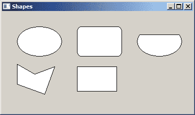

Figure: Shapes

## 星形

在下面的示例中，我们使用`Polyline()`函数绘制星形。

```c
BOOL Polyline(HDC hdc, const POINT *lppt, int cPoints);

```

`Polyline()`函数通过连接指定数组中的点来绘制一系列线段。 函数的第一个参数是设备上下文的句柄。 第二个参数是指向`POINT`结构数组的指针。 第三个参数是数组中的点数。 此数字必须大于或等于 2。

`star.c`

```c
#include <windows.h>

LRESULT CALLBACK WndProc(HWND, UINT, WPARAM, LPARAM);

int WINAPI wWinMain(HINSTANCE hInstance, HINSTANCE hPrevInstance,
    PWSTR lpCmdLine, int nCmdShow) {

    MSG  msg;
    WNDCLASSW wc = {0};

    wc.style = CS_HREDRAW | CS_VREDRAW;
    wc.lpszClassName = L"Star";
    wc.hInstance     = hInstance;
    wc.hbrBackground = GetSysColorBrush(COLOR_3DFACE);
    wc.lpfnWndProc   = WndProc;
    wc.hCursor       = LoadCursor(0, IDC_ARROW);

    RegisterClassW(&wc);
    CreateWindowW(wc.lpszClassName, L"Star",
          WS_OVERLAPPEDWINDOW | WS_VISIBLE,
          100, 100, 300, 250, NULL, NULL, hInstance, NULL);

    while (GetMessage(&msg, NULL, 0, 0)) {

        TranslateMessage(&msg);
        DispatchMessage(&msg);
    }

    return (int) msg.wParam;
}

LRESULT CALLBACK WndProc(HWND hwnd, UINT msg,
    WPARAM wParam, LPARAM lParam) {

    HDC hdc;
    PAINTSTRUCT ps;

    POINT points[11] = { 
        { 10, 85 }, 
        { 85, 75 }, 
        { 110, 10 }, 
        { 135, 75 }, 
        { 210, 85 },
        { 160, 125 }, 
        { 170, 190 },
        { 110, 150 }, 
        { 50, 190 },
        { 60, 125 },
        { 10, 85 } 
    };

    switch(msg) {

        case WM_PAINT:

            hdc = BeginPaint(hwnd, &ps);
            Polyline(hdc, points, 11);
            EndPaint(hwnd, &ps);
            break;

        case WM_DESTROY:

            PostQuitMessage(0);
            return 0;
    }

    return DefWindowProcW(hwnd, msg, wParam, lParam);
}

```

该示例绘制一个星形对象。

```c
POINT points[11] = { 
    { 10, 85 }, 
    { 85, 75 }, 
    { 110, 10 }, 
    { 135, 75 }, 
    { 210, 85 },
    { 160, 125 }, 
    { 170, 190 },
    { 110, 150 }, 
    { 50, 190 },
    { 60, 125 },
    { 10, 85 } 
};

```

这是恒星的`POINTS`的数组。

```c
Polyline(hdc, points, 11);

```

`Polyline()`功能绘制星形。

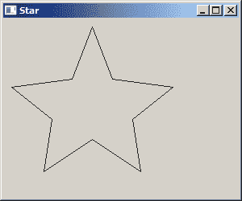

Figure: Star

## 文本

`TextOutW()`功能使用当前选择的字体，背景色和文本色在指定位置写入字符串。

```c
BOOL TextOut(HDC hdc, int nXStart, int nYStart, LPCTSTR lpString, int cchString);

```

函数的第一个参数是设备上下文的句柄。 接下来的两个参数是系统用于对齐字符串的参考点的 x 和 y 坐标。 第三个参数是指向要绘制的字符串的指针。 最后一个参数是字符串的长度。

`sonnet55.c`

```c
#include <windows.h>

LRESULT CALLBACK WndProc(HWND, UINT, WPARAM, LPARAM);

int WINAPI wWinMain(HINSTANCE hInstance, HINSTANCE hPrevInstance,
    PWSTR lpCmdLine, int nCmdShow) {

    MSG  msg ;
    WNDCLASSW wc = {0};

    wc.style = CS_HREDRAW | CS_VREDRAW;
    wc.lpszClassName = L"Sonnet 55";
    wc.hInstance     = hInstance;
    wc.hbrBackground = GetSysColorBrush(COLOR_BTNFACE);
    wc.lpfnWndProc   = WndProc;
    wc.hCursor       = LoadCursor(0, IDC_ARROW);

    RegisterClassW(&wc);
    CreateWindowW(wc.lpszClassName, L"Sonnet 55",
          WS_OVERLAPPEDWINDOW | WS_VISIBLE,
          100, 100, 390, 350, NULL, NULL, hInstance, NULL);

    while (GetMessage(&msg, NULL, 0, 0)) {

        TranslateMessage(&msg);
        DispatchMessage(&msg);
    }

    return (int) msg.wParam;
}

LRESULT CALLBACK WndProc(HWND hwnd, UINT msg, 
  WPARAM wParam, LPARAM lParam) {

    HDC hdc;
    PAINTSTRUCT ps;

    DWORD color;

    HFONT hFont, holdFont;

    static wchar_t *ver1 = L"Not marble, nor the gilded monuments";
    static wchar_t *ver2 = L"Of princes, shall outlive this powerful rhyme;";
    static wchar_t *ver3 = L"But you shall shine more bright in these contents";
    static wchar_t *ver4 = L"Than unswept stone, besmear'd with sluttish time.";
    static wchar_t *ver5 = L"When wasteful war shall statues overturn,";
    static wchar_t *ver6 = L"And broils root out the work of masonry,";
    static wchar_t *ver7 = L"Nor Mars his sword, nor war's quick fire shall burn";
    static wchar_t *ver8 = L"The living record of your memory.";
    static wchar_t *ver9 = L"'Gainst death, and all oblivious enmity";
    static wchar_t *ver10 = L"Shall you pace forth; your praise shall still find room";
    static wchar_t *ver11 = L"Even in the eyes of all posterity";
    static wchar_t *ver12 = L"That wear this world out to the ending doom.";
    static wchar_t *ver13 = L"So, till the judgment that yourself arise,";
    static wchar_t *ver14 = L"You live in this, and dwell in lovers' eyes.";

    switch(msg) {

        case WM_PAINT:

            hdc = BeginPaint(hwnd, &ps);

            color = GetSysColor(COLOR_BTNFACE);
            SetBkColor(hdc, color);

            hFont = CreateFontW(15, 0, 0, 0, FW_MEDIUM, 0, 0, 0, 0,
                                0, 0, 0, 0, L"Georgia");
            holdFont = SelectObject(hdc, hFont);

            TextOutW(hdc, 50, 20,  ver1,  lstrlenW(ver1));
            TextOutW(hdc, 50, 40,  ver2,  lstrlenW(ver2));
            TextOutW(hdc, 50, 60,  ver3,  lstrlenW(ver3));
            TextOutW(hdc, 50, 80,  ver4,  lstrlenW(ver4));
            TextOutW(hdc, 50, 100, ver5,  lstrlenW(ver5));
            TextOutW(hdc, 50, 120, ver6,  lstrlenW(ver6));
            TextOutW(hdc, 50, 140, ver7,  lstrlenW(ver7));
            TextOutW(hdc, 50, 160, ver8,  lstrlenW(ver8));
            TextOutW(hdc, 50, 180, ver9,  lstrlenW(ver9));
            TextOutW(hdc, 50, 200, ver10, lstrlenW(ver10));
            TextOutW(hdc, 50, 220, ver11, lstrlenW(ver11));
            TextOutW(hdc, 50, 240, ver12, lstrlenW(ver12));
            TextOutW(hdc, 50, 260, ver13, lstrlenW(ver13));
            TextOutW(hdc, 50, 280, ver14, lstrlenW(ver14));

            SelectObject(hdc, holdFont);
            DeleteObject(hFont);

            EndPaint(hwnd, &ps);
            break;

        case WM_DESTROY:

            PostQuitMessage(0);
           return 0;
    }

    return DefWindowProcW(hwnd, msg, wParam, lParam);
}

```

我们使用`TextOutW()`功能在窗口上绘制几节经文。

```c
color = GetSysColor(COLOR_BTNFACE);
SetBkColor(hdc, color);

```

默认情况下，如果我们在窗口的工作区上绘制一些文本，则背景设置为白色。 我们可以通过使用`SetBkColor()`功能设置背景颜色来更改此设置。 我们使用了典型的 Windows 灰色。 `GetSysColor()`功能用于获取按钮，标题或窗口控件背景中使用的系统颜色。

```c
hFont = CreateFontW(15, 0, 0, 0, FW_MEDIUM, 0, 0, 0, 0,
                    0, 0, 0, 0, L"Georgia");
holdFont = SelectObject(hdc, hFont);

```

在这里，我们使用`CreateFontW()`函数创建一个字体对象。 该函数有 14 个参数； 我们不必全部指定。 我们仅指定字体大小，字体粗细和 fontface 参数。

```c
TextOutW(hdc, 50, 20, verse1, lstrlenW(verse1));

```

使用`TextOutW()`功能将文本绘制到窗口上。 字符串的长度由`lstrlenW()`函数确定。

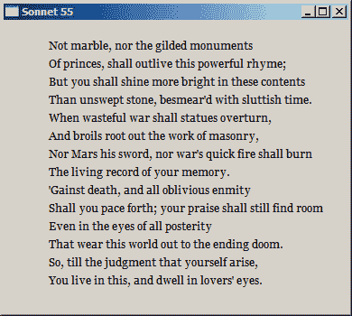

Figure: Text

## 绘制位图

位图是一个图形对象，用于创建，处理图像并将其作为文件存储在磁盘上。 BMP 是 Windows 的本机位图格式，实际上用于存储任何类型的位图数据。

`drawbitmap.c`

```c
#include <windows.h>

LRESULT CALLBACK WndProc(HWND, UINT, WPARAM, LPARAM);

int WINAPI wWinMain(HINSTANCE hInstance, HINSTANCE hPrevInstance,
    PWSTR lpCmdLine, int nCmdShow) {

    MSG  msg;
    WNDCLASSW wc = {0};

    wc.style = CS_HREDRAW | CS_VREDRAW;
    wc.lpszClassName = L"Draw Bitmap";
    wc.hInstance     = hInstance;
    wc.hbrBackground = GetSysColorBrush(COLOR_3DFACE);
    wc.lpfnWndProc   = WndProc;
    wc.hCursor       = LoadCursor(0, IDC_ARROW);

    RegisterClassW(&wc);
    CreateWindowW(wc.lpszClassName, L"Draw Bitmap",
          WS_OVERLAPPEDWINDOW | WS_VISIBLE,
          100, 100, 280, 220, NULL, NULL, hInstance, NULL);

    while (GetMessage(&msg, NULL, 0, 0)) {

        TranslateMessage(&msg);
        DispatchMessage(&msg);
    }

    return (int) msg.wParam;
}

LRESULT CALLBACK WndProc(HWND hwnd, UINT msg,
    WPARAM wParam, LPARAM lParam) {

    static HBITMAP hBitmap;
    HDC hdc;
    PAINTSTRUCT ps;
    BITMAP bitmap;
    HDC hdcMem;
    HGDIOBJ oldBitmap;

    switch(msg) {

        case WM_CREATE:

             hBitmap = (HBITMAP) LoadImageW(NULL, L"C:\\prog\\slovakia.bmp", 
                        IMAGE_BITMAP, 0, 0, LR_LOADFROMFILE);

             if (hBitmap == NULL) {
                 MessageBoxW(hwnd, L"Failed to load image", L"Error", MB_OK); 
             }

             break;      

        case WM_PAINT:

             hdc = BeginPaint(hwnd, &ps);

             hdcMem = CreateCompatibleDC(hdc);
             oldBitmap = SelectObject(hdcMem, hBitmap);

             GetObject(hBitmap, sizeof(bitmap), &bitmap);
             BitBlt(hdc, 5, 5, bitmap.bmWidth, bitmap.bmHeight, 
                 hdcMem, 0, 0, SRCCOPY);

             SelectObject(hdcMem, oldBitmap);
             DeleteDC(hdcMem);

             EndPaint(hwnd, &ps);

             break;

        case WM_DESTROY:

            DeleteObject(hBitmap);
            PostQuitMessage(0);

            return 0;
    }

    return DefWindowProcW(hwnd, msg, wParam, lParam);
}

```

该示例在窗口上绘制了斯洛伐克国旗。 图片为 BMP 文件格式。

```c
static HBITMAP hBitmap;

```

`HBITMAP`是位图对象的句柄。

```c
BITMAP bitmap;

```

`BITMAP`结构定义位图的类型，宽度，高度，颜色格式和位值。

```c
hBitmap = (HBITMAP) LoadImageW(NULL, L"C:\\prog\\slovakia.bmp", 
        IMAGE_BITMAP, 0, 0, LR_LOADFROMFILE);

```

`LoadImageW()`功能从磁盘加载 BMP 图像。 它返回位图的句柄。

```c
GetObject(hBitmap, sizeof(bitmap), &bitmap);

```

`GetObject()`函数在提供的`BITMAP`结构中存储有关位图的信息。

```c
hdcMem = CreateCompatibleDC(hdc);

```

`CreateCompatibleDC()`功能创建与应用当前屏幕兼容的存储设备上下文。

```c
oldBitmap = SelectObject(hdcMem, hBitmap);

```

`SelectObject()`函数将一个对象选择到存储设备上下文中。 在将位图用于任何事物之前，必须先将其选择到存储设备上下文中。

```c
BitBlt(hdc, 5, 5, bitmap.bmWidth, bitmap.bmHeight, hdcMem, 0, 0, SRCCOPY);

```

`BitBlt()`函数执行与像素矩形相对应的颜色数据从指定的源设备上下文到目标设备上下文的位块传输。

```c
SelectObject(hdcMem, oldBitmap);

```

应用在完成使用新对象的绘制之后，应始终将其替换为原始的默认对象。

```c
DeleteDC(hdcMem);

```

与存储设备上下文关联的资源被释放。

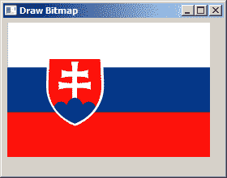

Figure: Drawing a bitmap

在 Windows API 教程的这一部分中，我们进行了一些绘制。