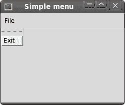
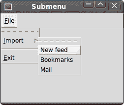
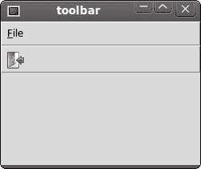

# Tcl / Tk 中的菜单&工具栏

> 原文： [http://zetcode.com/gui/tcltktutorial/menustoolbars/](http://zetcode.com/gui/tcltktutorial/menustoolbars/)

在 Tcl / Tk 教程的这一部分中，我们将使用菜单和工具栏。

菜单栏是 GUI 应用程序中最可见的部分之一。 它是位于各个菜单中的一组命令。 在控制台应用程序中，我们必须记住许多奥术命令，在这里，我们将大多数命令分组为逻辑部分。 有公认的标准可以进一步减少学习新应用程序的时间。 菜单将我们可以在应用程序中使用的命令分组。 使用工具栏可以快速访问最常用的命令。

## 简单菜单

第一个示例将显示一个简单的菜单。

```
#!/usr/bin/wish

# ZetCode Tcl/Tk tutorial
#
# In this code example, we create 
# a simple menu.
#
# author: Jan Bodnar
# last modified: March 2011
# website: www.zetcode.com

menu .mbar
. configure -menu .mbar

menu .mbar.fl -tearoff 0
.mbar add cascade -menu .mbar.fl -label File \
    -underline 0

.mbar.fl add command -label Exit -command { exit }

wm title . "Simple menu" 
wm geometry . 250x150+300+300

```

我们的示例将显示一个文件菜单，其中包含一项。 通过选择退出菜单项，我们关闭应用程序。

```
menu .mbar
. configure -menu .mbar

```

我们创建一个菜单栏。 菜单栏是菜单的特例。

```
menu .mbar.fl -tearoff 0

```

创建文件菜单。 `-tearoff`选项指定无法从菜单栏中删除菜单。

```
.mbar add cascade -menu .mbar.fl -label File \
    -underline 0

```

我们将文件菜单添加到菜单栏。 `-underline`选项在标签的第一个字符下划线。 现在可以使用 `Alt` + `F` 快捷方式下拉菜单。

```
.mbar.fl add command -label Exit -command { exit }

```

`Exit`命令被添加到文件菜单。 这将创建一个菜单项。 选择菜单项后，应用程序终止。



Figure: Simple menu

## 子菜单

子菜单是插入另一个菜单对象的菜单。 下一个示例对此进行了演示。

```
#!/usr/bin/wish

# ZetCode Tcl/Tk tutorial
#
# In this code example, we create 
# a submenu.
#
# author: Jan Bodnar
# last modified: March 2011
# website: www.zetcode.com

menu .mbar
. configure -menu .mbar

menu .mbar.fm -tearoff 0
.mbar add cascade -menu .mbar.fm -label File \
    -underline 0

menu .mbar.fm.sb   
.mbar.fm.sb add command -label "News feed"
.mbar.fm.sb add command -label Bookmarks
.mbar.fm.sb add command -label Mail

.mbar.fm add cascade -label Import -menu \
    .mbar.fm.sb -underline 0
.mbar.fm add separator

.mbar.fm add command -label Exit -underline 0 \
    -command {exit}     

wm title . submenu 
wm geometry . 250x150+300+300  

```

在示例中，文件菜单的子菜单中有三个选项。 我们创建一个分隔符和键盘快捷键。

```
menu .mbar.fm.sb   
.mbar.fm.sb add command -label "News feed"
.mbar.fm.sb add command -label Bookmarks
.mbar.fm.sb add command -label Mail

```

我们有一个包含三个命令的子菜单。 子菜单是常规菜单。 注意小部件路径名的层次结构。

```
.mbar.fm add cascade -label Import -menu \
    .mbar.fm.sb -underline 0

```

通过将菜单添加到“文件”菜单而不是菜单栏，我们创建了一个子菜单。 下划线参数创建键盘快捷键。 我们提供了角色位置，应在下面加下划线。 在我们的情况下，这是第一个。 位置从零开始。 当我们单击“文件”菜单时，将显示一个弹出窗口。 导入菜单下划线一个字符。 我们可以使用鼠标指针或 `Alt` + `I` 快捷方式选择它。

```
.mbar.fm add separator

```

分隔符是一条水平线，可以在视觉上分隔菜单命令。 这样，我们可以将项目分组到一些合理的位置。



Figure: Submenu

## 弹出菜单

在下一个示例中，我们创建一个弹出菜单。 弹出菜单是上下文窗口小部件，可以在窗口的客户区域中的任何位置显示。

```
#!/usr/bin/wish

# ZetCode Tcl/Tk tutorial
#
# In this code example, we create 
# a popup menu.
#
# author: Jan Bodnar
# last modified: March 2011
# website: www.zetcode.com

menu .m -tearoff 0
.m add command -label Beep
.m add command -label Exit -command {exit}

bind . "<Button-3>" "showMenu %X %Y"

wm title . popupmenu
wm geometry . 250x150+300+300

proc showMenu {x y} {
    tk_popup .m $x $y
} 

```

在我们的示例中，我们使用两个命令创建一个弹出菜单。

```
menu .m -tearoff 0
.m add command -label Beep
.m add command -label Exit -command {exit}

```

上下文菜单是常规的`menu`小部件。 `tearoff`功能已关闭。

```
bind . "<Button-3>" "showMenu %X %Y"

```

我们将`&lt;Button-3&gt;`事件绑定到`showMenu`过程。 当我们右键单击窗口的客户区域时，将生成事件。 我们将两个参数传递给该过程。 这些是鼠标单击的 x 和 y 坐标。

```
proc showMenu {x y} {
    tk_popup .m $x $y
} 

```

`showMenu`过程显示上下文菜单。 弹出菜单显示在鼠标单击的 x 和 y 坐标处。 要显示弹出菜单，我们使用`tk_popup`命令。


Figure: Popup menu

## 工具列

菜单将我们可以在应用程序中使用的命令分组。 使用工具栏可以快速访问最常用的命令。 Tk 中没有工具栏小部件。

```
#!/usr/bin/wish

# ZetCode Tcl/Tk tutorial
#
# In this code example, we create 
# a toolbar.
#
# author: Jan Bodnar
# last modified: March 2011
# website: www.zetcode.com

package require Img

menu .mbar
. configure -menu .mbar

menu .mbar.fl -tearoff 0
.mbar add cascade -menu .mbar.fl -label File \
    -underline 0

frame .toolbar -bd 1 -relief raised
image create photo img -file "exit.png"
button .toolbar.exitButton -image img -relief flat -command {exit}
pack .toolbar.exitButton -side left -padx 2 -pady 2
pack .toolbar -fill x

wm title . toolbar
wm geometry . 250x150+300+300

```

我们的工具栏将是一个框架，在该框架上将放置一个按钮。

```
frame .toolbar -bd 1 -relief raised

```

工具栏已创建。 它是`frame`。 我们创建了一个凸起的边框，以便工具栏的边界可见。

```
image create photo img -file "exit.png"
button .toolbar.exitButton -image img -relief flat -command {exit}

```

创建带有图像的退出按钮。

```
pack .toolbar.exitButton -side left -padx 2 -pady 2

```

工具栏是框架，框架是容器小部件。 我们将按钮包装在左侧。 我们添加一些填充。

```
pack .toolbar -fill x

```

工具栏打包在根窗口中； 它是水平拉伸的。



Figure: Toolbar

在 Tcl / Tk 教程的这一部分中，我们展示了如何创建带有菜单和菜单项以及工具栏的菜单栏。