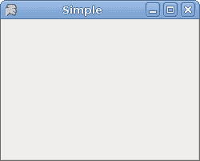
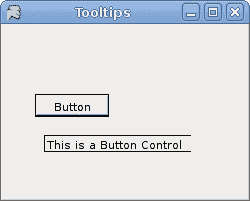

# Mono Winforms 中的第一步

> 原文： [http://zetcode.com/gui/csharpwinforms/firststeps/](http://zetcode.com/gui/csharpwinforms/firststeps/)

在 Mono Winforms 教程的这一部分中，我们介绍 Winforms 编程库中的一些基本程序。

## 简单

这是一个简单的 Winforms 应用程序。

`simple.cs`

```
using System.Windows.Forms;
using System.Drawing;

public class Simple : Form
{
    public Simple()
    {
       Text = "Simple";
       Size = new Size(250, 200);
       CenterToScreen();
    }

    static public void Main()
    {
       Application.Run(new Simple());
    }
}

```

此代码示例在屏幕上显示一个小窗口。

```
using System.Windows.Forms;
using System.Drawing;

```

在这里，我们使用`using`指令，该指令允许我们使用适当名称空间中的类型，而无需使用完全限定的名称。 例如，我们现在可以编写 Form 而不是 System.Windows.Forms.Form。

```
public class Simple : Form
{
...
}

```

在 Winforms 中，任何窗口或对话框都是`Form`。 该控件是一个基本容器，其目的是显示其他子控件。 我们的类 Simple 继承自表单。 这样，它本身就成为一种形式。

```
Text = "Simple";
Size = new Size(250, 200);

```

`Text`和`Size`是表单的属性。 更改这些属性，我们将修改表单控件。 第一行在表单控件的标题栏中显示文本“ Simple”。 第二行将表单的大小设置为 250x200 px。

```
CenterToScreen();

```

这种方法将我们的应用程序集中在屏幕上。

```
static public void Main()
{
   Application.Run(new Simple());
}

```

编译并运行后，将首先执行 Main 方法。 该代码实例化 Simple 类并运行它。

```
 $ gmcs -r:System.Windows.Forms.dll -r:System.Drawing.dll simple.cs

```

这是我们编译源代码的方式。 如果没有犯任何错误，则应在当前工作目录中包含`simple.exe`文件。



Figure: Simple

## 图标

Mono 在西班牙语中意为猴子。 如果我们不为应用程序提供图标，则默认情况下，我们的头是猴子。 下一个示例显示如何更改此设置。

`icon.cs`

```
using System.Windows.Forms;
using System.Drawing;
using System;

public class MForm : Form
{
    public MForm()
    {
       Text = "Icon";
       Size = new Size(250, 200);

       try {
           Icon = new Icon("web.ico");
       } catch (Exception e) {
           Console.WriteLine(e.Message);
           Environment.Exit(1);
       }

       CenterToScreen();
    }

    static public void Main()
    {
       Application.Run(new MForm());
    }
}

```

该代码示例在窗体的左上角显示一个图标。 表单的图标是代表任务栏中表单的图片以及为表单的控制框显示的图标。

```
try {
    Icon = new Icon("web.ico");
} catch (Exception e) {
    Console.WriteLine(e.Message);
    Environment.Exit(1);
}

```

最好将所有输入输出工作放在 try / catch 关键字之间。 web.ico 文件必须在当前工作目录中可用。 这是我们执行（./icon.exe）应用程序的目录。


Figure: Icon

## 工具提示

工具提示是一个小的矩形弹出窗口，当用户将指针放在控件上时，它会显示控件目的的简短说明。

`tooltips.cs`

```
using System;
using System.Drawing;
using System.Windows.Forms;

class MForm : Form {

    public MForm() {
        Text = "Tooltips";
        Size = new Size(250, 200);

        ToolTip btnTlp = new ToolTip();

        btnTlp.SetToolTip(this, "This is a Form");

        Button button = new Button();
        btnTlp.SetToolTip(button, "This is a Button Control");
        button.Text = "Button";
        button.Location = new Point(30, 70);
        button.Parent = this;

        CenterToScreen();
    }
}

class MApplication {
    static void Main() {
        Application.Run(new MForm());
    }
}

```

我们的代码示例为两个控件创建一个工具提示。 `Button`控件和`Form`控件。

```
ToolTip btnTlp = new ToolTip();

```

在这里，我们创建`ToolTip`控件。 此实例用于为两个控件提供工具提示。

```
btnTlp.SetToolTip(this, "This is a Form");

```

在这里，我们为表单设置工具提示。

```
btnTlp.SetToolTip(button, "This is a Button Control");

```

这里是我们的按钮。

```
Button button = new Button();
btnTlp.SetToolTip(button, "This is a Button Control");
button.Text = "Button";
button.Location = new Point(30, 70);
button.Parent = this;

```

注意`Button`控件的创建。 `Text`属性是按钮的标签。 `Location`属性将按钮放在 x = 30，y = 70 px 坐标的表单上。 最后，`Parent`属性确定按钮所在的容器。



Figure: Tooltips

## 纽扣

我们的最后一个代码示例显示了一个有效的按钮控件。

`button.cs`

```
using System;
using System.Drawing;
using System.Windows.Forms;

class MForm : Form {
    public MForm() {
        Text = "Button";
        Size = new Size(250, 200);

        Button button = new Button();

        button.Location = new Point(30, 20);
        button.Text = "Quit";
        button.Click += new EventHandler(OnClick);
        button.MouseEnter += new EventHandler(OnEnter);

        Controls.Add(button);
        CenterToScreen();
    }

    void OnClick(object sender, EventArgs e) {
       Close();
    }

    void OnEnter(object sender, EventArgs e) {
       Console.WriteLine("Button Entered");
    }

}

class MApplication {
    public static void Main() {
        Application.Run(new MForm());
    }
}

```

所有 GUI 编程都是事件驱动的编程。 在我们的示例中，我们在表单容器上显示了一个按钮控件。 该按钮将收听两个事件。 `Click`和`MouseEnter`事件。

```
button.Click += new EventHandler(OnClick);   

```

此代码行将事件处理程序插入`Click`事件。 当我们单击按钮时，将调用`OnClick()`方法。

```
button.MouseEnter += new EventHandler(OnEnter);

```

当我们使用鼠标指针进入按钮区域时，将触发`MouseEnter`事件。 在这种情况下，我们的代码将调用`OnEnter()`方法。

```
void OnClick(object sender, EventArgs e) {
    Close();
}

```

该方法关闭应用程序。

```
void OnEnter(object sender, EventArgs e) {
    Console.WriteLine("Button Entered");
}

```

当我们使用鼠标指针进入按钮控制区域时，终端中将显示“已输入按钮”文本。

Mono Winforms 教程的这一部分显示了一些入门代码示例，以帮助您开始使用 Winforms 编程库。