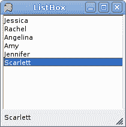
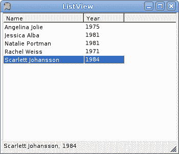
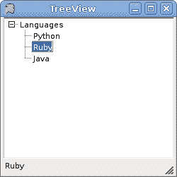
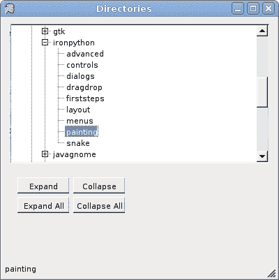

# Mono Winforms 中的高级控件

> 原文： [http://zetcode.com/gui/csharpwinforms/advancedcontrols/](http://zetcode.com/gui/csharpwinforms/advancedcontrols/)

在 Mono Winforms 教程的这一部分中，我们介绍一些更高级的控件。 即`ListBox`，`ListView`和`TreeView`控件。

## 列表框控件

`ListBox`控件用于显示项目列表。 用户可以通过单击选择一个或多个项目。

`listbox.cs`

```
using System;
using System.Drawing;
using System.Windows.Forms;

class MForm : Form {

    private StatusBar sb;

    public MForm() {
        Text = "ListBox";
        Size = new Size(210, 210);

        ListBox lb = new ListBox();
        lb.Parent = this;
        lb.Items.Add("Jessica");
        lb.Items.Add("Rachel");
        lb.Items.Add("Angelina");
        lb.Items.Add("Amy");
        lb.Items.Add("Jennifer");
        lb.Items.Add("Scarlett");

        lb.Dock = DockStyle.Fill;
        lb.SelectedIndexChanged += new EventHandler(OnChanged);

        sb = new StatusBar();
        sb.Parent = this;

        CenterToScreen();
    }

    void OnChanged(object sender, EventArgs e) {
        ListBox lb = (ListBox) sender;
        sb.Text = lb.SelectedItem.ToString();
    }
}

class MApplication {
    public static void Main() {
        Application.Run(new MForm());
    }
}

```

我们的示例显示了一个具有六个名称的列表框。 所选项目显示在状态栏中。

```
ListBox lb = new ListBox();
lb.Parent = this;

```

`ListBox`控件已创建。

```
lb.Items.Add("Jessica");

```

这就是我们向`ListBox`控件添加新项目的方式。 该控件具有`Items`属性。 该属性是对列表框中项目列表的引用。 使用此参考，我们可以添加，删除或获取列表框中的项目数。

```
lb.SelectedIndexChanged += new EventHandler(OnChanged);

```

当我们选择一个项目时，会触发`SelectedIndexChanged`事件。

```
ListBox lb = (ListBox) sender;
sb.Text = lb.SelectedItem.ToString();

```

在`OnChange()`方法内部，我们获得对列表框的引用，并将所选文本设置为状态栏。



Figure: ListBox

## 列表视图

`ListView`控件用于显示项目集合。 它是比`ListBox`控件更复杂的控件。 它可以在各种视图中显示数据，主要用于在多列视图中显示数据。

`listview.cs`

```
using System;
using System.Drawing;
using System.Windows.Forms;
using System.Collections.Generic;

public class Actress
{
    public string name;
    public int year;

    public Actress(string name, int year)
    {
        this.name = name;
        this.year = year;
    }
}

class MForm : Form {

    private StatusBar sb;

    public MForm() {
        Text = "ListView";
        Size = new Size(350, 300);

        List<Actress> actresses = new List<Actress>();

        actresses.Add(new Actress("Jessica Alba", 1981));
        actresses.Add(new Actress("Angelina Jolie", 1975));
        actresses.Add(new Actress("Natalie Portman", 1981));
        actresses.Add(new Actress("Rachel Weiss", 1971));
        actresses.Add(new Actress("Scarlett Johansson", 1984));

        ColumnHeader name = new ColumnHeader();
        name.Text = "Name";
        name.Width = -1;
        ColumnHeader year = new ColumnHeader();
        year.Text = "Year";

        SuspendLayout();

        ListView lv = new ListView();
        lv.Parent = this;
        lv.FullRowSelect = true;
        lv.GridLines = true;
        lv.AllowColumnReorder = true;
        lv.Sorting = SortOrder.Ascending;
        lv.Columns.AddRange(new ColumnHeader[] {name, year});
        lv.ColumnClick += new ColumnClickEventHandler(ColumnClick);

        foreach (Actress act in actresses) {
            ListViewItem item = new ListViewItem();
            item.Text = act.name;
            item.SubItems.Add(act.year.ToString());
            lv.Items.Add(item);
        }

        lv.Dock = DockStyle.Fill;
        lv.Click += new EventHandler(OnChanged);

        sb = new StatusBar();
        sb.Parent = this;
        lv.View = View.Details;

        ResumeLayout();

        CenterToScreen();
    }

    void OnChanged(object sender, EventArgs e) {
        ListView lv = (ListView) sender;
        string name = lv.SelectedItems[0].SubItems[0].Text;
        string born = lv.SelectedItems[0].SubItems[1].Text;
        sb.Text = name + ", " + born;
    }

    void ColumnClick(object sender, ColumnClickEventArgs e)
    {
        ListView lv = (ListView) sender;

        if (lv.Sorting == SortOrder.Ascending) {
            lv.Sorting = SortOrder.Descending;
        } else {
            lv.Sorting = SortOrder.Ascending;
        }   
    }
}

class MApplication {
    public static void Main() {
        Application.Run(new MForm());
    }
}

```

在我们的示例中，我们有一个包含两列的列表视图。 在第一列中，我们显示女演员的名字。 在第二个他们的出生日期。 数据存储在`List`集合中。 通过选择一行，一行中的数据将显示在状态栏中。 另外，通过单击列标题，可以对数据进行排序。

```
public class Actress
{
...
}

```

我们使用`Actress`类存储数据。

```
List<Actress> actresses = new List<Actress>();

actresses.Add(new Actress("Jessica Alba", 1981));
actresses.Add(new Actress("Angelina Jolie", 1975));
...

```

我们创建项目并在项目中填充项目。

```
ColumnHeader name = new ColumnHeader();
name.Text = "Name";
name.Width = -1;

```

对于列表视图中的每一列，我们创建一个`ColumnHeader`。 通过将`Width`设置为-1，列的宽度等于列中最长的项目。

```
ListView lv = new ListView();
lv.Parent = this;

```

`ListView`控件已创建。

```
lv.FullRowSelect = true;
lv.GridLines = true;
lv.AllowColumnReorder = true; 
lv.Sorting = SortOrder.Ascending;

```

在这里，我们设置控件的四个属性。 该代码行支持全行选择，显示网格线，通过拖动列对列进行重新排序并以升序对数据进行排序。

```
lv.Columns.AddRange(new ColumnHeader[] {name, year});

```

在这里，我们将两个`ColumnHeader`添加到`ListView`控件中。

```
foreach (Actress act in actresses) {
    ListViewItem item = new ListViewItem();
    item.Text = act.name;
    item.SubItems.Add(act.year.ToString());
    lv.Items.Add(item);
}

```

此循环填充 listview 控件。 每行都作为`ListViewItem`类添加到列表视图。

```
lv.View = View.Details;

```

`ListView`控件可以具有不同的视图。 不同的视图以不同的方式显示数据。

```
ListView lv = (ListView) sender;
string name = lv.SelectedItems[0].SubItems[0].Text;
string born = lv.SelectedItems[0].SubItems[1].Text;
sb.Text = name + ", " + born;

```

在`OnChanged()`方法内部，我们从选定的行中获取数据并将其显示在状态栏上。

```
if (lv.Sorting == SortOrder.Ascending) {
    lv.Sorting = SortOrder.Descending;
} else {
    lv.Sorting = SortOrder.Ascending;
}   

```

在这里，我们切换列的排序顺序。



Figure: ListView

## 树视图

`TreeView`控件显示项目的分层集合。 此控件中的每个项目都由`TreeNode`对象表示。

`treeview.cs`

```
using System;
using System.Drawing;
using System.Windows.Forms;

class MForm : Form {

    StatusBar sb;

    public MForm() {
        Text = "TreeView";
        Size = new Size(250, 250);

        TreeView tv = new TreeView();

        TreeNode root = new TreeNode();
        root.Text = "Languages";

        TreeNode child1 = new TreeNode();
        child1.Text = "Python";

        TreeNode child2 = new TreeNode();
        child2.Text = "Ruby";

        TreeNode child3 = new TreeNode();
        child3.Text = "Java";

        root.Nodes.AddRange(new TreeNode[] {child1, child2, child3});

        tv.Parent = this;
        tv.Nodes.Add(root);
        tv.Dock = DockStyle.Fill;
        tv.AfterSelect += new TreeViewEventHandler(AfterSelect);

        sb = new StatusBar();
        sb.Parent = this;

        CenterToScreen();
    }

    void AfterSelect(object sender, TreeViewEventArgs e)
    {
        sb.Text = e.Node.Text;
    }
}

class MApplication {
    public static void Main() {
        Application.Run(new MForm());
    }
}

```

这是`TreeView`控件的非常简单的演示。 我们有一个根项目和三个孩子。

```
TreeView tv = new TreeView();

```

我们创建`TreeView`控件。

```
TreeNode root = new TreeNode();
root.Text = "Languages";
...
tv.Nodes.Add(root);

```

在这里，我们创建一个根节点。

```
TreeNode child1 = new TreeNode();
child1.Text = "Python";

```

子节点以类似的方式创建。

```
root.Nodes.AddRange(new TreeNode[] {child1, child2, child3});

```

子节点插入到根节点的`Nodes`属性中。



Figure: TreeView

## 目录

下面的代码示例将更深入地研究`TreeView`控件。

`directories.cs`

```
using System;
using System.Drawing;
using System.Windows.Forms;
using System.IO;       

public class MForm : Form
{
  private TreeView tv;
  private Button expand;
  private Button expandAll;
  private Button collapse;
  private Button collapseAll;
  private StatusBar sb;

  private const string HOME_DIR = "/home/vronskij";

  public MForm()
  {
    Size = new Size(400, 400);
    Text = "Directories";

    tv = new TreeView();

    SuspendLayout();

    tv.Parent = this;
    tv.Location = new Point(10,10);
    tv.Size = new Size(ClientSize.Width - 20, Height - 200);
    tv.Anchor = AnchorStyles.Top | AnchorStyles.Left | 
          AnchorStyles.Right ;

    tv.FullRowSelect = false;    
    tv.ShowLines = true;      
    tv.ShowPlusMinus = true;    
    tv.Scrollable = true;      
    tv.AfterSelect += new TreeViewEventHandler(AfterSelect);

    expand = new Button();
    expand.Parent = this;
    expand.Location = new Point(20, tv.Bottom + 20);
    expand.Text = "Expand";
    expand.Anchor = AnchorStyles.Left | AnchorStyles.Top;
    expand.Click += new EventHandler(OnExpand);

    expandAll = new Button();
    expandAll.Parent = this;
    expandAll.Location = new Point(20, expand.Bottom + 5);
    expandAll.Text = "Expand All";
    expandAll.Anchor = AnchorStyles.Left | AnchorStyles.Top;
    expandAll.Click += new EventHandler(OnExpandAll);

    collapse = new Button();
    collapse.Parent = this;
    collapse.Location = new Point(expandAll.Right + 5, expand.Top );
    collapse.Text = "Collapse";
    collapse.Anchor = AnchorStyles.Left | AnchorStyles.Top;
    collapse.Click += new EventHandler(OnCollapse);

    collapseAll = new Button();
    collapseAll.Parent = this;
    collapseAll.Location = new Point(collapse.Left, collapse.Bottom + 5);
    collapseAll.Text = "Collapse All";
    collapseAll.Anchor = AnchorStyles.Left | AnchorStyles.Top;
    collapseAll.Click += new EventHandler(OnCollapseAll);

    sb = new StatusBar();
    sb.Parent = this;

    ShowDirectories(tv.Nodes, HOME_DIR);

    ResumeLayout();

    CenterToScreen();
  }

  void AfterSelect(object sender, TreeViewEventArgs e)
  {
      sb.Text = e.Node.Text;
  }

  void ShowDirectories(TreeNodeCollection trvNode, string path)
  {
      DirectoryInfo dirInfo = new DirectoryInfo(path);
      if (dirInfo != null)
      {
          DirectoryInfo[] subDirs = dirInfo.GetDirectories();
          TreeNode tr = new TreeNode(dirInfo.Name);

          if (subDirs.Length > 0)
          {
              foreach (DirectoryInfo dr in subDirs)
              {   
                  if (!dr.Name.StartsWith("."))
                      ShowDirectories(tr.Nodes, dr.FullName);               
              }
          }
          trvNode.Add(tr);
      }
  }

  void OnExpand(object sender, EventArgs e)
  {
    tv.SelectedNode.Expand();
  }

  void OnExpandAll(object sender, EventArgs e)
  {
    tv.ExpandAll();
  }

  void OnCollapse(object sender, EventArgs e)
  {
    tv.SelectedNode.Collapse();
  }

  void OnCollapseAll(object sender, EventArgs e)
  {
    tv.CollapseAll();
  }

  static void Main() 
  {
    Application.Run(new MForm());
  }

}

```

我们的代码示例在`TreeView`控件中显示指定主目录的目录。 该应用程序启动有些延迟，因为它首先读取主目录的目录结构。 表单上还有四个按钮。 这些按钮以编程方式展开和折叠节点。

```
tv.Scrollable = true; 

```

我们使 treeview 控件可滚动，因为该控件显示了大量目录。

```
ShowDirectories(tv.Nodes, HOME_DIR);

```

`ShowDirectories()`方法使用指定主目录中可用的目录填充 treview 控件的节点。

```
if (subDirs.Length > 0)
{
...
}

```

我们检查是否有任何子目录。

```
foreach (DirectoryInfo dr in subDirs)
{   
    if (!dr.Name.StartsWith("."))
        ShowDirectories(tr.Nodes, dr.FullName);               
}

```

我们遍历所有目录。 为此，我们使用了递归算法。 我们还跳过隐藏的目录。 它们以 Unix 系统上的点开头。

```
trvNode.Add(tr);

```

此代码行实际上将目录添加到 treeview 控件。

```
void OnExpand(object sender, EventArgs e)
{
  tv.SelectedNode.Expand();
}

```

所有四个按钮都将事件插入到方法中。 这是展开按钮的方法。 它调用当前所选节点的`Expand()`方法。



Figure: Directories

在 Mono Winforms 教程的这一部分中，我们介绍了 Winforms 库中可用的几个高级控件。