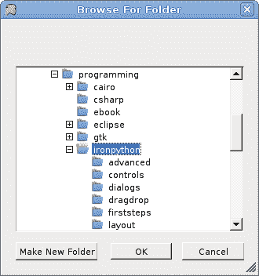
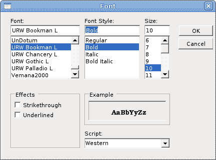
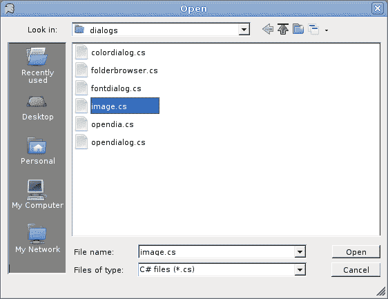

# 对话框

> 原文： [http://zetcode.com/gui/csharpwinforms/dialogs/](http://zetcode.com/gui/csharpwinforms/dialogs/)

在 Mono Winforms 教程的这一部分中，我们将讨论对话框。

对话框窗口或对话框是大多数现代 GUI 应用程序必不可少的部分。 对话被定义为两个或更多人之间的对话。 在计算机应用程序中，对话框是一个窗口，用于与应用程序“对话”。 对话框用于输入数据，修改数据，更改应用程序设置等。对话框是用户与计算机程序之间进行通信的重要手段。

基本上有两种类型的对话框。 预定义对话框和自定义对话框。

## 文件夹浏览器对话框

此对话框提示用户选择一个文件夹。

`folderbrowserdialog.cs`

```
using System;
using System.IO;
using System.Drawing;
using System.Windows.Forms;

class MForm : Form {

    private ToolBar toolbar;
    private ToolBarButton open;
    private StatusBar statusbar;

    public MForm() {
        Text = "FolderBrowserDialog";

        toolbar = new ToolBar();
        open = new ToolBarButton();

        statusbar = new StatusBar();
        statusbar.Parent = this;

        toolbar.Buttons.Add(open);
        toolbar.ButtonClick += new ToolBarButtonClickEventHandler(OnClicked);

        Controls.Add(toolbar);

        CenterToScreen();
    }

    void OnClicked(object sender, ToolBarButtonClickEventArgs e) {
       FolderBrowserDialog dialog = new FolderBrowserDialog();

       if (dialog.ShowDialog(this) == DialogResult.OK) {
           statusbar.Text = dialog.SelectedPath;
       }
    }
}

class MApplication {
    public static void Main() {
        Application.Run(new MForm());
    }
}

```

我们有一个工具栏和一个工具栏按钮。 点击按钮，`FolderBrowserDialog`出现在屏幕上。 所选文件夹的名称显示在状态栏中。

```
FolderBrowserDialog dialog = new FolderBrowserDialog();

```

`FolderBrowserDialog`已创建。

```
if (dialog.ShowDialog(this) == DialogResult.OK) {
    statusbar.Text = dialog.SelectedPath;
}       

```

`ShowDialog()`方法在屏幕上显示对话框。 如果单击对话框的“确定”按钮，则所选的目录路径将显示在状态栏上。



Figure: FolderBrowserDialog

## 色彩对话框

此对话框显示可用的颜色以及使用户能够定义自定义颜色的控件。

`colordialog.cs`

```
 using System;
 using System.Drawing;
 using System.Windows.Forms;

class MForm : Form {

    private ToolBar toolbar;
    private ToolBarButton open;
    private Color color;

    private int rectWidth = 100;
    private int rectHeight = 100;
    private Rectangle r;

    public MForm() {
        Text = "ColorDialog";

        color = Color.Blue;

        toolbar = new ToolBar();
        open = new ToolBarButton();

        toolbar.Buttons.Add(open);
        toolbar.ButtonClick += new ToolBarButtonClickEventHandler(OnClicked);

        LocateRect();

        SetStyle (ControlStyles.ResizeRedraw, true);
        Controls.Add(toolbar);
        Paint += new PaintEventHandler(OnPaint);

        CenterToScreen();
    }

    void OnPaint(object sender, PaintEventArgs e)
    {
      Graphics g = e.Graphics;
      LocateRect();

      SolidBrush brush = new SolidBrush(color);

      g.FillRectangle(brush, r);
    }

    void OnClicked(object sender, ToolBarButtonClickEventArgs e) {
       ColorDialog dialog = new ColorDialog();
       if (dialog.ShowDialog(this) == DialogResult.OK) {
          color = dialog.Color;
          Invalidate();
       }
    }

    void LocateRect() {
        int x = (ClientSize.Width - rectWidth) / 2;
        int y = (ClientSize.Height - rectHeight) / 2;
        r = new Rectangle(x, y, rectWidth, rectHeight);
    }
}

class MApplication {
    public static void Main() {
        Application.Run(new MForm());
    }
}

```

在此代码示例中，我们使用`ColorDialog`为位于窗体控件中间的矩形选择颜色。

```
color = Color.Blue;

```

开始时，矩形的颜色是蓝色。 我们使用`color`变量来确定矩形的颜色。

```
ColorDialog dialog = new ColorDialog();

```

`ColorDialog`已创建。

```
if (dialog.ShowDialog(this) == DialogResult.OK) {
   color = dialog.Color;
   Invalidate();
}

```

该代码显示颜色对话框。 如果单击“确定”按钮，则将获得选定的颜色并调用`Invalidate()`方法。 该方法会使控件的整个表面无效，并使控件重画。 结果是用新的颜色值绘制了矩形。


Figure: ColorDialog

## 字体对话框

`FontDialog`用于选择字体。

`fontdialog.cs`

```
 using System;
 using System.Drawing;
 using System.Windows.Forms;

class MForm : Form {

    private Label text;
    private ToolBar toolbar;
    private ToolBarButton open;

    public MForm() {
        Text = "FontDialog";

        text = new Label();
        text.Parent = this;
        text.Text = "Winforms tutorial";

        LocateText();

        toolbar = new ToolBar();
        toolbar.Parent = this;
        open = new ToolBarButton();

        toolbar.Buttons.Add(open);
        toolbar.ButtonClick += new ToolBarButtonClickEventHandler(OnClicked);

        text.AutoSize = true;
        Resize += new EventHandler(OnResize);

        CenterToScreen();
    }

    void OnResize(object sender, EventArgs e){
       LocateText();
    }

    void OnClicked(object sender, ToolBarButtonClickEventArgs e) {
       FontDialog dialog = new FontDialog();
       if (dialog.ShowDialog(this) == DialogResult.OK) {
          text.Font = dialog.Font;
          LocateText();
       }
    }

    void LocateText() {
        text.Top = (this.ClientSize.Height - text.Height) / 2;
        text.Left = (this.ClientSize.Width - text.Width) / 2;
    }
}

class MApplication {
    public static void Main() {
        Application.Run(new MForm());
    }
}

```

我们在表单控件的中间绘制一些文本。 我们使用字体对话框更改此文本的字体。

```
FontDialog dialog = new FontDialog();

```

创建了`FontDialog`。

```
if (dialog.ShowDialog(this) == DialogResult.OK) {
   text.Font = dialog.Font;
   LocateText();
}

```

单击“确定”按钮时，将为`Label`控件设置新选择的字体。 由于文本的大小会随着字体的变化而变化，因此我们必须调用`LocateText()`方法，该方法将文本定位在表单控件的中间。



Figure: FontDialog

## 打开对话框

此对话框用于打开文件。

`opendialog.cs`

```
using System;
using System.IO;
using System.Drawing;
using System.Windows.Forms;

class MForm : Form {

    private ToolBar toolbar;
    private ToolBarButton open;
    private TextBox textbox;

    public MForm() {
        Text = "OpenFileDialog";

        toolbar = new ToolBar();
        open = new ToolBarButton();

        textbox = new TextBox();
        textbox.Multiline = true;
        textbox.ScrollBars = ScrollBars.Both;
        textbox.WordWrap = false;
        textbox.Parent = this;
        textbox.Dock = DockStyle.Fill;

        toolbar.Buttons.Add(open);
        toolbar.ButtonClick += new ToolBarButtonClickEventHandler(OnClicked);

        Controls.Add(toolbar);
        Controls.Add(textbox);

 	CenterToScreen();
    }

    void OnClicked(object sender, ToolBarButtonClickEventArgs e) {
       OpenFileDialog dialog = new OpenFileDialog();
       dialog.Filter = "C# files (*.cs)|*.cs";

       if (dialog.ShowDialog(this) == DialogResult.OK) {
           StreamReader reader = new StreamReader(dialog.FileName);
           string data = reader.ReadToEnd();
           reader.Close();
           textbox.Text = data;
       }
    }
}

class MApplication {
    public static void Main() {
        Application.Run(new MForm());
    }
}

```

我们使用`OpenDialog`控件打开 C# 源文件。 我们有一个`TextBox`控件，用于显示文件。

```
OpenFileDialog dialog = new OpenFileDialog();

```

`OpenDialog`已创建。

```
dialog.Filter = "C# files (*.cs)|*.cs";

```

我们将`Filter`属性设置为 C# 源文件。 此对话框实例只能选择 C# 文件。

```
if (dialog.ShowDialog(this) == DialogResult.OK) {
    StreamReader reader = new StreamReader(dialog.FileName);
    string data = reader.ReadToEnd();
    reader.Close();
    textbox.Text = data;
}

```

单击确定后，我们读取所选文件的内容并将其放入`TextBox`控件。



Figure: OpenDialog

在 Mono Winforms 教程的这一部分中，我们显示了各种对话框。