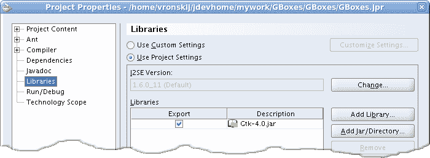

# Java Gnome 简介

> 原文： [http://zetcode.com/gui/javagnome/introduction/](http://zetcode.com/gui/javagnome/introduction/)

## 关于本教程

这是 Java Gnome 编程入门。 本教程针对 Java 编程语言。 它已在 Linux 上创建并经过测试。 Java Gnome 编程教程适合新手和中级程序员。

您可以在此处下载本教程[中使用的图像。](/img/gui/javagnoimg.tgz)

## Java Gnome

Java Gnome 是 Java 编程语言的 GTK+ 和 Gnome 的包装。

GTK+  是用于创建图形用户界面的库。 该库是用 C 编程语言创建的。 GTK+ 库也称为 GIMP Toolkit。 最初，该库是在开发 GIMP 图像处理程序时创建的。 从那时起，GTK+ 成为 Linux 和 BSD Unix 下最受欢迎的工具包之一。 如今，开源世界中的大多数 GUI 软件都是在 Qt 或 GTK+ 中创建的。 GTK+ 是面向对象的应用程序编程接口。 有几种其他编程语言的绑定。 存在用于 C ++，Python，Perl，Java，C＃和其他编程语言的语言绑定。

GNOME 是一个桌面环境，是在计算机操作系统之上运行的图形用户界面。 这是一个国际项目，包括创建软件开发框架，为桌面选择应用程序软件，以及开发用于管理应用程序启动，文件处理以及窗口和任务管理的程序。 GNOME 是 GNU Project 的一部分，可以与各种类似 Unix 的操作系统一起使用。 （wikipedia.org）

## 发展技巧

请使用官方的 Sun JDK。 不要使用任何其他派生或替代。 你被警告了。

下载最新版本的 Java Gnome 库。 手动编译并安装。

```
./configure --jdk=/home/vronskij/bin/jdk1.6.0_11/

```

如果您的系统上安装了 OpenJDK 或任何其他非标准 Java 开发工具包，则运行配置脚本，其路径指向已安装的 Sun JDK。

成功构建 Java Gnome 库之后，应该有两个文件。 `gtk-4.0.jar`和`libgtkjni-4.0.10.so`。 如果您已经下载了 java-gnome 4.0.10。

启动 Java Gnome 应用程序存在一个长期存在的问题。 通常，您需要创建一个脚本来启动每个 Java gnome 应用程序。 根据该网站，此问题已解决，但对我不起作用。 我通过复制`gtk-4.0.jar`所在的`libgtkjni-4.0.10.so`进行了变通。

```
$ ls
gtk-4.0.jar  libgtkjni-4.0.10.so 
$ pwd 
/usr/local/share/java

```

我使用 JDeveloper，此解决方法解决了此问题。



Figure: Adding Java Gnome library

在 JDeveloper 中创建新项目时，需要将`gtk-4.0.jar`添加到项目库中。 从这一点来看，运行应用程序很简单。

## 资料来源

*   [java-gnome.sourceforge.net](http://java-gnome.sourceforge.net)
*   [wikipedia.org](http://wikipedia.org)

这是 Java Gnome 库的简介。