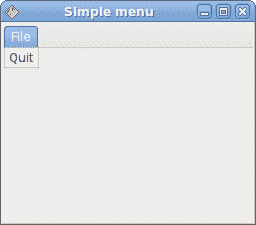
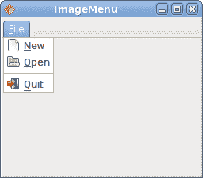
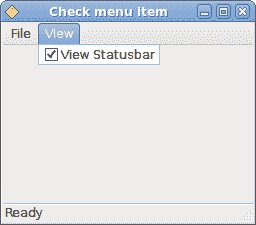

# Java Gnome 中的菜单

> 原文： [http://zetcode.com/gui/javagnome/menus/](http://zetcode.com/gui/javagnome/menus/)

在 Java Gnome 编程教程的这一部分中，我们将使用菜单。

菜单栏是 GUI 应用程序中最常见的部分之一。 它是位于各个菜单中的一组命令。 在控制台应用程序中，您必须记住所有这些神秘命令，在这里，我们将大多数命令分组为逻辑部分。 这些公认的标准可进一步减少学习新应用程序的时间。

## 简单菜单

在第一个示例中，我们将创建一个带有一个文件菜单的菜单栏。 该菜单将只有一个菜单项。 通过选择项目，应用程序退出。

`simplemenu.java`

```
package com.zetcode;

import org.gnome.gdk.Event;
import org.gnome.gtk.Gtk;
import org.gnome.gtk.Menu;
import org.gnome.gtk.MenuBar;
import org.gnome.gtk.MenuItem;
import org.gnome.gtk.VBox;
import org.gnome.gtk.Widget;
import org.gnome.gtk.Window;
import org.gnome.gtk.WindowPosition;

/**
 * ZetCode Java Gnome tutorial
 *
 * This program creates a simple menu.
 *
 * @author jan bodnar
 * website zetcode.com
 * last modified March 2009
 */

public class GSimpleMenu extends Window {

    public GSimpleMenu() {

        setTitle("Simple menu");

        initUI();

        setDefaultSize(250, 200);
        setPosition(WindowPosition.CENTER);
        showAll();
    }    

    private void initUI() {

        connect(new Window.DeleteEvent() {
            public boolean onDeleteEvent(Widget source, Event event) {
                Gtk.mainQuit();
                return false;
            }
        });

        VBox vbox = new VBox(false, 0);

        MenuBar menuBar = new MenuBar();
        MenuItem fileItem = new MenuItem("File");
        menuBar.append(fileItem);

        Menu quitMenu = new Menu();
        MenuItem quitItem = new MenuItem("Quit");

        quitItem.connect(new MenuItem.Activate() {

            public void onActivate(MenuItem menuItem) {
                Gtk.mainQuit();
            }
        });

        quitMenu.append(quitItem);
        fileItem.setSubmenu(quitMenu);

        vbox.packStart(menuBar, false, false, 3);
        add(vbox);
    }

    public static void main(String[] args) {

        Gtk.init(args);
        new GSimpleMenu();
        Gtk.main();   
    }
}

```

这是一个最小的菜单栏功能示例。

```
MenuBar menuBar = new MenuBar();

```

`MenuBar`小部件已创建。

```
MenuItem fileItem = new MenuItem("File");
menuBar.append(fileItem);

```

创建顶层`MenuItem`。

```
Menu quitMenu = new Menu();
MenuItem quitItem = new MenuItem("Quit");
...
quitMenu.append(quitItem);

```

创建退出`MenuItem`并将其附加到退出`Menu`。

```
fileItem.setSubmenu(quitMenu);

```

退出菜单设置为顶级文件菜单项的子菜单。

```
VBox vbox = new VBox(false, 0);
...
vbox.packStart(menuBar, false, false, 3);
add(vbox);

```

与其他工具包不同，我们必须自己照顾菜单栏的布局管理。 我们将菜单栏放入垂直框中。



Figure: Simple menu

## 图像菜单

在下一个示例中，我们将进一步探索菜单。 我们将使用图像和分隔符。

`imagemenu.java`

```
package com.zetcode;

import org.gnome.gtk.Gtk;
import org.gnome.gtk.ImageMenuItem;
import org.gnome.gtk.Menu;
import org.gnome.gtk.MenuBar;
import org.gnome.gtk.MenuItem;
import org.gnome.gtk.SeparatorMenuItem;
import org.gnome.gtk.Stock;
import org.gnome.gtk.VBox;
import org.gnome.gtk.Window;
import org.gnome.gtk.WindowPosition;

/**
 * ZetCode Java Gnome tutorial
 *
 * This program shows images in
 * the menu.
 *
 * @author jan bodnar
 * website zetcode.com
 * last modified March 2009
 */

public class GImageMenu extends Window {
    public GImageMenu() {

        setTitle("ImageMenu");

        initUI();

        setDefaultSize(250, 200);
        setPosition(WindowPosition.CENTER);
        showAll();
    }

    private void initUI() {

        VBox vbox = new VBox(false, 0);
        add(vbox);

        MenuBar menuBar = new MenuBar();
        MenuItem file = new MenuItem("_File");

        Menu fileMenu = new Menu();

        ImageMenuItem imnew = new ImageMenuItem(Stock.NEW);
        ImageMenuItem imopen = new ImageMenuItem(Stock.OPEN);
        ImageMenuItem imquit = new ImageMenuItem(Stock.QUIT);

        imquit.connect(new MenuItem.Activate() {

            public void onActivate(MenuItem menuItem) {
                Gtk.mainQuit();
            }
        });

        fileMenu.append(imnew);
        fileMenu.append(imopen);
        fileMenu.append(new SeparatorMenuItem());
        fileMenu.append(imquit);

        file.setSubmenu(fileMenu);

        menuBar.append(file);
        vbox.packStart(menuBar, false, false, 3);
    }

    public static void main(String[] args) {

        Gtk.init(args);
        new GImageMenu();
        Gtk.main();   
    }   
}

```

该代码示例显示了如何在 Java Gnome 的菜单中使用图像和分隔符。

```
ImageMenuItem imnew = new ImageMenuItem(Stock.NEW);
ImageMenuItem imopen = new ImageMenuItem(Stock.OPEN);
ImageMenuItem imquit = new ImageMenuItem(Stock.QUIT);

```

`ImageMenuItem`对象已创建。 图像来自图像的内部库存。

```
fileMenu.append(new SeparatorMenuItem());

```

此代码行创建一个分隔符。 它用于将菜单项分成逻辑组。



Figure: Image menu

## CheckMenuItem

`CheckMenuItem`是带有复选框的菜单项。 它可以用于布尔属性。

`checkmenuitem.java`

```
package com.zetcode;

import org.gnome.gdk.Event;
import org.gnome.gtk.CheckMenuItem;
import org.gnome.gtk.Gtk;
import org.gnome.gtk.Label;
import org.gnome.gtk.Menu;
import org.gnome.gtk.MenuBar;
import org.gnome.gtk.MenuItem;
import org.gnome.gtk.Statusbar;
import org.gnome.gtk.VBox;
import org.gnome.gtk.Widget;
import org.gnome.gtk.Window;
import org.gnome.gtk.WindowPosition;

/**
 * ZetCode Java Gnome tutorial
 *
 * This program creates checked menu
 * item.
 *
 * @author jan bodnar
 * website zetcode.com
 * last modified March 2009
 */

public class GCheckMenuItem extends Window {

    private Statusbar statusbar;

    public GCheckMenuItem() {

        setTitle("Check menu item");

        initUI();

        connect(new Window.DeleteEvent() {
            public boolean onDeleteEvent(Widget source, Event event) {
                Gtk.mainQuit();
                return false;
            }
        });

        setDefaultSize(250, 200);
        setPosition(WindowPosition.CENTER);
        showAll();
    }    

    private void initUI() {

        VBox vbox = new VBox(false, 0);

        MenuBar menuBar = new MenuBar();
        MenuItem fileItem = new MenuItem("File");
        menuBar.append(fileItem);

        Menu fileMenu = new Menu();
        MenuItem quitItem = new MenuItem("Quit");

        quitItem.connect(new MenuItem.Activate() {

            public void onActivate(MenuItem menuItem) {
                Gtk.mainQuit();
            }
        });

        fileMenu.append(quitItem);
        fileItem.setSubmenu(fileMenu);

        Menu viewmenu = new Menu();
        MenuItem view = new MenuItem("View");
        view.setSubmenu(viewmenu); 

        CheckMenuItem stat = new CheckMenuItem("View Statusbar");
        stat.setActive(true);
        viewmenu.append(stat);

        menuBar.append(view);

        statusbar = new Statusbar();
        statusbar.setMessage("Ready");

        vbox.packStart(menuBar, false, false, 0);
        vbox.packStart(new Label(""), true, false, 0);
        vbox.packStart(statusbar, false, false, 0);

        stat.connect(new MenuItem.Activate() {

            public void onActivate(MenuItem menuItem) {
                CheckMenuItem item = (CheckMenuItem) menuItem;

                if (item.getActive()) {
                    statusbar.show();
                } else {
                    statusbar.hide();
                }
            }
        });

        add(vbox);
    }

    public static void main(String[] args) {

        Gtk.init(args);
        new GCheckMenuItem();
        Gtk.main();   
    }
}

```

在我们的代码示例中，我们显示一个检查菜单项。 如果该复选框已激活，则显示状态栏小部件。 如果不是，状态栏将被隐藏。

```
CheckMenuItem stat = new CheckMenuItem("View Statusbar");

```

`CheckMenuItem`小部件已创建。

```
stat.setActive(true);

```

`setActive()`方法选中/取消选中检查菜单项。

```
if (item.getActive()) {
    statusbar.show();
} else {
    statusbar.hide();
}

```

根据`CheckMenuItem`的状态，我们显示或隐藏状态栏小部件。



Figure: CheckMenuItem

## 子菜单

我们的最后一个示例演示了如何在 Java Gnome 中创建子菜单。

`submenu.java`

```
package com.zetcode;

import org.gnome.gdk.Event;
import org.gnome.gtk.Gtk;
import org.gnome.gtk.Menu;
import org.gnome.gtk.MenuBar;
import org.gnome.gtk.MenuItem;
import org.gnome.gtk.VBox;
import org.gnome.gtk.Widget;
import org.gnome.gtk.Window;
import org.gnome.gtk.WindowPosition;

/**
 * ZetCode Java Gnome tutorial
 *
 * This program creates a submenu.
 *
 * @author jan bodnar
 * website zetcode.com
 * last modified March 2009
 */

public class GSubmenu extends Window {

    public GSubmenu() {

        setTitle("Simple menu");

        initUI();

        connect(new Window.DeleteEvent() {
            public boolean onDeleteEvent(Widget source, Event event) {
                Gtk.mainQuit();
                return false;
            }
        });

        setDefaultSize(250, 200);
        setPosition(WindowPosition.CENTER);
        showAll();
    }    

    private void initUI() {

        VBox vbox = new VBox(false, 0);

        MenuBar menuBar = new MenuBar();
        MenuItem fileItem = new MenuItem("File");
        menuBar.append(fileItem);

        Menu fileMenu = new Menu();
        MenuItem quitItem = new MenuItem("Quit");

        quitItem.connect(new MenuItem.Activate() {

            public void onActivate(MenuItem menuItem) {
                Gtk.mainQuit();
            }
        });

        // submenu creation
        Menu imenu = new Menu();

        MenuItem importm = new MenuItem("Import");
        importm.setSubmenu(imenu);

        MenuItem inews = new MenuItem("Import news feed...");
        MenuItem ibookmarks = new MenuItem("Import bookmarks...");
        MenuItem imail = new MenuItem("Import mail...");

        imenu.append(inews);
        imenu.append(ibookmarks);
        imenu.append(imail);

        fileMenu.append(importm);
        fileMenu.append(quitItem);
        fileItem.setSubmenu(fileMenu);

        vbox.packStart(menuBar, false, false, 3);
        add(vbox);
    }

    public static void main(String[] args) {

        Gtk.init(args);
        new GSubmenu();
        Gtk.main();   
    }
}

```

子菜单创建。

```
Menu imenu = new Menu();

```

子菜单是`Menu`。

```
MenuItem importm = new MenuItem("Import");
importm.setSubmenu(imenu);

```

它是菜单项的子菜单，它会登录到顶级文件菜单。

```
MenuItem inews = new MenuItem("Import news feed...");
MenuItem ibookmarks = new MenuItem("Import bookmarks...");
MenuItem imail = new MenuItem("Import mail...");

imenu.append(inews);
imenu.append(ibookmarks);
imenu.append(imail);

```

子菜单有其自己的菜单项。


Figure: Submenu

在 Java Gnome 编程库的这一章中，我们展示了如何使用菜单。