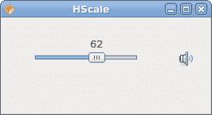
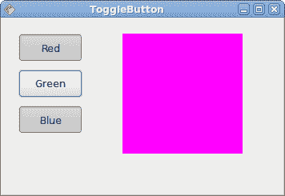
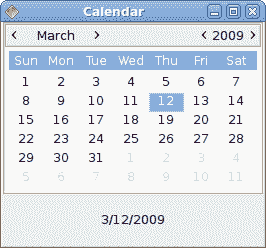

# Java Gnome 中的小部件 II

> 原文： [http://zetcode.com/gui/javagnome/widgetsII/](http://zetcode.com/gui/javagnome/widgetsII/)

在 Java Gnome 编程教程的这一部分中，我们继续介绍小部件。

## `Entry`

`Entry`是单行文本输入字段。 该小部件用于输入文本数据。

`entry.java`

```
package com.zetcode;

import org.gnome.gdk.Event;
import org.gnome.gtk.Editable;
import org.gnome.gtk.Entry;
import org.gnome.gtk.Fixed;
import org.gnome.gtk.Gtk;
import org.gnome.gtk.Label;
import org.gnome.gtk.Widget;
import org.gnome.gtk.Window;
import org.gnome.gtk.WindowPosition;

/**
 * ZetCode Java Gnome tutorial
 *
 * This program shows how to use
 * an Entry widget.
 *
 * @author jan bodnar
 * website zetcode.com
 * last modified March 2009
 */

public class GEntry extends Window {

    private Label label;
    private Entry entry;

    public GEntry() {

        setTitle("Entry");

        initUI();

        connect(new Window.DeleteEvent() {
            public boolean onDeleteEvent(Widget source, Event event) {
                Gtk.mainQuit();
                return false;
            }
        });

        setDefaultSize(250, 200);
        setPosition(WindowPosition.CENTER);
        showAll();
    }

    public void initUI() {

        label = new Label("...");

        entry = new Entry();

        entry.connect(new Entry.Changed() {
            public void onChanged(Editable editable) {
                label.setLabel(entry.getText());
            }
        });

        Fixed fix = new Fixed();
        fix.put(entry, 60, 100);
        fix.put(label, 60, 40);

        add(fix);

    }

    public static void main(String[] args) {
        Gtk.init(args);
        new GEntry();
        Gtk.main();
    }  
}

```

此示例显示了条目小部件和标签。 我们输入的文本将立即显示在标签控件中。

```
entry = new Entry();

```

`Entry`小部件已创建。

```
entry.connect(new Entry.Changed() {
  public void onChanged(Editable editable) {
      label.setLabel(entry.getText());
  }
});

```

如果`Entry`小部件中的文本被更改，我们将调用`onChanged()`方法。 在这种方法中，我们从`Entry`小部件中获取文本并将其设置为标签。


Figure: Entry Widget

## 刻度

`Scale`是一个小部件，可让用户通过在有限间隔内滑动旋钮以图形方式选择一个值。 我们的示例将显示音量控制。

`hscale.java`

```
package com.zetcode;

import java.io.FileNotFoundException;

import org.gnome.gdk.Event;
import org.gnome.gdk.Pixbuf;
import org.gnome.gtk.Fixed;
import org.gnome.gtk.Gtk;
import org.gnome.gtk.HScale;
import org.gnome.gtk.Image;
import org.gnome.gtk.Range;
import org.gnome.gtk.Widget;
import org.gnome.gtk.Window;
import org.gnome.gtk.WindowPosition;

/**
 * Java Gnome tutorial
 *
 * This program shows how to use 
 * the HScale widget. It implements a 
 * volume control.
 *
 * @author jan bodnar
 * website zetcode.com
 * last modified March 2009
 */

public class GHScale extends Window {

    private HScale hscale;
    private Image image;

    private Pixbuf mute;
    private Pixbuf min;
    private Pixbuf med;
    private Pixbuf max;

    public GHScale() {

        setTitle("HScale");

        initUI();

        connect(new Window.DeleteEvent() {
            public boolean onDeleteEvent(Widget source, Event event) {
                Gtk.mainQuit();
                return false;
            }
        });

        setDefaultSize(260, 120);
        setPosition(WindowPosition.CENTER);
        showAll();
    }

    public void initUI() {

        loadImages();

        hscale = new HScale(0, 99, 1);
        hscale.setSizeRequest(130, 45);
        hscale.setCanFocus(false);

        image = new Image("mute.png");

        hscale.connect(new HScale.ValueChanged() {

            public void onValueChanged(Range range) {
                int pos = (int) hscale.getValue();

                if (pos == 0) {
                    image.setImage(mute);
                } else if (pos > 0 && pos <= 30) {
                    image.setImage(min);
                } else if (pos > 30 && pos < 80) {
                    image.setImage(med);
                } else {
                    image.setImage(max);
                }
            }
        });

        Fixed fixed = new Fixed();

        fixed.put(hscale, 40, 20);
        fixed.put(image, 220, 40);

        add(fixed);
    }

    private void loadImages() {
        try {
            mute = new Pixbuf("mute.png");
            min = new Pixbuf("min.png");
            med = new Pixbuf("med.png");
            max = new Pixbuf("max.png");
        } catch (FileNotFoundException e) {
            e.printStackTrace();
        }
    }

    public static void main(String[] args) {      
        Gtk.init(args);
        new GHScale();
        Gtk.main();
    }
}

```

在上面的示例中，我们有`HScale`和`Image`小部件。 通过拖动比例尺，我们可以在`Image`小部件上更改图像。

```
hscale = new HScale(0, 99, 1);

```

`HScale`小部件已创建。 参数是下边界，上边界和阶跃。

```
int pos = (int) hscale.getValue();

```

在`onValueChanged()`方法中，我们获得了比例小部件的值。

```
if (pos == 0) {
    image.setImage(mute);
} else if (pos > 0 && pos <= 30) {
    image.setImage(min);
} else if (pos > 30 && pos < 80) {
    image.setImage(med);
} else {
    image.setImage(max);
}

```

根据获得的值，我们在图像小部件中更改图片。



Figure: HScale Widget

## 切换按钮

`ToggleButton`是具有两种状态的按钮。 已按下但未按下。 通过单击可以在这两种状态之间切换。 在某些情况下此功能非常合适。

`togglebuttons.java`

```
package com.zetcode;

import org.gnome.gdk.Color;
import org.gnome.gdk.Event;
import org.gnome.gtk.DrawingArea;
import org.gnome.gtk.Fixed;
import org.gnome.gtk.Gtk;
import org.gnome.gtk.StateType;
import org.gnome.gtk.ToggleButton;
import org.gnome.gtk.Widget;
import org.gnome.gtk.Window;
import org.gnome.gtk.WindowPosition;

/**
 * ZetCode Java Gnome tutorial
 *
 * This program demonstrates the ToggleButton
 * widget. Three toggle buttons control the
 * color of a drawing area. 
 *
 * @author jan bodnar
 * website zetcode.com
 * last modified March 2009
 */

public class GToggleButton extends Window 
             implements ToggleButton.Toggled {

    private ToggleButton tb1;
    private ToggleButton tb2;
    private ToggleButton tb3;

    private DrawingArea darea;
    private Color color;

    public GToggleButton() {

        setTitle("ToggleButton");

        initUI();

        setPosition(WindowPosition.CENTER);

        setSizeRequest(350, 220);
        showAll();
    }

    public void initUI() {

        color = new Color(0, 0, 0);

        connect(new Window.DeleteEvent() {
            public boolean onDeleteEvent(Widget source, Event event) {
                Gtk.mainQuit();
                return false;
            }
        });

        Fixed fixed = new Fixed();

        tb1 = new ToggleButton("Red");
        tb1.setSizeRequest(80, 35);
        tb1.connect(this);

        tb2 = new ToggleButton("Green");
        tb2.setSizeRequest(80, 35);
        tb2.connect(this);

        tb3 = new ToggleButton("Blue");
        tb3.setSizeRequest(80, 35);
        tb3.connect(this);

        darea = new DrawingArea();
        darea.modifyBackground(StateType.NORMAL, Color.BLACK);
        darea.setSizeRequest(150, 150);

        fixed.put(tb1, 20, 20);
        fixed.put(tb2, 20, 65);
        fixed.put(tb3, 20, 110);

        fixed.put(darea, 150, 20);

        add(fixed);
    }

    public void onToggled(ToggleButton toggleButton) {

        int red = color.getRed();
        int green = color.getGreen();
        int blue = color.getBlue();

        if ("Red".equals(toggleButton.getLabel())) {
            if (toggleButton.getActive()) {
                red = 65535;
            } else {
                red = 0;
            }
        }

        if ("Green".equals(toggleButton.getLabel())) {
            if (toggleButton.getActive()) {
                green = 65535;
            } else {
                green = 0;
            }
        }

        if ("Blue".equals(toggleButton.getLabel())) {
            if (toggleButton.getActive()) {
                blue = 65535;
            } else {
                blue = 0;
            }
        }

        color = new Color(red, green, blue);
        darea.modifyBackground(StateType.NORMAL, color);
    }

    public static void main(String[] args) {

        Gtk.init(args);
        new GToggleButton();
        Gtk.main();
    }
}

```

在我们的示例中，我们显示了三个切换按钮和一个`DrawingArea`。 我们将区域的背景色设置为黑色。 切换按钮将切换颜色值的红色，绿色和蓝色部分。 背景颜色取决于我们按下的切换按钮。

```
color = new Color(0, 0, 0);

```

这是将使用切换按钮更新的颜色值。

```
tb1 = new ToggleButton("Red");
tb1.setSizeRequest(80, 35);
tb1.connect(this);

```

`ToggleButton`小部件已创建。 我们将其尺寸设置为 80x35 像素。 它连接到`onToggled()`方法。

```
darea = new DrawingArea();
darea.modifyBackground(StateType.NORMAL, Color.BLACK);
darea.setSizeRequest(150, 150);

```

`DrawingArea`小部件是显示颜色的小部件，由切换按钮混合。 开始时，它显示为黑色。

```
if ("Red".equals(toggleButton.getLabel())) {
    if (toggleButton.getActive()) {
        red = 65535;
    } else {
        red = 0;
    }
}

```

我们根据红色切换按钮的状态更新颜色的红色部分。

```
color = new Color(red, green, blue);
darea.modifyBackground(StateType.NORMAL, color);

```

颜色值将更新并设置为`DrawingArea`小部件。



Figure: ToggleButton widget

## 日历

我们最终的窗口小部件是`Calendar`小部件。 它用于处理日期。

`calendar.java`

```
package com.zetcode;

import org.gnome.gdk.Event;
import org.gnome.gtk.Calendar;
import org.gnome.gtk.Gtk;
import org.gnome.gtk.Label;
import org.gnome.gtk.VBox;
import org.gnome.gtk.Widget;
import org.gnome.gtk.Window;
import org.gnome.gtk.WindowPosition;

/**
 * ZetCode Java Gnome tutorial 
 *
 * This program demonstrates the Calendar 
 * widget. We show a selected date in a 
 * label widget. 
 *
 * @author jan bodnar
 * website zetcode.com
 * last modified March 2009
 */

public class GCalendar extends Window {

    private Calendar calendar;
    private Label label;

    public GCalendar() {

        setTitle("Calendar");

        initUI();

        connect(new Window.DeleteEvent() {
            public boolean onDeleteEvent(Widget source, Event event) {
                Gtk.mainQuit();
                return false;
            }
        });

        setDefaultSize(260, 120);
        setPosition(WindowPosition.CENTER);
        showAll();    
    }

    private void initUI() {

        VBox vbox = new VBox(false, 1);

        calendar = new Calendar();
        label = new Label(getDate());

        calendar.connect(new Calendar.DaySelected() {

            public void onDaySelected(Calendar calendar) {
                label.setLabel(getDate());
            }
        });

        vbox.add(calendar);

        label.setSizeRequest(-1, 50);
        vbox.add(label);

        add(vbox);
    }

    private String getDate() {
        int year = calendar.getDateYear();
        int month = calendar.getDateMonth();
        int day = calendar.getDateDay();
        String dateLabel = month + "/" + day + "/" + year; 

        return dateLabel;
    }

    public static void main(String[] args) {
        Gtk.init(args);
        new GCalendar();
        Gtk.main();        
    }
}

```

我们有`Calendar`小部件和`Label`。 从日历中选择的日期显示在标签中。

```
calendar = new Calendar();

```

`Calendar`小部件已创建。

```
public void onDaySelected(Calendar calendar) {
    label.setLabel(getDate());
};

```

在`onDaySelected()`方法中，我们将标签更新为当前选择的日期。



Figure: Calendar

在本章中，我们结束了 Java Gnome 中的小部件的讨论。