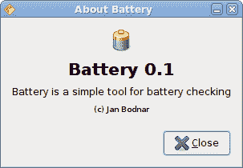

# Java Gnome 中的对话框

> 原文： [http://zetcode.com/gui/javagnome/dialogs/](http://zetcode.com/gui/javagnome/dialogs/)

在 Java Gnome 编程教程的这一部分中，我们将介绍对话框。

对话框窗口或对话框是大多数现代 GUI 应用程序必不可少的部分。 对话被定义为两个或更多人之间的对话。 在计算机应用程序中，对话框是一个窗口，用于与应用程序“对话”。 对话框用于输入数据，修改数据，更改应用程序设置等。对话框是用户与计算机程序之间进行通信的重要手段。

## 消息对话框

消息对话框是方便的对话框，可向应用程序的用户提供消息。 该消息包含文本和图像数据。

`messages.java`

```
package com.zetcode;

import org.gnome.gdk.Event;
import org.gnome.gtk.Button;
import org.gnome.gtk.ButtonsType;
import org.gnome.gtk.Gtk;
import org.gnome.gtk.MessageDialog;
import org.gnome.gtk.MessageType;
import org.gnome.gtk.Table;
import org.gnome.gtk.Widget;
import org.gnome.gtk.Window;
import org.gnome.gtk.WindowPosition;

/**
 * Java Gnome tutorial
 *
 * This program shows four
 * message dialogs.
 *
 * @author jan bodnar
 * website zetcode.com
 * last modified March 2009
 */

public class GMessages extends Window {

    Window parent;

    public GMessages() {

        setTitle("GMessages");

        initUI();

        parent = this;

        connect(new Window.DeleteEvent() {
            public boolean onDeleteEvent(Widget source, Event event) {
                Gtk.mainQuit();
                return false;
            }
        });

        setDefaultSize(250, 100);
        setPosition(WindowPosition.CENTER);
        showAll();
    }

    public void initUI() {

        Table table = new Table(2, 2, true);

        Button info = new Button("Information");
        Button warn = new Button("Warning");
        Button ques = new Button("Question");
        Button erro = new Button("Error");

        info.connect(new Button.Clicked() {

            public void onClicked(Button button) {
                MessageDialog md = new MessageDialog(null, true,
                     MessageType.INFO, 
                    ButtonsType.CLOSE, "Download completed");
                md.setPosition(WindowPosition.CENTER);
                md.run();
                md.hide();
            }
        });

        warn.connect(new Button.Clicked() {

            public void onClicked(Button button) {
                MessageDialog md = new MessageDialog(parent, true,
                    MessageType.WARNING, 
                    ButtonsType.CLOSE, "Unallowed operation");
                md.setPosition(WindowPosition.CENTER);
                md.run();
                md.hide();
            }
        });

        ques.connect(new Button.Clicked() {

            public void onClicked(Button button) {
                MessageDialog md = new MessageDialog(null, true,
                    MessageType.QUESTION, 
                    ButtonsType.CLOSE, "Are you sure to quit?");
                md.setPosition(WindowPosition.CENTER);
                md.run();
                md.hide();
            }
        });

        erro.connect(new Button.Clicked() {
            public void onClicked(Button button) {
                MessageDialog md = new MessageDialog (null, true, 
                    MessageType.ERROR, 
                    ButtonsType.CLOSE, "Error loading file");
                md.setPosition(WindowPosition.CENTER);
                md.run();
                md.hide();
            }            
         });

        table.attach(info, 0, 1, 0, 1);
        table.attach(warn, 1, 2, 0, 1);
        table.attach(ques, 0, 1, 1, 2);
        table.attach(erro, 1, 2, 1, 2);

        add(table);
    }

    public static void main(String[] args) {
        Gtk.init(args);
        new GMessages();
        Gtk.main();
    }
}

```

在我们的示例中，我们将显示四种消息对话框。 信息，警告，问题和错误消息对话框。

```
Button info = new Button("Information");
Button warn = new Button("Warning");
Button ques = new Button("Question");
Button erro = new Button("Error");

```

我们有四个按钮。 这些按钮中的每个按钮都会显示不同类型的消息对话框。

```
info.connect(new Button.Clicked() {

    public void onClicked(Button button) {
    MessageDialog md = new MessageDialog(null, true,
      MessageType.INFO, 
        ButtonsType.CLOSE, "Download completed");
    md.setPosition(WindowPosition.CENTER);
    md.run();
    md.hide();
    }
});

```

如果单击信息按钮，将显示“信息”对话框。 `MessageType.INFO`指定对话框的类型。 `ButtonsType.CLOSE`指定要在对话框中显示的按钮。 最后一个参数是已分发的消息。 该对话框使用`run()`方法显示。 `hide()`方法隐藏对话框。


## `AboutDialog`

`AboutDialog`显示有关应用程序的信息。 `AboutDialog`可以显示徽标，应用程序名称，版本，版权或许可信息。 也可以给作者或翻译者以荣誉。

`aboutdialog.java`

```
package com.zetcode;

import java.io.FileNotFoundException;

import org.gnome.gdk.Event;
import org.gnome.gdk.Pixbuf;
import org.gnome.gtk.AboutDialog;
import org.gnome.gtk.Button;
import org.gnome.gtk.Fixed;
import org.gnome.gtk.Gtk;
import org.gnome.gtk.Widget;
import org.gnome.gtk.Window;
import org.gnome.gtk.WindowPosition;

public class GAboutDialog extends Window implements Button.Clicked {

    Pixbuf logo;

    public GAboutDialog() {

        setTitle("AboutDialog");

        initUI();

        connect(new Window.DeleteEvent() {
            public boolean onDeleteEvent(Widget source, Event event) {
                Gtk.mainQuit();
                return false;
            }
        });

        setDefaultSize(250, 200);
        setPosition(WindowPosition.CENTER);
        showAll();
    }

    public void initUI() {

        try {
            logo = new Pixbuf("battery.png");
        } catch (FileNotFoundException e) {
            e.printStackTrace();
        }

        Button button = new Button("About");
        button.connect(this);

        Fixed fix = new Fixed();
        fix.put(button, 20, 20);
        add(fix);

    }

    public void onClicked(Button button) {
        AboutDialog about = new AboutDialog();
        about.setProgramName("Battery");
        about.setVersion("0.1");
        about.setCopyright("(c) Jan Bodnar");
        about.setComments("Battery is a simple tool for battery checking");
        about.setLogo(logo);
        about.setPosition(WindowPosition.CENTER);
        about.run();
        about.hide();
    }

    public static void main(String[] args) {
        Gtk.init(args);
        new GAboutDialog();
        Gtk.main();
    }
}

```

该代码示例使用具有某些功能的`AboutDialog`。

```
AboutDialog about = new AboutDialog();

```

我们创建一个`AboutDialog`。

```
about.setProgramName("Battery");
about.setVersion("0.1");
about.setCopyright("(c) Jan Bodnar");

```

我们设置名称，版本和版权。

```
about.setLogo(logo);

```

此行创建徽标。



Figure: AboutDialog

在 Java Gnome 教程的这一部分中，我们介绍了对话框。