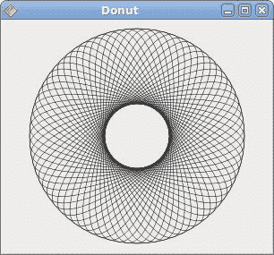
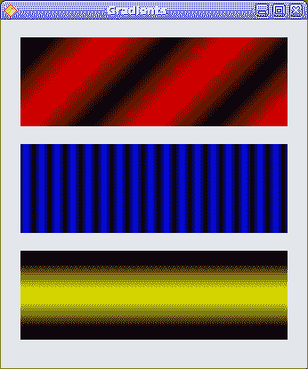
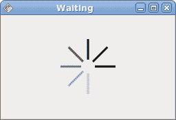

# Cario 绘图 II

> 原文： [http://zetcode.com/gui/javagnome/drawingII/](http://zetcode.com/gui/javagnome/drawingII/)

在 Java Gnome 编程教程的这一部分中，我们将继续使用 Cairo 库进行绘制。

## 甜甜圈

在下面的示例中，我们通过旋转一堆椭圆来创建复杂的形状。

`donut.java`

```
package com.zetcode;

import org.freedesktop.cairo.Context;
import org.freedesktop.cairo.Matrix;

import org.gnome.gdk.Event;
import org.gnome.gdk.EventExpose;
import org.gnome.gtk.DrawingArea;
import org.gnome.gtk.Gtk;
import org.gnome.gtk.Widget;
import org.gnome.gtk.Window;
import org.gnome.gtk.WindowPosition;

/**
 * ZetCode Java Gnome tutorial
 *
 * This program draws a Donut
 * shape on the drawing area.
 *
 * @author jan bodnar
 * website zetcode.com
 * last modified March 2009
 */

public class GDonut extends Window
            implements Widget.ExposeEvent {

    public GDonut()  {

        setTitle("Donut");

        initUI();

        connect(new Window.DeleteEvent() {
            public boolean onDeleteEvent(Widget source, Event event) {
                Gtk.mainQuit();
                return false;
            }
        });

        setDefaultSize(300, 260);
        setPosition(WindowPosition.CENTER);
        showAll();
    }

    public void initUI() {
        DrawingArea darea = new DrawingArea();
        darea.connect(this);
        add(darea);
    }

    public boolean onExposeEvent(Widget widget, EventExpose eventExpose) {
        final Context cr;

        cr = new Context(widget.getWindow());    
        drawDonut(cr);

        return false;
    }

    public void drawDonut(Context cr) {
        int width = this.getWindow().getWidth();
        int height = this.getWindow().getHeight();

        cr.setLineWidth(0.5);
        cr.translate(width/2, height/2);
        cr.arc( 0, 0, 120, 0, 2 * Math.PI);
        cr.stroke();
        cr.save();

        for ( int i = 0; i < 36; i++) {
            Matrix mat = new Matrix();
            mat.rotate(i*Math.PI/36);
            mat.scale(0.3, 1);
            cr.transform(mat);
            cr.arc(0, 0, 120, 0, 2 * Math.PI);
            cr.restore();
            cr.stroke();
            cr.save();
        }
    }

    public static void main(String[] args)  {
        Gtk.init(args);
        new GDonut();
        Gtk.main();
    }
}

```

在此示例中，我们创建一个甜甜圈。 形状类似于 Cookie，因此得名“甜甜圈”。

```
cr.translate(width/2, height/2);
cr.arc( 0, 0, 120, 0, 2 * Math.PI);
cr.stroke();

```

刚开始时有一个椭圆。

```
Matrix mat = new Matrix();
mat.rotate(i*Math.PI/36);
mat.scale(0.3, 1);
cr.transform(mat);
cr.arc(0, 0, 120, 0, 2 * Math.PI);
cr.restore();
cr.stroke();
cr.save();

```

旋转几圈后，有一个甜甜圈。



Figure: Donut

## 渐变色

在计算机图形学中，渐变是从浅到深或从一种颜色到另一种颜色的阴影的平滑混合。 在 2D 绘图程序和绘画程序中，渐变用于创建彩色背景和特殊效果以及模拟灯光和阴影。 （answers.com）

`gradients.java`

```
package com.zetcode;

import org.freedesktop.cairo.Context;

import org.freedesktop.cairo.LinearPattern;

import org.gnome.gdk.Color;
import org.gnome.gdk.EventExpose;
import org.gnome.gtk.DrawingArea;
import org.gnome.gtk.Gtk;
import org.gnome.gtk.Widget;
import org.gnome.gtk.Window;
import org.gnome.gtk.WindowPosition;

/**
 * ZetCode Java Gnome tutorial
 *
 * This program draws gradients.
 *
 * @author jan bodnar
 * website zetcode.com
 * last modified March 2009
 */

public class GGradients extends Window implements Widget.ExposeEvent {

    public GGradients() {

        setTitle("Gradients");

        initUI();

        connect(new Window.DeleteEvent() {
            public boolean onDeleteEvent(Widget source, Event event) {
                Gtk.mainQuit();
                return false;
            }
        });

        setDefaultSize(340, 390);
        setPosition(WindowPosition.CENTER);
        showAll();
    } 

    public void initUI() {
        DrawingArea darea = new DrawingArea();
        darea.connect(this);
        add(darea);        
    }

    public boolean onExposeEvent(Widget widget, EventExpose eventExpose) {
        final Context cr;

        cr = new Context(widget.getWindow());    
        drawGradients(cr);

        return false;
    }

    public void drawGradients(Context cr) {

        LinearPattern lg1 = new LinearPattern(0.0, 0.0, 350.0, 350.0);

        int count = 1;

        for (double j=0.1; j<1.0; j+= 0.1) {
            if (count % 2 != 0) {
                lg1.addColorStopRGB(j, 0, 0, 0);
            } else {
                lg1.addColorStopRGB(j, 1, 0, 0);
            }
        count++;
        }

        cr.rectangle(20, 20, 300, 100);
        cr.setSource(lg1);
        cr.fill();

        LinearPattern lg2 = new LinearPattern(0.0, 0.0, 350.0, 0);

        count = 1;

        for (double i=0.05; i<0.95; i+= 0.025) {
            if (count % 2 != 0) {
                lg2.addColorStopRGB(i, 0, 0, 0);
            } else {
                lg2.addColorStopRGB(i, 0, 0, 1);
            }
        count++;
        }

        cr.rectangle(20, 140, 300, 100);
        cr.setSource(lg2);
        cr.fill();

        LinearPattern lg3 = new LinearPattern(20.0, 260.0,  20.0, 360.0);

        lg3.addColorStopRGB(0.1, 0, 0, 0 );
        lg3.addColorStopRGB(0.5, 1, 1, 0);
        lg3.addColorStopRGB(0.9, 0, 0, 0 );

        cr.rectangle(20, 260, 300, 100);
        cr.setSource(lg3);
        cr.fill();
    }

    public static void main(String[] args) {
        Gtk.init(args);
        new GGradients();
        Gtk.main();
    }
}

```

在我们的示例中，我们绘制了三个具有三个不同渐变的矩形。

```
LinearPattern lg1 = new LinearPattern(0.0, 0.0, 350.0, 350.0);

```

在这里，我们创建一个线性渐变图案。 参数指定直线，沿着该直线绘制渐变。 在我们的情况下，它是一条对角线。

```
LinearPattern lg3 = new LinearPattern(20.0, 260.0,  20.0, 360.0);        
lg3.addColorStopRGB(0.1, 0, 0, 0 );
lg3.addColorStopRGB(0.5, 1, 1, 0);
lg3.addColorStopRGB(0.9, 0, 0, 0 );

```

我们定义色标以产生渐变图案。 在这种情况下，渐变是黑色和黄色的混合。 通过添加两个黑色和一个黄色色标，我们创建了一个水平渐变图案。 这些停止实际上是什么意思？ 在我们的情况下，我们从黑色开始，该颜色将以尺寸的 1/10 停止。 然后，我们开始逐渐涂成黄色，最终达到形状的中心。 黄色停在大小的 9/10，我们再次开始用黑色绘画，直到结束。



Figure: Gradients

## 星形

在下面的示例中，我们创建了一颗移动的星星。星星移动，旋转并成长/收缩。

`star.java`

```
package com.zetcode;

import java.util.Timer;
import java.util.TimerTask;

import org.freedesktop.cairo.Context;
import org.freedesktop.cairo.Matrix;

import org.gnome.gdk.Event;
import org.gnome.gdk.EventExpose;
import org.gnome.gtk.DrawingArea;
import org.gnome.gtk.Gtk;
import org.gnome.gtk.Widget;
import org.gnome.gtk.Window;
import org.gnome.gtk.WindowPosition;

/**
 * ZetCode Java Gnome tutorial
 *
 * This program shows an animated star. Rotate, 
 * translate and scale operations are 
 * applied on the star.
 *
 * @author jan bodnar
 * website zetcode.com
 * last modified March 2009
 */

public class GStar extends Window
            implements Widget.ExposeEvent {

    private static Timer timer;
    private int count;

    private double angle = 0;
    private double scale = 1;
    private double delta = 0.01;

    double points[][] = { 
        { 0, 85 }, { 75, 75 }, { 100, 10 }, { 125, 75 }, 
        { 200, 85 }, { 150, 125 }, { 160, 190 }, { 100, 150 }, 
        { 40, 190 }, { 50, 125 }, { 0, 85 } 
    };

    public GStar() {

        setTitle("Star");

        timer = new Timer();
        timer.scheduleAtFixedRate(new ScheduleTask(), 100, 20);
        count = 0;

        initUI();

        connect(new Window.DeleteEvent() {
            public boolean onDeleteEvent(Widget source, Event event) {
                timer.cancel();
                Gtk.mainQuit();
                return false;
            }
        });

        setSizeRequest(350, 250);
        setPosition(WindowPosition.CENTER);
        showAll();
    }

    public void initUI() {
        DrawingArea darea = new DrawingArea();
        darea.connect(this);
        add(darea);
    }

    public void drawStar(Context cr) {

        int width = this.getWindow().getWidth();
        int height = this.getWindow().getHeight();

        cr.setSource(0, 0.44, 0.7);
        cr.setLineWidth(1);

        Matrix mat = new Matrix();

        mat.translate(width/2, height/2);
        mat.rotate(angle);
        mat.scale(scale, scale);
        cr.transform(mat);

        for ( int i = 0; i < 10; i++ ) {
            cr.lineTo(points[i][0], points[i][1]);
        }

        cr.fill();
        cr.stroke();

        if ( scale < 0.01 ) {
            delta = -delta;
        } else if (scale > 0.99) {
            delta = -delta;
        }

        scale += delta;
        angle += 0.01;
    }

    public boolean onExposeEvent(Widget widget, EventExpose eventExpose) {

        Context cr = new Context(widget.getWindow());
        drawStar(cr);

        return false;
    }

    class ScheduleTask extends TimerTask {

        public void run() {
             count++;
             queueDraw();
        }
    } 

    public static void main(String[] args)  {
        Gtk.init(args);
        new GStar();
        Gtk.main();
    }
}

```

我们对星形应用平移，缩放和旋转操作。

```
public boolean onDeleteEvent(Widget source, Event event) {
    timer.cancel();
    Gtk.mainQuit();
    return false;
 }

```

为了干净出口，我们一定不要忘记停止计时器。 `Timer`是 Java util 库的对象，并且不被`Gtk.mainQuit()`方法停止。

```
double points[][] = { 
    { 0, 85 }, { 75, 75 }, { 100, 10 }, { 125, 75 }, 
    { 200, 85 }, { 150, 125 }, { 160, 190 }, { 100, 150 }, 
    { 40, 190 }, { 50, 125 }, { 0, 85 } 
};

```

这些点用于构建星形。

```
Matrix mat = new Matrix();

mat.translate(width/2, height/2);
mat.rotate(angle);
mat.scale(scale, scale);
cr.transform(mat);

```

在这里，我们对星形应用平移，旋转和缩放操作。

```
for ( int i = 0; i < 10; i++ ) {
    cr.lineTo(points[i][0], points[i][1]);
}

```

在这里，我们画星星。

## 等待

在此示例中，我们使用透明效果创建一个等待演示。 我们将绘制 8 条线，这些线将逐渐消失，从而产生一条线在移动的错觉。 这种效果通常用于通知用户，一项艰巨的任务正在幕后进行。 一个示例是通过互联网流式传输视频。

`waiting.java`

```
package com.zetcode;

import java.util.Timer;
import java.util.TimerTask;

import org.freedesktop.cairo.Context;

import org.gnome.gdk.Event;
import org.gnome.gdk.EventExpose;
import org.gnome.gtk.DrawingArea;
import org.gnome.gtk.Gtk;
import org.gnome.gtk.Widget;
import org.gnome.gtk.Window;
import org.gnome.gtk.WindowPosition;

/**
 * ZetCode Java Gnome tutorial
 *
 * This program creates a waiting
 * effect. 
 *
 * @author jan bodnar
 * website zetcode.com
 * last modified March 2009
 */

public class GWaiting extends Window 
            implements Widget.ExposeEvent {

    private static Timer timer;
    private int count;

    private final double[][] trs = {
        { 0.0, 0.15, 0.30, 0.5, 0.65, 0.80, 0.9, 1.0 },
        { 1.0, 0.0,  0.15, 0.30, 0.5, 0.65, 0.8, 0.9 },
        { 0.9, 1.0,  0.0,  0.15, 0.3, 0.5, 0.65, 0.8 },
        { 0.8, 0.9,  1.0,  0.0,  0.15, 0.3, 0.5, 0.65 },
        { 0.65, 0.8, 0.9,  1.0,  0.0,  0.15, 0.3, 0.5 },
        { 0.5, 0.65, 0.8, 0.9, 1.0,  0.0,  0.15, 0.3 },
        { 0.3, 0.5, 0.65, 0.8, 0.9, 1.0,  0.0,  0.15 },
        { 0.15, 0.3, 0.5, 0.65, 0.8, 0.9, 1.0,  0.0, }
    };

    public GWaiting() {
        setPosition(WindowPosition.CENTER);

        timer = new Timer();
        timer.scheduleAtFixedRate(new ScheduleTask(), 100, 80);
        count = 0;

        initUI();

        connect(new Window.DeleteEvent() {
            public boolean onDeleteEvent(Widget source, Event event) {
                timer.cancel();
                Gtk.mainQuit();
                return false;
            }
        });

        resize(250, 150);
        setTitle("Waiting");
        showAll();
    }

    public void initUI() {
        DrawingArea darea = new DrawingArea();
        add(darea);
        darea.connect(this);
    }

    public boolean onExposeEvent(Widget widget, EventExpose eventExpose) {

        Context cr = new Context(widget.getWindow());
        drawWaiting(cr);

        return false;
    }

    private void drawWaiting(Context cr) {
        int w = this.getWidth();
        int h = this.getHeight();

        cr.translate(w/2, h/2);

        for (int i = 0; i < 8; i++) {

            cr.setLineWidth(3);
            cr.setSource(0, 0, 0, trs[count%8][i]);

            cr.moveTo(0, -10);
            cr.lineTo(0, -40);
            cr.rotate(Math.PI/4f);
            cr.stroke();
        }
    }

    class ScheduleTask extends TimerTask {

        public void run() {
              count++;
              queueDraw();
        }
    } 

    public static void main(String[] args)  {
        Gtk.init(args);
        new GWaiting();
        Gtk.main();
    }
}

```

我们用八个不同的 alpha 值绘制八条线。

```
private final double[][] trs = {
    { 0.0, 0.15, 0.30, 0.5, 0.65, 0.80, 0.9, 1.0 },
    ....
};

```

这是此演示中使用的透明度值的二维数组。 有 8 行，每行一种状态。 8 行中的每行将连续使用这些值。

```
cr.setLineWidth(3);

```

我们使线条更粗一些，以便更好地显示它们。

```
cr.setSource(0, 0, 0, trs[count%8][i]);

```

在这里，我们定义了一条线的透明度值。

```
cr.moveTo(0, -10);
cr.lineTo(0, -40);
cr.rotate(Math.PI/4f); 
cr.stroke();

```

这些代码行将绘制八行中的每行。



Figure: Waiting

在 Java Gnome 编程库的这一章中，我们使用 Cairo 库进行了一些更高级的绘制。