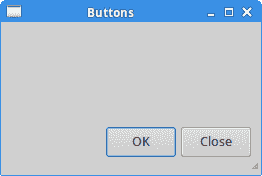
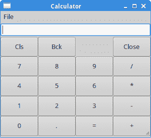
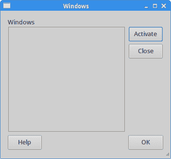

# Ruby GTK 中的布局管理

> 原文： [http://zetcode.com/gui/rubygtk/layoutmanagement/](http://zetcode.com/gui/rubygtk/layoutmanagement/)

在本章中，我们将展示如何在窗口或对话框上布置窗口小部件。

在设计应用程序的 GUI 时，我们决定使用哪些小部件以及如何在应用程序中组织这些小部件。 为了组织窗口小部件，我们使用称为布局容器的专用非可见窗口小部件。 在本章中，我们提到`Gtk::Alignment`，`Gtk::Fixed`，`Gtk::VBox`和`Gtk::Grid`。

## Gtk ::修复

`Gtk::Fixed`容器将子窗口小部件放置在固定位置并具有固定大小。 此容器不执行自动布局管理。 在大多数应用程序中，我们不使用此容器。 我们在某些特定领域使用它，例如游戏，使用图表的应用程序，可以移动的可调整大小的组件（例如电子表格应用程序中的图表），小型教育示例。

```
#!/usr/bin/ruby

'''
ZetCode Ruby GTK tutorial

In this program, we lay out widgets
using absolute positioning.

Author: Jan Bodnar
Website: www.zetcode.com
Last modified: May 2014
'''

require 'gtk3'

class RubyApp < Gtk::Window

    def initialize
        super

        init_ui
    end

    def init_ui

        override_background_color :normal, Gdk::RGBA::new(0.2, 0.2, 0.2, 1)

        begin       
            bardejov = Gdk::Pixbuf.new :file => "bardejov.jpg"
            rotunda = Gdk::Pixbuf.new :file => "rotunda.jpg"
            mincol = Gdk::Pixbuf.new :file => "mincol.jpg"
        rescue IOError => e
            puts e
            puts "cannot load images"
            exit
        end

        image1 = Gtk::Image.new :pixbuf => bardejov 
        image2 = Gtk::Image.new :pixbuf => rotunda 
        image3 = Gtk::Image.new :pixbuf => mincol 

        fixed = Gtk::Fixed.new

        fixed.put image1, 20, 20
        fixed.put image2, 40, 160
        fixed.put image3, 170, 50

        add fixed

        set_title "Fixed"
        signal_connect "destroy" do 
            Gtk.main_quit 
        end        

        set_default_size 300, 280
        window_position = :center

        show_all        
    end
end

Gtk.init
    window = RubyApp.new
Gtk.main

```

在我们的示例中，我们在窗口上显示了三个小图像。 我们明确指定放置这些图像的 x，y 坐标。

```
override_background_color :normal, Gdk::RGBA::new(0.2, 0.2, 0.2, 1)

```

为了获得更好的视觉体验，我们将背景色更改为深灰色。

```
bardejov = Gdk::Pixbuf.new :file => "bardejov.jpg"

```

我们将图像从磁盘加载到`Gtk::Pixbuf`对象。

```
image1 = Gtk::Image.new :pixbuf => bardejov 
image2 = Gtk::Image.new :pixbuf => rotunda 
image3 = Gtk::Image.new :pixbuf => mincol 

```

`Gtk::Image`是用于显示图像的小部件。 它在构造函数中使用一个`Gdk::Pixbuf`对象。

```
fixed = Gtk::Fixed.new

```

我们创建`Gtk::Fixed`容器。

```
fixed.put image1, 20, 20

```

我们将第一个图像放置在 x = 20，y = 20 坐标处。

```
add fixed

```

最后，我们将`Gtk::Fixed`容器添加到窗口中。


Figure: Gtk::Fixed

## 纽扣

`Gtk::Alignment`容器控制其子窗口小部件的对齐方式和大小。

```
#!/usr/bin/ruby

'''
ZetCode Ruby GTK tutorial

In this program, we position two buttons
in the bottom right corner of the window.
We use horizontal and vertical boxes.

Author: Jan Bodnar
Website: www.zetcode.com
Last modified: May 2014
'''

require 'gtk3'

class RubyApp < Gtk::Window

    def initialize
        super

        init_ui
    end

    def init_ui

        set_border_width 10

        vbox = Gtk::Box.new :vertical, 0
        hbox = Gtk::Box.new :horizontal, 5

        e_space = Gtk::Alignment.new 0, 0, 0, 0
        vbox.pack_start e_space, :expand => true

        ok_btn = Gtk::Button.new :label => "OK"
        ok_btn.set_size_request 70, 30
        close_btn = Gtk::Button.new :label => "Close"
        close_btn.set_size_request 70, 30

        hbox.add ok_btn
        hbox.add close_btn 

        halign = Gtk::Alignment.new 1, 0, 0, 0
        halign.add hbox

        vbox.pack_start halign, :expand => false, 
            :fill => false, :padding => 5

        add vbox

        set_title "Buttons"
        signal_connect "destroy" do 
            Gtk.main_quit 
        end        

        set_default_size 260, 150
        set_window_position :center

        show_all        
    end
end

Gtk.init
    window = RubyApp.new
Gtk.main

```

在代码示例中，我们在窗口的右下角放置了两个按钮。 为此，我们使用一个水平框，一个垂直框和两个对齐容器。

```
set_border_width 10

```

`set_border_width`在`Gtk::Window`容器窗口小部件的边框周围设置了一些空白。 对于我们的示例来说很重要，因为关闭按钮不会太靠近窗口的右边缘。

```
vbox = Gtk::Box.new :vertical, 0
hbox = Gtk::Box.new :horizontal, 5

```

将创建一个垂直和水平框。 垂直框用作我们窗口的基础容器。 垂直框中放置有空白空间和包含两个按钮小部件的水平框。

```
e_space = Gtk::Alignment.new 0, 0, 0, 0
vbox.pack_start e_space, :expand => true

```

`Gtk::Alignment`小部件用作空白填充符。 它将按钮推到窗口底部。 `:expand`参数将导致`Gtk::Alignment`小部件消耗分配给垂直框的所有额外空间。

```
hbox = Gtk::Box.new :horizontal, 5
...
ok_btn = Gtk::Button.new :label => "OK"
ok_btn.set_size_request 70, 30
close_btn = Gtk::Button.new :label => "Close"
close_btn.set_size_request 70, 30

hbox.add ok_btn
hbox.add close_btn         

```

我们创建一个水平框，并在其中放置两个按钮。 `Gtk::Box`的第二个参数是子级之间的间距量。

```
halign = Gtk::Alignment.new 1, 0, 0, 0
halign.add hbox

vbox.pack_start halign, :expand => false, 
    :fill => false, :padding => 5

```

这将创建一个对齐容器，它将其子窗口小部件放在右侧。 `Gtk::Alignment`容器的第一个参数是水平对齐方式。 值为 1 会将其子项（包含两个按钮的水平框）向右推。 对齐容器仅需要一个子窗口小部件-我们必须使用水平框。



Figure: Buttons

## 计算器骨架

本示例借助`Gtk::Box`和`Gtk::Grid`小部件创建计算器的骨架。

```
#!/usr/bin/ruby

'''
ZetCode Ruby GTK tutorial

In this program we create a skeleton of
a calculator. We use a Gtk::Grid widget
and a vertical Gtk::Box.

Author: Jan Bodnar
Website: www.zetcode.com
Last modified: May 2014
'''

require 'gtk3'

class RubyApp < Gtk::Window

    def initialize
        super

        init_ui
    end

    def init_ui

        vbox = Gtk::Box.new :vertical, 2

        mb = Gtk::MenuBar.new
        filemenu = Gtk::Menu.new
        file = Gtk::MenuItem.new "File"
        file.set_submenu filemenu
        mb.append file

        vbox.pack_start mb, :expand => false, :fill => false, 
            :padding => 0

        vbox.pack_start Gtk::Entry.new, :expand => false, 
            :fill => false, :padding => 0            

        grid = Gtk::Grid.new
        grid.set_property "row-homogeneous", true
        grid.set_property "column-homogeneous", true

        grid.attach Gtk::Button.new(:label => "Cls"), 0, 0, 1, 1
        grid.attach Gtk::Button.new(:label => "Bck"), 1, 0, 1, 1
        grid.attach Gtk::Label.new, 2, 0, 1, 1
        grid.attach Gtk::Button.new(:label => "Close"), 3, 0, 1, 1

        grid.attach Gtk::Button.new(:label => "7"), 0, 1, 1, 1
        grid.attach Gtk::Button.new(:label => "8"), 1, 1, 1, 1
        grid.attach Gtk::Button.new(:label => "9"), 2, 1, 1, 1
        grid.attach Gtk::Button.new(:label => "/"), 3, 1, 1, 1

        grid.attach Gtk::Button.new(:label => "4"), 0, 2, 1, 1
        grid.attach Gtk::Button.new(:label => "5"), 1, 2, 1, 1
        grid.attach Gtk::Button.new(:label => "6"), 2, 2, 1, 1
        grid.attach Gtk::Button.new(:label => "*"), 3, 2, 1, 1

        grid.attach Gtk::Button.new(:label => "1"), 0, 3, 1, 1
        grid.attach Gtk::Button.new(:label => "2"), 1, 3, 1, 1
        grid.attach Gtk::Button.new(:label => "3"), 2, 3, 1, 1
        grid.attach Gtk::Button.new(:label => "-"), 3, 3, 1, 1

        grid.attach Gtk::Button.new(:label => "0"), 0, 4, 1, 1
        grid.attach Gtk::Button.new(:label => "."), 1, 4, 1, 1
        grid.attach Gtk::Button.new(:label => "="), 2, 4, 1, 1
        grid.attach Gtk::Button.new(:label => "+"), 3, 4, 1, 1

        vbox.pack_start grid, :expand => true, :fill => true, 
            :padding => 0

        add vbox

        set_title "Calculator"
        signal_connect "destroy" do 
            Gtk.main_quit 
        end        

        set_default_size 300, 250
        set_window_position :center

        show_all        
    end
end

Gtk.init
    window = RubyApp.new
Gtk.main

```

`Gtk::Grid`小部件按行和列排列小部件。

```
vbox = Gtk::Box.new :vertical, 2

```

`Gtk::Box`用作我们应用程序的基础容器。 框的方向是垂直的，其子框（菜单栏，条目和网格小部件）之间有 2px 的间距。 由于它是一个垂直框，因此该空间垂直放置在小部件之间。

```
mb = Gtk::MenuBar.new
filemenu = Gtk::Menu.new
file = Gtk::MenuItem.new "File"
file.set_submenu filemenu
mb.append file

vbox.pack_start mb, :expand => false, :fill => false, 
    :padding => 0

```

创建带有一个菜单的`Gtk::MenuBar`。 它放置在垂直框内。

```
vbox.pack_start Gtk::Entry.new, :expand => false, 
    :fill => false, :padding => 0    

```

`Gtk::Entry`放置在菜单栏下方。 我们将`:expand`参数设置为`false`，因为我们不想垂直扩展条目窗口小部件。 放在垂直框中的小部件从左向右拉伸。 如果要更改此设置，则需要一个附加的水平框。

```
grid = Gtk::Grid.new

```

`Gtk::Grid`容器已创建。

```
grid.set_property "row-homogeneous", true
grid.set_property "column-homogeneous", true

```

我们将行和列的均质属性设置为 true。 这将导致所有子项具有相同的大小。

```
grid.attach Gtk::Button.new(:label => "Cls"), 0, 0, 1, 1

```

我们在网格容器的左上角单元格上附加一个按钮。 前两个参数是列索引和行索引。 最后两个参数是列跨度和行跨度。 网格内的所有小部件都占用一个单元格。

```
vbox.pack_start grid, :expand => true, :fill => true, 
    :padding => 0

```

我们将网格小部件打包到垂直框中。 `:expand`和`:fill`选项的组合将使网格小部件及其子级占据窗口区域的大部分。

```
add vbox

```

垂直框放置在`Gtk::Window`容器内。



Figure: Calculator skeleton

## 视窗

在最后一个示例中，我们将使用`Gtk::Grid`容器。 此容器将其子级放置到单元格中，这些单元格由行和列的交点界定。 网格容器的`attach`方法采用五个参数。 第一个参数是附加的子窗口小部件。 接下来的两个参数是放置子项的行和列索引。 最后两个参数是行跨度和列跨度。

```
#!/usr/bin/ruby

'''
ZetCode Ruby GTK tutorial

This is a more complicated layout example.
We use Gtk::Alignment, Gtk::Box, and Gtk::Grid widgets.

Author: Jan Bodnar
Website: www.zetcode.com
Last modified: May 2014
'''

require 'gtk3'

class RubyApp < Gtk::Window

    def initialize
        super

        init_ui
    end

    def init_ui

        set_border_width 15

        grid = Gtk::Grid.new 
        grid.set_column_spacing 5
        grid.set_row_spacing 5

        title = Gtk::Label.new "Windows"

        align1 = Gtk::Alignment.new 0, 0, 0, 0
        align1.add title

        grid.attach align1, 0, 0, 1, 1 

        frame = Gtk::Frame.new
        frame.set_hexpand true
        frame.set_vexpand true
        grid.attach frame, 0, 1, 3, 3

        vbox = Gtk::Box.new :vertical, 4
        act_btn = Gtk::Button.new :label => "Activate"
        act_btn.set_size_request 70, 30

        close_btn = Gtk::Button.new :label => "Close"
        close_btn.set_size_request 70, 30

        vbox.add act_btn
        vbox.add close_btn
        grid.attach vbox, 3, 1, 1, 1

        help_btn = Gtk::Button.new :label => "Help"
        help_btn.set_size_request 70, 30
        align2 = Gtk::Alignment.new 0, 0, 0, 0
        align2.add help_btn        
        grid.attach align2, 0, 4, 1, 1

        ok_btn = Gtk::Button.new :label => "OK" 
        ok_btn.set_size_request 70, 30
        grid.attach ok_btn, 3, 4, 1, 1

        add grid

        set_title "Windows"
        signal_connect "destroy" do 
            Gtk.main_quit 
        end

        set_default_size 350, 300
        set_window_position :center

        show_all        
    end
end

Gtk.init
    window = RubyApp.new
Gtk.main

```

该代码在 Ruby GTK 中创建了一个真实世界的窗口。

```
grid = Gtk::Grid.new 
grid.set_column_spacing 5
grid.set_row_spacing 5

```

创建`Gtk::Grid`容器的实例。 该容器将小部件打包为行和列。 我们在行和列之间设置一些空间。

```
title = Gtk::Label.new "Windows"

align1 = Gtk::Alignment.new 0, 0, 0, 0
align1.add title

grid.attach align1, 0, 0, 1, 1 

```

我们创建一个标签小部件。 将此小部件放置在`Gtk::Alignment`小部件中，以便使其与标签上的空格左侧对齐。 网格容器的`attach`方法将标签放入其左上角的单元格中。 标签将占据一个单元格。

```
frame = Gtk::Frame.new
frame.set_hexpand true
frame.set_vexpand true
grid.attach frame, 0, 1, 3, 3

```

框架小部件位于 column = 0 和 row = 1 处。 它跨越三行和树列。 `set_hexpand`和`set_vexpand`方法将窗口小部件设置为占用任何可用的额外水平和垂直空间。 当窗口增长时，框架小部件也增长； 其他小部件保留其大小。

```
vbox = Gtk::Box.new :vertical, 4
act_btn = Gtk::Button.new :label => "Activate"
act_btn.set_size_request 70, 30

close_btn = Gtk::Button.new :label => "Close"
close_btn.set_size_request 70, 30

vbox.add act_btn
vbox.add close_btn
grid.attach vbox, 3, 1, 1, 1

```

创建两个按钮并将其放置在垂直框中。 “到”框位于框架小部件旁边。

```
help_btn = Gtk::Button.new :label => "Help"
help_btn.set_size_request 70, 30
align2 = Gtk::Alignment.new 0, 0, 0, 0
align2.add help_btn        
grid.attach align2, 0, 4, 1, 1

```

帮助按钮位于对齐容器内部，该对齐按钮将其对齐到网格容器旁边放置的单元格的左侧。 较早的`set_hexpand`方法调用使框架窗口小部件可扩展； 它还会影响框架窗口小部件占用的列中的窗口小部件。 因此，我们需要使用`Gtk::Alignment`小部件来保持按钮的大小不变，并将其向左对齐。



Figure: Windows

在 Ruby GTK 教程的这一部分中，我们提到了小部件的布局管理。