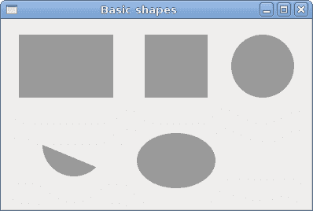
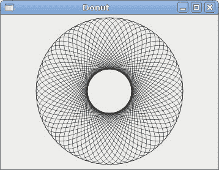
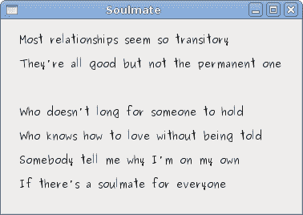

# 在 Ruby GTK 中与开罗一起绘画

> 原文： [http://zetcode.com/gui/rubygtk/cairo/](http://zetcode.com/gui/rubygtk/cairo/)

在 Ruby GTK 教程的这一部分中，我们将使用 Cairo 库进行一些绘画。

Cairo 是用于创建 2D 矢量图形的库。 我们可以使用它来绘制自己的小部件，图表或各种效果和动画。

## 色彩

在第一个示例中，我们将处理颜色。 颜色是代表红色，绿色和蓝色（RGB）强度值的组合的对象。 开罗有效 RGB 值在 0 到 1 的范围内。

```
#!/usr/bin/ruby

'''
ZetCode Ruby GTK tutorial

This program draws tree rectangles filled
with different colours.

Author: Jan Bodnar
Website: www.zetcode.com
Last modified: May 2014
'''

require 'gtk3'

class RubyApp < Gtk::Window

    def initialize
        super

        set_title "Colours"
        signal_connect "destroy" do 
            Gtk.main_quit 
        end

        init_ui

        set_default_size 360, 100
        set_window_position :center
        show_all
    end

    def init_ui

        @darea = Gtk::DrawingArea.new  

        @darea.signal_connect "draw" do  
            on_draw
        end

        add @darea
    end

    def on_draw

        cr = @darea.window.create_cairo_context  
        draw_colors cr
    end 

    def draw_colors cr

        cr.set_source_rgb 0.2, 0.23, 0.9
        cr.rectangle 10, 15, 90, 60
        cr.fill

        cr.set_source_rgb 0.9, 0.1, 0.1
        cr.rectangle 130, 15, 90, 60
        cr.fill

        cr.set_source_rgb 0.4, 0.9, 0.4
        cr.rectangle 250, 15, 90, 60
        cr.fill
    end
end

Gtk.init
    window = RubyApp.new
Gtk.main

```

在我们的示例中，我们将绘制三个矩形，并用三种不同的颜色填充它们。

```
@darea = Gtk::DrawingArea.new 

```

我们将在`Gtk::DrawingArea`小部件上进行绘制操作。

```
@darea.signal_connect "draw" do  
    on_draw
end

```

当需要重绘窗口时，会触发`draw`信号。 响应此信号，我们称为`on_draw`方法。

```
cr = @darea.window.create_cairo_context  

```

我们从绘图区域的`Gdk::Window`创建 cairo 上下文对象。 上下文是我们绘制所有图纸的对象。

```
draw_colors cr

```

实际图形委托给`draw_colors`方法。 我们通过开罗语境。

```
cr.set_source_rgb 0.2, 0.23, 0.9

```

`set_source_rgb`方法为开罗上下文设置颜色。 该方法的三个参数是颜色强度值。

```
cr.rectangle 10, 15, 90, 60

```

我们画一个矩形。 前两个参数是矩形左上角的 x，y 坐标。 最后两个参数是矩形的宽度和高度。

```
cr.fill

```

我们用当前颜色填充矩形的内部。


Figure: Colours

## 基本形状

下一个示例将一些基本形状绘制到窗口上。

```
#!/usr/bin/ruby

'''
ZetCode Ruby GTK tutorial

This code example draws basic shapes.

Author: Jan Bodnar
Website: www.zetcode.com
Last modified: May 2014
'''

require 'gtk3'

class RubyApp < Gtk::Window

    def initialize
        super

        set_title "Basic shapes"
        signal_connect "destroy" do 
            Gtk.main_quit 
        end

        init_ui

        set_default_size 390, 240
        set_window_position :center

        show_all
    end

    def init_ui

        @darea = Gtk::DrawingArea.new  

        @darea.signal_connect "draw" do  
            on_draw
        end

        add @darea
    end

    def on_draw

        cr = @darea.window.create_cairo_context  
        draw_shapes cr
    end

    def draw_shapes cr

        cr.set_source_rgb 0.6, 0.6, 0.6

        cr.rectangle 20, 20, 120, 80
        cr.rectangle 180, 20, 80, 80
        cr.fill

        cr.arc 330, 60, 40, 0, 2*Math::PI
        cr.fill

        cr.arc 90, 160, 40, Math::PI/4, Math::PI
        cr.fill

        cr.translate 220, 180
        cr.scale 1, 0.7
        cr.arc 0, 0, 50, 0, 2*Math::PI
        cr.fill
    end
end

Gtk.init
    window = RubyApp.new
Gtk.main

```

在此示例中，我们将创建一个矩形，一个正方形，一个圆形，一个弧形和一个椭圆形。 我们用蓝色绘制轮廓，内部用白色绘制。

```
cr.rectangle 20, 20, 120, 80
cr.rectangle 180, 20, 80, 80
cr.fill

```

这些线绘制一个矩形和一个正方形。

```
cr.arc 330, 60, 40, 0, 2*Math::PI
cr.fill

```

此处`arc`方法绘制一个完整的圆。

```
cr.translate 220, 180
cr.scale 1, 0.7
cr.arc 0, 0, 50, 0, 2*Math::PI
cr.fill

```

`translate`方法将对象移动到特定点。 如果要绘制椭圆形，请先进行一些缩放。 在这里`scale`方法缩小 y 轴。



Figure: Basic shapes

## 透明矩形

透明度是能够透视材料的质量。 了解透明度的最简单方法是想象一块玻璃或水。 从技术上讲，光线可以穿过玻璃，这样我们就可以看到玻璃后面的物体。

在计算机图形学中，我们可以使用 alpha 合成实现透明效果。 Alpha 合成是将图像与背景组合以创建部分透明外观的过程。 合成过程使用 Alpha 通道。 （wikipedia.org，answers.com）

```
#!/usr/bin/ruby

'''
ZetCode Ruby GTK tutorial

This program shows transparent rectangles.

Author: Jan Bodnar
Website: www.zetcode.com
Last modified: May 2014
'''

require 'gtk3'

class RubyApp < Gtk::Window

    def initialize
        super

        set_title "Transparent rectangles"
        signal_connect "destroy" do 
            Gtk.main_quit 
        end

        init_ui

        set_default_size 590, 90
        set_window_position :center

        show_all
    end

    def init_ui

        @darea = Gtk::DrawingArea.new  

        @darea.signal_connect "draw" do  
            on_draw
        end

        add @darea
    end

    def on_draw

        cr = @darea.window.create_cairo_context  
        draw_rectangles cr        
    end

    def draw_rectangles cr

        for i in 1..10
            cr.set_source_rgba 0, 0, 1, i*0.1
            cr.rectangle 50*i, 20, 40, 40
            cr.fill
        end    
    end 
end

Gtk.init
    window = RubyApp.new
Gtk.main

```

在示例中，我们将绘制十个具有不同透明度级别的矩形。

```
cr.set_source_rgba 0, 0, 1, i*0.1

```

`set_source_rgba`方法的最后一个参数是 alpha 透明度。


Figure: Transparent rectangles

## 甜甜圈

在下面的示例中，我们通过旋转一堆椭圆来创建复杂的形状。

```
#!/usr/bin/ruby

'''
ZetCode Ruby GTK tutorial

This program draws a donut shape.

Author: Jan Bodnar
Website: www.zetcode.com
Last modified: May 2014
'''

require 'gtk3'

class RubyApp < Gtk::Window

    def initialize
        super

        set_title "Donut"
        signal_connect "destroy" do 
            Gtk.main_quit 
        end

        init_ui

        set_default_size 350, 250
        set_window_position :center

        show_all
    end

    def init_ui

        @darea = Gtk::DrawingArea.new  

        @darea.signal_connect "draw" do  
            on_draw
        end

        add @darea
    end

    def on_draw

        cr = @darea.window.create_cairo_context  
        draw_donut cr
    end

    def draw_donut cr

        cr.set_line_width 0.5

        w = allocation.width
        h = allocation.height

        cr.translate w/2, h/2
        cr.arc 0, 0, 120, 0, 2*Math::PI
        cr.stroke

        for i in 1..36
            cr.save
            cr.rotate i*Math::PI/36
            cr.scale 0.3, 1
            cr.arc 0, 0, 120, 0, 2*Math::PI
            cr.restore
            cr.stroke
        end
    end
end

Gtk.init
    window = RubyApp.new
Gtk.main

```

在此示例中，我们创建一个甜甜圈。 形状类似于 Cookie，因此得名“甜甜圈”。

```
cr.translate w/2, h/2

```

用户空间原点移动到窗口的中心。 圆和所有其他椭圆的中心都位于此处。

```
cr.translate w/2, h/2
cr.arc 0, 0, 120, 0, 2*Math::PI
cr.stroke

```

这是外部椭圆。 在此椭圆内，我们绘制所有其他椭圆。

```
for i in 1..36
    cr.save
    cr.rotate i*Math::PI/36
    cr.scale 0.3, 1
    cr.arc 0, 0, 120, 0, 2*Math::PI
    cr.restore
    cr.stroke
end

```

我们沿着边界圆的路径创建了 36 个椭圆。 我们使用`save()`和`restore()`方法将每个旋转和缩放操作相互隔离。



Figure: Donut

## 绘制文字

在下一个示例中，我们在窗口上绘制一些文本。

```
#!/usr/bin/ruby

'''
ZetCode Ruby GTK tutorial

This program draws text.

Author: Jan Bodnar
Website: www.zetcode.com
Last modified: May 2014
'''

require 'gtk3'

class RubyApp < Gtk::Window

    def initialize
        super

        set_title "Soulmate"
        signal_connect "destroy" do 
            Gtk.main_quit 
        end

        init_ui

        set_default_size 370, 240
        set_window_position :center

        show_all
    end

    def init_ui

        @darea = Gtk::DrawingArea.new  

        @darea.signal_connect "draw" do  
            on_draw
        end

        add @darea 
    end

    def on_draw

        cr = @darea.window.create_cairo_context  
        draw_lyrics cr
    end

    def draw_lyrics cr

        cr.set_source_rgb 0.1, 0.1, 0.1

        cr.select_font_face "Purisa", Cairo::FONT_SLANT_NORMAL, 
            Cairo::FONT_WEIGHT_NORMAL
        cr.set_font_size 13 

        cr.move_to 20, 30
        cr.show_text "Most relationships seem so transitory"
        cr.move_to 20, 60
        cr.show_text "They're all good but not the permanent one"
        cr.move_to 20, 120
        cr.show_text "Who doesn't long for someone to hold"
        cr.move_to 20, 150
        cr.show_text "Who knows how to love without being told"
        cr.move_to 20, 180
        cr.show_text "Somebody tell me why I'm on my own"
        cr.move_to 20, 210
        cr.show_text "If there's a soulmate for everyone"
    end
end

Gtk.init
    window = RubyApp.new
Gtk.main

```

我们将展示 Natasha Bedingfield 的 Soulmate 歌曲的歌词的一部分。

```
cr.select_font_face "Purisa", Cairo::FONT_SLANT_NORMAL, 
    Cairo::FONT_WEIGHT_NORMAL

```

在这里，我们指定使用的字体：Purisa normal。

```
cr.set_font_size 13 

```

`set_font_size`方法指定字体的大小。

```
cr.move_to 20, 30

```

我们移至将要绘制文本的位置。

```
cr.show_text "Most relationships seem so transitory"

```

`show_text`方法在窗口上绘制文本。



Figure: Soulmate

在 Ruby GTK 教程的这一章中，我们使用 Cairo 库绘画。