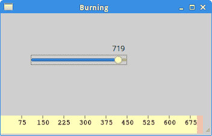

# Ruby GTK 中的自定义小部件

> 原文： [http://zetcode.com/gui/rubygtk/customwidget/](http://zetcode.com/gui/rubygtk/customwidget/)

工具箱通常仅提供最常见的窗口小部件，例如按钮，文本窗口小部件，滑块等。没有工具箱可以提供所有可能的窗口小部件。 程序员必须自己创建此类小部件。 他们使用工具箱提供的绘图工具来完成此任务。 有两种可能：程序员可以修改或增强现有的小部件，或者可以从头开始创建自定义小部件。

## 刻录小部件

这是我们从头开始创建的小部件的示例。 可以在各种媒体刻录应用（例如 K3B）中找到此小部件。

`custom.rb`

```
#!/usr/bin/ruby

'''
ZetCode Ruby GTK tutorial

This example creates a custom widget.

Author: Jan Bodnar
Website: www.zetcode.com
Last modified: May 2014
'''

require 'gtk3'

class Burning < Gtk::DrawingArea

    def initialize parent
        @parent = parent

        super()

        @num = [ "75", "150", "225", "300", 
            "375", "450", "525", "600", "675" ]

        set_size_request 1, 30
        signal_connect "draw" do
            on_draw
        end
    end

    def on_draw

        cr = window.create_cairo_context
        draw_widget cr
    end

    def draw_widget cr

        cr.set_line_width 0.8

        cr.select_font_face "Courier", 
            Cairo::FONT_SLANT_NORMAL, Cairo::FONT_WEIGHT_NORMAL
        cr.set_font_size 11

        width = allocation.width

        @cur_width = @parent.get_cur_value

        step = (width / 10.0).round

        till = (width / 750.0) * @cur_width
        full = (width / 750.0) * 700

        if @cur_width >= 700

            cr.set_source_rgb 1.0, 1.0, 0.72
            cr.rectangle 0, 0, full, 30
            cr.clip
            cr.paint
            cr.reset_clip

            cr.set_source_rgb 1.0, 0.68, 0.68
            cr.rectangle full, 0, till-full, 30
            cr.clip
            cr.paint
            cr.reset_clip

        else
            cr.set_source_rgb 1.0, 1.0, 0.72
            cr.rectangle 0, 0, till, 30
            cr.clip
            cr.paint
            cr.reset_clip
        end

        cr.set_source_rgb(0.35, 0.31, 0.24)

        for i in 1..@num.length
            cr.move_to i*step, 0
            cr.line_to i*step, 5
            cr.stroke

            te = cr.text_extents @num[i-1]
            cr.move_to i*step-te.width/2, 15
            cr.text_path @num[i-1]
            cr.stroke
        end         
    end
end

class RubyApp < Gtk::Window

    def initialize
        super

        set_title "Burning"
        signal_connect "destroy" do 
            Gtk.main_quit 
        end

        set_size_request 350, 200        
        set_window_position :center

        @cur_value = 0

        vbox = Gtk::Box.new :vertical, 2

        scale = Gtk::Scale.new :horizontal
        scale.set_range 0, 750
        scale.set_digits 0
        scale.set_size_request 160, 35
        scale.set_value @cur_value

        scale.signal_connect "value-changed" do |w|
            on_changed w
        end

        fix = Gtk::Fixed.new
        fix.put scale, 50, 50

        vbox.pack_start fix

        @burning = Burning.new self
        vbox.pack_start @burning, :expand => false, 
            :fill => false, :padding => 0

        add vbox
        show_all
    end    

    def on_changed widget

        @cur_value = widget.value
        @burning.queue_draw
    end

    def get_cur_value
        return @cur_value
    end
end

Gtk.init
    window = RubyApp.new
Gtk.main

```

我们在窗口底部放置一个`Gtk::DrawingArea`并手动绘制整个窗口小部件。 所有重要的代码都驻留在`draw_widget`中，这是从 Burning 类的`on_draw`方法调用的。 此小部件以图形方式显示介质的总容量和可用空间。 该小部件由比例小部件控制。 自定义窗口小部件的最小值为 0，最大值为 750。如果值达到 700，则开始绘制红色。 这通常表示过度燃烧。

```
@num = [ "75", "150", "225", "300", 
    "375", "450", "525", "600", "675" ]

```

这些数字显示在刻录小部件上。 它们显示了介质的容量。

```
@cur_width = @parent.get_cur_value

```

从父小部件中，我们获得了比例小部件的当前值。

```
till = (width / 750.0) * @cur_width
full = (width / 750.0) * 700

```

我们使用`width`变量在小数位的值和自定义小部件的度量之间进行转换。 请注意，我们使用浮点值-在绘图中获得更高的精度。 `till`参数确定要绘制的总大小。 该值来自滑块小部件。 它占整个面积的一部分。 `full`参数确定我们开始绘制红色的点。

```
cr.set_source_rgb 1.0, 1.0, 0.72
cr.rectangle 0, 0, till, 30
cr.clip
cr.paint
cr.reset_clip

```

我们绘制一个黄色矩形，直到介质充满的地方。

```
te = cr.text_extents @num[i-1]
cr.move_to i*step-te.width/2, 15
cr.text_path @num[i-1]
cr.stroke

```

这里的代码在刻录小部件上绘制数字。 我们计算文本范围以正确定位文本。

```
def on_changed widget

    @cur_value = widget.value
    @burning.queue_draw
end

```

我们从小部件中获取值，并将其存储在`@cur_value`变量中以备后用。 我们重新绘制刻录的小部件。



Figure: Burning widget

在本章中，我们使用 GTK 和 Ruby 编程语言创建了一个自定义小部件。