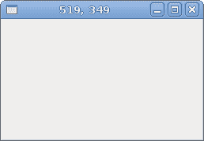
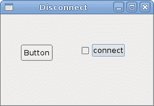

# GTK＃中的事件

> 原文： [http://zetcode.com/gui/gtksharp/events/](http://zetcode.com/gui/gtksharp/events/)

在 GTK＃编程教程的这一部分中，我们将讨论事件。

GTK＃库是一个事件驱动的系统。 所有 GUI 应用程序都会对事件做出反应。 应用程序启动一个主循环，该循环不断检查新生成的事件。 如果没有事件，则应用程序将等待并且不执行任何操作。 事件主要由应用程序的用户生成。 但是它们也可以通过其他方式生成，例如 Internet 连接，窗口管理器或计时器。

## 简单事件示例

下一个示例显示了我们如何应对两个基本事件。

`quitbutton.cs`

```
using Gtk;
using System;

class SharpApp : Window {

    public SharpApp() : base ("Button")
    {
        SetDefaultSize(250, 200);
        SetPosition(WindowPosition.Center);

        DeleteEvent += delegate { Application.Quit(); };

        Fixed fix = new Fixed();

        Button quit = new Button("Quit");
        quit.Clicked += OnClick;
        quit.SetSizeRequest(80, 35);

        fix.Put(quit, 50, 50);
        Add(fix);
        ShowAll();
    }

    void OnClick(object sender, EventArgs args)
    {
        Application.Quit();
    }

    public static void Main()
    {
        Application.Init();
        new SharpApp();
        Application.Run();
    }
}

```

在我们的代码示例中，我们对两个事件作出反应：Delete 事件和 Clicked 事件。

当我们关闭窗口时，将触发删除事件。 默认情况下，当我们单击标题栏中的关闭按钮时，应用程序不会退出。

```
DeleteEvent += delegate { Application.Quit(); };

```

当我们使用`delegate`关键字时，我们可以编写将对这个特定事件做出反应的行代码。

```
quit.Clicked += OnClick;

```

在这里，我们指定使用`OnClick()`方法对`Clicked`事件做出反应。

```
void OnClick(object sender, EventArgs args)
{
    Application.Quit();
}

```

这是`OnClick()`方法。 它有两个参数。 第一个参数是对象，它触发了此事件。 在我们的例子中，它是退出按钮。 第二个参数为我们提供了有关事件的各种其他信息。 事件参数始终取决于事件的类型。 每种方法的签名都可以在 GTK＃库的参考手册中找到。 [http://www.go-mono.com/docs/](http://www.go-mono.com/docs/)

## 移动窗

下一个示例显示了我们如何对移动窗口事件做出反应。 我们在标题栏中显示窗口左上角的当前位置。

`move.cs`

```
using Gtk;
using System;

class SharpApp : Window {

    public SharpApp() : base("")
    {
        SetDefaultSize(250, 150);
        SetPosition(WindowPosition.Center);

        DeleteEvent += delegate { Application.Quit(); };
        Show();
    }

    protected override bool OnConfigureEvent(Gdk.EventConfigure args)
    {
        base.OnConfigureEvent(args);
        Title = args.X + ", " + args.Y;
        return true;
    }

    public static void Main()
    {
        Application.Init();
        new SharpApp();
        Application.Run();
    }
}

```

在前面的示例中，我们已将委托或方法插入事件。 在 GTK＃中，许多事件已经具有处理程序方法。 在这种情况下，我们可以覆盖该方法。 在我们的代码示例中就是这种情况。

```
protected override bool OnConfigureEvent(Gdk.EventConfigure args)
{
    base.OnConfigureEvent(args);
    Title = args.X + ", " + args.Y;
    return true;
}

```

在这里，我们将覆盖预定义的`OnConfigureEvent()`方法。 当我们调整大小或移动窗口小部件时，触发 Configure 事件。 请注意，该方法的第一行调用默认方法。 没有此行，程序将无法正常运行。 下一行将窗口的 x，y 坐标设置为窗口的标题。



Figure: Move event

## EnterNotifyEvent

当我们使用鼠标指针进入小部件的区域时，会发出`EnterNotifyEvent`。

`enter.cs`

```
using Gtk;
using System;

class SharpApp : Window {

    public SharpApp() : base("Enter")
    {
        SetDefaultSize(200, 150);
        SetPosition(WindowPosition.Center);

        DeleteEvent += delegate { Application.Quit(); };

        Button button = new Button("Button");
        button.EnterNotifyEvent += OnEnter;

        Fixed fix = new Fixed();
        fix.Put(button, 20, 20);

        Add(fix);

        ShowAll();
    }

    void OnEnter(object sender, EnterNotifyEventArgs args)
    {
        Button button = (Button) sender;
        button.ModifyBg(StateType.Prelight, new Gdk.Color(220, 220, 220));
    }

    public static void Main()
    {
        Application.Init();
        new SharpApp();
        Application.Run();
    }
}

```

一旦将鼠标指针悬停在按钮小部件上，我们将更改其背景颜色。

```
button.EnterNotifyEvent += OnEnter;

```

我们将`OnEnter()`方法插入`EnterNotifyEvent`。

```
Button button = (Button) sender;
button.ModifyBg(StateType.Prelight, new Gdk.Color(220, 220, 220));

```

我们获取按钮小部件并修改其背景颜色。

## 断开事件处理程序

我们可以从事件断开处理程序方法。 下一个代码示例演示了这种情况。

`disconnect.cs`

```
using Gtk;
using System;

class SharpApp : Window {

    Button button;

    public SharpApp() : base("Disconnect")
    {
        SetDefaultSize(250, 150);
        SetPosition(WindowPosition.Center);

        DeleteEvent += delegate { Application.Quit(); };

        button = new Button("Button");

        CheckButton cb = new CheckButton("connect");
        cb.Toggled += OnToggled;

        Fixed fix = new Fixed();
        fix.Put(button, 30, 50);
        fix.Put(cb, 130, 50);

        Add(fix);

        ShowAll();
    }

    void OnClick(object sender, EventArgs args)
    {
        Console.WriteLine("Click");
    }

    void OnToggled(object sender, EventArgs args)
    {
        CheckButton cb = (CheckButton) sender;
        if (cb.Active) {
            button.Clicked += OnClick;
        } else {
            button.Clicked -= OnClick;
        }
    }

    public static void Main()
    {
        Application.Init();
        new SharpApp();
        Application.Run();
    }
}

```

在代码示例中，我们有一个按钮和一个复选框。 当我们单击按钮并且复选框处于活动状态时，我们在控制台中显示“单击”文本。 该复选框可将处理程序方法与按钮`Clicked`事件连接或断开连接。

```
CheckButton cb = new CheckButton("connect");
cb.Toggled += OnToggled;

```

我们有一个复选框。 该小部件具有`Toggled`事件。 我们将`OnToggled()`方法插入此事件。

```
CheckButton cb = (CheckButton) sender;
if (cb.Active) {
    button.Clicked += OnClick;
} else {
    button.Clicked -= OnClick;
}

```

这些行根据复选框小部件的状态连接或断开事件处理程序。



Figure: Disconnect

本章是关于 GTK＃中的事件的。