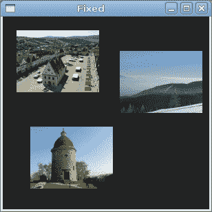
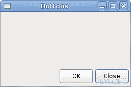
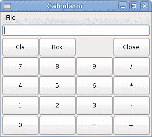
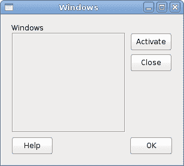

# 布局管理

> 原文： [http://zetcode.com/gui/vbgtk/layoutmanagement/](http://zetcode.com/gui/vbgtk/layoutmanagement/)

在本章中，我们将展示如何在窗口或对话框中布置窗口小部件。

在设计应用程序的 GUI 时，我们决定要使用哪些小部件以及如何在应用程序中组织这些小部件。 为了组织窗口小部件，我们使用专门的不可见窗口小部件，称为布局容器。 在本章中，我们将提到`Alignment`，`Fixed`，`VBox`和`Table`。

## 固定

`Fixed`容器将子窗口小部件放置在固定位置并具有固定大小。 此容器不执行自动布局管理。 在大多数应用程序中，我们不使用此容器。 我们在某些专业领域使用它。 例如游戏，使用图表的专用应用程序，可以移动的可调整大小的组件（如电子表格应用程序中的图表），小型教育示例。

```
' ZetCode Mono Visual Basic GTK# tutorial
'
' In this program, we lay out widgets
' using absolute positioning
'
' author jan bodnar
' last modified May 2009
' website www.zetcode.com

Imports Gtk

Public Class GtkVBApp
    Inherits Window

    Private Dim rotunda As Gdk.Pixbuf 
    Private Dim bardejov As Gdk.Pixbuf 
    Private Dim mincol As Gdk.Pixbuf

    Public Sub New

        MyBase.New("Fixed")

        Me.InitUI

        Me.SetDefaultSize(300, 280)
        Me.SetPosition(WindowPosition.Center)
        AddHandler Me.DeleteEvent, AddressOf Me.OnDelete

        Me.ShowAll 

    End Sub

    Private Sub InitUI

        Me.ModifyBg(StateType.Normal, New Gdk.Color(40, 40, 40))

        Try 
            bardejov = New Gdk.Pixbuf("bardejov.jpg")
            rotunda = New Gdk.Pixbuf("rotunda.jpg")
            mincol = New Gdk.Pixbuf("mincol.jpg")
        Catch e As Exception
            Console.WriteLine("Cannot load images")
            Console.WriteLine(e.Message)
            Environment.Exit(1)
        End Try

        Dim image1 As New Image(bardejov)
        Dim image2 As New Image(rotunda)
        Dim image3 As New Image(mincol)

        Dim fixed As New Fixed

        fixed.Put(image1, 20, 20)
        fixed.Put(image2, 40, 160)
        fixed.Put(image3, 170, 50)

        Me.Add(fixed)

    End Sub

    Sub OnDelete(ByVal sender As Object, _ 
            ByVal args As DeleteEventArgs)
        Application.Quit
    End Sub

    Public Shared Sub Main

        Application.Init
        Dim app As New GtkVBApp
        Application.Run

    End Sub

End Class

```

在我们的示例中，我们在窗口上显示了三个小图像。 我们明确指定放置这些图像的 x，y 坐标。

```
vbnc -r:/usr/lib/mono/gtk-sharp-2.0/gtk-sharp.dll -r:/usr/lib/mono/gtk-sharp-2.0/gdk-sharp.dll 
      absolute.vb

```

在此示例中，我们还使用`gdk-sharp`程序集。

```
Me.ModifyBg(StateType.Normal, New Gdk.Color(40, 40, 40))

```

为了获得更好的视觉体验，我们将背景色更改为深灰色。

```
bardejov = New Gdk.Pixbuf("bardejov.jpg")

```

我们将图像从磁盘加载到`Gdk.Pixbuf`对象。

```
Dim image1 As New Image(bardejov)
Dim image2 As New Image(rotunda)
Dim image3 As New Image(mincol)

```

`Image`是用于显示图像的小部件。 它在构造函数中使用`Gdk.Pixbuf`对象。

```
Dim fixed As New Fixed

```

我们创建`Fixed`容器。

```
fixed.Put(image1, 20, 20)

```

我们将第一个图像放置在 x = 20，y = 20 坐标处。

```
Me.Add(fixed)

```

最后，我们将`Fixed`容器添加到窗口中。



Figure: Fixed

## 纽扣

`Alignment`容器控制其子窗口小部件的对齐方式和大小。

```
' ZetCode Mono Visual Basic GTK# tutorial
'
' In this program, we position two buttons
' in the bottom right corner of the window.
' We use horizontal and vertical boxes.
'
' author jan bodnar
' last modified May 2009
' website www.zetcode.com

Imports Gtk

Public Class GtkVBApp
    Inherits Window

    Public Sub New

        MyBase.New("Buttons")

        Me.InitUI

        Me.SetDefaultSize(260, 150)
        Me.SetPosition(WindowPosition.Center)
        AddHandler Me.DeleteEvent, AddressOf Me.OnDelete

        Me.ShowAll

    End Sub

    Private Sub InitUI

        Dim vbox As New VBox(False, 5)
        Dim hbox As New HBox(True, 3)

        Dim valign As New Alignment(0, 1, 0, 0)
        vbox.PackStart(valign)

        Dim ok As New Button("OK")
        ok.SetSizeRequest(70, 30)
        Dim close As New Button("Close")

        hbox.Add(ok)
        hbox.Add(close)

        Dim halign As New Alignment(1, 0, 0, 0)
        halign.Add(hbox)

        vbox.PackStart(halign, False, False, 3)

        Me.Add(vbox)

    End Sub

    Sub OnDelete(ByVal sender As Object, _
            ByVal args As DeleteEventArgs)
        Application.Quit
    End Sub

    Public Shared Sub Main

        Application.Init
        Dim app As New GtkVBApp
        Application.Run

    End Sub

End Class

```

在代码示例中，我们在窗口的右下角放置了两个按钮。 为此，我们使用一个水平框和一个垂直框以及两个对齐容器。

```
Dim valign As New Alignment(0, 1, 0, 0)

```

这会将子窗口小部件置于底部。

```
vbox.PackStart(valign)

```

在这里，我们将`Alignment`小部件放置到垂直框中。

```
Dim hbox As New HBox(True, 3)
...
Dim ok As New Button("OK")
ok.SetSizeRequest(70, 30)
Dim close As New Button("Close")

hbox.Add(ok)
hbox.Add(close)

```

我们创建一个水平框，并在其中放置两个按钮。

```
Dim halign As New Alignment(1, 0, 0, 0)
halign.Add(hbox)

vbox.PackStart(halign, False, False, 3)

```

这将创建一个对齐容器，它将其子窗口小部件放在右侧。 我们将水平框添加到对齐容器中，然后将对齐容器包装到垂直框中。 我们必须记住，对齐容器仅包含一个子窗口小部件。 这就是为什么我们必须使用盒子。



Figure: Buttons

## 计算器骨架

`Table`小部件按行和列排列小部件。

```
' ZetCode Mono Visual Basic GTK# tutorial
'
' In this program we create a skeleton of
' a calculator. We use the Table widget. 
'
' author jan bodnar
' last modified May 2009
' website www.zetcode.com

Imports Gtk

Public Class GtkVBApp
    Inherits Window

    Public Sub New

        MyBase.New("Calculator")

        Me.InitUI

        Me.SetDefaultSize(300, 250)
        Me.SetPosition(WindowPosition.Center)
        AddHandler Me.DeleteEvent, AddressOf Me.OnDelete

        Me.ShowAll 

    End Sub

    Private Sub InitUI

        Dim vbox As New VBox(False, 2)

        Dim mb As New MenuBar
        Dim filemenu As New Menu
        Dim file As MenuItem = New MenuItem("File")
        file.Submenu = filemenu
        mb.Append(file)

        vbox.PackStart(mb, False, False, 0)

        Dim table As New Table(5, 4, True)

        table.Attach(New Button("Cls"), 0, 1, 0, 1)
        table.Attach(New Button("Bck"), 1, 2, 0, 1)
        table.Attach(New Label(), 2, 3, 0, 1)
        table.Attach(New Button("Close"), 3, 4, 0, 1)

        table.Attach(New Button("7"), 0, 1, 1, 2)
        table.Attach(New Button("8"), 1, 2, 1, 2)
        table.Attach(New Button("9"), 2, 3, 1, 2)
        table.Attach(New Button("/"), 3, 4, 1, 2)

        table.Attach(New Button("4"), 0, 1, 2, 3)
        table.Attach(New Button("5"), 1, 2, 2, 3)
        table.Attach(New Button("6"), 2, 3, 2, 3)
        table.Attach(New Button("*"), 3, 4, 2, 3)

        table.Attach(New Button("1"), 0, 1, 3, 4)
        table.Attach(New Button("2"), 1, 2, 3, 4)
        table.Attach(New Button("3"), 2, 3, 3, 4)
        table.Attach(New Button("-"), 3, 4, 3, 4)

        table.Attach(New Button("0"), 0, 1, 4, 5)
        table.Attach(New Button("."), 1, 2, 4, 5)
        table.Attach(New Button("="), 2, 3, 4, 5)
        table.Attach(New Button("+"), 3, 4, 4, 5)

        vbox.PackStart(New Entry, False, False, 0)

        vbox.PackEnd(table, True, True, 0)

        Me.Add(vbox)

    End Sub

    Sub OnDelete(ByVal sender As Object, _
            ByVal args As DeleteEventArgs)
        Application.Quit
    End Sub

    Public Shared Sub Main

        Application.Init
        Dim app As New GtkVBApp
        Application.Run

    End Sub

End Class

```

我们使用`Table`小部件创建一个计算器框架。

```
Dim table As New Table(5, 4, True)

```

我们创建一个具有 5 行 4 列的表小部件。 第三个参数是同质参数。 如果设置为 true，则表中的所有小部件都具有相同的大小。 所有窗口小部件的大小等于表容器中最大的窗口小部件。

```
table.Attach(New Button("Cls"), 0, 1, 0, 1)

```

我们在表格容器上附加一个按钮。 到表格的左上方单元格。 前两个参数是单元格的左侧和右侧，后两个参数是单元格的顶部和左侧。

```
vbox.PackEnd(table, True, True, 0)

```

我们将表格小部件打包到垂直框中。



Figure: Calculator skeleton

## 窗口

接下来，我们将创建一个更高级的示例。 我们显示一个窗口，可以在 JDeveloper IDE 中找到它。

```
' ZetCode Mono Visual Basic GTK# tutorial
'
' This is a more complicated layout example.
' We use Alignment and Table widgets. 
'
' author jan bodnar
' last modified May 2009
' website www.zetcode.com

Imports Gtk

Public Class GtkVBApp
    Inherits Window

    Public Sub New

        MyBase.New("Windows")

        Me.InitUI

        Me.SetDefaultSize(300, 250)
        Me.SetPosition(WindowPosition.Center)
        AddHandler Me.DeleteEvent, AddressOf Me.OnDelete

        Me.ShowAll 

    End Sub

    Private Sub InitUI

        Me.BorderWidth = 15

        Dim table As New Table(8, 4, False)
        table.ColumnSpacing = 3

        Dim title As New Label("Windows")

        Dim halign As New Alignment(0, 0, 0, 0)
        halign.Add(title)

        table.Attach(halign, 0, 1, 0, 1, AttachOptions.Fill, _
            AttachOptions.Fill, 0, 0)

        Dim frame As New Frame
        table.Attach(frame, 0, 2, 1, 3, AttachOptions.Fill Or AttachOptions.Expand, _
            AttachOptions.Fill Or AttachOptions.Expand, 1, 1)

        Dim activate As New Button("Activate")
        activate.SetSizeRequest(50, 30)
        table.Attach(activate, 3, 4, 1, 2, AttachOptions.Fill, _
            AttachOptions.Shrink, 1, 1)

        Dim valign As New Alignment(0, 0, 0, 0)
        Dim close As New Button("Close")
        close.SetSizeRequest(70, 30)
        valign.Add(close)
        table.SetRowSpacing(1, 3)
        table.Attach(valign, 3, 4, 2, 3, AttachOptions.Fill, _
            AttachOptions.Fill Or AttachOptions.Expand, 1, 1)

        Dim halign2 As New Alignment(0, 1, 0, 0)
        Dim help As New Button("Help")
        help.SetSizeRequest(70, 30)
        halign2.Add(help)
        table.SetRowSpacing(3, 6)
        table.Attach(halign2, 0, 1, 4, 5, AttachOptions.Fill, _
            AttachOptions.Fill, 0, 0)

        Dim ok As New Button("OK")
        ok.SetSizeRequest(70, 30)
        table.Attach(ok, 3, 4, 4, 5, AttachOptions.Fill, _
            AttachOptions.Fill, 0, 0)

        Me.Add(table)

    End Sub

    Sub OnDelete(ByVal sender As Object, _
            ByVal args As DeleteEventArgs)
        Application.Quit
    End Sub

    Public Shared Sub Main

        Application.Init
        Dim app As New GtkVBApp
        Application.Run

    End Sub

End Class

```

该代码示例显示了如何在 GTK＃中创建类似的窗口。

```
Dim table As New Table(8, 4, False)
table.ColumnSpacing = 3

```

该示例基于`Table`容器。 列之间将有 3px 的间隔。

```
Dim title As New Label("Windows")

Dim halign As New Alignment(0, 0, 0, 0)
halign.Add(title)

table.Attach(halign, 0, 1, 0, 1, AttachOptions.Fill, _
    AttachOptions.Fill, 0, 0)

```

这段代码创建了一个向左对齐的标签。 标签放置在 Table 容器的第一行中。

```
Dim frame As New Frame
table.Attach(frame, 0, 2, 1, 3, AttachOptions.Fill Or AttachOptions.Expand, _
    AttachOptions.Fill Or AttachOptions.Expand, 1, 1)

```

框架视图小部件跨越两行两列。 我们使小部件不可编辑并隐藏光标。

```
Dim valign As New Alignment(0, 0, 0, 0)
Dim close As New Button("Close")
close.SetSizeRequest(70, 30)
valign.Add(close)
table.SetRowSpacing(1, 3)
table.Attach(valign, 3, 4, 2, 3, AttachOptions.Fill, _
    AttachOptions.Fill Or AttachOptions.Expand, 1, 1)

```

我们将关闭按钮放在框架小部件旁边，进入第四列。 （我们从零开始计数）将按钮添加到对齐小部件中，以便可以将其对齐到顶部。



Figure: Windows

在 Visual Basic GTK＃教程的这一部分中，我们提到了小部件的布局管理。