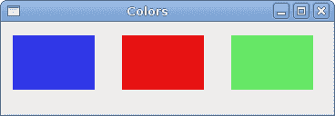
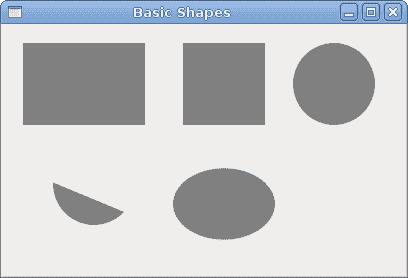
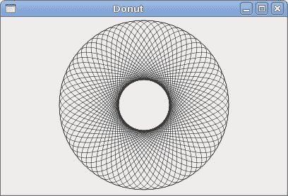
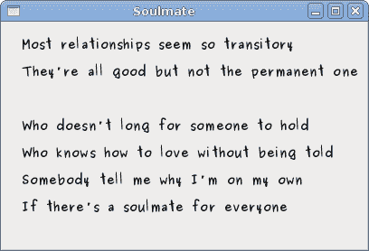

# Cario 绘图

> 原文： [http://zetcode.com/gui/vbgtk/painting/](http://zetcode.com/gui/vbgtk/painting/)

在 Visual Basic GTK# 教程的这一部分中，我们将使用 Cairo 库进行一些绘画。

Cairo 是用于创建 2D 矢量图形的库。 我们可以使用它来绘制自己的小部件，图表或各种效果或动画。

## 色彩

在第一个示例中，我们将使用颜色。 颜色是代表红色，绿色和蓝色（RGB）强度值的组合的对象。 开罗有效 RGB 值在 0 到 1 的范围内。

```
' ZetCode Mono Visual Basic GTK# tutorial
'
' This program draws three rectangles.
' The interiors are filled with
' different colors.
'
' author jan bodnar
' last modified May 2009
' website www.zetcode.com

Imports Gtk

Public Class GtkVBApp
    Inherits Window

    Public Sub New

        MyBase.New("Colors")

        Me.InitUI

        Me.SetDefaultSize(360, 100)
        Me.SetPosition(WindowPosition.Center)
        AddHandler Me.DeleteEvent, AddressOf Me.OnDelete

        Me.ShowAll 

    End Sub

    Private Sub InitUI

        Dim darea As New DrawingArea
        AddHandler darea.ExposeEvent, AddressOf Me.OnExpose
        Me.Add(darea)

    End Sub

    Private Sub OnExpose(ByVal sender As Object, ByVal args As ExposeEventArgs)

        Dim cc As Cairo.Context = Gdk.CairoHelper.Create(sender.GdkWindow)

        Me.DrawColors(cc)

        Dim disposeTarget As IDisposable = CType(cc.Target, IDisposable)
        disposeTarget.Dispose

        Dim disposeContext As IDisposable = CType(cc, IDisposable)
        disposeContext.Dispose

    End Sub

    Private Sub DrawColors(ByVal cc As Cairo.Context)

        cc.SetSourceRGB(0.2, 0.23, 0.9)
        cc.Rectangle(10, 15, 90, 60)
        cc.Fill

        cc.SetSourceRGB(0.9, 0.1, 0.1)
        cc.Rectangle(130, 15, 90, 60)
        cc.Fill

        cc.SetSourceRGB(0.4, 0.9, 0.4)
        cc.Rectangle(250, 15, 90, 60)
        cc.Fill    

    End Sub

    Private Sub OnDelete(ByVal sender As Object, _
            ByVal args As DeleteEventArgs)
        Application.Quit
    End Sub

    Public Shared Sub Main

        Application.Init
        Dim app As New GtkVBApp
        Application.Run

    End Sub

End Class

```

在我们的示例中，我们将绘制三个矩形，并用三种不同的颜色填充它们。

```
vbnc -r:/usr/lib/mono/gtk-sharp-2.0/gtk-sharp.dll 
 -r:/usr/lib/mono/gtk-sharp-2.0/gdk-sharp.dll
 -r:/usr/lib/mono/2.0/Mono.Cairo.dll colors.vb

```

这是我们编译示例的方式。

```
Dim darea As New DrawingArea

```

我们将在`DrawingArea`小部件上进行绘制操作。

```
AddHandler darea.ExposeEvent, AddressOf Me.OnExpose

```

所有绘图都是通过我们插入`ExposeEvent`的方法完成的。

```
Dim cc As Cairo.Context = Gdk.CairoHelper.Create(sender.GdkWindow)

```

我们从绘图区域的`GdkWindow`创建`Cairo.Context`对象。 上下文是我们绘制所有图纸的对象。

```
Me.DrawColors(cc)

```

实际图形委托给`DrawColors`方法。

```
Dim disposeTarget As IDisposable = CType(cc.Target, IDisposable)
disposeTarget.Dispose

Dim disposeContext As IDisposable = CType(cc, IDisposable)
disposeContext.Dispose

```

在这里，我们处理在绘制过程中使用的资源。

```
cc.SetSourceRGB(0.2, 0.23, 0.9)

```

`SetSourceRGB`方法为开罗上下文设置颜色。 该方法的三个参数是颜色强度值。

```
cc.Rectangle(10, 15, 90, 60)

```

我们画一个矩形。 前两个参数是矩形左上角的 x，y 坐标。 最后两个参数是矩形的宽度和高度。

```
cc.Fill

```

我们用当前颜色填充矩形的内部。



Figure: Colors

## 基本形状

下一个示例将一些基本形状绘制到窗口上。

```
' ZetCode Mono Visual Basic GTK# tutorial
'
' This program draws basic shapes
' available in Cairo
'
' author jan bodnar
' last modified May 2009
' website www.zetcode.com

Imports Gtk

Public Class GtkVBApp
    Inherits Window

    Public Sub New

        MyBase.New("Basic Shapes")

        Me.InitUI

        Me.SetDefaultSize(400, 250)
        Me.SetPosition(WindowPosition.Center)
        AddHandler Me.DeleteEvent, AddressOf Me.OnDelete

        Me.ShowAll

    End Sub

    Private Sub InitUI

        Dim darea As New DrawingArea
        AddHandler darea.ExposeEvent, AddressOf Me.OnExpose
        Me.Add(darea)

    End Sub

    Private Sub OnExpose(ByVal sender As Object, ByVal args As ExposeEventArgs)

        Dim cc As Cairo.Context = Gdk.CairoHelper.Create(sender.GdkWindow)

        Me.DrawShapes(cc)

        Dim disposeTarget As IDisposable = CType(cc.Target, IDisposable)
        disposeTarget.Dispose

        Dim disposeContext As IDisposable = CType(cc, IDisposable)
        disposeContext.Dispose

    End Sub

    Private Sub DrawShapes(ByVal cc As Cairo.Context)

        cc.SetSourceRGB(0.5, 0.5, 0.5)

        cc.Rectangle(20, 20, 120, 80)
        cc.Rectangle(180, 20, 80, 80)
        cc.Fill

        cc.Arc(330, 60, 40, 0, 2*Math.PI)
        cc.Fill

        cc.Arc(90, 160, 40, Math.PI/4, Math.PI)
        cc.ClosePath
        cc.Fill

        cc.Translate(220, 180)
        cc.Scale(1, 0.7)
        cc.Arc(0, 0, 50, 0, 2*Math.PI)
        cc.Fill

    End Sub

    Private Sub OnDelete(ByVal sender As Object, _
            ByVal args As DeleteEventArgs)
        Application.Quit
    End Sub

    Public Shared Sub Main

        Application.Init
        Dim app As New GtkVBApp
        Application.Run

    End Sub

End Class

```

在此示例中，我们将创建一个矩形，正方形，圆形，弧形和椭圆形。

```
cc.Rectangle(20, 20, 120, 80)
cc.Rectangle(180, 20, 80, 80)
cc.Fill

```

这些线绘制一个矩形和一个正方形。

```
cc.Arc(330, 60, 40, 0, 2*Math.PI)
cc.Fill

```

此处`Arc`方法绘制一个完整的圆。

```
cc.Translate(220, 180)
cc.Scale(1, 0.7)
cc.Arc(0, 0, 50, 0, 2*Math.PI)
cc.Fill

```

`Translate`方法将对象移动到特定点。 如果要绘制椭圆形，请先进行一些缩放。 在这里`Scale`方法缩小 y 轴。



Figure: Basic shapes

## 透明矩形

透明性是指能够透视材料的质量。 了解透明度的最简单方法是想象一块玻璃或水。 从技术上讲，光线可以穿过玻璃，这样我们就可以看到玻璃后面的物体。

在计算机图形学中，我们可以使用 alpha 合成来实现透明效果。 Alpha 合成是将图像与背景组合以创建部分透明外观的过程。 合成过程使用 Alpha 通道。 （wikipedia.org，answers.com）

```
' ZetCode Mono Visual Basic GTK# tutorial
'
' This program draws ten
' rectangles with different
' levels of transparency
'
' author jan bodnar
' last modified May 2009
' website www.zetcode.com

Imports Gtk

Public Class GtkVBApp
    Inherits Window

    Public Sub New

        MyBase.New("Transparent rectangles")

        Me.InitUI

        Me.SetDefaultSize(590, 90)
        Me.SetPosition(WindowPosition.Center)
        AddHandler Me.DeleteEvent, AddressOf Me.OnDelete

        Me.ShowAll

    End Sub

    Private Sub InitUI

        Dim darea As New DrawingArea
        AddHandler darea.ExposeEvent, AddressOf Me.OnExpose
        Me.Add(darea)

    End Sub

    Private Sub OnExpose(ByVal sender As Object, ByVal args As ExposeEventArgs)

        Dim cc As Cairo.Context = Gdk.CairoHelper.Create(sender.GdkWindow)

        Me.DrawRectangles(cc)

        Dim disposeTarget As IDisposable = CType(cc.Target, IDisposable)
        disposeTarget.Dispose()

        Dim disposeContext As IDisposable = CType(cc, IDisposable)
        disposeContext.Dispose()

    End Sub

    Private Sub DrawRectangles(ByVal cc As Cairo.Context)

        For i As Integer = 1 To 10        
            cc.SetSourceRGBA(0, 0, 1, i*0.1)
            cc.Rectangle(50*i, 20, 40, 40)
            cc.Fill  
        Next

    End Sub

    Private Sub OnDelete(ByVal sender As Object, _
            ByVal args As DeleteEventArgs)
        Application.Quit
    End Sub

    Public Shared Sub Main

        Application.Init
        Dim app As New GtkVBApp
        Application.Run

    End Sub

End Class

```

在示例中，我们将绘制十个具有不同透明度级别的矩形。

```
cc.SetSourceRGBA(0, 0, 1, i*0.1)

```

`SetSourceRGBA`方法的最后一个参数是 alpha 透明度。


Figure: Transparent rectangles

## 甜甜圈

在下面的示例中，我们通过旋转一堆椭圆来创建 n 个复杂形状。

```
' ZetCode Mono Visual Basic GTK# tutorial
'
' This program draws basic shapes
' available in Cairo
'
' author jan bodnar
' last modified May 2009
' website www.zetcode.com

Imports Gtk

Public Class GtkVBApp
    Inherits Window

    Public Sub New

        MyBase.New("Donut")

        Me.InitUI

        Me.SetDefaultSize(400, 250)
        Me.SetPosition(WindowPosition.Center)
        AddHandler Me.DeleteEvent, AddressOf Me.OnDelete

        Me.ShowAll

    End Sub

    Private Sub InitUI

        Dim darea As New DrawingArea
        AddHandler darea.ExposeEvent, AddressOf Me.OnExpose
        Me.Add(darea)

    End Sub

    Private Sub OnExpose(ByVal sender As Object, ByVal args As ExposeEventArgs)

        Dim cc As Cairo.Context = Gdk.CairoHelper.Create(sender.GdkWindow)

        Me.DrawDonut(cc)

        Dim disposeTarget As IDisposable = CType(cc.Target, IDisposable)
        disposeTarget.Dispose

        Dim disposeContext As IDisposable = CType(cc, IDisposable)
        disposeContext.Dispose

    End Sub

    Private Sub DrawDonut(ByVal cc As Cairo.Context)

        cc.LineWidth = 0.5

        Dim width, height As Integer
        width = Allocation.Width
        height = Allocation.Height

        cc.Translate(width/2, height/2)
        cc.Arc(0, 0, 120, 0, 2*Math.PI)
        cc.Stroke

        cc.Save

        For i As Integer = 0 To 35
            cc.Rotate( i*Math.PI/36)
            cc.Scale(0.3, 1)
            cc.Arc(0, 0, 120, 0, 2*Math.PI)
            cc.Restore
            cc.Stroke
            cc.Save
        Next

    End Sub

    Private Sub OnDelete(ByVal sender As Object, _
            ByVal args As DeleteEventArgs)
        Application.Quit
    End Sub

    Public Shared Sub Main

        Application.Init
        Dim app As New GtkVBApp
        Application.Run

    End Sub

End Class

```

在此示例中，我们创建一个甜甜圈。 形状类似于 Cookie，因此得名“甜甜圈”。

```
cc.Translate(width/2, height/2)
cc.Arc(0, 0, 120, 0, 2*Math.PI)
cc.Stroke

```

刚开始时有一个椭圆。

```
For i As Integer = 0 To 35
    cc.Rotate( i*Math.PI/36)
    cc.Scale(0.3, 1)
    cc.Arc(0, 0, 120, 0, 2*Math.PI)
    cc.Restore
    cc.Stroke
    cc.Save
Next

```

旋转几圈后，有一个甜甜圈。



Figure: Donut

## 绘制文字

在下一个示例中，我们在窗口上绘制一些文本。

```
' ZetCode Mono Visual Basic GTK# tutorial
'
' This program draws text
' on the window
'
' author jan bodnar
' last modified May 2009
' website www.zetcode.com

Imports Gtk

Public Class GtkVBApp
    Inherits Window

    Public Sub New

        MyBase.New("Soulmate")

        Me.InitUI

        Me.SetDefaultSize(400, 250)
        Me.SetPosition(WindowPosition.Center)
        AddHandler Me.DeleteEvent, AddressOf Me.OnDelete

        Me.ShowAll    

    End Sub

    Private Sub InitUI

        Dim darea As New DrawingArea
        AddHandler darea.ExposeEvent, AddressOf Me.OnExpose
        Me.Add(darea)

    End Sub

    Private Sub OnExpose(ByVal sender As Object, ByVal args As ExposeEventArgs)

        Dim cc As Cairo.Context = Gdk.CairoHelper.Create(sender.GdkWindow)

        Me.DrawLyrics(cc)

        Dim disposeTarget As IDisposable = CType(cc.Target, IDisposable)
        disposeTarget.Dispose

        Dim disposeContext As IDisposable = CType(cc, IDisposable)
        disposeContext.Dispose

    End Sub

    Private Sub DrawLyrics(ByVal cc As Cairo.Context)

        cc.SetSourceRGB(0.1, 0.1, 0.1)

        cc.SelectFontFace("Purisa", Cairo.FontSlant.Normal, Cairo.FontWeight.Bold)
        cc.SetFontSize(13)

        cc.MoveTo(20, 30)
        cc.ShowText("Most relationships seem so transitory")
        cc.MoveTo(20, 60)
        cc.ShowText("They're all good but not the permanent one")
        cc.MoveTo(20, 120)
        cc.ShowText("Who doesn't long for someone to hold")
        cc.MoveTo(20, 150)
        cc.ShowText("Who knows how to love without being told")
        cc.MoveTo(20, 180)
        cc.ShowText("Somebody tell me why I'm on my own")
        cc.MoveTo(20, 210)
        cc.ShowText("If there's a soulmate for everyone")

    End Sub

    Private Sub OnDelete(ByVal sender As Object, _
            ByVal args As DeleteEventArgs)
        Application.Quit
    End Sub

    Public Shared Sub Main

        Application.Init
        Dim app As New GtkVBApp
        Application.Run

    End Sub

End Class

```

我们显示 Natasha Bedingfields Soulmate 歌曲的部分歌词。

```
cc.SelectFontFace("Purisa", Cairo.FontSlant.Normal, Cairo.FontWeight.Bold)

```

在这里，我们指定使用的字体。 普莉莎（Purisa）大胆

```
cc.SetFontSize(13)

```

我们指定字体的大小。

```
cc.MoveTo(20, 30)

```

我们移动到要绘制文本的位置。

```
cc.ShowText("Most relationships seem so transitory")

```

`ShowText`方法将文本绘制到窗口上。



Figure: Soulmate

在 Visual Basic GTK# 教程的这一章中，我们使用开罗库进行绘画。