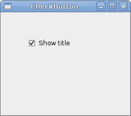
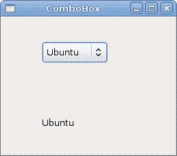
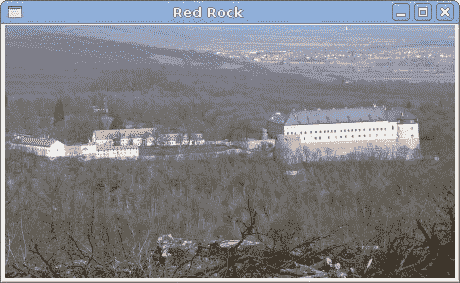

# PyGTK 中的小部件

> 原文： [http://zetcode.com/gui/pygtk/widgets/](http://zetcode.com/gui/pygtk/widgets/)

在 PyGTK 编程教程的这一部分中，我们将介绍一些 PyGTK 小部件。

小部件是 GUI 应用的基本构建块。 多年来，几个小部件已成为所有 OS 平台上所有工具包中的标准。 例如，按钮，复选框或滚动条。 PyGTK 工具箱的理念是将小部件的数量保持在最低水平。 将创建更多专门的小部件作为自定义 PyGTK 小部件。

## `Label`

`Label`小部件显示有限数量的只读文本。

`label.py`

```
#!/usr/bin/python

# ZetCode PyGTK tutorial 
#
# This example demonstrates the Label widget
#
# author: jan bodnar
# website: zetcode.com 
# last edited: February 2009

import gtk

lyrics = """Meet you downstairs in the bar and heard
your rolled up sleeves and your skull t-shirt
You say why did you do it with him today?
and sniff me out like I was Tanqueray

cause you're my fella, my guy
hand me your stella and fly
by the time I'm out the door
you tear men down like Roger Moore

I cheated myself
like I knew I would
I told ya, I was trouble
you know that I'm no good"""

class PyApp(gtk.Window): 
    def __init__(self):
        super(PyApp, self).__init__()

        self.set_position(gtk.WIN_POS_CENTER)
        self.set_border_width(8)
        self.connect("destroy", gtk.main_quit)
        self.set_title("You know I'm no Good")

        label = gtk.Label(lyrics)
        self.add(label)
        self.show_all()

PyApp()
gtk.main()

```

该代码示例在窗口上显示了一些歌词。

```
lyrics = """Meet you downstairs in the bar and heard
your rolled up sleeves and your skull t-shirt
..."""

```

这是我们显示的文本。

```
self.set_border_width(8)

```

`Label`周围有一些空白。

```
label = gtk.Label(lyrics)
self.add(label)

```

`Label`小部件已创建并添加到窗口。


Figure: Label Widget

## `CheckButton`

`CheckButton`是具有两种状态的窗口小部件：打开和关闭。 n 状态通过复选标记显示。 它用来表示一些布尔属性。

`checkbutton.py`

```
#!/usr/bin/python

# ZetCode PyGTK tutorial 
#
# This example demonstrates the CheckButton widget
#
# author: jan bodnar
# website: zetcode.com 
# last edited: February 2009

import gtk

class PyApp(gtk.Window):

    def __init__(self):
        super(PyApp, self).__init__()
        self.set_title("Check Button")
        self.set_position(gtk.WIN_POS_CENTER)
        self.set_default_size(250, 200)

        fixed = gtk.Fixed()
        button = gtk.CheckButton("Show title")
        button.set_active(True)
        button.unset_flags(gtk.CAN_FOCUS)
        button.connect("clicked", self.on_clicked)

        fixed.put(button, 50, 50)

        self.connect("destroy", gtk.main_quit)
        self.add(fixed)
        self.show_all()

    def on_clicked(self, widget):
        if widget.get_active():
            self.set_title("Check Button")
        else:
           self.set_title("")

PyApp()
gtk.main()

```

根据`CheckButton`的状态，我们将在窗口的标题栏中显示标题。

```
button = gtk.CheckButton("Show title")

```

`CheckButton`小部件已创建。

```
button.set_active(True)

```

默认情况下标题是可见的，因此我们默认情况下选中复选按钮。

```
if widget.get_active():
    self.set_title("Check Button")
else:
    self.set_title("")

```

如果选中`CheckButton`，我们将显示标题。 否则，我们将在标题栏中放置空白文本。



Figure: CheckButton

## `ComboBox`

`ComboBox`是一个小部件，允许用户从选项列表中进行选择。

`combobox.py`

```
#!/usr/bin/python

# ZetCode PyGTK tutorial 
#
# This example demonstrates the ComboBox widget
#
# author: jan bodnar
# website: zetcode.com 
# last edited: February 2009

import gtk

class PyApp(gtk.Window):
    def __init__(self):
        super(PyApp, self).__init__()

        self.set_title("ComboBox")
        self.set_default_size(250, 200)
        self.set_position(gtk.WIN_POS_CENTER)

        cb = gtk.combo_box_new_text()
        cb.connect("changed", self.on_changed)

        cb.append_text('Ubuntu')
        cb.append_text('Mandriva')
        cb.append_text('Redhat')
        cb.append_text('Gentoo')
        cb.append_text('Mint')

        fixed = gtk.Fixed()
        fixed.put(cb, 50, 30)
        self.label = gtk.Label("-")
        fixed.put(self.label, 50, 140)
        self.add(fixed)

        self.connect("destroy", gtk.main_quit)
        self.show_all()

    def on_changed(self, widget):
        self.label.set_label(widget.get_active_text()) 

PyApp()
gtk.main()

```

该示例显示了一个组合框和一个标签。 组合框具有六个选项的列表。 这些是 Linux 发行版的名称。 标签窗口小部件显示了从组合框中选择的选项。

```
cb = gtk.combo_box_new_text()

```

`gtk.combo_box_new_text()`功能是一种便捷功能，可构造一个新的文本组合框。 它是只显示字符串的`ComboBox`。

```
cb.append_text('Ubuntu')
cb.append_text('Mandriva')
cb.append_text('Redhat')
cb.append_text('Gentoo')
cb.append_text('Mint')

```

`ComboBox`充满了文本数据。

```
self.label.set_label(widget.get_active_text()) 

```

在`on_changed()`方法内部，我们从组合框中获取选定的文本并将其设置为标签。



Figure: ComboBox

## `Image`

下一个示例介绍`Image`小部件。 此小部件显示图片。

`image.py`

```
#!/usr/bin/python

# ZetCode PyGTK tutorial 
#
# This example demonstrates the Image widget
#
# author: jan bodnar
# website: zetcode.com 
# last edited: February 2009

import gtk

class PyApp(gtk.Window):

    def __init__(self):
        super(PyApp, self).__init__()

        self.set_title("Red Rock")
        self.set_position(gtk.WIN_POS_CENTER)
        self.set_border_width(2)

        image = gtk.Image()
        image.set_from_file("redrock.png")

        self.connect("destroy", gtk.main_quit)
        self.add(image)
        self.show_all()

PyApp()
gtk.main()

```

我们在窗口中显示红色岩石城堡。

```
image = gtk.Image()

```

`Image`小部件已创建。

```
image.set_from_file("redrock.png")

```

我们将 PNG 图像设置为`Image`小部件。 图片是从磁盘上的文件加载的。



Figure: Image

在本章中，我们展示了 PyGTK 编程库的第一组基本小部件。