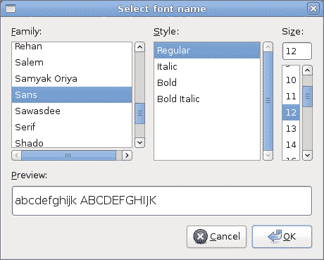
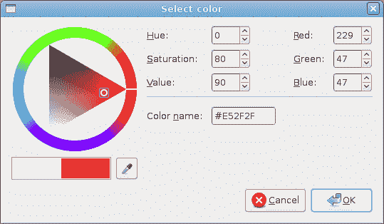

# PyGTK 中的对话框

> 原文： [http://zetcode.com/gui/pygtk/dialogs/](http://zetcode.com/gui/pygtk/dialogs/)

在 PyGTK 编程教程的这一部分中，我们将介绍对话框。

对话框窗口或对话框是大多数现代 GUI 应用程序必不可少的部分。 对话被定义为两个或更多人之间的对话。 在计算机应用程序中，对话框是一个窗口，用于与应用程序“对话”。 反之亦然。 对话框用于输入数据，修改数据，更改应用程序设置等。对话框是用户与计算机程序之间进行通信的重要手段。

## 消息框

消息对话框是方便的对话框，可向应用程序的用户提供消息。 该消息包含文本和图像数据。

`messages.py`

```
#!/usr/bin/python

# ZetCode PyGTK tutorial 
#
# This example shows message
# dialogs
#
# author: jan bodnar
# website: zetcode.com 
# last edited: February 2009

import gtk

class PyApp(gtk.Window): 
    def __init__(self):
        super(PyApp, self).__init__()

        self.set_size_request(250, 100)
        self.set_position(gtk.WIN_POS_CENTER)
        self.connect("destroy", gtk.main_quit)
        self.set_title("Message dialogs")

        table = gtk.Table(2, 2, True);

        info = gtk.Button("Information")
        warn = gtk.Button("Warning")
        ques = gtk.Button("Question")
        erro = gtk.Button("Error")

        info.connect("clicked", self.on_info)
        warn.connect("clicked", self.on_warn)
        ques.connect("clicked", self.on_ques)
        erro.connect("clicked", self.on_erro)

        table.attach(info, 0, 1, 0, 1)
        table.attach(warn, 1, 2, 0, 1)
        table.attach(ques, 0, 1, 1, 2)
        table.attach(erro, 1, 2, 1, 2)

        self.add(table)
        self.show_all()

    def on_info(self, widget):
        md = gtk.MessageDialog(self, 
            gtk.DIALOG_DESTROY_WITH_PARENT, gtk.MESSAGE_INFO, 
            gtk.BUTTONS_CLOSE, "Download completed")
        md.run()
        md.destroy()

    def on_erro(self, widget):
        md = gtk.MessageDialog(self, 
            gtk.DIALOG_DESTROY_WITH_PARENT, gtk.MESSAGE_ERROR, 
            gtk.BUTTONS_CLOSE, "Error loading file")
        md.run()
        md.destroy()

    def on_ques(self, widget):
        md = gtk.MessageDialog(self, 
            gtk.DIALOG_DESTROY_WITH_PARENT, gtk.MESSAGE_QUESTION, 
            gtk.BUTTONS_CLOSE, "Are you sure to quit?")
        md.run()
        md.destroy()

    def on_warn(self, widget):
        md = gtk.MessageDialog(self, 
            gtk.DIALOG_DESTROY_WITH_PARENT, gtk.MESSAGE_WARNING, 
            gtk.BUTTONS_CLOSE, "Unallowed operation")
        md.run()
        md.destroy()

PyApp()
gtk.main()

```

在我们的示例中，我们将显示四种消息对话框。 信息，警告，问题和错误消息对话框。

```
info = gtk.Button("Information")
warn = gtk.Button("Warning")
ques = gtk.Button("Question")
erro = gtk.Button("Error")

```

我们有四个按钮。 这些按钮中的每个按钮都会显示不同类型的消息对话框。

```
md = gtk.MessageDialog(self, 
    gtk.DIALOG_DESTROY_WITH_PARENT, gtk.MESSAGE_INFO, 
        gtk.BUTTONS_CLOSE, "Download completed")
md.run()
md.destroy()

```

如果单击信息按钮，将显示“信息”对话框。 `MESSAGE_INFO`指定对话框的类型。 `BUTTONS_CLOSE`指定要在对话框中显示的按钮。 最后一个参数是显示的消息。 该对话框使用`run()`方法显示。 程序员还必须调用`destroy()`或`hide()`方法。


## `AboutDialog`

`AboutDialog`显示有关应用程序的信息。 `AboutDialog`可以显示徽标，应用程序名称，版本，版权，网站或许可证信息。 也有可能对作者，文档撰写者，翻译者和艺术家予以赞扬。

`aboutdialog.py`

```
#!/usr/bin/python

# ZetCode PyGTK tutorial 
#
# This example demonstrates the
# AboutDialog dialog
#
# author: jan bodnar
# website: zetcode.com 
# last edited: February 2009

import gtk

class PyApp(gtk.Window): 
    def __init__(self):
        super(PyApp, self).__init__()
        self.set_size_request(300, 150)
        self.set_position(gtk.WIN_POS_CENTER)
        self.connect("destroy", gtk.main_quit)
        self.set_title("About battery")

        button = gtk.Button("About")
        button.set_size_request(80, 30)
        button.connect("clicked", self.on_clicked)

        fix = gtk.Fixed()
        fix.put(button, 20, 20)

        self.add(fix)
        self.show_all()

    def on_clicked(self, widget):
        about = gtk.AboutDialog()
        about.set_program_name("Battery")
        about.set_version("0.1")
        about.set_copyright("(c) Jan Bodnar")
        about.set_comments("Battery is a simple tool for battery checking")
        about.set_website("http://www.zetcode.com")
        about.set_logo(gtk.gdk.pixbuf_new_from_file("battery.png"))
        about.run()
        about.destroy()

PyApp()
gtk.main()

```

该代码示例使用具有某些功能的`AboutDialog`。

```
about = gtk.AboutDialog()

```

我们创建一个`AboutDialog`。

```
about = gtk.AboutDialog()
about.set_program_name("Battery")
about.set_version("0.1")
about.set_copyright("(c) Jan Bodnar")

```

我们指定名称，版本和版权。

```
about.set_logo(gtk.gdk.pixbuf_new_from_file("battery.png"))

```

此行创建徽标。


Figure: AboutDialog

## `FontSelectionDialog`

`FontSelectionDialog`是用于选择字体的对话框。 它通常用于进行一些文本编辑或格式化的应用程序中。

`fontdialog.py`

```
#!/usr/bin/python

# ZetCode PyGTK tutorial 
#
# This example works with the
# FontSelection dialog
#
# author: jan bodnar
# website: zetcode.com 
# last edited: February 2009

import gtk
import pango

class PyApp(gtk.Window): 
    def __init__(self):
        gtk.Window.__init__(self)
        self.set_size_request(300, 150)
        self.set_position(gtk.WIN_POS_CENTER)
        self.connect("destroy", gtk.main_quit)
        self.set_title("Font Selection Dialog")

        self.label = gtk.Label("The only victory over love is flight.")
        button = gtk.Button("Select font")
        button.connect("clicked", self.on_clicked)

        fix = gtk.Fixed()
        fix.put(button, 100, 30)
        fix.put(self.label, 30, 90)
        self.add(fix)

        self.show_all()

    def on_clicked(self, widget):
        fdia = gtk.FontSelectionDialog("Select font name")
        response = fdia.run()

        if response == gtk.RESPONSE_OK:
            font_desc = pango.FontDescription(fdia.get_font_name())
            if font_desc:
                self.label.modify_font(font_desc)

        fdia.destroy()

PyApp()
gtk.main()

```

在代码示例中，我们有一个按钮和一个标签。 单击按钮显示`FontSelectionDialog`。

```
fdia = gtk.FontSelectionDialog("Select font name")

```

我们创建了`FontSelectionDialog.`

```
if response == gtk.RESPONSE_OK:
    font_desc = pango.FontDescription(fdia.get_font_name())
    if font_desc:
        self.label.modify_font(font_desc)

```

如果单击“确定”按钮，则标签小部件的字体将更改为我们在对话框中选择的字体。



Figure: FontSelectionDialog

## `ColorSelectionDialog`

`ColorSelectionDialog`是用于选择颜色的对话框。

`colordialog.py`

```
#!/usr/bin/python

# ZetCode PyGTK tutorial 
#
# This example works with the
# ColorSelection dialog
#
# author: jan bodnar
# website: zetcode.com 
# last edited: February 2009

import gtk

class PyApp(gtk.Window): 
    def __init__(self):
        super(PyApp, self).__init__()

        self.set_size_request(300, 150)
        self.set_position(gtk.WIN_POS_CENTER)
        self.connect("destroy", gtk.main_quit)
        self.set_title("Color Selection Dialog")

        self.label = gtk.Label("The only victory over love is flight.")
        button = gtk.Button("Select color")
        button.connect("clicked", self.on_clicked)

        fix = gtk.Fixed()
        fix.put(button, 100, 30)
        fix.put(self.label, 30, 90)
        self.add(fix)

        self.show_all()

    def on_clicked(self, widget):
        cdia = gtk.ColorSelectionDialog("Select color")
        response = cdia.run()

        if response == gtk.RESPONSE_OK:
            colorsel = cdia.colorsel
            color = colorsel.get_current_color()
            self.label.modify_fg(gtk.STATE_NORMAL, color)

        cdia.destroy()

PyApp()
gtk.main()

```

该示例与上一个示例非常相似。 这次我们更改标签的颜色。

```
cdia = gtk.ColorSelectionDialog("Select color")

```

我们创建`ColorSelectionDialog`。

```
if response == gtk.RESPONSE_OK:
    colorsel = cdia.colorsel
    color = colorsel.get_current_color()
    self.label.modify_fg(gtk.STATE_NORMAL, color)

```

如果用户按下 OK，我们将获得颜色并修改标签的颜色。



Figure: ColorSelectionDialog

在 PyGTK 编程教程的这一部分中，我们使用了 PyGTK 内置对话框。