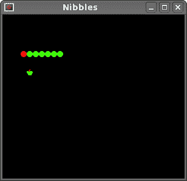

# 轻咬

> 原文： [http://zetcode.com/gui/phpgtktutorial/nibbles/](http://zetcode.com/gui/phpgtktutorial/nibbles/)

在 PHP GTK 编程教程的这一部分中，我们将创建一个 Nibbles 游戏克隆。

Nibbles 是较旧的经典视频游戏。 它最初是在 70 年代后期创建的。 后来它被带到 PC 上。 在这个游戏中，玩家控制蛇。 目的是尽可能多地吃苹果。 蛇每次吃一个苹果，它的身体就会长大。 蛇必须避开墙壁和自己的身体。

## 发展历程

蛇的每个关节的大小为 10px。 蛇由光标键控制。 最初，蛇具有三个关节。 游戏立即开始。 游戏结束后，我们在窗口中心显示“ Game Over”消息。

该代码分为两个文件。 board.php 和 nibbles.php。

```
<?php

// board.php

define("WIDTH", 300);
define("HEIGHT", 270);
define("DOT_SIZE", 10);
define("ALL_DOTS", WIDTH * HEIGHT / (DOT_SIZE * DOT_SIZE));
define("RAND_POS", 26);

class Board extends GtkDrawingArea {

    public function __construct() { 

        parent::__construct(); 

        $this->modify_bg(Gtk::STATE_NORMAL, new GdkColor(6400, 6400, 6440));

        $this->connect('expose_event', array($this, 'on_expose')); 

        $this->init_game();

    } 

    public function init_game() {

        $this->x = array_fill(0, ALL_DOTS, 0);
        $this->y = array_fill(0, ALL_DOTS, 0);

        $this->left = false;
        $this->right = true;
        $this->up = false;
        $this->down = false;
        $this->inGame = true;
        $this->dots = 3;

        for ($i=0; $i<=$this->dots; $i++) {
            $this->x[$i] = 50 - $i * 10;
            $this->y[$i] = 50;
        }

        try {
            $this->dot = CairoImageSurface::createFromPng("dot.png");
            $this->head = CairoImageSurface::createFromPng("head.png");
            $this->apple = CairoImageSurface::createFromPng("apple.png");
        } catch( Exception  $e) {
            echo $e->getMessage();
            echo "cannot load images";
            exit;
        }

        $this->locate_apple();
        $this->set_can_focus(true);

        Gtk::timeout_add(100, array($this, 'on_timer'));

     }

    public function on_timer() {

        if ($this->inGame) {
            $this->check_apple();
            $this->check_collision();
            $this->move();
            $this->queue_draw();
            return true;
        } else {
            return false;
        }
    }

    public function on_expose() {

        $cr = $this->window->cairo_create();

        if ($this->inGame) {
            $this->draw_objects($cr);
        } else {
            $this->game_over($cr);
        }
    }

    public function draw_objects($cr) {

        $cr->SetSourceRgb(0, 0, 0);
        $cr->paint();

        $cr->setSourceSurface($this->apple, 
            $this->apple_x, $this->apple_y);
        $cr->paint();

        for ($z=0; $z<=$this->dots; $z++) {
            if ($z == 0) {
                $cr->setSourceSurface($this->head, 
                    $this->x[$z], $this->y[$z]);
                $cr->paint();
            } else {
                $cr->setSourceSurface($this->dot, 
                    $this->x[$z], $this->y[$z]);
                $cr->paint();
            } 
        }
    }

    public function game_over($cr) {

        $c_x = $this->get_allocation()->width/2;
        $c_y = $this->get_allocation()->height/2;

        $cr->SetFontSize(15);
        $cr->SetSourceRgb(65535, 65535, 65535);

        $te = $cr->TextExtents("Game Over");

        $cr->MoveTo($c_x - $te['width']/2, $c_y);
        $cr->ShowText("Game Over");
    }

    public function check_apple() {

        if ($this->x[0] == $this->apple_x 
                and $this->y[0] == $this->apple_y) {
            $this->dots = $this->dots + 1;
            $this->locate_apple();
        }
    }

    public function move() {

        $z = $this->dots;

        while ($z > 0) {
            $this->x[$z] = $this->x[($z - 1)];
            $this->y[$z] = $this->y[($z - 1)];
            $z--;
        }

        if ($this->left) {
            $this->x[0] -= DOT_SIZE;
        }

        if ($this->right) {
            $this->x[0] += DOT_SIZE;
        }

        if ($this->up) {
            $this->y[0] -= DOT_SIZE;
        }

        if ($this->down) {
            $this->y[0] += DOT_SIZE;
        }

     }

    public function check_collision() {

        $z = $this->dots;

        while ($z > 0) {
            if ($z > 4 and $this->x[0] == $this->x[$z] 
                       and $this->y[0] == $this->y[$z]) {
                $this->inGame = false;
            }
            $z--;
        }

        if ($this->y[0] > HEIGHT - DOT_SIZE) {
            $this->inGame = false;
        }

        if ($this->y[0] < 0) {
            $this->inGame = false;
        }

        if ($this->x[0] > WIDTH - DOT_SIZE) {
            $this->inGame = false;
        }

        if ($this->x[0] < 0) {
            $this->inGame = false;
        }

    }

    public function locate_apple() {

        $r = rand(0, RAND_POS);
        $this->apple_x = $r * DOT_SIZE;
        $r = rand(0, RAND_POS);
        $this->apple_y = $r * DOT_SIZE;
    }

    public function on_key_down($event) {

        $key = $event->keyval;

        if ($key == Gdk::KEY_Left and !$this->right) {
            $this->left = true;
            $this->up = false;
            $this->down = false;
        }

        if ($key == Gdk::KEY_Right and !$this->left) {
            $this->right = true;
            $this->up = false;
            $this->down = false;
        }

        if ($key == Gdk::KEY_Up and !$this->down) {
            $this->up = true;
            $this->right = false;
            $this->left = false;
        }

        if ($key == Gdk::KEY_Down and !$this->up) {
            $this->down = true;
            $this->right = false;
            $this->left = false;
        }
    }
}
?>

```

这是 board.php 文件。

```
define("WIDTH", 300);
define("HEIGHT", 270);
define("DOT_SIZE", 10);
define("ALL_DOTS", WIDTH * HEIGHT / (DOT_SIZE * DOT_SIZE));
define("RAND_POS", 26);

```

`WIDTH`和`HEIGHT`常数确定电路板的大小。 `DOT_SIZE`是苹果的大小和蛇的点。 `ALL_DOTS`常数定义了板上可能的最大点数。 `RAND_POS`常数用于计算苹果的随机位置。

```
$this->x = array_fill(0, ALL_DOTS, 0);
$this->y = array_fill(0, ALL_DOTS, 0);

```

这两个数组存储蛇的所有可能关节的 x，y 坐标。

`init_game()`方法初始化变量，加载图像并启动超时功能。

```
if ($this->inGame) {
    $this->check_apple();
    $this->check_collision();
    $this->move();
    $this->queue_draw();
    return true;
} else {
    return false;
}

```

每 140 毫秒，将调用`on_timer()`方法。 如果我们参与了游戏，我们将调用三种构建游戏逻辑的方法。 `queue_draw()`方法强制重新绘制窗口小部件。 这将反映游戏板上的变化。 否则，我们返回`false`，它将停止计时器事件。

```
$cr = $this->window->cairo_create();

if ($this->inGame) {
    $this->draw_objects($cr);
} else {
    $this->game_over($cr);
}    

```

在`on_expose()`方法内部，我们检查`$this-&gt;inGame`变量。 如果为真，则绘制对象。 苹果和蛇的关节。 否则，我们显示“游戏结束”文本。

```
public function draw_objects($cr) {

    $cr->SetSourceRgb(0, 0, 0);
    $cr->paint();

    $cr->setSourceSurface($this->apple, 
        $this->apple_x, $this->apple_y);
    $cr->paint();

    for ($z=0; $z<=$this->dots; $z++) {
        if ($z == 0) {
            $cr->setSourceSurface($this->head, 
                $this->x[$z], $this->y[$z]);
            $cr->paint();
        } else {
            $cr->setSourceSurface($this->dot, 
                $this->x[$z], $this->y[$z]);
            $cr->paint();
        } 
    }
}

```

`draw_objects()`方法绘制苹果和蛇的关节。 蛇的第一个关节是其头部，用红色圆圈表示。

如果游戏结束，则调用`game_over()`方法。 此方法在窗口中心显示“游戏结束”。

```
$c_x = $this->get_allocation()->width/2;
$c_y = $this->get_allocation()->height/2;

```

在这里，我们获得窗口的中心点。

```
$cr->SetFontSize(15);
$cr->SetSourceRgb(65535, 65535, 65535);

```

我们设置文本的字体大小和颜色。 背景为黑色，因此字体将为白色。

```
$te = $cr->TextExtents("Game Over");

```

我们得到字符串的文本范围。 为了将文本放置在窗口的中央，这是必需的。

```
$cr->MoveTo($c_x - $te['width']/2, $c_y);
$cr->ShowText("Game Over");

```

我们移到中心并显示文本。

```
public function check_apple() {

    if ($this->x[0] == $this->apple_x 
            and $this->y[0] == $this->apple_y) {
        $this->dots = $this->dots + 1;
        $this->locate_apple();
    }
}

```

`check_apple()`方法检查蛇是否击中了苹果对象。 如果是这样，我们添加另一个蛇形关节并调用`locate_apple()`方法，该方法将随机放置一个新的 Apple 对象。

在`move()`方法中，我们有游戏的密钥算法。 要了解它，请看一下蛇是如何运动的。 您控制蛇的头。 您可以使用光标键更改其方向。 其余关节在链上向上移动一个位置。 第二关节移动到第一个关节的位置，第三关节移动到第二个关节的位置，依此类推。

```
while ($z > 0) {
    $this->x[$z] = $this->x[($z - 1)];
    $this->y[$z] = $this->y[($z - 1)];
    $z--;
}

```

该代码将关节向上移动。

```
if ($this->left) {
    $this->x[0] -= DOT_SIZE;
}

```

将头向左移动。

在`check_collision()`方法中，我们确定蛇是否击中了自己或撞墙之一。

```
while ($z > 0) {
    if ($z > 4 and $this->x[0] == $this->x[$z] 
                and $this->y[0] == $this->y[$z]) {
        $this->inGame = false;
    }
    $z--;
}

```

如果蛇用头撞到关节之一，我们就结束游戏。

```
if ($this->y[0] > HEIGHT - DOT_SIZE) {
  $this->inGame = false;
}

```

如果蛇击中了棋盘的底部，我们就结束了游戏。

`locate_apple()`方法在板上随机放置一个苹果。

```
$r = rand(0, RAND_POS);

```

我们得到一个从 0 到 RAND_POS-1 的随机数。

```
$this->apple_x = $r * DOT_SIZE;
...
$this->apple_y = $r * DOT_SIZE;

```

这些行设置了 apple 对象的 x，y 坐标。

在 Board 类的`on_key_down()`方法中，我们确定按下的键。

```
if ($key == Gdk::KEY_Left and !$this->right) {
    $this->left = true;
    $this->up = false;
    $this->down = false;
}

```

如果单击左光标键，则将`$this-&gt;left`变量设置为 true。 在`move()`方法中使用此变量来更改蛇对象的坐标。 还要注意，当蛇向右行驶时，我们不能立即向左转。

```
<?php

/* 
ZetCode PHP GTK tutorial

In this program, we create a Nibbles
game clone. 

author: Jan Bodnar
website: www.zetcode.com
last modified: September 2011
*/

include 'board.php';

class Example extends GtkWindow { 

    public function __construct() { 

        parent::__construct(); 

        $this->init_ui();

    } 

    private function init_ui() {

        $this->set_title('Nibbles');         
        $this->connect_simple('destroy', array('gtk', 'main_quit')); 

        $this->board = new Board();
        $this->board->connect('key-press-event', array($this, 'on_key_down'));

        $this->add($this->board);

        $this->set_default_size(300, 270); 
        $this->set_position(GTK::WIN_POS_CENTER);
        $this->show_all();         
    }

    public function on_key_down($sender, $event) {

        $key = $event->keyval;
        $this->board->on_key_down($event);
    }
} 

new Example(); 
Gtk::main();

?>

```

这是 nibbles.php 文件。 在此文件中，我们设置了 Nibbles 游戏。

```
public function on_key_down($sender, $event) {

    $key = $event->keyval;
    $this->board->on_key_down($event);
}

```

在本课程中，我们捕获按键事件。 并将处理委托给板类的`on_key_down()`方法。



Figure: Nibbles

这是用 GTK 库和 PHP 编程语言编程的 Nibbles 电脑游戏。