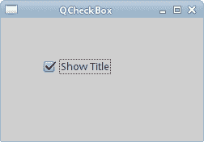
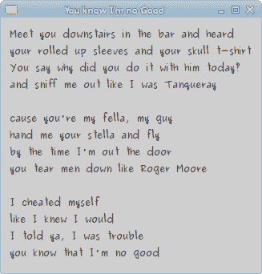
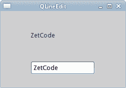
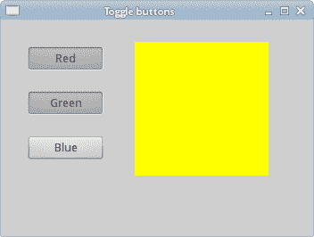
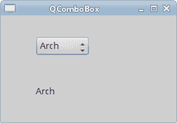

# Qyoto 中的小部件

> 原文： [http://zetcode.com/gui/csharpqyoto/widgets/](http://zetcode.com/gui/csharpqyoto/widgets/)

在 Qyoto C＃编程教程的这一部分中，我们将介绍 Qyoto 小部件。

小部件是 GUI 应用程序的基本构建块。 多年来，几个小部件已成为所有 OS 平台上所有工具包中的标准。 例如，按钮，复选框或滚动条。 Qyoto 有一组丰富的小部件，可以满足大多数编程需求。 可以将更多专门的窗口小部件创建为自定义窗口小部件。

## QCheckBox

`QCheckBox`是具有两种状态的窗口小部件：开和关。 接通状态通过复选标记显示。 它用来表示一些布尔属性。 QCheckBox 小部件提供一个带有文本标签的复选框。

```
using System;
using QtCore;
using QtGui;

/**
 * ZetCode Qyoto C# tutorial
 *
 * This program uses QCheckBox
 * widget to show/hide the title
 * of the window.
 *
 * @author Jan Bodnar
 * website zetcode.com
 * last modified October 2012
 */

public class QyotoApp : QWidget 
{
    public QyotoApp() 
    {
        WindowTitle = "QCheckBox";

        SetupUI();

        Resize(250, 150);
        Move(300, 300);
        Show();
    }    

    public void SetupUI() 
    {       
        QCheckBox cb = new QCheckBox("Show Title", this);
        cb.Checked = true;
        cb.Move(50, 50);

        cb.StateChanged += ShowTitle;
    }

    [Q_SLOT]
    public void ShowTitle(int state) 
    {
        if (state == (int) CheckState.Checked) 
        {
            WindowTitle = "QCheckBox";
        } else {
            WindowTitle = "";
        }
    }

    [STAThread]
    public static int Main(String[] args) 
    {
        new QApplication(args);
        new QyotoApp();
        return QApplication.Exec();
    }
}

```

在我们的示例中，我们在窗口上放置了一个复选框。 复选框显示/隐藏窗口的标题。

```
WindowTitle = "QCheckBox";

```

在构建窗口期间，我们为窗口设置标题。

```
QCheckBox cb = new QCheckBox("Show Title", this);

```

`QCheckBox`小部件已创建。 构造函数的第一个参数是其文本标签。 第二个参数是父窗口小部件。

```
cb.Checked = true;

```

标题在应用程序的开始处可见。 因此，也必须选中该复选框。 我们通过`Checked`属性选中该复选框。

```
cb.StateChanged += ShowTitle;

```

我们将`ShowTitle()`方法插入`StateChange`事件。 复选框的状态更改时，将发出事件。

```
[Q_SLOT]
public void ShowTitle(int state) 
{
   ...
}

```

方法定义之前带有`Q_SLOT`属性。 此属性通知编译器有关自定义插槽的信息。

```
if (state == (int) CheckState.Checked) 
{
    WindowTitle = "QCheckBox";
} else {
    WindowTitle = "";
}

```

根据复选框的状态，我们显示或隐藏窗口的标题。



Figure: QCheckBox

## QLabel

`QLabel`小部件用于显示文本或图像。 没有用户交互。

```
using System;
using QtCore;
using QtGui;

/**
 * ZetCode Qyoto C# tutorial
 *
 * This program uses QLabel to 
 * show lyrics of a song.
 *
 * @author Jan Bodnar
 * website zetcode.com
 * last modified October 2012
 */

public class QyotoApp : QWidget 
{
    public QyotoApp() 
    {
        WindowTitle = "You know I'm no Good";

        InitUI();

        Resize(250, 150);
        Move(300, 300);
        Show();
    }

    public void InitUI() 
    {
           string text = @"Meet you downstairs in the bar and heard
your rolled up sleeves and your skull t-shirt
You say why did you do it with him today?
and sniff me out like I was Tanqueray

cause you're my fella, my guy
hand me your stella and fly
by the time I'm out the door
you tear men down like Roger Moore

I cheated myself
like I knew I would
I told ya, I was trouble
you know that I'm no good";

        QLabel label = new QLabel(text, this);
        label.Font = new QFont("Purisa", 9);

        QVBoxLayout vbox = new QVBoxLayout();
        vbox.AddWidget(label);
        Layout = vbox;
    }

    [STAThread]
    public static int Main(String[] args) 
    {
        new QApplication(args);
        new QyotoApp();
        return QApplication.Exec();
    }
}

```

我们的示例在窗口中显示了歌曲的歌词。

```
string text = @"Meet you downstairs in the bar and heard
...

```

我们定义了多行文字。 多行文本在 C＃语言中以@字符开头。

```
QLabel label = new QLabel(text, this);
label.Font = new QFont("Purisa", 9);

```

我们创建标签小部件并更改其字体。

```
QVBoxLayout vbox = new QVBoxLayout();
vbox.AddWidget(label);
Layout = vbox;

```

代替手动编码标签的位置和大小，我们将标签放入盒子布局中。



Figure: QLabel

## QLineEdit

`QLineEdit`是一个小部件，允许输入和编辑单行纯文本。 QLineEdit 小部件具有撤消/重做，剪切/粘贴和拖动&放置功能。

```
using System;
using QtCore;
using QtGui;

/**
 * ZetCode Qyoto C# tutorial
 *
 * This program shows text
 * which is entered in a QLineEdit
 * widget in a QLabel widget.
 *
 * @author Jan Bodnar
 * website zetcode.com
 * last modified October 2012
 */

public class QyotoApp : QWidget 
{
    QLabel label;

    public QyotoApp() 
    {
        WindowTitle = "QLineEdit";

        InitUI();

        Resize(250, 150);
        Move(400, 300);
        Show();
    }    

    public void InitUI() 
    {        
        label = new QLabel(this);

        QLineEdit edit = new QLineEdit(this);
        edit.TextChanged += OnChanged;

        edit.Move(60, 100);
        label.Move(60, 40);
    }

    [Q_SLOT]
    public void OnChanged(string text) 
    {
        label.Text = text;
        label.AdjustSize();
    }

    [STAThread]
    public static int Main(string[] args) 
    {
        new QApplication(args);
        new QyotoApp();
        return QApplication.Exec();
    }
}

```

在我们的示例中，我们显示了两个小部件。 行编辑和标签小部件。 输入到行编辑中的文本显示在标签窗口小部件中。

```
QLineEdit edit = new QLineEdit(this);

```

`QLineEdit`小部件已创建。

```
edit.TextChanged += OnChanged;

```

当我们在行编辑中键入或删除某些文本时，将触发`OnChanged()`方法。 该方法采用字符串参数。

```
[Q_SLOT]
public void OnChanged(string text) 
{
    label.Text = text;
    label.AdjustSize();
}

```

在`OnChanged()`方法中，我们将行编辑的内容设置为标签窗口小部件。 `AdjustSize()`方法确保所有文本都是可见的。



Figure: QLineEdit widget

## 切换按钮

切换按钮是设置了可检查标志的按钮。 切换按钮是具有两种状态的按钮。 已按下但未按下。 通过单击可以在这两种状态之间切换。 在某些情况下此功能非常合适。

```
using System;
using QtCore;
using QtGui;

/**
 * ZetCode Qyoto C# tutorial
 *
 * This program uses toggle buttons to
 * change the background colour of
 * a widget.
 *
 * @author Jan Bodnar
 * website zetcode.com
 * last modified October 2012
 */

public class QyotoApp : QWidget 
{
    QWidget square;
    QColor col;

    QPushButton redb;
    QPushButton greenb;
    QPushButton blueb;

    public QyotoApp() 
    {
        WindowTitle = "Toggle buttons";

        InitUI();

        Resize(350, 240);
        Move(400, 300);
        Show();
    }

    private void InitUI() 
    {
        col = new QColor();

        redb = new QPushButton("Red", this);
        redb.Checkable = true;
        greenb = new QPushButton("Green", this);
        greenb.Checkable = true;
        blueb = new QPushButton("Blue", this);
        blueb.Checkable = true;

        redb.Toggled += OnToggled;
        greenb.Toggled += OnToggled;
        blueb.Toggled += OnToggled;

        square = new QWidget(this);
        square.StyleSheet = "QWidget { background-color: black }";

        redb.Move(30, 30);
        greenb.Move(30, 80);
        blueb.Move(30, 130);
        square.SetGeometry(150, 25, 150, 150);
    }

    [Q_SLOT]
    public void OnToggled(bool @checked) 
    {
        int red = col.Red;
        int green = col.Green;
        int blue = col.Blue;

        if (redb.Checked) 
        {
            red = 255;
        } else {
            red = 0;
        }

        if (greenb.Checked) 
        {
            green = 255;
        } else {
            green = 0;
        }

        if (blueb.Checked) 
        {
            blue = 255;
        } else {
            blue = 0;
        }

        col = new QColor(red, green, blue);

        string sheet = System.String.Format("QWidget {{ background-color: {0} }}", 
            col.Name());
        square.StyleSheet = sheet;
    }

    [STAThread]    
    public static int Main(string[] args) 
    {
        new QApplication(args);
        new QyotoApp();
        return QApplication.Exec();
    }
}

```

在代码示例中，我们使用三个切换按钮来更改矩形小部件的颜色。

```
QWidget square;
QColor color;

QPushButton redb;
QPushButton greenb;
QPushButton blueb;

```

我们定义了五个对象。 方形小部件是`QWidget`，它显示颜色。 `color`变量用于保存颜色值。 这三个按钮是切换按钮，用于混合颜色值。

```
redb = new QPushButton("Red", this);
redb.Checkable = true;

```

我们创建一个`QPushButton`小部件。 `Checkable`属性将按钮更改为切换按钮。

```
redb.Toggled += OnToggled;
greenb.Toggled += OnToggled;
blueb.Toggled += OnToggled;

```

所有三个按钮都插入到一个方法调用中，即`OnToggled()`方法。

```
square = new QWidget(this);
square.StyleSheet = "QWidget { background-color: black }";

```

我们创建方形小部件。 一开始是黑色的。 在 Qyoto 中，我们使用样式表来自定义小部件的外观。

在`OnToggled()`方法内部，我们确定颜色值并将正方形小部件更新为新颜色。

```
int red = col.Red;
int green = col.Green;
int blue = col.Blue;

```

在这里，我们确定方形小部件的当前颜色。

```
if (redb.Checked) 
{
    red = 255;
} else {
    red = 0;
}

```

根据红色切换按钮的状态，更改颜色的红色部分。

```
col = new QColor(red, green, blue);

```

我们创建一个新的颜色值。

```
string sheet = System.String.Format("QWidget {{ background-color: {0} }}", 
    col.Name());        

```

我们使用 C＃Format 方法创建适当的样式表。

```
square.StyleSheet = sheet;

```

正方形的颜色已更新。



Figure: Toggle buttons

## QComboBox

`QComboBox`是一个小部件，允许用户从选项列表中进行选择。 这是一个显示当前项目的选择小部件，可以弹出可选择项目的列表。 组合框可能是可编辑的。 它以占用最少屏幕空间的方式向用户显示选项列表。

```
using System;
using QtCore;
using QtGui;

/**
 * ZetCode Qyoto C# tutorial
 *
 * This program uses the QComboBox widget.
 * The option selected from the combo box is
 * displayed in the label widget.
 *
 * @author Jan Bodnar
 * website zetcode.com
 * last modified October 2012
 */

public class QyotoApp : QWidget 
{    
    QLabel label;

    public QyotoApp() 
    {
        WindowTitle = "QComboBox";

        InitUI();

        Resize(250, 150);
        Move(300, 300);
        Show();
    }

    public void InitUI() 
    {       
        label = new QLabel("Ubuntu", this);

        QComboBox combo = new QComboBox(this);
        combo.AddItem("Ubuntu");
        combo.AddItem("Arch");
        combo.AddItem("Fedora");
        combo.AddItem("Red Hat");
        combo.AddItem("Gentoo");

        combo.Move(50, 30);
        label.Move(50, 100);

        combo.ActivatedString += OnActivated;
    }

    [Q_SLOT]
    public void OnActivated(string text) 
    {
        label.Text = text;
        label.AdjustSize();
    }

    [STAThread]
    public static int Main(String[] args) 
    {
        new QApplication(args);
        new QyotoApp();
        return QApplication.Exec();
    }
}

```

在我们的代码示例中，我们有两个小部件。 组合框和标签小部件。 从组合框中选择的选项显示在标签中。

```
label = new QLabel("Ubuntu", this);

```

这是一个标签，它将显示组合框中当前选择的选项。

```
QComboBox combo = new QComboBox(this);

```

我们创建`QComboBox`小部件的实例。

```
combo.AddItem("Ubuntu");
combo.AddItem("Arch");
combo.AddItem("Fedora");
combo.AddItem("Red Hat");
combo.AddItem("Gentoo");

```

组合框将填充值。

```
combo.ActivatedString += OnActivated;

```

当我们从组合框中选择一个选项时，将触发`OnActivated()`方法。

```
[Q_SLOT]
public void OnActivated(string text) 
{
    label.Text = text;
    label.AdjustSize();
}

```

在`OnActivated()`方法中，我们将标签小部件更新为从组合框中选择的当前字符串。



Figure: QComboBox widget

在 Qyoto C＃教程的这一部分中，我们介绍了几个 Qyoto 小部件。