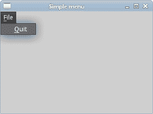
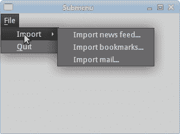
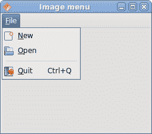
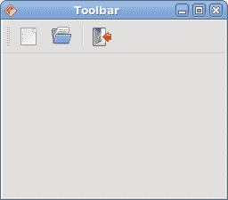
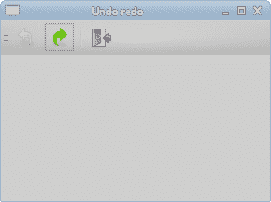

# Qyoto 中的菜单和工具栏

> 原文： [http://zetcode.com/gui/csharpqyoto/menustoolbars/](http://zetcode.com/gui/csharpqyoto/menustoolbars/)

在 Qyoto C＃编程教程的这一部分中，我们将使用菜单和工具栏。

菜单栏是 GUI 应用程序中最可见的部分之一。 它是位于各个菜单中的一组命令。 菜单将我们可以在应用程序中使用的命令分组。 使用工具栏可以快速访问最常用的命令。

## 简单菜单

第一个示例将显示一个简单的菜单。

```
using System;
using QtCore;
using QtGui;

/**
 * ZetCode Qyoto C# tutorial
 *
 * This program shows a simple
 * menu. It has one action, which
 * will terminate the program, when
 * selected. 
 *
 * @author Jan Bodnar
 * website zetcode.com
 * last modified October 2012
 */

public class QyotoApp : QMainWindow 
{    
    public QyotoApp() 
    {
        WindowTitle = "Simple menu";

        InitUI();

        Resize(300, 200);
        Move(300, 300);
        Show();
    }

    private void InitUI() 
    {
        QAction quit = new QAction("&Quit", this);

        QMenu file = MenuBar.AddMenu("&File");
        file.AddAction(quit);

        Connect(quit, SIGNAL("triggered()"), qApp, SLOT("quit()"));
    }

    [STAThread]
    public static int Main(String[] args) 
    {
        new QApplication(args);
        new QyotoApp();
        return QApplication.Exec();
    }
}

```

我们有一个菜单栏，一个菜单和一个动作。 为了使用菜单，我们必须继承`QMainWindow`小部件。

```
QAction quit = new QAction("&Quit", this);

```

此代码行创建一个`QAction`。 每个`QMenu`具有一个或多个动作对象。 注意＆字符（&）。 它为以下项目创建快捷方式： `Alt` + `Q` 。 它还强调了 Q 字符。 下拉文件菜单时，该快捷方式处于活动状态。

```
QMenu file = MenuBar.AddMenu("&File");
file.AddAction(quit);

```

我们创建一个`QMenu`对象。 ＆字符创建快捷方式： `Alt` + `F` 。 连续的快捷方式 `Alt` + `F` ， `Alt` + `Q` 终止应用程序。

```
Connect(quit, SIGNAL("triggered()"), qApp, SLOT("quit()"));

```

当我们从菜单中选择此选项时，应用程序终止。



Figure: Simple menu

## 创建一个子菜单

子菜单是插入另一个菜单对象的菜单。 下一个示例对此进行了演示。

```
using System;
using QtCore;
using QtGui;

/**
 * ZetCode Qyoto C# tutorial
 *
 * This program creates a
 * submenu.
 *
 * @author Jan Bodnar
 * website zetcode.com
 * last modified October 2012
 */

public class QyotoApp : QMainWindow 
{    
    public QyotoApp() 
    {
        WindowTitle = "Submenu";

        InitUI();

        Resize(300, 200);
        Move(300, 300);
        Show();
    }

    private void InitUI() 
    {
        QAction quit = new QAction("&Quit", this);

        QMenu file = MenuBar.AddMenu("&File");
        QMenu impm = new QMenu("Import");

        QAction seeds = new QAction("Import news feed...", this);
        QAction marks = new QAction("Import bookmarks...", this);
        QAction mail = new QAction("Import mail...", this);

        impm.AddAction(seeds);
        impm.AddAction(marks);
        impm.AddAction(mail);

        file.AddMenu(impm);
        file.AddAction(quit);

        Connect(quit, SIGNAL("triggered()"), qApp, SLOT("quit()"));
    }

    [STAThread]
    public static int Main(String[] args) 
    {
        new QApplication(args);
        new QyotoApp();
        return QApplication.Exec();
    }
}

```

在示例中，文件菜单的子菜单中有三个选项。

```
QMenu file = MenuBar.AddMenu("&File");
QMenu impm = new QMenu("Import");

```

我们有两个`QMenu`对象。 文件菜单和导入菜单。

```
QAction seeds = new QAction("Import news feed...", this);
QAction marks = new QAction("Import bookmarks...", this);
QAction mail = new QAction("Import mail...", this);

```

我们创建三个动作对象。

```
impm.AddAction(seeds);
impm.AddAction(marks);
impm.AddAction(mail);

```

我们将动作对象添加到导入菜单中。

```
file.AddMenu(impm);

```

最后，我们将导入菜单添加到文件菜单中。



Figure: Submenu

## 图像，菜单，分隔符

在以下示例中，我们将进一步增强以前的应用程序。 我们将在菜单中添加图标，使用快捷方式和分隔符。

```
using System;
using QtCore;
using QtGui;

/**
 * ZetCode Qyoto C# tutorial
 *
 * This program shows image menu items, a shorcut
 * and a separator.
 *
 * @author Jan Bodnar
 * website zetcode.com
 * last modified October 2012
 */

public class QyotoApp : QMainWindow 
{    
    public QyotoApp() 
    {
        WindowTitle = "Image menu";

        InitUI();

        Resize(300, 200);
        Move(300, 300);
        Show();
    }

    private void InitUI() 
    {
        QIcon newpix = new QIcon("new.png");
        QIcon openpix = new QIcon("open.png");
        QIcon quitpix = new QIcon("quit.png");

        QAction newa = new QAction(newpix, "&New", this);
        QAction open = new QAction(openpix, "&Open", this);
        QAction quit = new QAction(quitpix, "&Quit", this);
        quit.Shortcut = "CTRL+Q";

        QMenu file;
        file = MenuBar.AddMenu("&File");
        file.AddAction(newa);
        file.AddAction(open);
        file.AddSeparator();
        file.AddAction(quit);

        Connect(quit, SIGNAL("triggered()"), qApp, SLOT("quit()"));
    }

    [STAThread]
    public static int Main(String[] args) 
    {
        new QApplication(args);
        new QyotoApp();
        return QApplication.Exec();
    }
}

```

在我们的示例中，我们有一个包含三个动作的菜单。 如果我们选择退出操作，则实际上只有退出操作才可以执行某些操作。 我们还创建了一个分隔符和 Ctrl + Q 快捷键，它们将终止应用程序。

```
QIcon newpix = new QIcon("new.png");
QIcon openpix = new QIcon("open.png");
QIcon quitpix = new QIcon("quit.png");

```

这些是我们将在应用程序中使用的 PNG 图像。

```
QAction newa = new QAction(newpix, "&New", this);
QAction open = new QAction(openpix, "&Open", this);
QAction quit = new QAction(quitpix, "&Quit", this);

```

在这里，我们创建三个动作对象。 第一个参数是`QIcon`。

```
quit.Shortcut = "CTRL+Q";

```

这行创建一个快捷方式。 通过按下此快捷方式，我们将运行 quit 操作，这将退出应用程序。

```
file.AddSeparator();

```

我们创建一个分隔符。 分隔符是一条水平线，它使我们能够将菜单操作分组为一些逻辑部分。



Figure: Images, shortcut and a separator

## 工具栏

`QToolBar`类提供了一个可移动面板，其中包含一组控件，这些控件提供对应用程序操作的快速访问。

```
using System;
using QtCore;
using QtGui;

/**
 * ZetCode Qyoto C# tutorial
 *
 * This program creates a 
 * toolbar.
 *
 * @author Jan Bodnar
 * website zetcode.com
 * last modified October 2012
 */

public class QyotoApp : QMainWindow 
{    
    public QyotoApp() 
    {
        WindowTitle = "Toolbar";

        InitUI();

        Resize(300, 200);
        Move(300, 300);
        Show();
    }

    private void InitUI() 
    {
        QIcon newpi = new QIcon("new.png");
        QIcon openpi = new QIcon("open.png");
        QIcon quitpi = new QIcon("quit.png");

        QToolBar toolbar = AddToolBar("main toolbar");
        toolbar.AddAction(newpi, "New File");
        toolbar.AddAction(openpi, "Open File");
        toolbar.AddSeparator();
        QAction quit = toolbar.AddAction(quitpi,
            "Quit Application");

        Connect(quit, SIGNAL("triggered()"), qApp, SLOT("quit()"));
    }

    [STAThread]
    public static int Main(String[] args) 
    {
        new QApplication(args);
        new QyotoApp();
        return QApplication.Exec();
    }
}

```

我们创建一个带有三个动作对象和一个分隔符的工具栏。

```
QIcon newpi = new QIcon("new.png");
QIcon openpi = new QIcon("open.png");
QIcon quitpi = new QIcon("quit.png");

```

工具栏动作对象将显示这些图标。

```
QToolBar toolbar = AddToolBar("main toolbar");

```

`QMainWindow`类的`AddToolBar()`方法为应用程序创建一个工具栏。 文本字符串为工具栏命名。 此名称用于引用此工具栏，因为一个应用程序中可以有多个工具栏。 如果右键单击窗口区域，我们将看到一个可检查的选项，该选项显示/隐藏工具栏。

```
toolbar.AddSeparator();

```

我们创建一个垂直分隔符。

```
Connect(quit, SIGNAL("triggered()"), qApp, SLOT("quit()"));

```

当我们单击退出操作对象时，应用程序终止。



Figure: Toolbar

## 撤销重做

以下示例演示了如何停用工具栏上的工具栏按钮。 这是 GUI 编程中的常见做法。 例如，保存按钮。 如果我们将文档的所有更改都保存到磁盘上，则在大多数文本编辑器中，“保存”按钮将被停用。 这样，应用程序会向用户指示所有更改都已保存。

```
using System;
using QtCore;
using QtGui;

/**
 * ZetCode Qyoto C# tutorial
 *
 * This program disables/enables
 * toolbuttons on a toolbar.
 *
 * @author Jan Bodnar
 * website zetcode.com
 * last modified October 2012
 */

public class QyotoApp : QMainWindow 
{    
    int count = 0;
    QToolButton undoButton;
    QToolButton redoButton;

    public QyotoApp() 
    {
        WindowTitle = "Undo redo";

        InitUI();

        Resize(300, 200);
        Move(300, 300);
        Show();
    }

    private void InitUI() 
    {
        QIcon undoi = new QIcon("undo.png");
        QIcon redoi = new QIcon("redo.png");
        QIcon quitpi = new QIcon("quit.png");

        QToolBar toolbar = new QToolBar();
        undoButton = new QToolButton();
        redoButton = new QToolButton();

        QAction undoAction = new QAction(undoi, "Undo", undoButton);
        QAction redoAction = new QAction(redoi, "Redo", redoButton);

        undoButton.DefaultAction = undoAction;
        redoButton.DefaultAction = redoAction;

        toolbar.AddWidget(undoButton);
        toolbar.AddWidget(redoButton);
        toolbar.AddSeparator();

        QAction quit = toolbar.AddAction(quitpi, "Quit Application");

        undoButton.Triggered += Count;
        redoButton.Triggered += Count;

        Connect(quit, SIGNAL("triggered()"), qApp, SLOT("quit()"));

        AddToolBar(toolbar);        
    }

    [Q_SLOT]
    void Count(QAction action) 
    {
        if ("Undo".Equals(action.Text)) 
        {
            count += -1;
        } 
        else 
        {
            count += 1;
        }

        if (count <= 0) 
        {
            undoButton.SetDisabled(true);
            redoButton.SetDisabled(false);
        }

        if (count >= 5) 
        {
            undoButton.SetDisabled(false);
            redoButton.SetDisabled(true);
        }
    }

    [STAThread]
    public static int Main(String[] args) 
    {
        new QApplication(args);
        new QyotoApp();
        return QApplication.Exec();
    }
}

```

在我们的示例中，我们有三个`QAction`对象和一个分隔符。 在撤消或重做按钮上单击几下后，它们将被停用。 外观上，按钮显示为灰色。

```
int count = 0;

```

计数变量确定哪个按钮被激活和停用。

```
undoButton.Triggered += Count;
redoButton.Triggered += Count;

```

单击工具栏按钮，将发射`Triggered`信号。 我们将此信号连接到`Count()`方法。 它接收触发它的`QAction`对象。

```
if ("Undo".Equals(action.Text)) 
{
    count += -1;
} 
else 
{
    count += 1;
}

```

撤消工具栏按钮从计数变量中减去 1。 重做添加 1.根据计数变量的值，我们启用/禁用工具栏按钮。

```
if (count <= 0) 
{
    undoButton.SetDisabled(true);
    redoButton.SetDisabled(false);
}

```

`SetDisabled()`方法激活或停用工具栏按钮。



Figure: Undo redo

在 Qyoto C＃教程的这一部分中，我们提到了菜单和工具栏。