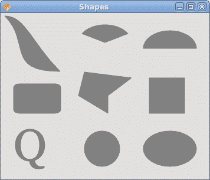
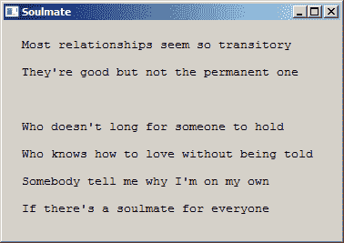

# 在京都绘画

> 原文： [http://zetcode.com/gui/csharpqyoto/painting/](http://zetcode.com/gui/csharpqyoto/painting/)

在 Qyoto C＃编程教程的这一部分中，我们将进行绘画。

当我们在京都进行绘画时，`QPainter`类非常有用。 绘画事件通过`OnPaintEvent()`方法接收。 若要进行自定义绘画，我们必须重新实现此方法。

## 图案

在《京都议定书》中，我们可以使用各种图案来填充形状的内部。

```
using System;
using QtCore;
using QtGui;

/**
 * ZetCode Qyoto C# tutorial
 *
 * This program draws nine rectangles.
 * The interiors are filled with
 * different built-in patterns.
 *
 * @author Jan Bodnar
 * website zetcode.com
 * last modified November 2012
 */

public class QyotoApp : QMainWindow 
{
    public QyotoApp() 
    {
        WindowTitle = "Patterns";

        PaintEvent += OnPaintEvent;

        Resize(350, 280);
        Move(300, 300);
        Show();
    }

    private void OnPaintEvent(object sender, QEventArgs<QPaintEvent> e)
    {
        QPainter ptr = new QPainter(this);
        DrawPatterns(ptr);

        ptr.End();
    }

    void DrawPatterns(QPainter ptr) 
    {
        ptr.SetPen(Qt.PenStyle.NoPen);

        ptr.SetBrush(Qt.BrushStyle.HorPattern);
        ptr.DrawRect(10, 15, 90, 60);

        ptr.SetBrush(Qt.BrushStyle.VerPattern);
        ptr.DrawRect(130, 15, 90, 60);

        ptr.SetBrush(Qt.BrushStyle.CrossPattern);
        ptr.DrawRect(250, 15, 90, 60);

        ptr.SetBrush(Qt.BrushStyle.Dense7Pattern);
        ptr.DrawRect(10, 105, 90, 60);

        ptr.SetBrush(Qt.BrushStyle.Dense6Pattern);
        ptr.DrawRect(130, 105, 90, 60);

        ptr.SetBrush(Qt.BrushStyle.Dense5Pattern);
        ptr.DrawRect(250, 105, 90, 60);

        ptr.SetBrush(Qt.BrushStyle.BDiagPattern);
        ptr.DrawRect(10, 195, 90, 60);

        ptr.SetBrush(Qt.BrushStyle.FDiagPattern);
        ptr.DrawRect(130, 195, 90, 60);

        ptr.SetBrush(Qt.BrushStyle.DiagCrossPattern);
        ptr.DrawRect(250, 195, 90, 60);
    }

    [STAThread]
    public static int Main(String[] args) 
    {
        new QApplication(args);
        new QyotoApp();
        return QApplication.Exec();
    }
}

```

在代码示例中，我们将绘制九个矩形，并用不同的画笔图案填充它们。

```
PaintEvent += OnPaintEvent;

```

在绘制事件中执行绘制。 我们将 OnPaintEvent（）方法插入到 paint 事件。

```
private void OnPaintEvent(object sender, QEventArgs<QPaintEvent> e)
{
    QPainter ptr = new QPainter(this);
    DrawPatterns(ptr);

    ptr.End();
}

```

当需要重绘窗口区域时，将调用`OnPaintEvent()`方法。 当我们调整窗口大小，最大化或最小化窗口时，就会发生这种情况。在此方法中，我们创建了`QPainter`对象。 该对象用于完成 Qyoto 中的所有绘画。 绘画本身被委托给`DrawPatterns()`方法。 `End()`方法释放绘画时使用的资源。

```
ptr.SetPen(Qt.PenStyle.NoPen);

```

笔对象用于绘制形状的轮廓。 在我们的示例中，我们将不使用笔。

```
ptr.SetBrush(Qt.BrushStyle.HorPattern);

```

我们将水平图案设置为画笔。

```
ptr.DrawRect(10, 15, 90, 60);

```

我们使用当前的笔和画笔绘制一个矩形。 该方法的前两个参数是 x，y 坐标。 最后两个参数是矩形的宽度和高度。


Figure: Patterns

## 形状

Qyoto 绘画 API 可以绘制各种形状。 以下编程代码示例将显示其中的一些。

```
using System;
using System.Collections.Generic;
using QtGui;
using QtCore;

/**
 * ZetCode Qyoto C# tutorial
 *
 * This program draws basic shapes
 * available in Qyoto.
 *
 * @author Jan Bodnar
 * website zetcode.com
 * last modified November 2012
 */

public class QyotoApp : QMainWindow 
{    
    public QyotoApp() 
    {
        WindowTitle = "Shapes";

        PaintEvent += OnPaintEvent;

        Resize(350, 280);
        Move(300, 300);
        Show();
    }

    private void OnPaintEvent(object sender, QEventArgs<QPaintEvent> e)
    {
        QPainter ptr = new QPainter(this);
        DrawShapes(ptr);

        ptr.End();
    }

    void DrawShapes(QPainter ptr) 
    {
        ptr.SetRenderHint(QPainter.RenderHint.Antialiasing);
        ptr.Pen = new QPen(new QBrush(new QColor("Gray")), 1);
        ptr.Brush = new QColor("Gray");

        QPainterPath path1 = new QPainterPath();

        path1.MoveTo(5, 5);
        path1.CubicTo(40, 5,  50, 50,  99, 99);
        path1.CubicTo(5, 99,  50, 50,  5, 5);
        ptr.DrawPath(path1);

        ptr.DrawPie(130, 20, 90, 60, 30*16, 120*16);
        ptr.DrawChord(240, 30, 90, 60, 0, 16*180);
        ptr.DrawRoundRect(20, 120, 80, 50);

        List<QPoint> points = new List<QPoint>();
        points.Add(new QPoint(130, 140));
        points.Add(new QPoint(180, 170));
        points.Add(new QPoint(180, 140));
        points.Add(new QPoint(220, 110));
        points.Add(new QPoint(140, 100));

        QPolygon polygon = new QPolygon(points);
        ptr.DrawPolygon(polygon);

        ptr.DrawRect(250, 110, 60, 60);

        QPointF baseline = new QPointF(20, 250);
        QFont font = new QFont("Georgia", 55);
        QPainterPath path2 = new QPainterPath();
        path2.AddText(baseline, font, "Q");
        ptr.DrawPath(path2);

        ptr.DrawEllipse(140, 200, 60, 60);
        ptr.DrawEllipse(240, 200, 90, 60);
    }

    [STAThread]    
    public static int Main(String[] args) 
    {
        new QApplication(args);
        new QyotoApp();
        return QApplication.Exec();
    }
}

```

在此代码示例中，我们在窗口上绘制了九种不同的形状。 复杂路径，饼图，和弦，圆角矩形，多边形，矩形，基于字符的形状，圆形和椭圆形。

```
ptr.SetRenderHint(QPainter.RenderHint.Antialiasing);

```

我们在示例中使用抗锯齿。 抗锯齿形状看起来更好，但是绘制它们需要更多时间。

```
ptr.Pen = new QPen(new QBrush(new QColor("Gray")), 1);
ptr.Brush = new QColor("Gray");

```

我们使用深灰色的笔和画笔绘制形状。

```
QPainterPath path1 = new QPainterPath();

path1.MoveTo(5, 5);
path1.CubicTo(40, 5,  50, 50,  99, 99);
path1.CubicTo(5, 99,  50, 50,  5, 5);
ptr.DrawPath(path1);

```

使用`QPainterPath`对象创建第一个复杂形状。 QPainterPath 类为绘画操作提供了一个容器。 画家路径是由许多图形构造块（例如矩形，椭圆形，直线和曲线）组成的对象。

```
ptr.DrawPie(130, 20, 90, 60, 30*16, 120*16);
ptr.DrawChord(240, 30, 90, 60, 0, 16*180);
ptr.DrawRoundRect(20, 120, 80, 50);

```

这三行画出一个饼图，一个和弦和一个圆角矩形。

```
List<QPoint> points = new List<QPoint>();
points.Add(new QPoint(130, 140));
points.Add(new QPoint(180, 170));
points.Add(new QPoint(180, 140));
points.Add(new QPoint(220, 110));
points.Add(new QPoint(140, 100));

QPolygon polygon = new QPolygon(points);
ptr.DrawPolygon(polygon);

```

我们使用五个点的列表来创建多边形。

```
QPointF baseline = new QPointF(20, 250);
QFont font = new QFont("Georgia", 55);
QPainterPath path2 = new QPainterPath();
path2.AddText(baseline, font, "Q");
ptr.DrawPath(path2);

```

这些线创建基于字符的形状。

```
ptr.DrawEllipse(140, 200, 60, 60);
ptr.DrawEllipse(240, 200, 90, 60);

```

这两条线分别创建一个圆和一个椭圆。



Figure: Shapes

## 透明矩形

透明性是指能够透视材料的质量。 了解透明度的最简单方法是想象一块玻璃或水。 从技术上讲，光线可以穿过玻璃，这样我们就可以看到玻璃后面的物体。

在计算机图形学中，我们可以使用 alpha 合成来实现透明效果。 Alpha 合成是将图像与背景组合以创建部分透明外观的过程。 合成过程使用 Alpha 通道。 （wikipedia.org，answers.com）

```
using System;
using QtCore;
using QtGui;

/**
 * ZetCode Qyoto C# tutorial
 *
 * This program draws ten rectangles with 
 * different levels of transparency.
 *
 * @author Jan Bodnar
 * website zetcode.com
 * last modified November 2012
 */

public class QyotoApp : QMainWindow 
{    
    public QyotoApp() 
    {
        WindowTitle = "Transparent rectangles";

        PaintEvent += OnPaintEvent;

        Resize(590, 90);
        Move(300, 300);
        Show();
    }

    private void OnPaintEvent(object sender, QEventArgs<QPaintEvent> e)
    {  
        QPainter ptr = new QPainter(this);
        DrawRectangles(ptr);

        ptr.End();
    }

    void DrawRectangles(QPainter ptr) 
    {
        ptr.SetPen(Qt.PenStyle.NoPen);

        for (int i=1; i<11; i++) 
        {
            ptr.Brush = new QColor(0, 0, 255, i*25);
            ptr.DrawRect(50*i, 20, 40, 40);
        }
    }

    [STAThread]
    public static int Main(String[] args) 
    {
        new QApplication(args);
        new QyotoApp();
        return QApplication.Exec();
    }
}

```

在示例中，我们将绘制十个具有不同透明度级别的矩形。

```
ptr.SetPen(Qt.PenStyle.NoPen);

```

我们不用笔。

```
for (int i=1; i<11; i++) 
{
    ptr.Brush = new QColor(0, 0, 255, i*25);
    ptr.DrawRect(50*i, 20, 40, 40);
}

```

QColor 对象的最后一个参数是 alpha 透明度值。


Figure: Transparent rectangles

## 绘制文字

在最后一个示例中，我们将在窗口上绘制文本。

```
using System;
using QtCore;
using QtGui;

/**
 * ZetCode Qyoto C# tutorial
 *
 * This program draws text
 * on the window.
 *
 * @author Jan Bodnar
 * website zetcode.com
 * last modified November 2012
 */

public class QyotoApp : QMainWindow 
{    
    public QyotoApp() 
    {
        WindowTitle = "Soulmate";

        PaintEvent += OnPaintEvent;

        Resize(370, 240);
        Move(300, 300);
        Show();
    }

    private void OnPaintEvent(object sender, QEventArgs<QPaintEvent> e)
    { 
        QPainter ptr = new QPainter(this);
        DrawLyrics(ptr);

        ptr.End();
    }

    void DrawLyrics(QPainter ptr) 
    {
        ptr.Brush = new QColor(25, 25, 25);
        ptr.Font = new QFont("Courier", 10);

        ptr.DrawText(new QPoint(20, 30),
                "Most relationships seem so transitory");
        ptr.DrawText(new QPoint(20, 60),
                "They're good but not the permanent one");
        ptr.DrawText(new QPoint(20, 120),
                "Who doesn't long for someone to hold");
        ptr.DrawText(new QPoint(20, 150),
                "Who knows how to love without being told");
        ptr.DrawText(new QPoint(20, 180),
                "Somebody tell me why I'm on my own");
        ptr.DrawText(new QPoint(20, 210),
                "If there's a soulmate for everyone");
    }

    [STAThread]
    public static int Main(String[] args) 
    {
        new QApplication(args);
        new QyotoApp();
        return QApplication.Exec();
    }
}

```

我们在窗口上画一首歌歌词。

```
ptr.Font = new QFont("Courier", 10);

```

我们为文本设置了 Courier 字体。

```
ptr.DrawText(new QPoint(20, 30),
        "Most relationships seem so transitory");

```

`DrawText()`方法用于在 x = 20，y = 30 处绘制文本。



Figure: Drawing text

在 Qyoto C＃编程教程的这一部分中，我们做了一些绘画。