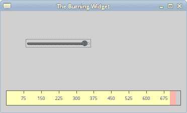
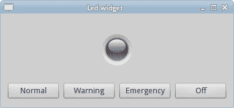

# Qyoto 中的自定义小部件

> 原文： [http://zetcode.com/gui/csharpqyoto/customwidget/](http://zetcode.com/gui/csharpqyoto/customwidget/)

在 Qyoto C# 编程教程的这一部分中，我们将展示如何创建自定义窗口小部件。

大多数工具包通常仅提供最常用的窗口小部件，例如按钮，文本窗口小部件，滑块等。没有工具箱可以提供所有可能的窗口小部件。 程序员必须自己创建此类小部件。 他们使用工具箱提供的绘图工具来完成此任务。 有两种可能性。 程序员可以修改或增强现有的小部件。 或者，他可以从头开始创建自定义窗口小部件。

在本章中，我们将创建两个自定义窗口小部件。 Burning 小部件和 Led 小部件。

## 刻录小部件

在下一个示例中，我们将创建一个自定义刻录小部件。 可以在 Nero 或 K3B 之类的应用程序中看到此小部件。 该小部件将从头开始创建。

`burning.cs`

```
using System;
using QtCore;
using QtGui;

public class Burning : QWidget 
{
    const int PANEL_HEIGHT = 30;
    const int DISTANCE = 19;
    const int LINE_WIDTH = 5;
    const int DIVISIONS = 10;
    const float FULL_CAPACITY = 700f;
    const float MAX_CAPACITY = 750f;

    QColor redColor = new QColor(255, 175, 175);
    QColor yellowColor = new QColor(255, 255, 184);

    QWidget parent;

    String[] num = 
    {
        "75", "150", "225", "300",
        "375", "450", "525", "600",
        "675"
    };

    public Burning(QWidget parent) 
    {
        this.parent = parent;
        MinimumHeight = PANEL_HEIGHT;
    }

    protected override void OnPaintEvent(QPaintEvent pe) 
    {
        QPainter ptr = new QPainter(this);

        DrawWidget(ptr);
        ptr.End();
    }

    void DrawWidget(QPainter ptr) 
    {
        QyotoApp burn = (QyotoApp) parent;

        float slid_width = burn.GetCurrentWidth();
        float width = Size.Width;
        float step = width / DIVISIONS;

        float till = (width / MAX_CAPACITY) * slid_width;
        float full = (width / MAX_CAPACITY) * FULL_CAPACITY;

        if (slid_width > FULL_CAPACITY) 
        {
            ptr.Pen = yellowColor;
            ptr.Brush = yellowColor;
            ptr.DrawRect(new QRectF(0, 0, full, PANEL_HEIGHT));
            ptr.Pen = redColor;
            ptr.Brush = redColor;
            ptr.DrawRect(new QRectF(full+1, 0, till-full, PANEL_HEIGHT));

        } else 
        {
            if (slid_width > 0) 
            {
               ptr.Pen = yellowColor;
               ptr.Brush = yellowColor;
               ptr.DrawRect(new QRectF(0, 0, till, PANEL_HEIGHT));
            }
        }

        ptr.Pen = new QColor(90, 90, 90);
        ptr.SetBrush(BrushStyle.NoBrush);
        ptr.DrawRect(0, 0, Size.Width-1, PANEL_HEIGHT-1);

        QFont newFont = ptr.Font;
        newFont.PointSize = 7;
        ptr.Font = newFont;

        QFontMetrics metrics = new QFontMetrics(newFont);

        for (int i = 1; i <= num.Length; i++) 
        {
            ptr.DrawLine(new QLineF(i*step, 1, i*step, LINE_WIDTH));

            int w = metrics.Width(num[i-1]);
            ptr.DrawText(new QPointF(i*step-w/2, DISTANCE), num[i-1]);
        }        
    }
}

```

在这个文件中，我们创建了 Burning 小部件。

```
public class Burning : QWidget 
{
...

```

自定义窗口小部件基于`QWidget`类。

```
const int PANEL_HEIGHT = 30;
const int DISTANCE = 19;
const int LINE_WIDTH = 5;
const int DIVISIONS = 10;
const float FULL_CAPACITY = 700f;
const float MAX_CAPACITY = 750f;

```

这些是重要的常数。 `PANEL_HEIGHT`定义自定义窗口小部件的高度。 `DISTANCE`是比例尺上的数字与其父边框顶部之间的距离。 `LINE_WIDTH`是垂直线的宽度。 `DIVISIONS`是秤的数量。 `FULL_CAPACITY`是媒体的容量。 达到目标后，就会发生过度刻录。 这通过红色可视化。 `MAX_CAPACITY`是介质的最大容量。

```
String[] num = 
{
    "75", "150", "225", "300",
    "375", "450", "525", "600",
    "675"
};

```

我们使用这些数字来构建 Burning 小部件的比例。

```
protected override void OnPaintEvent(QPaintEvent pe) 
{
    QPainter ptr = new QPainter(this);

    DrawWidget(ptr);
    ptr.End();
}

```

自定义窗口小部件的图形委托给`DrawWidget()`方法。

```
QyotoApp burn = (QyotoApp) parent;

```

我们检索对父窗口小部件的引用。

```
float slid_width = burn.GetCurrentWidth();

```

我们使用它来获取当前选定的滑块值。

```
float width = Size.Width;

```

我们得到小部件的宽度。 自定义窗口小部件的宽度是动态的。 用户可以调整大小。

```
float till = (width / MAX_CAPACITY) * slid_width;
float full = (width / MAX_CAPACITY) * FULL_CAPACITY;

```

我们使用`width`变量进行转换。 在比例尺值和自定义小部件的度量之间。 请注意，我们使用浮点值。 我们在绘图中获得了更高的精度。

```
ptr.Pen = redColor;
ptr.Brush = redColor;
ptr.DrawRect(new QRectF(full+1, 0, till-full, PANEL_HEIGHT));

```

这三行画出红色矩形，表示过度燃烧。

```
ptr.DrawRect(0, 0, Size.Width-1, PANEL_HEIGHT-1);

```

这是小部件的周长。 外部矩形。

```
ptr.DrawLine(new QLineF(i*step, 1, i*step, LINE_WIDTH));

```

在这里，我们画出小的垂直线。

```
QFontMetrics metrics = new QFontMetrics(newFont);
...
int w = metrics.Width(num[i-1]);
ptr.DrawText(new QPointF(i*step-w/2, DISTANCE), num[i-1]);

```

在这里，我们在比例尺上绘制数字。 为了精确定位数字，我们必须获得字符串的宽度。

`main.cs`

```
using System;
using QtCore;
using QtGui;

/**
 * ZetCode Qyoto C# tutorial
 *
 * In this program, we create
 * a custom Burning widget.
 *
 * @author Jan Bodnar
 * website zetcode.com
 * last modified October 2012
 */

public class QyotoApp : QWidget 
{
    const int MAX_CAPACITY = 750;

    QSlider slider;
    QWidget widget;
    int cur_width;

    public QyotoApp() 
    {
        WindowTitle = "The Burning Widget";

        InitUI();

        Resize(370, 200);
        Move(300, 300);
        Show();
    }

    void InitUI() 
    {       
       slider = new QSlider(Qt.Orientation.Horizontal , this);
       slider.Maximum = MAX_CAPACITY;
       slider.SetGeometry(50, 50, 130, 30);

       slider.ValueChanged += OnValueChanged;

       QVBoxLayout vbox = new QVBoxLayout(this);
       QHBoxLayout hbox = new QHBoxLayout();

       vbox.AddStretch(1);

       widget = new Burning(this);
       hbox.AddWidget(widget, 0);

       vbox.AddLayout(hbox);

       Layout = vbox;
    }

    [Q_SLOT]
    void OnValueChanged(int val) 
    {
        cur_width = val;
        widget.Repaint();
    }

    public int GetCurrentWidth() 
    {
        return cur_width;
    }

    [STAThread]
    public static int Main(String[] args) 
    {
        new QApplication(args);
        new QyotoApp();
        return QApplication.Exec();
    }
}

```

这是主文件。 在这里，我们创建滑块小部件并使用我们的自定义小部件。

```
widget = new Burning(this);
hbox.AddWidget(widget, 0);

```

我们创建了 Burning 小部件的实例，并将其添加到水平框中。

```
[Q_SLOT]
void OnValueChanged(int val) 
{
    cur_width = val;
    widget.Repaint();
}

```

当滑块的值更改时，我们将其存储在 cur_width 变量中，然后重新绘制自定义窗口小部件。

```
public int GetCurrentWidth() 
{
    return cur_width;
}

```

定制小部件调用此方法以获取实际的滑块值。



Figure: The Burning widget

## Led 小部件

Led 小部件是一个灯泡，可以将其设置为不同的颜色。 在我们的例子中是红色，绿色，橙色和黑色。 该自定义窗口小部件仅使用 SVG 图像创建。 有四个 SVG 图像。 每个用于 Led 小部件的一种状态。

要编译该示例，我们需要引用 qyoto-qtsvg.dll 库。 例如，在我们的系统上，我们将-r：/usr/local/lib/mono/qyoto/qyoto-qtsvg.dll 添加到了编译选项。

`led.cs`

```
using System;
using QtCore;
using QtGui;
using QtSvg;

public class Led : QWidget 
{
    string[] cols;
    int col;

    public Led(QWidget parent) 
    {
        const int GREEN = 1;
        col = GREEN;

        SetMinimumSize(50, 50);
        SetMaximumSize(50, 50);

        cols = new string[] { "red.svg", "green.svg",  
            "orange.svg", "black.svg" };
    }

    public void SetColour(int newColour)
    {
        col = newColour;
        Update();
    }

    protected override void OnPaintEvent(QPaintEvent e) 
    {
        QPainter ptr = new QPainter(this);

        DrawCustomWidget(ptr);
        ptr.End();
    }

    void DrawCustomWidget(QPainter ptr) 
    {
        QSvgRenderer srnd = new QSvgRenderer();
        srnd.Load(cols[col]);
        srnd.Render(ptr);       
    }
}

```

在 led.cs 类中，我们构建了自定义窗口小部件。

```
const int GREEN = 1;
col = GREEN;

```

当一切正常时，GREEN 常量指示 Led 小部件的状态。 颜色变量定义窗口小部件的当前状态。

```
SetMinimumSize(50, 50);
SetMaximumSize(50, 50);

```

这两条线强制窗口小部件具有恒定的大小。 SVG 图像的大小为 50x50。

```
cols = new string[] { "red.svg", "green.svg",  
    "orange.svg", "black.svg" };

```

我们将 SVG 图像文件名存储在 cols 数组中。

```
public void SetColour(int newColour)
{
    col = newColour;
    Update();
}

```

SetColour（）方法将 col 变量设置为新值。 我们调用 Update（）方法重绘 Led 小部件以反映新状态。

```
void DrawCustomWidget(QPainter ptr) 
{
    QSvgRenderer srnd = new QSvgRenderer();
    srnd.Load(cols[col]);
    srnd.Render(ptr);       
}

```

在 DrawCustomWidget（）方法中，我们使用`QSvgRenderer`类显示 SVG 图像。

`main.cs`

```
using Qyoto;
using QtCore;
using QtGui;

/**
 * ZetCode Qyoto C# tutorial
 *
 * This program creates a custom Led
 * widget.
 *
 * @author Jan Bodnar
 * website zetcode.com
 * last modified October 2012
 */

public class QyotoApp : QWidget 
{
    const int RED = 0;
    const int GREEN = 1;
    const int ORANGE = 2;
    const int BLACK = 3;

    Led led;

    public QyotoApp() 
    {
        WindowTitle = "Led widget";

        SetupUI();

        Resize(250, 150);
        Move(300, 300);
        Show();
    }

    public void SetupUI() 
    {        
        QVBoxLayout vbox = new QVBoxLayout();
        QHBoxLayout hbox = new QHBoxLayout();

        led = new Led(this);

        hbox.AddWidget(led);
        vbox.AddStretch(1);
        vbox.AddLayout(hbox);
        vbox.AddStretch(1);

        QHBoxLayout hbox2 = new QHBoxLayout();

        QPushButton pb1 = new QPushButton("Normal", this);
        QPushButton pb2 = new QPushButton("Warning", this);
        QPushButton pb3 = new QPushButton("Emergency", this);
        QPushButton pb4 = new QPushButton("Off", this);

        hbox2.AddWidget(pb1);
        hbox2.AddWidget(pb2);
        hbox2.AddWidget(pb3);
        hbox2.AddWidget(pb4);

        vbox.AddLayout(hbox2);

        Connect(pb1, SIGNAL("clicked()"), this, SLOT("OnClicked()"));
        Connect(pb2, SIGNAL("clicked()"), this, SLOT("OnClicked()"));
        Connect(pb3, SIGNAL("clicked()"), this, SLOT("OnClicked()"));
        Connect(pb4, SIGNAL("clicked()"), this, SLOT("OnClicked()"));

        Layout = vbox;
    }

    [Q_SLOT]
    public void OnClicked() 
    {

        QPushButton sender = (QPushButton) this.Sender();
        string text = sender.Text;

        if (text == "Normal") 
        {
            led.SetColour(GREEN);
        } 
        else if (text == "Warning")
        {
            led.SetColour(ORANGE);
        } 
        else if (text == "Emergency")
        {
            led.SetColour(RED);
        } 
        else if (text == "Off")
        {
            led.SetColour(BLACK);        
        }
    }

    [STAThread]
    public static int Main(String[] args) 
    {
        new QApplication(args);
        new QyotoApp();

        return QApplication.Exec();
    }
}

```

这是 main.cs 文件。 我们连续有四个按钮，窗口中央有一个 Led 小部件。 这四个按钮控制 Led 小部件的状态。 Led 小部件有四个状态。 正常，警告，紧急和关闭。

```
led = new Led(this);

hbox.AddWidget(led);

```

我们创建 Led 小部件的实例并将其放入水平框中。

```
else if ( text == "Warning")
{
    led.SetColour(ORANGE);
} 

```

如果单击警告按钮，则 LED 小部件的颜色将变为橙色。 更准确地说，将加载并显示一个新的橙色 SVG 图像。



Figure: The Led widget showing the Off state

在 Qyoto C# 教程的这一部分中，我们演示了如何创建自定义窗口小部件。