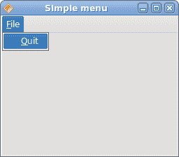
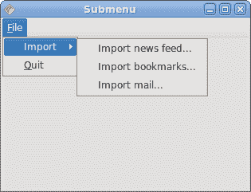
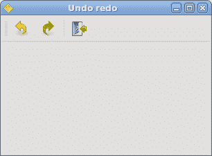

# Qyoto 中的菜单&工具栏

> 原文： [http://zetcode.com/gui/vbqyoto/menustoolbars/](http://zetcode.com/gui/vbqyoto/menustoolbars/)

在 Visual Basic Qyoto 编程教程的这一部分中，我们将使用菜单和工具栏。

菜单栏是 GUI 应用程序中最可见的部分之一。 它是位于各个菜单中的一组命令。 在控制台应用程序中，您必须记住所有这些神秘命令，在这里，我们将大多数命令分组为逻辑部分。 有公认的标准可以进一步减少学习新应用程序的时间。 菜单将我们可以在应用程序中使用的命令分组。 使用工具栏可以快速访问最常用的命令。

## 简单菜单

第一个示例将显示一个简单的菜单。

```
' ZetCode Mono Visual Basic Qt tutorial
'
' This program shows a simple
' menu. It has one action, which
' will terminate the program, when
' selected. 
'
' author jan bodnar
' last modified May 2009
' website www.zetcode.com

Imports Qyoto

Public Class VBQApp 
    Inherits QMainWindow

    Public Sub New()

        Me.SetWindowTitle("Simple menu")

        Me.InitUI()

        Me.Resize(250, 200)
        Me.Move(300, 300)
        Me.Show()

    End Sub

    Private Sub InitUI()

        Dim quit As New QAction("&Quit", Me)

        Dim file As QMenu = Me.MenuBar().AddMenu("&File")
        file.AddAction(quit)

        Connect(quit, SIGNAL("triggered()"), qApp, SLOT("quit()"))

    End Sub

    Public Shared Sub Main(ByVal args() As String)
        Dim qapp As New QApplication(args)
        Dim app as New VBQApp
        QApplication.Exec()
    End Sub

End Class

```

我们有一个菜单栏，一个菜单和一个动作。 为了使用菜单，我们必须继承`QMainWindow`小部件。

```
Dim quit As New QAction("&Quit", Me)

```

此代码行创建一个`QAction`。 每个`QMenu`具有一个或多个动作对象。 注意＆字符（&）。 它为以下项目创建快捷方式： `Alt` + `Q` 。 它还强调了 Q 字符。 下拉菜单中的文件时，该快捷方式处于活动状态。

```
Dim file As QMenu = Me.MenuBar().AddMenu("&File")
file.AddAction(quit)

```

我们创建一个`QMenu`对象。 ＆字符创建快捷方式： `Alt` + `F` 。 连续的快捷键 `Alt` + `F` ， `Alt` + `Q` 退出了应用程序。

```
Connect(quit, SIGNAL("triggered()"), qApp, SLOT("quit()"))

```

当我们从菜单中选择此选项时，应用程序退出。



Figure: Simple menu

## 创建一个子菜单

子菜单是插入另一个菜单对象的菜单。 下一个示例对此进行了演示。

```
' ZetCode Mono Visual Basic Qt tutorial
'
' This program creates 
' a submenu
'
' author jan bodnar
' last modified May 2009
' website www.zetcode.com

Imports Qyoto

Public Class VBQApp 
    Inherits QMainWindow

    Public Sub New()

        Me.SetWindowTitle("Submenu")

        Me.InitUI()

        Me.Resize(280, 200)
        Me.Move(300, 300)
        Me.Show()

    End Sub

    Private Sub InitUI()

        Dim quit As New QAction("&Quit", Me)

        Dim file As QMenu = MenuBar().AddMenu("&File")
        Dim impm As New QMenu("Import")

        Dim seeds As New QAction("Import news feed...", Me)
        Dim marks As New QAction("Import bookmarks...", Me)
        Dim mail As New QAction("Import mail...", Me)

        impm.AddAction(seeds)
        impm.AddAction(marks)
        impm.AddAction(mail)

        file.AddMenu(impm)
        file.AddAction(quit)

        Connect(quit, SIGNAL("triggered()"), qApp, SLOT("quit()"))

    End Sub

    Public Shared Sub Main(ByVal args() As String)
        Dim qapp As New QApplication(args)
        Dim app As New VBQApp
        QApplication.Exec()
    End Sub

End Class

```

在示例中，文件菜单的子菜单中有三个选项。

```
Dim file As QMenu = MenuBar().AddMenu("&File")
Dim impm As New QMenu("Import")

```

我们有两个`QMenu`对象。 文件菜单和导入菜单。

```
Dim seeds As New QAction("Import news feed...", Me)
Dim marks As New QAction("Import bookmarks...", Me)
Dim mail As New QAction("Import mail...", Me)

```

我们创建三个动作对象。

```
impm.AddAction(seeds)
impm.AddAction(marks)
impm.AddAction(mail)

```

我们将动作对象添加到导入菜单中。

```
file.AddMenu(impm)

```

最后，我们将导入菜单添加到文件菜单中。



Figure: Submenu

## 图像，菜单，分隔符

在以下示例中，我们将进一步增强以前的应用程序。 我们将在菜单中添加图标，使用快捷方式和分隔符。

```
' ZetCode Mono Visual Basic Qt tutorial
'
' This program shows image
' menu items, a shorcut and a separator
'
' author jan bodnar
' last modified May 2009
' website www.zetcode.com

Imports Qyoto

Public Class VBQApp 
    Inherits QMainWindow

    Public Sub New()

        Me.SetWindowTitle("Image menu")

        Me.InitUI()

        Me.Resize(280, 200)
        Me.Move(300, 300)
        Me.Show()

    End Sub

    Private Sub InitUI()

        Dim newpix As New QIcon("new.png")
        Dim openpix As New QIcon("open.png")
        Dim quitpix As New QIcon("quit.png")

        Dim newa As New QAction(newpix, "&New", Me)
        Dim open As New QAction(openpix, "&Open", Me)
        Dim quit As New QAction(quitpix, "&Quit", Me)

        quit.Shortcut = New QKeySequence("Ctrl+Q")    

        Dim file As QMenu = MenuBar().AddMenu("&File")
        file.AddAction(newa)
        file.AddAction(open)
        file.AddSeparator()
        file.AddAction(quit)

        Connect(quit, SIGNAL("triggered()"), qApp, SLOT("quit()"))

    End Sub

    Public Shared Sub Main(ByVal args() As String)
        Dim qapp As New QApplication(args)
        Dim app As New VBQApp
        QApplication.Exec()
    End Sub

End Class

```

在我们的示例中，我们有一个包含三个动作的菜单。 如果我们选择退出操作，则实际上只有退出操作才可以执行某些操作。 我们还创建了分隔符和 `Ctrl` + `Q` 快捷方式，它们将终止应用程序。

```
Dim newpix As New QIcon("new.png")
Dim openpix As New QIcon("open.png")
Dim quitpix As New QIcon("quit.png")

```

这些是我们将在应用程序中使用的 PNG 图像。

```
Dim newa As New QAction(newpix, "&New", Me)
Dim open As New QAction(openpix, "&Open", Me)
Dim quit As New QAction(quitpix, "&Quit", Me)

```

在这里，我们创建三个动作对象。 第一个参数是`QIcon`。

```
quit.Shortcut = New QKeySequence("Ctrl+Q") 

```

这行创建一个快捷方式。 通过按下此快捷方式，我们将运行 quit 操作，这将终止应用程序。

```
file.AddSeparator()

```

我们创建一个分隔符。 分隔符是一条水平线，它使我们能够将菜单操作分组为一些逻辑部分。


Figure: Images, shortcut and a separator

## 工具栏

`QToolBar`类提供了一个可移动面板，其中包含一组控件，这些控件提供对应用程序操作的快速访问。

```
' ZetCode Mono Visual Basic Qt tutorial
'
' This program creates a 
' toolbar
'
' author jan bodnar
' last modified May 2009
' website www.zetcode.com

Imports Qyoto

Public Class VBQApp 
    Inherits QMainWindow

    Public Sub New()

        Me.SetWindowTitle("Toolbar")

        Me.InitUI()

        Me.Resize(280, 200)
        Me.Move(300, 300)
        Me.Show()

    End Sub

    Private Sub InitUI()

        Dim newpi As New QIcon("new.png")
        Dim openpi As New QIcon("open.png")
        Dim quitpi As New QIcon("quit.png")

        Dim toolbar As QToolBar = AddToolBar("main toolbar")
        toolbar.AddAction(newpi, "New File")
        toolbar.AddAction(openpi, "Open File")
        toolbar.AddSeparator()
        Dim quit As QAction = toolbar.AddAction(quitpi, _
            "Quit Application")

        Connect(quit, SIGNAL("triggered()"), qApp, SLOT("quit()"))

    End Sub

    Public Shared Sub Main(ByVal args() As String)
        Dim qapp As New QApplication(args)
        Dim app as New VBQApp
        QApplication.Exec()
    End Sub

End Class

```

我们创建一个带有三个动作对象和一个分隔符的工具栏。

```
Dim newpi As New QIcon("new.png")
Dim openpi As New QIcon("open.png")
Dim quitpi As New QIcon("quit.png")

```

工具栏动作对象将显示这些图标。

```
Dim toolbar As QToolBar = AddToolBar("main toolbar")

```

`QMainWindow`类的`AddToolBar()`方法为应用程序创建一个工具栏。 文本字符串为工具栏命名。 此名称用于引用此工具栏，因为一个应用程序中可以有多个工具栏。 如果右键单击窗口区域，我们将看到一个可检查的选项，该选项显示/隐藏工具栏。

```
toolbar.AddSeparator()

```

我们创建一个垂直分隔符。

```
Connect(quit, SIGNAL("triggered()"), qApp, SLOT("quit()"))

```

当我们单击退出操作对象时，应用程序终止。


Figure: Toolbar

## 撤销重做

以下示例演示了如何停用工具栏上的工具栏按钮。 这是 GUI 编程中的常见做法。 例如，保存按钮。 如果我们将文档的所有更改都保存到磁盘上，则在大多数文本编辑器中，“保存”按钮将被停用。 这样，应用程序会向用户指示所有更改都已保存。

```
' ZetCode Mono Visual Basic Qt tutorial
'
' This program disables/enables
' toolbuttons on a toolbar
'
' author jan bodnar
' last modified May 2009
' website www.zetcode.com

Imports Qyoto

Public Class VBQApp 
    Inherits QMainWindow

    Dim clicks As Integer = 0
    Dim undoButton As QToolButton
    Dim redoButton As QToolButton

    Public Sub New()

        Me.SetWindowTitle("Undo redo")

        Me.InitUI()

        Me.Resize(280, 200)
        Me.Move(300, 300)
        Me.Show()

    End Sub

    Private Sub InitUI()

        Dim undoi As New QIcon("undo.png")
        Dim redoi As New QIcon("redo.png")
        Dim quitpi As New QIcon("quit.png")

        Dim toolbar As New QToolBar
        undoButton = New QToolButton
        redoButton = New QToolButton

        Dim undoAction As New QAction(undoi, "Undo", undoButton)
        Dim redoAction As New QAction(redoi, "Redo", redoButton)

        undoButton.SetDefaultAction(undoAction)
        redoButton.SetDefaultAction(redoAction)

        toolbar.AddSeparator()
        toolbar.AddWidget(undoButton)
        toolbar.AddWidget(redoButton)

        Dim quit As QAction = toolbar.AddAction(quitpi, "Quit Application")

        Connect(quit, SIGNAL("triggered()"), qApp, SLOT("quit()"))

        Connect(undoButton, SIGNAL("triggered(QAction*)"), _
            Me, SLOT("Count(QAction*)"))
        Connect(redoButton, SIGNAL("triggered(QAction*)"), _
            Me, SLOT("Count(QAction*)"))

        AddToolBar(toolbar)

    End Sub

    <Q_SLOT()> _
    Private Sub Count(ByVal action As QAction)

        If "Undo".Equals(action.Text)
            clicks -= 1
        Else 
            clicks += 1
        End If

        If clicks <= 0 
            undoButton.SetDisabled(True)
            redoButton.SetDisabled(False)
        End If

        If clicks >= 5 
            undoButton.SetDisabled(False)
            redoButton.SetDisabled(True)
        End If

    End Sub

    Public Shared Sub Main(ByVal args() As String)
        Dim qapp As New QApplication(args)
        Dim app As New VBQApp
        QApplication.Exec()
    End Sub

End Class

```

在我们的示例中，我们有三个`QAction`对象和一个分隔符。 在撤消或重做按钮上单击几下后，它们将被停用。 外观上，按钮显示为灰色。

```
Dim clicks As Integer = 0

```

clicks 变量确定哪个按钮被激活或停用。

```
Connect(undoButton, SIGNAL("triggered(QAction*)"), _
    Me, SLOT("Count(QAction*)"))
Connect(redoButton, SIGNAL("triggered(QAction*)"), _
    Me, SLOT("Count(QAction*)"))

```

单击工具栏按钮，将发射`triggered()`信号。 我们将此信号连接到`Count()`方法。 它接收触发它的`QAction`对象。

```
If "Undo".Equals(action.Text)
    clicks -= 1
Else 
    clicks += 1
End If

```

撤消工具栏按钮从 clicks 变量中减去 1。 重做添加 1。根据 clicks 变量的值，我们启用/禁用工具栏按钮。

```
If clicks <= 0 
    undoButton.SetDisabled(True)
    redoButton.SetDisabled(False)
End If

```

`SetDisabled()`方法激活或停用工具栏按钮。



Figure: Undo redo

在 Visual Basic Qyoto 教程的这一部分中，我们提到了菜单和工具栏。