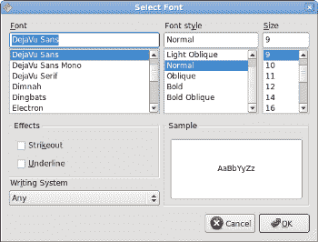

# Qyoto 对话框

> 原文： [http://zetcode.com/gui/vbqyoto/dialogs/](http://zetcode.com/gui/vbqyoto/dialogs/)

在 Visual Basic Qyoto 编程教程的这一部分中，我们将使用对话框。

对话框窗口或对话框是大多数现代 GUI 应用程序必不可少的部分。 对话被定义为两个或更多人之间的对话。 在计算机应用程序中，对话框是一个窗口，用于与应用程序“对话”。 对话框用于输入数据，修改数据，更改应用程序设置等。对话框是用户与计算机程序之间进行通信的重要手段。

## 消息框

消息框是方便的对话框，可向应用程序的用户提供消息。 该消息由文本和图像数据组成。

```
' ZetCode Mono Visual Basic Qt tutorial
'
' This program shows
' QMessageBox dialogs
'
' author jan bodnar
' last modified May 2009
' website www.zetcode.com

Imports Qyoto

Public Class VBQApp 
    Inherits QWidget

    Public Sub New()

        Me.SetWindowTitle("Message boxes")

        Me.InitUI()

        Me.Resize(220, 90)
        Me.Move(300, 300)
        Me.Show()

    End Sub

    Private Sub InitUI()

        Dim grid As New QGridLayout(Me)
        grid.Spacing = 2

        Dim errb As New QPushButton("Error", Me)
        Dim warnb As New QPushButton("Warning", Me)
        Dim questb As New QPushButton("Question", Me)
        Dim infob As New QPushButton("Information", Me)
        Dim aboutb As New QPushButton("About", Me)

        grid.AddWidget(errb, 0, 0)
        grid.AddWidget(warnb, 0, 1)
        grid.AddWidget(questb, 1, 0)
        grid.AddWidget(infob, 1, 1)
        grid.AddWidget(aboutb, 2, 0)

        Connect(errb, SIGNAL("clicked()"), Me, SLOT("OnClicked()"))
        Connect(warnb, SIGNAL("clicked()"), Me, SLOT("OnClicked()"))
        Connect(questb, SIGNAL("clicked()"), Me, SLOT("OnClicked()"))
        Connect(infob, SIGNAL("clicked()"), Me, SLOT("OnClicked()"))
        Connect(aboutb, SIGNAL("clicked()"), Me, SLOT("OnClicked()"))

    End Sub

    <Q_SLOT()> _
    Private Sub OnClicked()

        Dim button As QPushButton = Sender()

        If "Error".Equals(button.Text())
            QMessageBox.critical(Me, "Error", "Error loading file!")
        Else If "Warning".Equals(button.Text())
            QMessageBox.warning(Me, "Warning", "Operation not permitted!")
        Else If "Question".Equals(button.Text())
            QMessageBox.question(Me, "Question", "Are you sure to quit?")
        Else If "Information".Equals(button.Text())
            QMessageBox.information(Me, "Information", "Download completed.")
        Else If "About".Equals(button.Text())
            QMessageBox.about(Me, "About", "ZetCode Qyoto Visual Basic tutorial.")        
        End If

    End Sub

    Public Shared Sub Main(ByVal args() As String)
        Dim qapp As New QApplication(args)
        Dim app As New VBQApp
        QApplication.Exec()
    End Sub

End Class

```

我们使用`GridLayout`管理器来设置五个按钮的网格。 每个按钮显示一个不同的消息框。

```
Dim button As QPushButton = Sender()

```

在这里，我们确定哪个按钮称为`ShowDialog()`方法。

```
If "Error".Equals(button.Text())
    QMessageBox.critical(Me, "Error", "Error loading file!")

```

如果按下错误按钮，则会显示错误对话框。 我们使用`QMessageBox`类的静态方法来显示消息框。


## QInputDialog

`QInputDialog`类提供了一个简单的便捷对话框，可从用户那里获取单个值。 输入值可以是字符串，数字或列表中的项目。 必须设置标签以告知用户他们应该输入什么。

```
' ZetCode Mono Visual Basic Qt tutorial
'
' This program shows
' QInputDialog dialogs
'
' author jan bodnar
' last modified May 2009
' website www.zetcode.com

Imports Qyoto

Public Class VBQApp 
    Inherits QWidget

    Dim edit As QLineEdit

    Public Sub New()

        Me.SetWindowTitle("QInputDialog")

        Me.InitUI()

        Me.Resize(300, 150)
        Me.Move(300, 300)
        Me.Show()

    End Sub

    Private Sub InitUI()

        Dim show As New QPushButton("Dialog", Me)

        Connect(show, SIGNAL("clicked()"), Me, SLOT("ShowDialog()"))

        show.FocusPolicy = FocusPolicy.NoFocus
        show.Move(20, 20)

        edit = New QLineEdit(Me)
        edit.Move(130, 22)

    End Sub

    <Q_SLOT()> _
    Private Sub ShowDialog()

        Dim text As String = QInputDialog.GetText( _
                Me, "Input Dialog", "Enter your name")

        If text <> Nothing AndAlso text.Trim() <> String.Empty
            edit.SetText(text)
        End If

    End Sub

    Public Shared Sub Main(ByVal args() As String)
        Dim qapp As New QApplication(args)
        Dim app As New VBQApp
        QApplication.Exec()
    End Sub

End Class

```

在代码示例中，我们有一个按钮和一行编辑。 该按钮显示一个输入对话框。 我们得到一些文本，文本显示在行编辑小部件中。

```
Dim text As String = QInputDialog.GetText( _
        Me, "Input Dialog", "Enter your name")

```

`GetText()`静态方法创建输入对话框。 对话框中的文本存储在 text 变量中。

```
If text <> Nothing AndAlso text.Trim() <> String.Empty
    edit.SetText(text)
End If

```

在更新行编辑之前，请确保 text 变量不为 null 且不为空，并且不仅由空格组成。


Figure: Input dialog

## QColorDialog

`QColorDialog`类提供用于指定颜色的对话框小部件。 颜色对话框的功能是允许用户选择颜色。

```
' ZetCode Mono Visual Basic Qt tutorial
'
' In this program, we use the
' QColorDialog to change the color
' of a label text
'
' author jan bodnar
' last modified May 2009
' website www.zetcode.com

Imports Qyoto

Public Class VBQApp 
    Inherits QWidget

    Dim label As QLabel

    Public Sub New()

        Me.SetWindowTitle("QColorDialog")

        Me.InitUI()

        Me.Resize(300, 150)
        Me.Move(300, 300)
        Me.Show()

    End Sub

    Private Sub InitUI()

        label = New QLabel("ZetCode Qyoto Visual Basic tutorial", Me)

        Dim vbox As New QVBoxLayout(Me)
        label.Alignment = AlignmentFlag.AlignCenter
        vbox.AddWidget(label)

    End Sub

    Protected Overrides Sub MousePressEvent(ByVal e As QMouseEvent)

        Dim color As QColor = QColorDialog.GetColor()

        If Not color.IsValid() Then
            Return
        End If

        Dim style As String = String.Format("QWidget {{ color: {0} }}", _
            color.Name())
        label.SetStyleSheet(style)

    End Sub

    Public Shared Sub Main(ByVal args() As String)
        Dim qapp As New QApplication(args)
        Dim app As New VBQApp
        QApplication.Exec()
    End Sub

End Class

```

我们在窗口中心显示一些文本。 通过单击窗口区域，我们显示一个颜色对话框。 我们将文本前景色更改为从对话框中选择的颜色。

```
Protected Overrides Sub MousePressEvent(ByVal e As QMouseEvent)
    ...
End Sub

```

为了接收我们窗口的鼠标按下事件，我们必须重写`MousePressEvent()`方法。

```
Dim color As QColor = QColorDialog.GetColor()

```

正在创建`QColorDialog`。 所选颜色存储在`color`变量中。

```
If Not color.IsValid() Then
    Return
End If

```

当按下取消按钮时，我们什么也不做。

```
Dim style As String = String.Format("QWidget {{ color: {0} }}", _
    color.Name())
label.SetStyleSheet(style)

```

在这里，我们更新标签文本的前景色。


Figure: QColorDialog

## QFont 对话框

`QFontDialog`类提供用于选择字体的对话框小部件。

```
' ZetCode Mono Visual Basic Qt tutorial
'
' In this program, we use the
' QFontDialog to change the font
' of a label text
'
' author jan bodnar
' last modified May 2009
' website www.zetcode.com

Imports Qyoto

Public Class VBQApp 
    Inherits QWidget

    Dim label As QLabel

    Public Sub New()

        Me.SetWindowTitle("QFontDialog")

        Me.InitUI()

        Me.Resize(300, 150)
        Me.Move(300, 300)
        Me.Show()

    End Sub

    Private Sub InitUI()

        label = New QLabel("ZetCode Qyoto Visual Basic tutorial", Me)

        Dim vbox As New QVBoxLayout(Me)
        label.Alignment = AlignmentFlag.AlignCenter
        vbox.AddWidget(label)

    End Sub

    Protected Overrides Sub MousePressEvent(ByVal e As QMouseEvent)

        Dim ok As Boolean = True

        Dim font As QFont = QFontDialog.GetFont(ok)

        If Not ok Then
            Return
        End If

        label.Font = font

    End Sub

    Public Shared Sub Main(ByVal args() As String)
        Dim qapp As New QApplication(args)
        Dim app As New VBQApp
        QApplication.Exec()
    End Sub

End Class

```

此示例与上一个示例相似。 这次，我们更改文本的字体。

```
Dim font As QFont = QFontDialog.GetFont(ok)

```

正在创建`QFontDialog`。 当我们按下对话框的 OK 按钮时，将设置 boolean ok 变量。

```
If Not ok Then
    Return
End If

```

如果没有按下“确定”按钮，我们什么也不做。

```
label.Font = font

```

`font`字段存储所选字体。 我们将标签的字体更新为新选择的字体。



Figure: QFontDialog

在 Visual Basic Qyoto 教程的这一部分中，我们使用了对话框窗口。