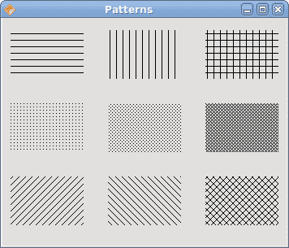
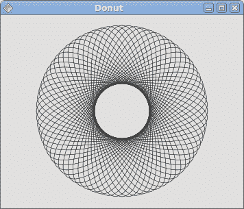
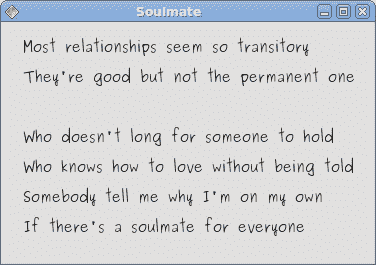

# Qyoto 中的绘图

> 原文： [http://zetcode.com/gui/vbqyoto/painting/](http://zetcode.com/gui/vbqyoto/painting/)

在 Visual Basic Qyoto 编程教程的这一部分中，我们将进行绘图。

我们什么时候需要油漆？ 在某些情况下，当我们需要从头开始创建小部件时。 在这种情况下，我们需要绘图。 或者我们想创建图表，特殊装饰，效果或小部件增强。

当我们在 Qyoto 库中进行绘图时，`QPainter`类非常有用。 绘图事件通过`PaintEvent()`方法接收。 若要进行自定义绘图，我们必须重新实现此方法。

## 图案

在《京都议定书》中，我们可以使用各种图案来填充形状的内部。

```
' ZetCode Mono Visual Basic Qt tutorial
'
' This program draws nine rectangles.
' The interiors are filled with
' different built-in patterns.
'
' author jan bodnar
' last modified May 2009
' website www.zetcode.com

Imports Qyoto

Public Class VBQApp 
    Inherits QWidget

    Public Sub New()

        Me.SetWindowTitle("Patterns")

        Me.Resize(350, 280)
        Me.Move(300, 300)
        Me.Show()

    End Sub

    Protected Overrides Sub PaintEvent(ByVal e As QPaintEvent)

        Dim painter As New QPainter(Me)
        Me.DrawPatterns(painter)

        painter.End()

    End Sub

    Private Sub DrawPatterns(ByRef painter As QPainter)

        painter.SetPen(PenStyle.NoPen)

        painter.SetBrush(Qt.BrushStyle.HorPattern)
        painter.DrawRect(10, 15, 90, 60)

        painter.SetBrush(Qt.BrushStyle.VerPattern)
        painter.DrawRect(130, 15, 90, 60)

        painter.SetBrush(Qt.BrushStyle.CrossPattern)
        painter.DrawRect(250, 15, 90, 60)

        painter.SetBrush(Qt.BrushStyle.Dense7Pattern)
        painter.DrawRect(10, 105, 90, 60)

        painter.SetBrush(Qt.BrushStyle.Dense6Pattern)
        painter.DrawRect(130, 105, 90, 60)

        painter.SetBrush(Qt.BrushStyle.Dense5Pattern)
        painter.DrawRect(250, 105, 90, 60)

        painter.SetBrush(Qt.BrushStyle.BDiagPattern)
        painter.DrawRect(10, 195, 90, 60)

        painter.SetBrush(Qt.BrushStyle.FDiagPattern)
        painter.DrawRect(130, 195, 90, 60)

        painter.SetBrush(Qt.BrushStyle.DiagCrossPattern)
        painter.DrawRect(250, 195, 90, 60)

    End Sub

    Public Shared Sub Main(ByVal args() As String)
        Dim qapp As New QApplication(args)
        Dim app As New VBQApp
        QApplication.Exec()
    End Sub

End Class

```

在代码示例中，我们将绘制九个矩形，并用不同的画笔图案填充它们。

```
Protected Overrides Sub PaintEvent(ByVal e As QPaintEvent)

    Dim painter As New QPainter(Me)
    Me.DrawPatterns(painter)

    painter.End()

End Sub

```

当需要重绘窗口区域时，将调用`PaintEvent()`方法。 当我们调整窗口大小，最大化或最小化窗口时，就会发生这种情况。在此方法中，我们创建了`QPainter`对象。 该对象用于完成 Qyoto 中的所有绘图。 绘图本身被委托给`DrawPatterns()`方法。 `End()`方法释放绘图时使用的资源。

```
painter.SetPen(PenStyle.NoPen)

```

笔对象用于绘制形状的轮廓。 在我们的示例中，我们将不使用笔。

```
painter.SetBrush(Qt.BrushStyle.HorPattern)

```

我们将水平图案设置为画笔。 画笔用于绘制形状的内部。

```
painter.DrawRect(10, 15, 90, 60)

```

我们使用当前的笔和画笔绘制一个矩形。 该方法的前两个参数是 x，y 坐标。 最后两个参数是矩形的宽度和高度。



Figure: Patterns

## 形状

Qyoto 绘图 API 可以绘制各种形状。 以下编程代码示例将显示其中的一些。

```
' ZetCode Mono Visual Basic Qt tutorial
'
' This program draws basic shapes
' available in Qyoto.
'
' author jan bodnar
' last modified May 2009
' website www.zetcode.com

Imports Qyoto

Public Class VBQApp 
    Inherits QWidget

    Public Sub New()

        Me.SetWindowTitle("Shapes")

        Me.Resize(350, 280)
        Me.Move(300, 300)
        Me.Show()

    End Sub

    Protected Overrides Sub PaintEvent(ByVal e As QPaintEvent)

        Dim painter As New QPainter(Me)
        Me.DrawShapes(painter)

        painter.End()

    End Sub

    Private Sub DrawShapes(ByRef painter As QPainter)

        painter.SetRenderHint(QPainter.RenderHint.Antialiasing)
        painter.SetPen(New QPen(New QBrush(New QColor("Gray")), 1))
        painter.SetBrush(New QBrush(New QColor("Gray")))

        Dim path1 As New QPainterPath()

        path1.MoveTo(5, 5)
        path1.CubicTo(40, 5,  50, 50,  99, 99)
        path1.CubicTo(5, 99,  50, 50,  5, 5)
        painter.DrawPath(path1)

        painter.DrawPie(130, 20, 90, 60, 30*16, 120*16)
        painter.DrawChord(240, 30, 90, 60, 0, 16*180)
        painter.DrawRoundRect(20, 120, 80, 50)

        Dim polygon As New QPolygon(5)
        polygon.SetPoint(0, 130, 140)
        polygon.SetPoint(1, 180, 170)
        polygon.SetPoint(2, 180, 140)
        polygon.SetPoint(3, 220, 110)
        polygon.SetPoint(4, 140, 100)

        painter.DrawPolygon(polygon)
        painter.DrawRect(250, 110, 60, 60)

        Dim baseline As New QPointF(20, 250)
        Dim font As New QFont("Georgia", 55)
        Dim path2 As New QPainterPath()

        path2.AddText(baseline, font, "Q")
        painter.DrawPath(path2)

        painter.DrawEllipse(140, 200, 60, 60)
        painter.DrawEllipse(240, 200, 90, 60)

    End Sub

    Public Shared Sub Main(ByVal args() As String)
        Dim qapp As New QApplication(args)
        Dim app As New VBQApp
        QApplication.Exec()
    End Sub

End Class

```

在此代码示例中，我们在窗口上绘制了九种不同的形状。 复杂路径，饼图，和弦，圆角矩形，多边形，矩形，基于字符的形状，圆形和椭圆形。

```
painter.SetRenderHint(QPainter.RenderHint.Antialiasing)

```

我们在示例中使用抗锯齿。 抗锯齿形状看起来更好，但是绘制它们需要更多时间。

```
painter.SetPen(New QPen(New QBrush(New QColor("Gray")), 1))
painter.SetBrush(New QBrush(New QColor("Gray")))

```

我们使用深灰色的笔和画笔绘制形状。

```
Dim path1 As New QPainterPath()

path1.MoveTo(5, 5)
path1.CubicTo(40, 5,  50, 50,  99, 99)
path1.CubicTo(5, 99,  50, 50,  5, 5)
painter.DrawPath(path1)

```

使用`QPainterPath`对象创建第一个复杂形状。 QPainterPath 类为绘图操作提供了一个容器。 画家路径是由许多图形构造块（例如矩形，椭圆形，直线和曲线）组成的对象。

```
painter.DrawPie(130, 20, 90, 60, 30*16, 120*16)
painter.DrawChord(240, 30, 90, 60, 0, 16*180)
painter.DrawRoundRect(20, 120, 80, 50)

```

这三行画出一个饼图，一个和弦和一个圆角矩形。

```
Dim polygon As New QPolygon(5)
polygon.SetPoint(0, 130, 140)
polygon.SetPoint(1, 180, 170)
polygon.SetPoint(2, 180, 140)
polygon.SetPoint(3, 220, 110)
polygon.SetPoint(4, 140, 100)

painter.DrawPolygon(polygon)

```

在这里，我们创建一个多边形。

```
Dim baseline As New QPointF(20, 250)
Dim font As New QFont("Georgia", 55)
Dim path2 As New QPainterPath()

path2.AddText(baseline, font, "Q")
painter.DrawPath(path2)

```

这些线创建基于字符的形状。

```
painter.DrawEllipse(140, 200, 60, 60)
painter.DrawEllipse(240, 200, 90, 60)

```

这两条线分别创建一个圆和一个椭圆。


Figure: Shapes

## 透明矩形

透明性是指能够透视材料的质量。 了解透明度的最简单方法是想象一块玻璃或水。 从技术上讲，光线可以穿过玻璃，这样我们就可以看到玻璃后面的物体。

在计算机图形学中，我们可以使用 alpha 合成来实现透明效果。 Alpha 合成是将图像与背景组合以创建部分透明外观的过程。 合成过程使用 Alpha 通道。 （wikipedia.org，answers.com）

```
' ZetCode Mono Visual Basic Qt tutorial
'
' This program draws ten
' rectangles with different
' levels of transparency
'
' author jan bodnar
' last modified May 2009
' website www.zetcode.com

Imports Qyoto

Public Class VBQApp 
    Inherits QWidget

    Public Sub New()

        Me.SetWindowTitle("Transparent rectangles")

        Me.Resize(590, 90)
        Me.Move(300, 300)
        Me.Show()

    End Sub

    Protected Overrides Sub PaintEvent(ByVal e As QPaintEvent)

        Dim painter As New QPainter(Me)
        Me.DrawRectangles(painter)

        painter.End()

    End Sub

    Private Sub DrawRectangles(ByRef painter As QPainter)

        painter.SetPen(PenStyle.NoPen)

        For i As Integer = 1 To 10
            painter.SetBrush(New QBrush(New QColor(0, 0, 255, i*25)))
            painter.DrawRect(50*i, 20, 40, 40)
        Next

    End Sub

    Public Shared Sub Main(ByVal args() As String)
        Dim qapp As New QApplication(args)
        Dim app As New VBQApp
        QApplication.Exec()
    End Sub

End Class

```

在示例中，我们将绘制十个具有不同透明度级别的矩形。

```
painter.SetPen(PenStyle.NoPen)

```

我们不用笔。

```
For i As Integer = 1 To 10
    painter.SetBrush(New QBrush(New QColor(0, 0, 255, i*25)))
    painter.DrawRect(50*i, 20, 40, 40)
Next

```

`QColor`对象的最后一个参数是 alpha 透明度值。


Figure: Transparent rectangles

## 甜甜圈形状

在下面的示例中，我们通过旋转一堆椭圆来创建复杂的形状。

```
' ZetCode Mono Visual Basic Qt tutorial
'
' This program draws a donut
' shape
'
' author jan bodnar
' last modified May 2009
' website www.zetcode.com

Imports Qyoto

Public Class VBQApp 
    Inherits QWidget

    Public Sub New()

        Me.SetWindowTitle("Donut")

        Me.Resize(350, 280)
        Me.Move(300, 300)
        Me.Show()

    End Sub

    Protected Overrides Sub PaintEvent(ByVal e As QPaintEvent)

        Dim painter As New QPainter(Me)
        Me.DrawDonut(painter)

        painter.End()

    End Sub

    Private Sub DrawDonut(ByRef painter As QPainter)

        Dim color As New QColor()
        color.SetNamedColor("#333333")

        Dim pen As New QPen(color)
        pen.setWidthF(0.5)
        painter.SetPen(pen)

        painter.SetRenderHint(QPainter.RenderHint.Antialiasing)

        Dim h As Integer = Me.Height()
        Dim w As Integer = Me.Width()

        painter.Translate(New QPoint(w/2, h/2))

        For rot As Integer = 1 To 360 Step 5
            painter.DrawEllipse(-125, -40, 250, 80)
            painter.Rotate(5)
        Next

    End Sub

    Public Shared Sub Main(ByVal args() As String)
        Dim qapp As New QApplication(args)
        Dim app As New VBQApp
        QApplication.Exec()
    End Sub

End Class

```

在此示例中，我们创建一个甜甜圈。 形状类似于 Cookie，因此得名“甜甜圈”。

```
Dim color As New QColor()
color.SetNamedColor("#333333")

```

我们可以使用十六进制表示法来创建颜色对象。

```
Dim h As Integer = Me.Height()
Dim w As Integer = Me.Width()

```

在这里，我们确定窗口的宽度和高度。

```
painter.Translate(New QPoint(w/2, h/2))

```

我们将坐标系移到窗口的中间。 这样，我们使绘图在数学上更容易。

```
For rot As Integer = 1 To 360 Step 5
    painter.DrawEllipse(-125, -40, 250, 80)
    painter.Rotate(5)
Next

```

我们绘制一个椭圆对象 72 次。 每次，我们将椭圆旋转 5 度。 这将创建我们的甜甜圈形状。



Figure: Donut

## 绘制文字

在最后一个示例中，我们将在窗口上绘制文本。

```
' ZetCode Mono Visual Basic Qt tutorial
'
' This program draws text
' on the window
'
' author jan bodnar
' last modified May 2009
' website www.zetcode.com

Imports Qyoto

Public Class VBQApp 
    Inherits QWidget

    Public Sub New()

        Me.SetWindowTitle("Unfaitful")

        Me.Resize(300, 280)
        Me.Move(300, 300)
        Me.Show()

    End Sub

    Protected Overrides Sub PaintEvent(ByVal e As QPaintEvent)

        Dim painter As New QPainter(Me)
        Me.DrawLyrics(painter)

        painter.End()

    End Sub

    Private Sub DrawLyrics(ByRef painter As QPainter)

        painter.SetBrush(New QBrush(new QColor(25, 25, 25)))
        painter.SetFont(New QFont("Purisa", 10))

        painter.DrawText(New QPoint(20, 30), _
                "I don't wanna do this anymore")
        painter.DrawText(New QPoint(20, 60), _
                "I don't wanna be the reason why")
        painter.DrawText(New QPoint(20, 90), _
                "Everytime I walk out the door")
        painter.DrawText(New QPoint(20, 120), _
                "I see him die a little more inside")
        painter.DrawText(New QPoint(20, 150), _
                "I don't wanna hurt him anymore")
        painter.DrawText(New QPoint(20, 180), _
                "I don't wanna take away his life")
        painter.DrawText(New QPoint(20, 210), _
                "I don't wanna be...") 
        painter.DrawText(New QPoint(20, 240), _
                "A murderer")

    End Sub

    Public Shared Sub Main(ByVal args() As String)
        Dim qapp As New QApplication(args)
        Dim app As New VBQApp
        QApplication.Exec()
    End Sub

End Class

```

我们在窗口上画一首歌歌词。

```
painter.SetFont(New QFont("Purisa", 10))

```

我们为文本设置了 Purisa 字体。

```
painter.DrawText(New QPoint(20, 30), _
        "I don't wanna do this anymore")

```

`DrawText()`方法用于绘制文本。



Figure: Drawing text

在 Visual Basic Qyoto 编程教程的这一部分中，我们做了一些绘图。