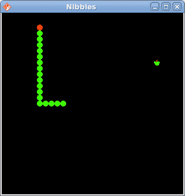

# 轻咬

> 原文： [http://zetcode.com/gui/vbqyoto/nibbles/](http://zetcode.com/gui/vbqyoto/nibbles/)

在 Visual Basic Qyoto 编程教程的这一部分中，我们将创建 Nibbles 游戏克隆。

Nibbles 是较旧的经典视频游戏。 它最初是在 70 年代后期创建的。 后来它被带到 PC 上。 在这个游戏中，玩家控制蛇。 目的是尽可能多地吃苹果。 蛇每次吃一个苹果，它的身体就会长大。 蛇必须避开墙壁和自己的身体。

## 开发

蛇的每个关节的大小为 10px。 蛇由光标键控制。 最初，蛇具有三个关节。 游戏立即开始。 游戏结束后，我们在窗口中心显示“ Game Over”消息。

`board.vb`

```
Imports Qyoto

NameSpace BoardSpace

public class Board 
    Inherits QFrame 

    Const WIDTH As Integer = 300
    Const HEIGHT As Integer = 300
    Const DOT_SIZE As Integer = 10
    Const ALL_DOTS As Integer = 900
    Const RAND_POS As Integer = 30
    Const DELAY As Integer = 140

    Dim x(ALL_DOTS) As Integer 
    Dim y(ALL_DOTS) As Integer 

    Dim dots As Integer
    Dim apple_x As Integer
    Dim apple_y As Integer

    Dim left As Boolean = False
    Dim right As Boolean = True

    Dim up As Boolean = False
    Dim down As Boolean = False
    Dim inGame As Boolean = True

    Dim timer As QBasicTimer 
    Dim ball As QImage 
    Dim apple As QImage
    Dim head As QImage

    Public Sub New() 

        Me.SetStyleSheet("QWidget { background-color: black }")

        Me.FocusPolicy = Qt.FocusPolicy.StrongFocus

        Try 
            ball = New QImage("dot.png")
            apple = New QImage("apple.png")
            head = New QImage("head.png")
        Catch e As Exception 
            Console.WriteLine("Cannot read images")
            Console.WriteLine(e.Message)
            Environment.Exit(1)
        End Try

        Me.InitGame()

    End Sub

    Private Sub InitGame() 

        dots = 3

        For z As Integer = 0 To dots-1 
            x(z) = 50 - z*10
            y(z) = 50
        Next

        Me.LocateApple()

        timer = New QBasicTimer()
        timer.Start(DELAY, Me)

    End Sub

    Protected Overrides Sub PaintEvent(ByVal e As QPaintEvent) 

        Dim painter As New QPainter()
        painter.Begin(Me)

        If inGame
            Me.DrawObjects(painter)
        Else 
            Me.GameOver(painter)
        End If

        painter.End()

    End Sub

    Private Sub DrawObjects(ByVal painter As QPainter) 

        painter.DrawImage(apple_x, apple_y, apple)

        For z As Integer = 0 to dots - 1
            If z = 0
                painter.DrawImage(x(z), y(z), head)
            Else 
                painter.DrawImage(x(z), y(z), ball)
            End If 
        Next

    End Sub

    Private Sub GameOver(ByVal painter As QPainter) 

        Dim msg As String = "Game Over"

        Dim small As New QFont("Helvetica", 12)
        small.SetBold(True)
        Dim metr As New QFontMetrics(small)

        Dim textWidth As Integer = metr.Width(msg)
        Dim h As Integer = Me.Height
        Dim w As Integer = Me.Width

        painter.SetPen(New QPen(New QBrush(Qt.GlobalColor.white), 1))

        painter.SetFont(small)
        painter.Translate(New QPoint(w/2, h/2))

        Dim text_x As Integer = -textWidth / 2
        Dim text_y As Integer = 0

        painter.DrawText(text_x, text_y, msg)

    End Sub

    Private Sub CheckApple()

        If x(0) = apple_x And y(0) = apple_y

            dots += 1
            Me.LocateApple()

        End If

    End Sub

    Private Sub Move() 

        For z As Integer = dots To 1 Step -1
            x(z) = x(z - 1)
            y(z) = y(z - 1)
        Next

        If left
            x(0) -= DOT_SIZE
        End If

        If right
            x(0) += DOT_SIZE
        End If

        If up 
            y(0) -= DOT_SIZE
        End If

        If down 
            y(0) += DOT_SIZE
        End If

    End Sub

    Private Sub CheckCollision() 

        For z As Integer = dots To 1 Step -1
            If z > 4 And x(0) = x(z) And y(0) = y(z) 
                inGame = False
            End If
        Next   

        If y(0) > HEIGHT 
            inGame = False
        End If

        If y(0) < 0 
            inGame = False
        End If

        If x(0) > WIDTH 
            inGame = False
        End If

        If x(0) < 0 
            inGame = False
        End If

    End Sub

    Private Sub LocateApple() 

        Dim rand As New Random()

        Dim r As Integer = rand.Next(RAND_POS)

        apple_x = r * DOT_SIZE
        r = rand.Next(RAND_POS)
        apple_y = r * DOT_SIZE

    End Sub

    Protected Overrides Sub TimerEvent(ByVal e As QTimerEvent) 

        If inGame
            Me.CheckApple()
            Me.CheckCollision()
            Me.Move()
        Else 
            timer.Stop()
        End If

        Me.Repaint()

    End Sub

    Protected Overrides Sub KeyPressEvent(ByVal e As QKeyEvent)

        Dim key As Integer = e.Key()

        If key = Qt.Key.Key_Left And Not right
            left = True
            up = False
            down = False
        End If

        If key = Qt.Key.Key_Right And Not left 
            right = True
            up = False
            down = False            
        End If

        If key = Qt.Key.Key_Up And Not down
            up = True
            right = False
            left = False
        End If

        If key = Qt.Key.Key_Down And Not up
            down = True
            right = False
            left = False       
        End If

    End Sub    

End Class

End Namespace

```

首先，我们将定义一些在游戏中使用的全局变量。

`WIDTH`和`HEIGHT`常数确定电路板的大小。 `DOT_SIZE`是苹果的大小和蛇的点。 `ALL_DOTS`常数定义了板上可能的最大点数。 `RAND_POS`常数用于计算苹果的随机位置。 `DELAY`常数确定游戏的速度。

```
Dim x(ALL_DOTS) As Integer 
Dim y(ALL_DOTS) As Integer 

```

这两个数组存储蛇的所有可能关节的 x，y 坐标。

`InitGame()`方法初始化变量，加载图像并启动超时功能。

```
If inGame
    Me.DrawObjects(painter)
Else 
    Me.GameOver(painter)
End If

```

在`PaintEvent()`方法内部，我们检查`inGame`变量。 如果为真，则绘制对象。 苹果和蛇的关节。 否则，我们显示“游戏结束”文本。

```
Private Sub DrawObjects(ByVal painter As QPainter) 

    painter.DrawImage(apple_x, apple_y, apple)

    For z As Integer = 0 to dots - 1
        If z = 0
            painter.DrawImage(x(z), y(z), head)
        Else 
            painter.DrawImage(x(z), y(z), ball)
        End If 
    Next

End Sub

```

`DrawObjects()`方法绘制苹果和蛇的关节。 蛇的第一个关节是其头部，用红色圆圈表示。

```
Private Sub CheckApple()

    If x(0) = apple_x And y(0) = apple_y

        dots += 1
        Me.LocateApple()

    End If

End Sub

```

`CheckApple()`方法检查蛇是否击中了苹果对象。 如果是这样，我们添加另一个蛇形关节并调用`LocateApple()`方法，该方法将随机放置一个新的 Apple 对象。

在`Move()`方法中，我们有游戏的密钥算法。 要了解它，请看一下蛇是如何运动的。 您控制蛇的头。 您可以使用光标键更改其方向。 其余关节在链上向上移动一个位置。 第二关节移动到第一个关节的位置，第三关节移动到第二个关节的位置，依此类推。

```
For z As Integer = dots To 1 Step -1
    x(z) = x(z - 1)
    y(z) = y(z - 1)
Next

```

该代码将关节向上移动。

```
If left
    x(0) -= DOT_SIZE
End If

```

将头向左移动。

在`CheckCollision()`方法中，我们确定蛇是否击中了自己或撞墙之一。

```
For z As Integer = dots To 1 Step -1
    If z > 4 And x(0) = x(z) And y(0) = y(z) 
        inGame = False
    End If
Next   

```

如果蛇用头撞到关节之一，我们就结束游戏。

```
If y(0) > HEIGHT 
    inGame = False
End If

```

如果蛇击中了棋盘的底部，我们就结束了游戏。

`LocateApple()`方法在板上随机放置一个苹果。

```
Dim rand As New Random()

Dim r As Integer = rand.Next(RAND_POS)

```

我们得到一个从 0 到 RAND_POS-1 的随机数。

```
apple_x = r * DOT_SIZE
...
apple_y = r * DOT_SIZE

```

这些行设置了 apple 对象的 x，y 坐标。

```
If inGame
    Me.CheckApple()
    Me.CheckCollision()
    Me.Move()
Else 
    timer.Stop()
End If

```

每 140 毫秒，将调用`TimerEvent()`方法。 如果我们参与了游戏，我们将调用三种构建游戏逻辑的方法。 否则，我们将停止计时器。

在 Board 类的`KeyPressEvent()`方法中，我们确定按下的键。

```
If key = Qt.Key.Key_Left And Not right
    left = True
    up = False
    down = False
End If

```

如果单击左光标键，则将`left`变量设置为 true。 在`Move()`方法中使用此变量来更改蛇对象的坐标。 还要注意，当蛇向右行驶时，我们不能立即向左转。

`nibbles.vb`

```
' ZetCode Mono Visual Basic Qt tutorial
'
' In this program, we create
' a Nibbles game clone
'
' author jan bodnar
' last modified May 2009
' website www.zetcode.com

Imports Qyoto
Imports BoardSpace

Public Class VBQApp 
    Inherits QMainWindow

    Dim WIDTH As Integer = 250
    Dim HEIGHT As Integer = 150

    Public Sub New()

        Me.SetWindowTitle("Nibbles")

        Dim board As New BoardSpace.Board()
        Me.SetCentralWidget(board)

        Me.Resize(310, 310)
        Me.Move(300, 300)
        Me.Show()

    End Sub

    Public Shared Sub Main(ByVal args() As String)
        Dim qapp As New QApplication(args)
        Dim app As New VBQApp
        QApplication.Exec()
    End Sub

End Class

```

在本课程中，我们设置了半字节游戏。



Figure: Nibbles

这是用 Qyo​​to 库和 Visual Basic 编程语言编写的 Nibbles 电脑游戏。