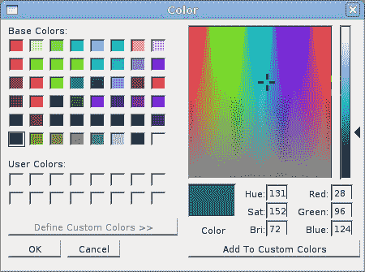

# 对话框

> 原文： [http://zetcode.com/tutorials/ironpythontutorial/dialogs/](http://zetcode.com/tutorials/ironpythontutorial/dialogs/)

在 IronPython Mono Winforms 教程的这一部分中，我们将讨论对话框。

对话框窗口或对话框是大多数现代 GUI 应用必不可少的部分。 对话被定义为两个或更多人之间的对话。 在计算机应用中，对话框是一个窗口，用于与应用“对话”。 对话框用于输入数据，修改数据，更改应用设置等。对话框是用户与计算机程序之间进行通信的重要手段。

基本上有两种类型的对话框。 预定义对话框和自定义对话框。

## `FolderBrowserDialog`

此对话框提示用户选择一个文件夹。

`folderbrowserdialog.py`

```
#!/usr/bin/ipy

import clr
clr.AddReference("System.Windows.Forms")
clr.AddReference("System.Drawing")

from System.Windows.Forms import Application, Form, StatusBar
from System.Windows.Forms import ToolBar, ToolBarButton, FolderBrowserDialog
from System.Windows.Forms import DialogResult

class IForm(Form):

    def __init__(self):
        self.Text = "FolderBrowserDialog"

        toolbar = ToolBar()
        toolbar.Parent = self
        openb = ToolBarButton()

        self.statusbar = StatusBar()
        self.statusbar.Parent = self

        toolbar.Buttons.Add(openb)
        toolbar.ButtonClick += self.OnClicked

        self.CenterToScreen()

    def OnClicked(self, sender, event):
        dialog = FolderBrowserDialog()

        if (dialog.ShowDialog(self) == DialogResult.OK):
            self.statusbar.Text = dialog.SelectedPath

Application.Run(IForm())

```

我们有一个工具栏和一个工具栏按钮。 点击按钮，`FolderBrowserDialog`出现在屏幕上。 所选文件夹的名称显示在状态栏中。

```
dialog = FolderBrowserDialog()

```

`FolderBrowserDialog`已创建。

```
if (dialog.ShowDialog(self) == DialogResult.OK):
    self.statusbar.Text = dialog.SelectedPath  

```

`ShowDialog()`方法在屏幕上显示对话框。 如果单击对话框的“确定”按钮，则所选的目录路径将显示在状态栏上。


Figure: FolderBrowserDialog

## `ColorDialog`

该对话框显示可用的颜色以及使用户能够定义自定义颜色的控件。

`colordialog.py`

```
#!/usr/bin/ipy

import sys
import clr
clr.AddReference("System.Windows.Forms")
clr.AddReference("System.Drawing")

from System.Windows.Forms import Application, Form, ToolBar
from System.Windows.Forms import ToolBarButton, ControlStyles, ColorDialog
from System.Windows.Forms import DialogResult
from System.Drawing import Size, Color, SolidBrush, Rectangle

RECT_WIDTH  = 100
RECT_HEIGHT = 100

class IForm(Form):

    def __init__(self):
        self.Text = "ColorDialog"

        self.color = Color.Blue

        toolbar = ToolBar()
        toolbar.Parent = self
        openb = ToolBarButton()

        toolbar.Buttons.Add(openb)
        toolbar.ButtonClick += self.OnClicked

        self.LocateRect()

        self.SetStyle(ControlStyles.ResizeRedraw, True)
        self.Paint += self.OnPaint

        self.CenterToScreen()

    def OnPaint(self, event):
        g = event.Graphics
        self.LocateRect()
        brush = SolidBrush(self.color)
        g.FillRectangle(brush, self.r)

    def OnClicked(self, sender, events):
        dialog = ColorDialog()

        if (dialog.ShowDialog(self) == DialogResult.OK):
            self.color = dialog.Color
            self.Invalidate()

    def LocateRect(self):
        x = (self.ClientSize.Width - RECT_WIDTH) / 2
        y = (self.ClientSize.Height - RECT_HEIGHT) / 2
        self.r = Rectangle(x, y, RECT_WIDTH, RECT_HEIGHT)

Application.Run(IForm())

```

在此代码示例中，我们使用`ColorDialog`为位于窗体控件中间的矩形选择颜色。

```
self.color = Color.Blue

```

开始时，矩形的颜色是蓝色。 我们使用`self.color`变量来确定矩形的颜色。

```
dialog = ColorDialog()

```

`ColorDialog`已创建。

```
if (dialog.ShowDialog(self) == DialogResult.OK):
    self.color = dialog.Color
    self.Invalidate()

```

该代码显示颜色对话框。 如果单击“确定”按钮，则将获得选定的颜色并调用`Invalidate()`方法。 该方法会使控件的整个表面无效，并使控件重画。 结果是用新的颜色值绘制了矩形。



Figure: ColorDialog

## `FontDialog`

`FontDialog`用于选择字体。

`fontdialog.py`

```
#!/usr/bin/ipy

import clr
clr.AddReference("System.Windows.Forms")
clr.AddReference("System.Drawing")

from System.Windows.Forms import Application, Form, StatusBar, Label
from System.Windows.Forms import ToolBar, ToolBarButton, FontDialog
from System.Windows.Forms import DialogResult

class IForm(Form):

    def __init__(self):
        self.Text = "FolderBrowserDialog"

        self.text = Label()
        self.text.Parent = self
        self.text.Text = "Winforms tutorial"

        self.LocateText()

        toolbar = ToolBar()
        toolbar.Parent = self
        openb = ToolBarButton()

        toolbar.Buttons.Add(openb)
        toolbar.ButtonClick += self.OnClicked

        self.text.AutoSize = True
        self.Resize += self.OnResize

        self.CenterToScreen()

    def OnResize(self, sender, event):
        self.LocateText()

    def LocateText(self): 
        self.text.Top = (self.ClientSize.Height - self.text.Height) / 2
        self.text.Left = (self.ClientSize.Width - self.text.Width) / 2

    def OnClicked(self, sender, event):

        dialog = FontDialog()

        if (dialog.ShowDialog(self) == DialogResult.OK):
           self.text.Font = dialog.Font
           self.LocateText()

Application.Run(IForm())

```

我们在表单控件的中间绘制一些文本。 我们使用字体对话框更改此文本的字体。

```
dialog = FontDialog()

```

`FontDialog`已创建。

```
if (dialog.ShowDialog(self) == DialogResult.OK):
    self.text.Font = dialog.Font
    self.LocateText()

```

单击“确定”按钮时，将为`Label`控件设置新选择的字体。 由于文本的大小会随着字体的变化而变化，因此我们必须调用`LocateText()`方法，该方法将文本定位在表单控件的中间。


Figure: FontDialog

## `OpenDialog`

此对话框用于打开文件。

`opendialog.py`

```
#!/usr/bin/ipy

import clr
clr.AddReference("System.Windows.Forms")
clr.AddReference("System.Drawing")

from System.Windows.Forms import Application, Form, TextBox
from System.Windows.Forms import ToolBar, ToolBarButton, OpenFileDialog
from System.Windows.Forms import DialogResult, ScrollBars, DockStyle

class IForm(Form):

    def __init__(self):
        self.Text = "OpenDialog"

        toolbar = ToolBar()
        toolbar.Parent = self
        openb = ToolBarButton()

        self.textbox = TextBox()
        self.textbox.Parent = self
        self.textbox.Multiline = True
        self.textbox.ScrollBars = ScrollBars.Both
        self.textbox.WordWrap = False
        self.textbox.Parent = self
        self.textbox.Dock = DockStyle.Fill

        toolbar.Buttons.Add(openb)
        toolbar.ButtonClick += self.OnClicked

        self.CenterToScreen()

    def OnClicked(self, sender, event):
        dialog = OpenFileDialog()
        dialog.Filter = "C# files (*.cs)|*.cs"

        if dialog.ShowDialog(self) == DialogResult.OK:
            f = open(dialog.FileName)
            data = f.read()
            f.Close()
            self.textbox.Text = data

Application.Run(IForm())

```

我们使用`OpenDialog`控件打开 C# 源文件。 我们有一个`TextBox`控件，用于显示文件。

```
dialog = OpenFileDialog()

```

`OpenDialog`已创建。

```
dialog.Filter = "C# files (*.cs)|*.cs"

```

我们将`Filter`属性设置为 C# 源文件。 此对话框实例只能选择 C# 文件。

```
if dialog.ShowDialog(self) == DialogResult.OK:
    f = open(dialog.FileName)
    data = f.read()
    f.Close()
    self.textbox.Text = data

```

单击确定后，我们读取所选文件的内容并将其放入`TextBox`控件。

在 IronPython Mono Winforms 教程的这一部分中，我们展示了各种对话框。