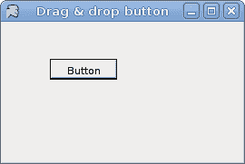
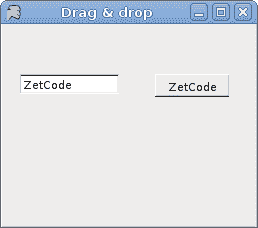
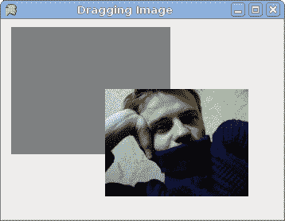

# Mono Winforms 中的拖放

> 原文： [http://zetcode.com/tutorials/ironpythontutorial/dragdrop/](http://zetcode.com/tutorials/ironpythontutorial/dragdrop/)

IronPython Mono Winforms 教程的这一部分将专门用于拖动&放置操作。

在计算机图形用户界面中，拖放是单击虚拟对象并将其拖动到其他位置或另一个虚拟对象上的动作（或支持以下动作）。 通常，它可用于调用多种动作，或在两个抽象对象之间创建各种类型的关联。 （维基百科）

拖放功能是图形用户界面最明显的方面之一。 拖放操作使您可以直观地完成复杂的事情。

## 拖动按钮

在第一个示例中，我们将在按钮控件上执行拖动&拖放操作。 该示例在拖放&放置协议之外执行作业。

`dragbutton.py`

```
#!/usr/bin/ipy

import clr
clr.AddReference("System.Windows.Forms")
clr.AddReference("System.Drawing")

from System.Windows.Forms import Application, Form, Button
from System.Drawing import Size, Point

class IForm(Form):

    def __init__(self):
        self.Text = 'Drag & Drop'

        button = Button()
        button.Parent = self
        button.Text = 'Button'
        button.MouseDown += self.OnMousDown
        button.MouseUp += self.OnMousUp
        button.MouseMove += self.OnMousMove

        button.Location = Point(20, 20)

        self.isDragging = False
        self.CenterToScreen()

    def OnMousDown(self, sender,  event):

        self.isDragging = True
        self.oldX = event.X
        self.oldY = event.Y

    def OnMousMove(self, sender, event):

        if self.isDragging: 
            sender.Top = sender.Top + (event.Y - self.oldY)
            sender.Left = sender.Left + (event.X - self.oldX)

    def OnMousUp(self, sender,  event):
        self.isDragging = False

Application.Run(IForm())

```

该代码示例将一个常规按钮控件放在表单容器上。 通过单击按钮表面并同时用鼠标拖动它，我们可以重新放置按钮。

我们的示例中有一些支持变量。 `isDragging`变量告诉我们是否正在拖动对象。 `oldX`和`oldY`变量在拖动过程开始之前存储 x，y 坐标。

```
button.MouseDown += self.OnMousDown
button.MouseUp += self.OnMousUp
button.MouseMove += self.OnMousMove

```

我们为按钮插入了三种不同的鼠标处理程序。 它们实现了拖动&拖放过程的三个不同阶段。 当我们单击按钮时，过程开始。 这由`OnMousDown()`方法处理。 第二部分是机芯。 这是当我们将对象移动到新位置时。 它以`OnMousMove()`方法处理。 最后一部分是过程停止的时间。 当我们释放鼠标按钮时会发生这种情况。 适当的任务委托给`OnMousUp()`方法。

```
def OnMousDown(self, sender,  event):

self.isDragging = True
self.oldX = event.X
self.oldY = event.Y

```

`OnMousDown()`方法实现了过程的第一部分。 它设置了三个必要的变量。

```
def OnMousMove(self, sender, event):

    if self.isDragging: 
        sender.Top = sender.Top + (event.Y - self.oldY)
        sender.Left = sender.Left + (event.X - self.oldX)

```

在`OnMousMove()`方法中，我们重新定位按钮。 我们计算存储的 x，y 坐标与鼠标指针的新坐标之间的差。 差异将添加到按钮的`Top`和`Left`属性中，从而将其移动到新位置。



Figure: Dragging a button

## 拖动文字

在前面的示例中，我们确实拖动了控件上的&拖放。 接下来，我们将对文本数据进行拖放&拖放操作。 在这里，我们将使用 Winforms 库提供的拖放&拖放协议。

拖动&放置操作是 Winforms 中的标准通信协议。 我们有两个基本对象。 拖动源和放置目标。

`dragtext.py`

```
#!/usr/bin/ipy

import clr
clr.AddReference("System.Windows.Forms")
clr.AddReference("System.Drawing")

from System.Windows.Forms import Application, Form, Button
from System.Windows.Forms import TextBox, DragDropEffects, DataFormats
from System.Drawing import Size, Point

class IForm(Form):

    def __init__(self):
        self.Text = 'Drag & Drop'
        self.AllowDrop = True

        button = Button()
        button.Parent = self
        textBox = TextBox()
        textBox.Parent = self

        button.AllowDrop = True
        button.Location = Point(150, 50)
        button.DragDrop += self.OnDragDrop
        button.DragEnter += self.OnDragEnter

        textBox.Location = Point(15, 50)
        textBox.MouseDown += self.OnMousDown

        self.ClientSize = Size(250, 200)
        self.CenterToScreen()

    def OnMousDown(self, sender, event):
        sender.SelectAll()
        sender.DoDragDrop(sender.Text, DragDropEffects.Copy)

    def OnDragEnter(self, sender, event):

        if event.Data.GetDataPresent(DataFormats.Text):
            event.Effect = DragDropEffects.Copy

    def OnDragDrop(self, sender, event):
        sender.Text =  event.Data.GetData(DataFormats.Text)

Application.Run(IForm())

```

我们在表单上有两个控件。 一个按钮和一个文本框。 我们将文本从文本框中拖放到按钮上。

```
self.AllowDrop = True

```

我们将`AllowDrop`属性设置为 true。 默认情况下不启用删除。

```
button.DragDrop += self.OnDragDrop
button.DragEnter += self.OnDragEnter
...       
extBox.MouseDown += self.OnMousDown

```

同样，拖动&拖放过程分为三个步骤。 对于每个特定步骤，我们有三种方法。

```
def OnMousDown(self, sender, event):
    sender.SelectAll()
    sender.DoDragDrop(sender.Text, DragDropEffects.Copy)

```

在`OnMousDown()`方法中，我们初始化了 drap &放置过程。 我们使用`DoDragDrop()`方法启动该过程。 `DragDropEffects.Copy`参数指定操作的类型。 实质上，我们可以在拖动&放置操作期间复制文本或移动文本。

```
def OnDragEnter(self, sender, event):

    if event.Data.GetDataPresent(DataFormats.Text):
        event.Effect = DragDropEffects.Copy

```

当鼠标指针进入放置目标控件的区域时，将启动`DragEnter`事件。 必须设置`Effect`属性。 拖动源和放置目标的`DragDropEffects`必须相等。 否则，该操作将无法进行。

```
def OnDragDrop(self, sender, event):
    sender.Text =  event.Data.GetData(DataFormats.Text)

```

最后，我们有`OnDragDrop()`方法。 在这里，我们从事件对象获取数据并将其设置为按钮`Text`属性。



Figure: Drag & drop of text

## 拖动图像

在最后一个示例中，我们将&拖放图像拖到窗体上。

`dragimage.py`

```
#!/usr/bin/ipy

import sys
import clr
clr.AddReference("System.Windows.Forms")
clr.AddReference("System.Drawing")

from System.Windows.Forms import Application, Form, PictureBox, PictureBoxSizeMode
from System.Windows.Forms import Cursors
from System.Drawing import Size, Point, Rectangle, Brushes, Bitmap

class IForm(Form):

    def __init__(self):

        self.ClientSize = Size(350, 250)
        self.Text = "Dragging Images"
        self.Paint += self.OnPaint

        self.isDragging = False
        self.dropRect = Rectangle(10, 10, 200, 160)
        self.brush = Brushes.Gray
        picBox = PictureBox()

        self.loadImage()

        self.isDragging = False
        self.CenterToScreen()

        picBox.Parent = self
        picBox.Location = Point(100, 50)
        picBox.Size = Size(self.image.Width, self.image.Height)
        picBox.Image = self.image
        picBox.MouseDown += self.OnMousDown
        picBox.MouseUp += self.OnMousUp
        picBox.MouseMove += self.OnMousMove
        picBox.Cursor = Cursors.Hand

    def loadImage(self):
        try:
            self.image = Bitmap("image.jpg")
        except Exception, e: 
            print "Error reading image"
            print e.msg
            sys.exit(1)

    def OnMousMove(self, sender, event): 
        if self.isDragging:
            sender.Top = sender.Top + (event.Y - self.oldY)
            sender.Left = sender.Left + (event.X - self.oldX)

    def OnMousUp(self, sender, event):
        self.isDragging = False

        if self.dropRect.Contains(sender.Bounds):
            self.brush = Brushes.Gold
        else: 
            self.brush = Brushes.Gray

        self.Refresh()

    def OnMousDown(self, sender, event):
        self.isDragging = True
        self.oldX = event.X
        self.oldY = event.Y

    def OnPaint(self, event): 
        g = event.Graphics
        g.FillRectangle(self.brush, self.dropRect)

Application.Run(IForm()) 

```

在我们的示例中，我们有一个`PictureBox`，并绘制了一个灰色矩形。 如果将图片放在矩形内，则矩形的颜色变为金色。

```
self.brush = Brushes.Gray

```

`self.brush`变量保存矩形的笔刷。 默认情况下为灰色。

```
def loadImage(self):
    try:
        self.image = Bitmap("image.jpg")
    except Exception, e: 
        print "Error reading image"
        print e.msg
        sys.exit(1)

```

`loadImage()`方法为`PictureBox`控件加载位图。

```
if self.dropRect.Contains(sender.Bounds):
    self.brush = Brushes.Gold
else: 
    self.brush = Brushes.Gray

```

在`OnMousUp()`方法中，我们确定矩形的笔刷。 如果图片框的边界在矩形内，则画笔为金色；否则，画笔为金色。 否则为灰色。

```
self.Refresh()

```

我们必须调用`Refresh()`方法来激活新的画笔颜色。



Figure: Drag & drop image

本章专门使用 Mono Winforms 库拖动&放置操作。