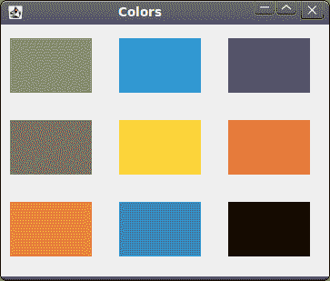
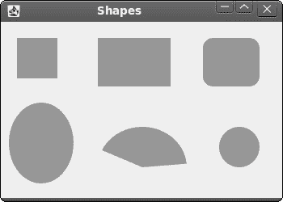

# Jython Swing 中的绘画

> 原文： [http://zetcode.com/gui/jythonswing/painting/](http://zetcode.com/gui/jythonswing/painting/)

在 Jython Swing 编程教程的这一部分中，我们将进行绘画。

我们使用绘画来创建图表，自定义组件或创建游戏。 要进行绘画，我们使用 Swing 工具包提供的绘画 API。 绘画是在`paintComponent()`方法中完成的。 在绘画过程中，我们使用`Graphics2D`对象。 它是一个图形上下文，允许应用程序绘制到组件上。 它是渲染二维形状，文本和图像的基础类。

## 色彩

颜色是代表红色，绿色和蓝色（RGB）强度值的组合的对象。 我们使用`Color`类在 Swing 中处理颜色。

```
#!/usr/local/bin/jython
# -*- coding: utf-8 -*-

"""
ZetCode Jython Swing tutorial

This program draws ten
rectangles filled with different
colors.

author: Jan Bodnar
website: www.zetcode.com
last modified: November 2010
"""

from java.awt import Color
from javax.swing import JFrame
from javax.swing import JPanel

class Canvas(JPanel):

    def __init__(self):
        super(Canvas, self).__init__()

    def paintComponent(self, g):

        self.drawColorRectangles(g)

    def drawColorRectangles(self, g):

        g.setColor(Color(125, 167, 116))
        g.fillRect(10, 15, 90, 60)

        g.setColor(Color(42, 179, 231))
        g.fillRect(130, 15, 90, 60)

        g.setColor(Color(70, 67, 123))
        g.fillRect(250, 15, 90, 60)

        g.setColor(Color(130, 100, 84))
        g.fillRect(10, 105, 90, 60)

        g.setColor(Color(252, 211, 61))
        g.fillRect(130, 105, 90, 60)

        g.setColor(Color(241, 98, 69))
        g.fillRect(250, 105, 90, 60)

        g.setColor(Color(217, 146, 54))
        g.fillRect(10, 195, 90, 60)

        g.setColor(Color(63, 121, 186))
        g.fillRect(130, 195, 90, 60)

        g.setColor(Color(31, 21, 1))
        g.fillRect(250, 195, 90, 60)

class Example(JFrame):

    def __init__(self):
        super(Example, self).__init__()

        self.initUI()

    def initUI(self):

        self.canvas = Canvas()
        self.getContentPane().add(self.canvas)
        self.setTitle("Colors")
        self.setDefaultCloseOperation(JFrame.EXIT_ON_CLOSE)
        self.setSize(360, 300)
        self.setLocationRelativeTo(None)
        self.setVisible(True)

if __name__ == '__main__':
    Example()

```

在代码示例中，我们绘制了九个矩形，并用不同的颜色值填充它们。

```
def paintComponent(self, g):

```

在大多数情况下，自定义绘画是在`paintComponent()`中完成的。 `g`参数是图形上下文。 我们称此对象为绘画操作。

```
g.setColor(Color(125, 167, 116))

```

我们将上下文的当前颜色设置为指定的颜色。 使用此图形上下文的所有后续图形操作均使用此指定的颜色。

```
g.fillRect(10, 15, 90, 60)

```

我们使用上面指定的颜色值填充位于 x = 10，y = 15 且宽度= 90 和高度= 60 的矩形。



Figure: Colours

## 形状

Swing 绘画 API 可以绘制各种形状。 以下编程代码示例将显示其中的一些。

```
#!/usr/local/bin/jython
# -*- coding: utf-8 -*-

"""
ZetCode Jython Swing tutorial

This program draws basic shapes

author: Jan Bodnar
website: www.zetcode.com
last modified: November 2010
"""

from java.awt import Color
from java.awt import RenderingHints
from java.awt.geom import Ellipse2D
from javax.swing import JFrame
from javax.swing import JPanel

class Canvas(JPanel):

    def __init__(self):
        super(Canvas, self).__init__()

    def paintComponent(self, g):

        self.drawShapes(g)

    def drawShapes(self, g):

        g.setColor(Color(150, 150, 150))

        rh = RenderingHints(RenderingHints.KEY_ANTIALIASING,
                RenderingHints.VALUE_ANTIALIAS_ON)

        rh.put(RenderingHints.KEY_RENDERING,
               RenderingHints.VALUE_RENDER_QUALITY)

        g.setRenderingHints(rh)

        g.fillRect(20, 20, 50, 50)
        g.fillRect(120, 20, 90, 60)
        g.fillRoundRect(250, 20, 70, 60, 25, 25)

        g.fill(Ellipse2D.Double(10, 100, 80, 100))
        g.fillArc(120, 130, 110, 100, 5, 150)
        g.fillOval(270, 130, 50, 50)

class Example(JFrame):

    def __init__(self):
        super(Example, self).__init__()

        self.initUI()

    def initUI(self):

        self.canvas = Canvas()
        self.getContentPane().add(self.canvas)
        self.setTitle("Shapes")
        self.setDefaultCloseOperation(JFrame.EXIT_ON_CLOSE)
        self.setSize(350, 250)
        self.setLocationRelativeTo(None)
        self.setVisible(True)

if __name__ == '__main__':
    Example()

```

在此代码示例中，我们在窗口上绘制了六个不同的形状。 正方形，矩形，圆角矩形，椭圆形，弧形和椭圆形。 我们不会绘制形状的轮廓，但是会用灰色填充形状的内部空间。

```
rh = RenderingHints(RenderingHints.KEY_ANTIALIASING,
        RenderingHints.VALUE_ANTIALIAS_ON)

```

借助渲染提示，我们可以控制绘画的质量。 在上面的代码中，我们实现了抗锯齿。 使用抗锯齿，形状更平滑。

```
g.setColor(Color(150, 150, 150))

```

我们将以某种灰色绘画。

```
g.fillRect(20, 20, 50, 50)
g.fillRect(120, 20, 90, 60)
g.fillRoundRect(250, 20, 70, 60, 25, 25)

```

在这里，我们绘制一个矩形，一个正方形和一个圆角矩形。 这些方法中的前四个参数是 x，y 坐标以及宽度和高度。 `fillRoundRect()`的最后两个参数是四个角处圆弧的水平和垂直直径。

```
g.fill(Ellipse2D.Double(10, 100, 80, 100))
g.fillArc(120, 130, 110, 100, 5, 150)
g.fillOval(270, 130, 50, 50)

```

这三条线绘制一个椭圆，一个弧形和一个椭圆形。



Figure: Shapes

## 透明矩形

透明性是指能够透视材料的质量。 了解透明度的最简单方法是想象一块玻璃或水。 从技术上讲，光线可以穿过玻璃，这样我们就可以看到玻璃后面的物体。

在计算机图形学中，我们可以使用 alpha 合成来实现透明效果。 Alpha 合成是将图像与背景组合以创建部分透明外观的过程。 合成过程使用 Alpha 通道。 （wikipedia.org，answers.com）

```
"""
ZetCode Jython Swing tutorial

This program draws ten
rectangles with different
levels of transparency.

author: Jan Bodnar
website: www.zetcode.com
last modified: November 2010
"""

from java.awt import AlphaComposite
from java.awt import Color
from javax.swing import JFrame
from javax.swing import JPanel

class Canvas(JPanel):

    def __init__(self):
        super(Canvas, self).__init__()

    def paintComponent(self, g):

        self.drawRectangles(g)

    def drawRectangles(self, g):

        g.setColor(Color.BLUE)

        for i in range(1, 11):
            g.setComposite(AlphaComposite.getInstance(AlphaComposite.SRC_OVER,
                                                        i * 0.1))
            g.fillRect(50 * i, 20, 40, 40)

class Example(JFrame):

    def __init__(self):
        super(Example, self).__init__()

        self.initUI()

    def initUI(self):

        self.canvas = Canvas()
        self.getContentPane().add(self.canvas)
        self.setTitle("Transparent rectangles")
        self.setDefaultCloseOperation(JFrame.EXIT_ON_CLOSE)
        self.setSize(590, 120)
        self.setLocationRelativeTo(None)
        self.setVisible(True)

if __name__ == '__main__':
    Example()

```

在示例中，我们将绘制十个具有不同透明度级别的矩形。

```
g.setComposite(AlphaComposite.getInstance(AlphaComposite.SRC_OVER, i * 0.1))

```

`AlphaComposite`类实现基本的 alpha 合成规则。


Figure: Transparent rectangles

## 甜甜圈形状

在下面的示例中，我们通过旋转一堆椭圆来创建复杂的形状。 仿射变换由零个或多个线性变换（旋转，缩放或剪切）和平移（移位）组成。 `AffineTransform`是 Swing 中用于执行仿射变换的类。

```
#!/usr/local/bin/jython
# -*- coding: utf-8 -*-

"""
ZetCode Jython Swing tutorial

In this program, we create a donut
shape.

author: Jan Bodnar
website: www.zetcode.com
last modified: November 2010
"""

from java.awt import BasicStroke
from java.awt import Color
from java.awt import RenderingHints
from java.awt.geom import AffineTransform
from java.awt.geom import Ellipse2D
from javax.swing import JFrame
from javax.swing import JPanel

import math

class Canvas(JPanel):

    def __init__(self):
        super(Canvas, self).__init__()

    def paintComponent(self, g):

        self.drawDonutShape(g)

    def drawDonutShape(self, g):

        rh = RenderingHints(RenderingHints.KEY_ANTIALIASING,
             RenderingHints.VALUE_ANTIALIAS_ON)

        rh.put(RenderingHints.KEY_RENDERING,
               RenderingHints.VALUE_RENDER_QUALITY)

        g.setRenderingHints(rh)

        size = self.getSize()
        w = size.getWidth()
        h = size.getHeight()

        e = Ellipse2D.Double(0, 0, 80, 130)
        g.setStroke(BasicStroke(1))
        g.setColor(Color.gray)

        for deg in range(0, 360, 5):
            at = AffineTransform.getTranslateInstance(w / 2, h / 2)
            at.rotate(math.radians(deg))
            g.draw(at.createTransformedShape(e))

class Example(JFrame):

    def __init__(self):
        super(Example, self).__init__()

        self.initUI()

    def initUI(self):

        self.canvas = Canvas()
        self.getContentPane().add(self.canvas)
        self.setTitle("Donut")
        self.setDefaultCloseOperation(JFrame.EXIT_ON_CLOSE)
        self.setSize(350, 320)
        self.setLocationRelativeTo(None)
        self.setVisible(True)

if __name__ == '__main__':
    Example()

```

在此示例中，我们创建一个甜甜圈。 形状类似于 Cookie，因此得名“甜甜圈”。 甜甜圈在窗口中居中。

```
size = self.getSize()
w = size.getWidth()
h = size.getHeight()

```

在这里，我们确定窗口的宽度和高度。 我们需要这些值来使甜甜圈形状居中。

```
e = Ellipse2D.Double(0, 0, 80, 130)

```

我们创建一个椭圆形。 我们将旋转此椭圆以创建甜甜圈形状。

```
g.setStroke(BasicStroke(1))
g.setColor(Color.gray)

```

我们为形状的轮廓设置笔触和颜色。

```
for deg in range(0, 360, 5):

```

我们绘制一个椭圆对象 72 次。 每次，我们再将椭圆旋转 5 度。 这将创建我们的甜甜圈形状。

```
at = AffineTransform.getTranslateInstance(w / 2, h / 2)
at.rotate(math.radians(deg))
g.draw(at.createTransformedShape(e))

```

在`AffineTransform`类的帮助下，我们将图形转换到窗口的中心。 然后我们进行旋转。 `createTransformedShape()`方法会将这些仿射变换应用于椭圆。 然后使用`draw()`方法绘制变换后的椭圆。

## 绘图文字

在最后一个示例中，我们将在窗口上绘制文本。

```
#!/usr/local/bin/jython
# -*- coding: utf-8 -*-

"""
ZetCode Jython Swing tutorial

This program draws lyrics of a
song on the window.

author: Jan Bodnar
website: www.zetcode.com
last modified: November 2010
"""

from java.awt import Font
from java.awt import RenderingHints
from javax.swing import JFrame
from javax.swing import JPanel

class Canvas(JPanel):

    def __init__(self):
        super(Canvas, self).__init__()

    def paintComponent(self, g):

        self.drawLyrics(g)

    def drawLyrics(self, g):

        rh = RenderingHints(RenderingHints.KEY_TEXT_ANTIALIASING,
            RenderingHints.VALUE_TEXT_ANTIALIAS_ON)

        g.setRenderingHints(rh)

        g.setFont(Font("Purisa", Font.PLAIN, 13))

        g.drawString("Most relationships seem so transitory", 20, 30)
        g.drawString("They're all good but not the permanent one", 20, 60)
        g.drawString("Who doesn't long for someone to hold", 20, 90)
        g.drawString("Who knows how to love you without being told", 20, 120)
        g.drawString("Somebody tell me why I'm on my own", 20, 150)
        g.drawString("If there's a soulmate for everyone", 20, 180)

class Example(JFrame):

    def __init__(self):
        super(Example, self).__init__()

        self.initUI()

    def initUI(self):

        self.canvas = Canvas()
        self.getContentPane().add(self.canvas)
        self.setTitle("Soulmate")
        self.setDefaultCloseOperation(JFrame.EXIT_ON_CLOSE)
        self.setSize(400, 250)
        self.setLocationRelativeTo(None)
        self.setVisible(True)

if __name__ == '__main__':
    Example()

```

我们在窗口上画一首歌的歌词。

```
rh = RenderingHints(RenderingHints.KEY_TEXT_ANTIALIASING,
    RenderingHints.VALUE_TEXT_ANTIALIAS_ON)

g.setRenderingHints(rh)

```

我们在画上应用文字抗锯齿。

```
g.setFont(Font("Purisa", Font.PLAIN, 13))

```

我们指定字体名称，样式和磅值，并在其中绘制歌词。

```
g.drawString("Most relationships seem so transitory", 20, 30)

```

`drawString()`方法绘制文本。


Figure: Drawing text

在 Jython Swing 编程教程的这一部分中，我们做了一些绘画。