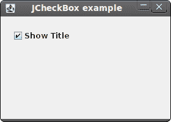
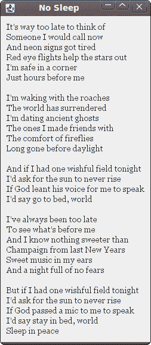
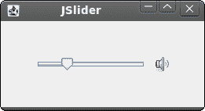
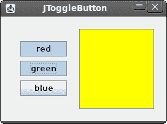
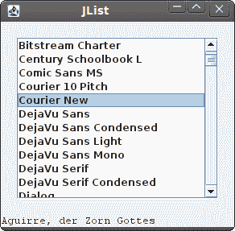

# JRuby Swing 中的组件

> 原文： [http://zetcode.com/gui/jrubyswing/components/](http://zetcode.com/gui/jrubyswing/components/)

在 JRuby Swing 编程教程的这一部分中，我们将介绍基本的 Swing 组件。

组件是 GUI 应用程序的基本构建块。 多年来，一些组件已成为所有 OS 平台上所有工具包中的标准组件。 例如，按钮，复选框或滚动条。 Swing 具有丰富的组件集，可满足大多数编程需求。 可以将更多专用组件创建为自定义组件。

## `JCheckBox`

`JCheckBox`是具有两种状态的组件：开和关。 开状态通过复选标记显示。 它用来表示一些布尔属性。 `JCheckBox`组件提供了一个带有文本标签的复选框。

```
#!/usr/local/bin/jruby

# ZetCode JRuby Swing tutorial
#
# This program uses JCheckBox
# component to show/hide the title
# of the window
#
# author: Jan Bodnar
# website: www.zetcode.com
# last modified: December 2010

include Java

import java.awt.Dimension
import javax.swing.JCheckBox
import javax.swing.Box
import javax.swing.BoxLayout
import javax.swing.JFrame

class Example < JFrame

    def initialize
        super "JCheckBox example"

        self.initUI
    end

    def initUI

        self.setLayout BoxLayout.new getContentPane, BoxLayout::Y_AXIS
        self.add Box.createRigidArea Dimension.new 15, 20

        cb = JCheckBox.new "Show Title", true
        cb.setBounds 50, 60, 80, 30
        cb.setFocusable(false)

        cb.add_action_listener do |e|
            if self.getTitle.empty?
                self.setTitle "JCheckBox example"
            else
                self.setTitle ""
            end
        end

        add cb

        self.setDefaultCloseOperation JFrame::EXIT_ON_CLOSE
        self.setSize 300, 200
        self.setLocationRelativeTo nil
        self.setVisible true
    end
end

Example.new

```

在我们的示例中，我们在窗口上放置了一个复选框。 复选框显示或隐藏窗口的标题。

```
self.setLayout BoxLayout.new getContentPane, BoxLayout::Y_AXIS
self.add Box.createRigidArea Dimension.new 15, 20

```

在此示例中，我们使用`BoxLayout`布局管理器。 我们在此处放置一些空间，以使复选框不太靠近角落。

```
cb = JCheckBox.new "Show Title", true

```

`JCheckBox`组件已创建。 构造函数的第一个参数是其文本标签。 第二个参数是一个布尔值，指示初始选择状态。 如果为 true，则选中该复选框。

```
cb.setFocusable false

```

我们禁用复选框的焦点。 可以使用空格键选择或取消选择具有焦点的`JCheckBox`。

```
cb.add_action_listener do |e|
    if self.getTitle.empty?
        self.setTitle "JCheckBox example"
    else
        self.setTitle ""
    end
end

```

在动作侦听器内部，我们检查标题是否已设置。 如果有标题，我们将其删除。 如果没有标题，我们设置一个。 这样，我们可以切换标题的可见性。



Figure: JCheckBox

## `JLabel`

`JLabel`组件用于显示文本，图像或两者。 没有用户交互。

```
#!/usr/local/bin/jruby

# ZetCode JRuby Swing tutorial
#
# In this program, we show lyrics of a
# song in a window.
#
# author: Jan Bodnar
# website: www.zetcode.com
# last modified: December 2010

include Java

import java.awt.BorderLayout
import java.awt.Color
import java.awt.Font

import javax.swing.JFrame
import javax.swing.BorderFactory
import javax.swing.JPanel
import javax.swing.JLabel

class Example < JFrame

    def initialize
        super "Lyrics"

        self.initUI
    end

    def initUI

        lyrics =  "<html>It's way too late to think of<br>
        Someone I would call now<br>
        And neon signs got tired<br>
        Red eye flights help the stars out<br>
        I'm safe in a corner<br>
        Just hours before me<br>
        <br>
        I'm waking with the roaches<br>
        The world has surrendered<br>
        I'm dating ancient ghosts<br>
        The ones I made friends with<br>
        The comfort of fireflies<br>
        Long gone before daylight<br>
        <br>
        And if I had one wishful field tonight<br>
        I'd ask for the sun to never rise<br>
        If God leant his voice for me to speak<br>
        I'd say go to bed, world<br>
        <br>
        I've always been too late<br>
        To see what's before me<br>
        And I know nothing sweeter than<br>
        Champaign from last New Years<br>
        Sweet music in my ears<br>
        And a night full of no fears<br>
        <br>
        But if I had one wishful field tonight<br>
        I'd ask for the sun to never rise<br>
        If God passed a mic to me to speak<br>
        I'd say stay in bed, world<br>
        Sleep in peace</html>"

        panel = JPanel.new
        panel.setLayout BorderLayout.new 10, 10

        label = JLabel.new lyrics
        label.setFont Font.new "Georgia", Font::PLAIN, 14
        label.setForeground Color.new 50, 50, 25

        panel.add label, BorderLayout::CENTER
        panel.setBorder BorderFactory.createEmptyBorder 10, 10, 10, 10
        self.add panel
        self.pack

        self.setDefaultCloseOperation JFrame::EXIT_ON_CLOSE
        self.setLocationRelativeTo nil
        self.setVisible true
    end    
end

Example.new

```

我们的示例在窗口中显示了歌曲的歌词。 我们可以在`JLabel`组件中使用 HTML 标签。 我们使用&lt; br &gt;标签来分隔行。

```
lyrics =  "<html>It's way too late to think of<br>
Someone I would call now<br>
And neon signs got tired<br>
...

```

我们定义了多行文字。

```
label = JLabel.new lyrics
label.setFont Font.new "Georgia", Font::PLAIN, 14

```

在这里，我们创建标签组件。 我们将其字体设置为 14 像素高的纯乔治亚州。

```
panel.add label, BorderLayout::CENTER
panel.setBorder BorderFactory.createEmptyBorder 10, 10, 10, 10

```

我们将标签放在面板的中央。 我们在标签周围放置了 10px。



Figure: JLabel component

## `JSlider`

`JSlider`是一个组件，使用户可以通过在有限的间隔内滑动旋钮来以图形方式选择一个值。 我们的示例将显示音量控制。

```
#!/usr/local/bin/jruby

# ZetCode JRuby Swing tutorial
#
# In this program we use a JSlider
# component to control volume images.
#
# author: Jan Bodnar
# website: www.zetcode.com
# last modified: December 2010

include Java

import java.awt.Dimension
import java.awt.BorderLayout

import javax.swing.event.ChangeListener
import javax.swing.JFrame
import javax.swing.JSlider
import javax.swing.JLabel
import javax.swing.JPanel
import javax.swing.BorderFactory
import javax.swing.Box
import javax.swing.BoxLayout
import javax.swing.ImageIcon

class ChangeEvent
    include ChangeListener

    def setLabel label
        @label = label
    end    

    def setIcons mute, min, med, max
        @mute = mute
        @min = min
        @med = med
        @max = max
    end       

    def stateChanged e
        sender = e.getSource

        value = sender.getValue

        if value == 0
            @label.setIcon(@mute)
        elsif value > 0 and value <= 30
            @label.setIcon(@min)
        elsif value > 30 and value < 80
            @label.setIcon(@med)
        else
            @label.setIcon(@max)  
        end            
    end    
end

class Example < JFrame

    def initialize
        super "JSlider"

        self.initUI
    end

    def initUI

        mute = ImageIcon.new "mute.png"
        min = ImageIcon.new "min.png"
        med = ImageIcon.new "med.png"
        max = ImageIcon.new "max.png"

        panel = JPanel.new
        panel.setLayout BoxLayout.new panel, BoxLayout::X_AXIS
        panel.setBorder BorderFactory.createEmptyBorder 40, 40, 40, 40
        self.setLayout BorderLayout.new

        panel.add Box.createHorizontalGlue

        label = JLabel.new mute, JLabel::CENTER

        slider = JSlider.new 0, 150, 0

        ce = ChangeEvent.new
        ce.setLabel label
        ce.setIcons mute, min, med, max
        slider.add_change_listener ce

        slider.setPreferredSize Dimension.new 150, 30

        panel.add slider
        panel.add label
        panel.add Box.createRigidArea Dimension.new 5, 0

        panel.add Box.createHorizontalGlue
        self.add panel, BorderLayout::CENTER

        self.pack

        self.setDefaultCloseOperation JFrame::EXIT_ON_CLOSE
        self.setSize 300, 200
        self.setLocationRelativeTo nil
        self.setVisible true
    end
end

Example.new

```

在代码示例中，我们显示了`JSlider`和`JLabel`。 通过拖动滑块，我们可以更改标签组件上的图标。 我们有四个代表声音各种状态的图像。

```
mute = ImageIcon.new "mute.png"

```

在这里，我们创建一个图像图标。

```
panel.setLayout BoxLayout.new panel, BoxLayout::X_AXIS

```

面板组件具有水平`BoxLayout`。

```
panel.setBorder BorderFactory.createEmptyBorder 40, 40, 40, 40

```

我们在面板周围创建 40px 的边框。

```
panel.add Box.createHorizontalGlue

```

我们在左右两侧都放置了可调整大小的空间。 这是为了防止`JSlider`增长到不自然的尺寸。

```
label = JLabel.new mute, JLabel::CENTER

```

该行创建一个具有指定图像和水平对齐方式的`JLabel`实例。 默认情况下，标签在其显示区域中垂直居中。

```
slider = JSlider.new 0, 150, 0

```

这是一个`JSlider`构造函数。 参数为最小值，最大值和当前值。

```
ce = ChangeEvent.new
ce.setLabel label
ce.setIcons mute, min, med, max

```

创建一个`ChangeEvent`对象。 我们为此对象设置了标签和图标。

```
slider.add_change_listener ce

```

每次我们移动滑块时，都会调用`ChangeEvent`对象的`stateChanged`方法。

```
panel.add Box.createRigidArea Dimension.new 5, 0

```

我们在两个组件之间放置一个 5px 的刚性空间。 当滑块位于末端位置时，它们彼此之间过于靠近。

```
class ChangeEvent
    include ChangeListener

```

这是一个`ChangeEvent`类，它实现了`ChangeListener`。 因此，此类必须实现`changeEvent`方法。

```
sender = e.getSource

value = sender.getValue

```

在`changeEvent`方法内部，我们获取事件源。 它是产生事件的滑块。 从发送者，我们获得当前值。

```
if value == 0
    @label.setIcon(@mute)

```

如果该值等于零，我们将更新标签以具有`mute.png`图像。



Figure: JSlider

## `JToggleButton`

`JToggleButton`是具有两种状态的按钮。 已按下但未按下。 通过单击可以在这两种状态之间切换。 在某些情况下此功能非常合适。

```
#!/usr/local/bin/jruby

# ZetCode JRuby Swing tutorial
#
# This program uses toggle buttons to
# change the background color of
# a panel.
#
# author: Jan Bodnar
# website: www.zetcode.com
# last modified: December 2010

include Java

import java.awt.Color
import java.awt.Dimension
import java.awt.event.ActionListener
import javax.swing.JToggleButton
import javax.swing.Box
import javax.swing.BoxLayout
import javax.swing.BorderFactory
import javax.swing.JFrame
import javax.swing.JPanel
import javax.swing.border.LineBorder

class Example < JFrame
    include ActionListener

    def initialize
        super "JToggleButton"

        self.initUI
    end

    def initUI

        self.setPreferredSize Dimension.new 280, 200

        bottom = JPanel.new
        bottom.setLayout BoxLayout.new bottom, BoxLayout::X_AXIS
        bottom.setBorder BorderFactory.createEmptyBorder 20, 20, 20, 20

        leftPanel = JPanel.new
        leftPanel.setLayout BoxLayout.new leftPanel, BoxLayout::Y_AXIS

        @display = JPanel.new
        @display.setPreferredSize Dimension.new 110, 110
        @display.setBorder LineBorder.createGrayLineBorder
        @display.setBackground Color.black

        bottom.add @display

        redButton = JToggleButton.new "red"
        redButton.addActionListener self
        greenButton = JToggleButton.new "green"
        greenButton.addActionListener self
        blueButton = JToggleButton.new "blue"
        blueButton.addActionListener self

        blueButton.setMaximumSize greenButton.getMaximumSize
        redButton.setMaximumSize greenButton.getMaximumSize

        leftPanel.add redButton
        leftPanel.add Box.createRigidArea Dimension.new 25, 7
        leftPanel.add greenButton
        leftPanel.add Box.createRigidArea Dimension.new 25, 7
        leftPanel.add blueButton      

        bottom.add leftPanel
        bottom.add Box.createRigidArea Dimension.new 20, 0

        self.add bottom
        self.pack

        self.setDefaultCloseOperation JFrame::EXIT_ON_CLOSE
        self.setSize 300, 200
        self.setLocationRelativeTo nil
        self.setVisible true
    end

    def actionPerformed e

        color = @display.getBackground
        red = color.getRed
        green = color.getGreen
        blue = color.getBlue

        if e.getActionCommand == "red"
            if red == 0
                red = 255
            else
                red = 0
            end
        end

        if e.getActionCommand == "green"
            if green == 0
                green = 255
            else
                green = 0
            end
        end

        if e.getActionCommand == "blue"
            if blue == 0
                blue = 255
            else
                blue = 0
            end            
        end

        setCol = Color.new red, green, blue
        @display.setBackground setCol        
    end      
end

Example.new

```

在代码示例中，我们使用三个切换按钮来更改矩形组件的颜色。

```
class Example < JFrame
    include ActionListener

```

该类实现`ActionListener`。 我们将在 Example 类的`actionPerformed`方法中执行一些操作。

```
redButton = JToggleButton.new "red"
redButton.addActionListener self

```

我们创建一个`JToggleButton`组件。 我们向按钮添加一个动作监听器。 动作侦听器是 Example 类。 当我们单击 redButton 时，将调用 Example 类的`actionPerformed`方法。

```
blueButton.setMaximumSize greenButton.getMaximumSize
redButton.setMaximumSize greenButton.getMaximumSize

```

我们使三个按钮的大小相等。

```
color = @display.getBackground
red = color.getRed
green = color.getGreen
blue = color.getBlue

```

我们确定显示背景颜色的当前红色，绿色，蓝色部分。

```
if e.getActionCommand == "red"
    if red == 0
        red = 255
    else
        red = 0
    end
end

```

我们确定切换了哪个按钮，并相应地更新 RGB 值的颜色部分。

```
setCol = Color.new red, green, blue
@display.setBackground setCol

```

在此创建新的颜色，并将显示面板更新为新的颜色。



Figure: JToggleButton

## `JList`

`JList`是显示对象列表的组件。 它允许用户选择一项或多项。

```
#!/usr/local/bin/jruby

# ZetCode JRuby Swing tutorial
#
# In this program, we show all 
# available fonts of a system in 
# a JList component.
#
# author: Jan Bodnar
# website: www.zetcode.com
# last modified: December 2010

include Java

import java.awt.BorderLayout
import java.awt.Dimension
import java.awt.Font
import java.awt.GraphicsEnvironment

import javax.swing.JFrame
import javax.swing.BorderFactory
import javax.swing.JScrollPane
import javax.swing.JPanel
import javax.swing.JLabel
import javax.swing.JList

class Example < JFrame

  def initialize
    super "JList"

    initUI
  end

  def initUI

    panel = JPanel.new
    panel.setLayout BorderLayout.new
    panel.setBorder BorderFactory.createEmptyBorder 20, 20, 20, 20

    ge = GraphicsEnvironment.getLocalGraphicsEnvironment
    fonts = ge.getAvailableFontFamilyNames

    list = JList.new fonts

    list.add_list_selection_listener do |e|

        sender = e.source

        if not e.getValueIsAdjusting
            name = sender.getSelectedValue
            font = Font.new name, Font::PLAIN, 13
            @label.setFont font
        end
    end

    pane = JScrollPane.new
    pane.getViewport.add list
    pane.setPreferredSize Dimension.new 250, 200
    panel.add pane

    @label = JLabel.new "Aguirre, der Zorn Gottes"
    @label.setFont Font.new "Serif", Font::PLAIN, 12
    self.add @label, BorderLayout::SOUTH

    self.add panel
    self.pack

    self.setDefaultCloseOperation JFrame::EXIT_ON_CLOSE
    self.setLocationRelativeTo nil
    self.setVisible true
  end

end

Example.new

```

在我们的示例中，我们将显示`JList`和`JLabel`组件。 list 组件包含我们系统上所有可用字体系列名称的列表。 如果我们从列表中选择一项，则标签将以我们选择的字体显示。

```
ge = GraphicsEnvironment.getLocalGraphicsEnvironment
fonts = ge.getAvailableFontFamilyNames

```

在这里，我们获得系统上所有可能的字体系列名称。

```
list = JList.new fonts

```

我们创建`JList`组件的实例。 它将显示所有字体系列名称。

```
if not e.getValueIsAdjusting

```

列表选择中的事件被分组。 我们收到选择和取消选择事件。 为了仅过滤选择事件，我们使用`getValueIsAdjusting`方法。

```
name = sender.getSelectedValue
font = Font.new name, Font::PLAIN, 13
@label.setFont font

```

我们得到所选项目并为标签设置新字体。

```
pane = JScrollPane.new
pane.getViewport.add list

```

默认情况下，`JList`组件不可滚动。 我们将列表放入`JScrollPane`以使其可滚动。



Figure: JList component

在 JRuby Swing 教程的这一部分中，我们介绍了几个 Swing 组件。