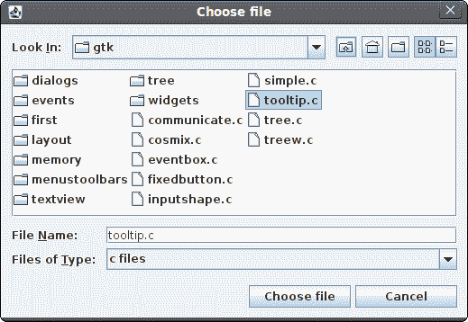

# JRuby Swing 中的对话框

> 原文： [http://zetcode.com/gui/jrubyswing/dialogs/](http://zetcode.com/gui/jrubyswing/dialogs/)

在 JRuby Swing 编程教程的这一部分中，我们将使用对话框。

对话框窗口或对话框是大多数现代 GUI 应用程序必不可少的部分。 对话被定义为两个或更多人之间的对话。 在计算机应用程序中，对话框是一个窗口，用于与应用程序“对话”。 对话框用于输入数据，修改数据，更改应用程序设置等。对话框是用户与计算机程序之间进行通信的重要手段。

## `MessageDialog`

消息框是方便的对话框，可向应用程序的用户提供消息。 该消息由文本和图像数据组成。

```
#!/usr/local/bin/jruby

# ZetCode JRuby Swing tutorial
# 
# This program demonstrates
# message dialogs.
# 
# author: Jan Bodnar
# website: www.zetcode.com
# last modified: December 2010

include Java

import java.awt.GridLayout
import javax.swing.JFrame
import javax.swing.JButton
import javax.swing.JPanel
import javax.swing.JOptionPane

class Example < JFrame

    def initialize
        super "Message boxes"

        self.initUI
    end

    def initUI

        panel = JPanel.new
        panel.setLayout GridLayout.new 2, 2

        errorButton = JButton.new "Error"
        errorButton.addActionListener do |e|
            JOptionPane.showMessageDialog panel, "Could not open file",
                "Error", JOptionPane::ERROR_MESSAGE
        end

        warningButton = JButton.new "Warning"
        warningButton.addActionListener do |e|
            JOptionPane.showMessageDialog panel, "A deprecated call",
                "Warning", JOptionPane::WARNING_MESSAGE
        end

        questionButton = JButton.new "Question"
        questionButton.addActionListener do |e|
            JOptionPane.showMessageDialog panel, "Are you sure to quit?",
                "Question", JOptionPane::QUESTION_MESSAGE
        end

        informButton = JButton.new "Information"
        informButton.addActionListener do |e|
            JOptionPane.showMessageDialog panel, "Download completed",
                "Information", JOptionPane::INFORMATION_MESSAGE
        end

        panel.add errorButton
        panel.add warningButton
        panel.add questionButton
        panel.add informButton

        self.add panel      

        self.setDefaultCloseOperation JFrame::EXIT_ON_CLOSE
        self.setSize 300, 200
        self.setLocationRelativeTo nil
        self.setVisible true
    end
end

Example.new

```

我们使用`GridLayout`管理器来设置四个按钮的网格。 每个按钮显示一个不同的消息框。

```
errorButton.addActionListener do |e|
    JOptionPane.showMessageDialog panel, "Could not open file",
        "Error", JOptionPane::ERROR_MESSAGE
end

```

如果按下错误按钮，则会显示错误对话框。 我们使用`showMessageDialog`方法在屏幕上显示对话框。 此方法的第一个参数是面板，在其中显示对话框。 第二个参数是要显示的消息。 第三个参数是对话框的标题。 最后一个参数是消息类型。 默认图标由消息类型决定。 在本例中，错误对话框的消息类型为`ERROR_MESSAGE`。


Figure: Error message dialog

## `JFileChooser`

`JFileChooser`对话框允许用户从文件系统中选择一个文件。

```
#!/usr/local/bin/jruby

# ZetCode JRuby Swing tutorial
# 
# In this program, we use a JFileChooser
# to load a c file.
# 
# author: Jan Bodnar
# website: www.zetcode.com
# last modified: December 2010

include Java

import java.awt.BorderLayout
import java.awt.Color
import javax.swing.JFrame
import javax.swing.JButton
import javax.swing.JPanel
import javax.swing.JToolBar
import javax.swing.JFileChooser
import javax.swing.JTextArea
import javax.swing.JTextPane
import javax.swing.JScrollPane
import javax.swing.BorderFactory
import javax.swing.filechooser::FileNameExtensionFilter

class Example < JFrame

    def initialize
        super "FileChooser"

        self.initUI
    end

    def initUI

        @panel = JPanel.new
        @panel.setLayout BorderLayout.new

        toolbar = JToolBar.new
        openb = JButton.new "Choose file"
        openb.addActionListener do |e|
            chooseFile = JFileChooser.new
            filter = FileNameExtensionFilter.new "c files", "c"
            chooseFile.addChoosableFileFilter filter

            ret = chooseFile.showDialog @panel, "Choose file"

            if ret == JFileChooser::APPROVE_OPTION
                file = chooseFile.getSelectedFile
                text = self.readFile file
                @area.setText text.to_s     
            end
        end

        toolbar.add openb

        @area = JTextArea.new
        @area.setBorder BorderFactory.createEmptyBorder 10, 10, 10, 10

        pane = JScrollPane.new
        pane.getViewport.add @area

        @panel.setBorder BorderFactory.createEmptyBorder 10, 10, 10, 10
        @panel.add pane
        self.add @panel

        self.add toolbar, BorderLayout::NORTH

        self.setDefaultCloseOperation JFrame::EXIT_ON_CLOSE
        self.setSize 450, 400
        self.setLocationRelativeTo nil
        self.setVisible true
    end

    def readFile file

        filename = file.getCanonicalPath
        f = File.open filename, "r"
        text = IO.readlines filename
        return text
    end    
end

Example.new

```

在我们的代码示例中，我们使用`JFileChooser`对话框选择一个 C 文件并将其内容显示在`JTextArea`中。

```
@area = JTextArea.new

```

这是`JTextArea`，我们将在其中显示所选文件的内容。

```
chooseFile = JFileChooser.new
filter = FileNameExtensionFilter.new "c files", "c"
chooseFile.addChoosableFileFilter filter

```

我们创建`JFileChooser`对话框的实例。 我们创建一个仅显示 C 文件的过滤器。

```
ret = chooseFile.showDialog @panel, "Choose file"

```

对话框显示在屏幕上。 我们得到了返回值。

```
if ret == JFileChooser::APPROVE_OPTION
    file = chooseFile.getSelectedFile
    text = self.readFile file
    @area.setText text.to_s     
end

```

如果用户选择了文件，我们将获得文件名。 阅读其内容并将文本设置为文本区域组件。

```
def readFile file

    filename = file.getCanonicalPath
    f = File.open filename, "r"
    text = IO.readlines filename
    return text
end   

```

此代码从文件中读取文本。 `getCanonicalPath`返回绝对文件名。



Figure: JFileChooser

在 JRuby Swing 教程的这一部分中，我们使用了对话框窗口。