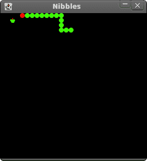

# JRuby Swing 中的蚕食

> 原文： [http://zetcode.com/gui/jrubyswing/nibbles/](http://zetcode.com/gui/jrubyswing/nibbles/)

在 JRuby Swing 编程教程的这一部分中，我们将创建一个 Nibbles 游戏克隆。

Nibbles 是较旧的经典视频游戏。 它最初是在 70 年代后期创建的。 后来它被带到 PC 上。 在这个游戏中，玩家控制蛇。 目的是尽可能多地吃苹果。 蛇每次吃一个苹果，它的身体就会长大。 蛇必须避开墙壁和自己的身体。

## 发展历程

蛇的每个关节的大小为 10px。 蛇由光标键控制。 最初，蛇具有三个关节。 游戏立即开始。 游戏结束后，我们在窗口中心显示“ Game Over”消息。

```
#!/usr/local/bin/jruby

# ZetCode JRuby Swing tutorial
# 
# In this program, we create
# a Nibbles game clone.
# 
# author: Jan Bodnar
# website: www.zetcode.com
# last modified: December 2010

include Java

import java.awt.Color
import java.awt.Font
import java.awt.Dimension
import java.awt.Toolkit
import java.awt.event.ActionListener
import java.awt.event.KeyEvent
import java.awt.event.KeyListener
import javax.swing.JFrame
import javax.swing.ImageIcon
import javax.swing.JPanel
import javax.swing.Timer

NWIDTH = 300
NHEIGHT = 300
DOT_SIZE = 10
ALL_DOTS = NWIDTH * NHEIGHT / (DOT_SIZE * DOT_SIZE)
RAND_POS = 25
DELAY = 140

$x = [0] * ALL_DOTS
$y = [0] * ALL_DOTS

class Board < JPanel
    include KeyListener, ActionListener

    def initialize 
        super

        self.setFocusable true

        self.initGame
    end

    def initGame

        @left = false
        @right = true
        @up = false
        @down = false
        @inGame = true
        @dots = 3

        begin
            iid = ImageIcon.new "dot.png"
            @ball = iid.getImage

            iia = ImageIcon.new "apple.png"
            @apple = iia.getImage

            iih = ImageIcon.new "head.png"
            @head = iih.getImage
        rescue
            puts "cannot load images"
        end

        for i in 0..@dots
            $x[i] = 50 - i * 10
            $y[i] = 50
        end

        self.locateApple
        self.setBackground Color.black
        self.addKeyListener self

        @timer = Timer.new DELAY, self
        @timer.start

    end

    def paint g

        super g      

        if @inGame

            self.drawObjects g

            Toolkit.getDefaultToolkit.sync
            g.dispose

        else
            self.gameOver g
        end
    end

    def drawObjects g

        g.drawImage @apple, @apple_x, @apple_y, self

        for z in 0..@dots
            if z == 0
                g.drawImage @head, $x[z], $y[z], self
            else
                g.drawImage @ball, $x[z], $y[z], self
            end
        end
    end

    def gameOver g

        msg = "Game Over"
        small = Font.new "Helvetica", Font::BOLD, 14
        metr = self.getFontMetrics small

        g.setColor Color.white
        g.setFont small
        g.drawString msg,  (NWIDTH - metr.stringWidth(msg)) / 2,
                     NHEIGHT / 2
        @timer.stop
    end

    def checkApple

        if $x[0] == @apple_x and $y[0] == @apple_y 
            @dots = @dots + 1
            self.locateApple
        end
    end

    def move

        z = @dots

        while z > 0
            $x[z] = $x[(z - 1)]
            $y[z] = $y[(z - 1)]
            z = z - 1
        end

        if @left
            $x[0] -= DOT_SIZE
        end

        if @right 
            $x[0] += DOT_SIZE
        end

        if @up
            $y[0] -= DOT_SIZE
        end

        if @down
            $y[0] += DOT_SIZE
        end

     end

    def checkCollision

        z = @dots

        while z > 0
            if z > 4 and $x[0] == $x[z] and $y[0] == $y[z]
                @inGame = false
            end
            z = z - 1
        end

        if $y[0] > NHEIGHT - DOT_SIZE
            @inGame = false
        end

        if $y[0] < 0
            @inGame = false
        end

        if $x[0] > NWIDTH - DOT_SIZE
            @inGame = false
        end

        if $x[0] < 0
            @inGame = false
        end    

    end

    def locateApple

        r = rand RAND_POS
        @apple_x = r * DOT_SIZE
        r = rand RAND_POS
        @apple_y = r * DOT_SIZE
    end

    def actionPerformed e

        if @inGame
            self.checkApple
            self.checkCollision
            self.move
        end

        self.repaint

    end

    def keyReleased e
    end

    def keyPressed e

        key = e.getKeyCode

        if key == KeyEvent::VK_LEFT and not @right
            @left = true
            @up = false
            @down = false
        end

        if key == KeyEvent::VK_RIGHT and not @left
            @right = true
            @up = false
            @down = false
        end

        if key == KeyEvent::VK_UP and not @down
            @up = true
            @right = false
            @left = false
        end

        if key == KeyEvent::VK_DOWN and not @up
            @down = true
            @right = false
            @left = false
        end
    end    
end

class Example < JFrame

    def initialize
        super "Nibbles"

        self.initUI
    end

    def initUI

        board = Board.new
        board.setPreferredSize Dimension.new NWIDTH, NHEIGHT
        self.add board     

        self.pack

        self.setResizable false
        self.setDefaultCloseOperation JFrame::EXIT_ON_CLOSE
        self.setLocationRelativeTo nil
        self.setVisible true
    end
end

Example.new

```

首先，我们将定义一些在游戏中使用的常量。

`WIDTH`和`HEIGHT`常数确定电路板的大小。 `DOT_SIZE`是苹果的大小和蛇的点。 `ALL_DOTS`常数定义了板上可能的最大点数。 `RAND_POS`常数用于计算苹果的随机位置。 `DELAY`常数确定游戏的速度。

```
$x = [0] * ALL_DOTS
$y = [0] * ALL_DOTS

```

这两个数组存储蛇的所有可能关节的 x，y 坐标。

`initGame`方法初始化变量，加载图像并启动超时功能。

```
def paint g

    super g      

    if @inGame

        self.drawObjects g

        Toolkit.getDefaultToolkit.sync
        g.dispose

    else
        self.gameOver g
    end
end

```

在`paint`方法内部，我们检查`@inGame`变量。 如果为真，则绘制对象。 苹果和蛇的关节。 否则，我们显示“游戏结束”文本。 `Toolkit.getDefaultToolkit.sync`方法可确保显示为最新。 这对于动画很有用。

```
def drawObjects g

    g.drawImage @apple, @apple_x, @apple_y, self

    for z in 0..@dots
        if z == 0
            g.drawImage @head, $x[z], $y[z], self
        else
            g.drawImage @ball, $x[z], $y[z], self
        end
    end
end

```

`drawObjects`方法绘制苹果和蛇的关节。 蛇的第一个关节是其头部，用红色圆圈表示。

```
def gameOver g

    msg = "Game Over"
    small = Font.new "Helvetica", Font::BOLD, 14
    metr = self.getFontMetrics small

    g.setColor Color.white
    g.setFont small
    g.drawString msg,  (NWIDTH - metr.stringWidth(msg)) / 2,
                  NHEIGHT / 2
    @timer.stop
end

```

在 gameOver 方法中，我们在窗口中心显示“ Game Over”消息。 我们也停止计时器。

```
def checkApple

    if $x[0] == @apple_x and $y[0] == @apple_y 
        @dots = @dots + 1
        self.locateApple
    end
end

```

`checkApple`方法检查蛇是否击中了苹果对象。 如果是这样，我们添加另一个蛇形关节并调用`locateApple`方法，该方法将随机放置一个新的 Apple 对象。

在`move`方法中，我们有游戏的密钥算法。 要了解它，请看一下蛇是如何运动的。 您控制蛇的头。 您可以使用光标键更改其方向。 其余关节在链上向上移动一个位置。 第二关节移动到第一个关节的位置，第三关节移动到第二个关节的位置，依此类推。

```
while z > 0
    $x[z] = $x[(z - 1)]
    $y[z] = $y[(z - 1)]
    z = z - 1
end

```

该代码将关节向上移动。

```
if @left
    $x[0] -= DOT_SIZE
end

```

将头向左移动。

在`checkCollision`方法中，我们确定蛇是否击中了自己或撞墙之一。

```
while z > 0
    if z > 4 and $x[0] == $x[z] and $y[0] == $y[z]
        @inGame = false
    end
    z = z - 1
end

```

如果蛇用头撞到关节之一，我们就结束游戏。

```
if $y[0] > NHEIGHT - DOT_SIZE
    @inGame = false
end

```

如果蛇击中了棋盘的底部，我们就结束了游戏。

`locateApple`方法在板上随机放置一个苹果。

```
r = rand RAND_POS

```

我们得到一个从 0 到 RAND_POS-1 的随机数。

```
@apple_x = r * DOT_SIZE
...
@apple_y = r * DOT_SIZE

```

这些行设置了 apple 对象的 x，y 坐标。

```
def actionPerformed e

    if @inGame
        self.checkApple
        self.checkCollision
        self.move
    end

    self.repaint

end

```

每隔 DELAY ms，将调用`actionPerformed`方法。 如果我们参与了游戏，我们将调用三种构建游戏逻辑的方法。

在 Board 类的`keyPressed`方法中，我们确定按下的键。

```
if key == KeyEvent::VK_LEFT and not @right
    @left = true
    @up = false
    @down = false
end

```

如果单击左光标键，则将`@left`变量设置为 true。 在`move`方法中使用此变量来更改蛇对象的坐标。 还要注意，当蛇向右行驶时，我们不能立即向左转。

```
class Example < JFrame

    def initialize
        super "Nibbles"

        self.initUI
    end

    def initUI

        board = Board.new
        board.setPreferredSize Dimension.new NWIDTH, NHEIGHT
        self.add board     

        self.pack

        self.setResizable false
        self.setDefaultCloseOperation JFrame::EXIT_ON_CLOSE
        self.setLocationRelativeTo nil
        self.setVisible true
    end
end

```

在本课程中，我们设置了半字节游戏。



Figure: Nibbles

这是使用 Swing 库和 JRuby 编程语言编写的 Nibbles 电脑游戏。