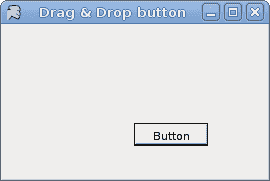
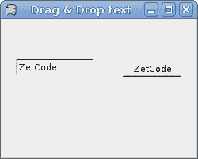
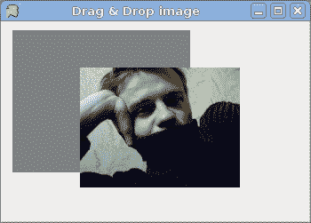

# 拖动&拖放

> 原文： [http://zetcode.com/gui/vbwinforms/dragdrop/](http://zetcode.com/gui/vbwinforms/dragdrop/)

Mono Visual Basic Winforms 教程的这一部分将专门用于拖动&放置操作。

在计算机图形用户界面中，拖放是单击虚拟对象并将其拖动到其他位置或另一个虚拟对象上的动作（或支持以下动作）。 通常，它可用于调用多种动作，或在两个抽象对象之间创建各种类型的关联。 （维基百科）

拖放功能是图形用户界面最明显的方面之一。 拖放操作使您可以直观地完成复杂的事情。

## 拖动按钮

在第一个示例中，我们将在按钮控件上执行拖动&拖放操作。 该示例在拖放&放置协议之外执行作业。

```
' ZetCode Mono Visual Basic Winforms tutorial
'
' In this program we drag & drop
' a button control
'
' author jan bodnar
' last modified May 2009
' website www.zetcode.com

Imports System.Windows.Forms
Imports System.Drawing

Public Class WinVBApp
    Inherits Form

    Private isDragging As Boolean = False
    Private oldX As Integer
    Private oldY As Integer
    Private button As Button

    Public Sub New

        Me.Text = "Drag & Drop button"
        Me.Size = New Size(270, 180)

        Me.InitUI

        Me.CenterToScreen

    End Sub

    Private Sub InitUI

        button = New Button
        button.Parent = Me
        button.Cursor = Cursors.Hand
        button.Text = "Button"
        button.Location = New Point(20, 20)

        AddHandler button.MouseDown, AddressOf Me.OnMouseDown
        AddHandler button.MouseUp, AddressOf Me.OnMouseUp
        AddHandler button.MouseMove, AddressOf Me.OnMouseMove

    End Sub

    Private Sub OnMouseDown(ByVal sender As Object, ByVal e As MouseEventArgs)
        isDragging = True
        oldX = e.X
        oldY = e.Y
    End Sub

    Private Sub OnMouseMove(ByVal sender As Object, ByVal e As MouseEventArgs)
        If isDragging
            button.Top = button.Top + (e.Y - oldY)
            button.Left = button.Left + (e.X - oldX)
        End If
    End Sub

    Private Sub OnMouseUp(ByVal sender As Object, ByVal e As MouseEventArgs)
        isDragging = False
    End Sub

    Public Shared Sub Main
        Application.Run(New WinVBApp)
    End Sub

End Class

```

该代码示例将一个常规按钮控件放在表单容器上。 通过单击按钮表面并同时用鼠标拖动它，我们可以重新放置按钮。

我们的示例中有一些支持变量。 `isDragging`变量告诉我们是否正在拖动对象。 `oldX`和`oldY`变量在拖动过程开始之前存储 x，y 坐标。

```
AddHandler button.MouseDown, AddressOf Me.OnMouseDown
AddHandler button.MouseUp, AddressOf Me.OnMouseUp
AddHandler button.MouseMove, AddressOf Me.OnMouseMove

```

我们为按钮插入了三种不同的鼠标处理程序。 它们实现了拖动&拖放过程的三个不同阶段。 当我们单击按钮时，过程开始。 这由`OnMouseDown`方法处理。 第二部分是机芯。 这是当我们将对象移动到新位置时。 它以`OnMouseMove`方法处理。 最后一部分是过程停止的时间。 当我们释放鼠标按钮时会发生这种情况。 适当的任务委托给`OnMouseUp`方法。

```
Private Sub OnMouseDown(ByVal sender As Object, ByVal e As MouseEventArgs)
    isDragging = True
    oldX = e.X
    oldY = e.Y
End Sub

```

`OnMouseDown`方法实现了过程的第一部分。 它设置了三个必要的变量。

```
Private Sub OnMouseMove(ByVal sender As Object, ByVal e As MouseEventArgs)
    If isDragging
        button.Top = button.Top + (e.Y - oldY)
        button.Left = button.Left + (e.X - oldX)
    End If
End Sub

```

在`OnMouseMove`方法中，我们重新定位按钮。 我们计算存储的 x，y 坐标与鼠标指针的新坐标之间的差。 差异将添加到按钮的`Top`和`Left`属性中，从而将其移动到新位置。



Figure: Dragging a button

## 拖曳文字

在前面的示例中，我们确实拖动了控件上的&拖放。 接下来，我们将对文本数据进行拖放&拖放操作。 在这里，我们将使用 Winforms 库提供的拖放&拖放协议。

拖动&放置操作是 Winforms 中的标准通信协议。 我们有两个基本对象。 `drag source`和`drop target`。

```
' ZetCode Mono Visual Basic Winforms tutorial
'
' In this program we drag & drop
' text
'
' author jan bodnar
' last modified May 2009
' website www.zetcode.com

Imports System.Windows.Forms
Imports System.Drawing

Public Class WinVBApp
    Inherits Form

    Private txtBox As TextBox
    Private btn As Button

    Public Sub New

       Me.Text = "Drag & Drop text"
       Me.Size = New Size(250, 200)

       Me.InitUI

       Me.CenterToScreen

    End Sub

    Private Sub InitUI

        btn = New Button
        txtBox = New TextBox
        Me.SuspendLayout

        btn.AllowDrop = True
        btn.Location = New Point(150, 50)
        txtBox.Location = New Point(15, 50)

        Me.Controls.Add(btn)
        Me.Controls.Add(txtBox)
        Me.ResumeLayout

        AddHandler btn.DragEnter, AddressOf Me.OnDragEnter
        AddHandler btn.DragDrop, AddressOf Me.OnDragDrop
        AddHandler txtBox.MouseDown, AddressOf Me.OnMouseDown

    End Sub

    Private Sub OnDragEnter(ByVal sender As Object, ByVal e As DragEventArgs)
        e.Effect = DragDropEffects.Copy
    End Sub

    Private Sub OnDragDrop(ByVal sender As Object, ByVal e As DragEventArgs)
        sender.Text = e.Data.GetData(DataFormats.Text)
    End Sub

    Private Sub OnMouseDown(ByVal sender As Object, ByVal e As MouseEventArgs)
        sender.DoDragDrop(sender.Text, DragDropEffects.Copy)
    End Sub

    Public Shared Sub Main
        Application.Run(New WinVBApp)
    End Sub

End Class

```

我们在表单上有两个控件。 一个按钮和一个文本框。 我们将文本从文本框中拖放到按钮上。

```
btn.AllowDrop = True

```

我们将`AllowDrop`属性设置为 true。 默认情况下不启用删除。

```
AddHandler btn.DragEnter, AddressOf Me.OnDragEnter
AddHandler btn.DragDrop, AddressOf Me.OnDragDrop
AddHandler txtBox.MouseDown, AddressOf Me.OnMouseDown

```

同样，拖动&拖放过程分为三个步骤。 对于每个特定步骤，我们有三种方法。

```
Private Sub OnDragEnter(ByVal sender As Object, ByVal e As DragEventArgs)
    e.Effect = DragDropEffects.Copy
End Sub

```

当鼠标指针进入放置目标控件的区域时，将启动`DragEnter`事件。 必须设置`Effect`属性。 拖动源和放置目标的 DragDropEffects 必须相等。 否则，该操作将无法进行。

```
Private Sub OnDragDrop(ByVal sender As Object, ByVal e As DragEventArgs)
    sender.Text = e.Data.GetData(DataFormats.Text)
End Sub

```

最后，我们有`OnDragDrop`方法。 在这里，我们从事件对象获取数据并将其设置为按钮`Text`属性。

```
Private Sub OnMouseDown(ByVal sender As Object, ByVal e As MouseEventArgs)
    sender.DoDragDrop(sender.Text, DragDropEffects.Copy)
End Sub

```

在`OnMouseDown`方法中，我们初始化了 drap &放置过程。 我们使用`DoDragDrop`方法启动该过程。 `DragDropEffects.Copy`参数指定操作的类型。 实质上，我们可以在拖动&放置操作期间复制文本或移动文本。



Figure: Drag & drop of text

## 拖曳影像

在最后一个示例中，我们将&拖放图像拖到窗体上。

```
' ZetCode Mono Visual Basic Winforms tutorial
'
' In this program we drag & drop
' an image
'
' author jan bodnar
' last modified May 2009
' website www.zetcode.com

Imports System.Windows.Forms
Imports System.Drawing

Public Class WinVBApp
    Inherits Form

    Private IsDragging As Boolean = False
    Private oldX As Integer
    Private oldY As Integer

    Private dropRect As Rectangle
    Private picBox As PictureBox
    Private image As Bitmap
    Private brsh As Brush

    Public Sub New

        Me.Text = "Drag & Drop image"
        Me.Size = New Size(350, 250)

        Me.InitUI

        Me.CenterToScreen

    End Sub

    Private Sub InitUI

        isDragging = False
        dropRect = New Rectangle(10, 10, 200, 160)
        brsh = Brushes.Gray
        picBox = New PictureBox
        Me.LoadImage

        picBox.Parent = Me
        picBox.Location = New Point(100, 50)
        picBox.Size = New Size(image.Width, image.Height)
        picBox.Image = image
        picBox.Cursor = Cursors.Hand

        AddHandler Me.Paint, AddressOf Me.OnPaint

        AddHandler picBox.MouseDown, AddressOf Me.OnMouseDown        
        AddHandler picBox.MouseMove, AddressOf Me.OnMouseMove
        AddHandler picBox.MouseUp, AddressOf Me.OnMouseUp

    End Sub

    Private Sub LoadImage

      Try 
          image = New Bitmap("image.jpg")
      Catch 
          Console.WriteLine("Error reading image")
          Environment.Exit(1)
      End Try

    End Sub  

    Private Sub OnMouseDown(ByVal sender As Object, ByVal e As MouseEventArgs)
        isDragging = True
        oldX = e.X
        oldY = e.Y
    End Sub

    Private Sub OnMouseMove(ByVal sender As Object, ByVal e As MouseEventArgs)
        If isDragging
            picBox.Top = picBox.Top + (e.Y - oldY)
            picBox.Left = picBox.Left + (e.X - oldX)
        End If
    End Sub

    Private Sub OnMouseUp(ByVal sender As Object, ByVal e As MouseEventArgs)

        isDragging = False

        If dropRect.Contains(picBox.Bounds)
            brsh = Brushes.Gold
        Else 
            brsh = Brushes.Gray
        End If

        Me.Refresh

    End Sub

    Private Sub OnPaint(ByVal sender As Object, ByVal e As PaintEventArgs)
        Dim g As Graphics = e.Graphics
        g.FillRectangle(brsh, dropRect)
    End Sub

    Public Shared Sub Main
        Application.Run(New WinVBApp)
    End Sub

End Class

```

在我们的示例中，我们有一个`PictureBox`，并绘制了一个灰色矩形。 如果将图片放在矩形内，则矩形的颜色变为金色。

```
brsh = Brushes.Gray

```

`brsh`变量保存矩形的笔刷。 默认情况下为灰色。

```
Private Sub LoadImage

  Try 
      image = New Bitmap("image.jpg")
  Catch 
      Console.WriteLine("Error reading image")
      Environment.Exit(1)
  End Try

End Sub  

```

`LoadImage`方法为`PictureBox`控件加载位图。

```
If dropRect.Contains(picBox.Bounds)
    brsh = Brushes.Gold
Else 
    brsh = Brushes.Gray
End If

```

在`OnMouseUp`方法中，我们确定矩形的笔刷。 如果图片框的边界在矩形内，则画笔为金色；否则，画笔为金色。 否则为灰色。

```
Me.Refresh

```

我们必须调用`Refresh`方法来激活新的画笔颜色。



Figure: Drag & drop image

本章致力于使用带有 Visual Basic 语言的 Mono Winforms 库拖动&放置操作。