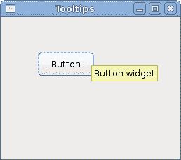
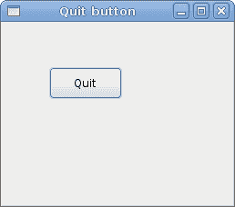

# JavaScript GTK 简介

> 原文： [http://zetcode.com/gui/javascriptgtktutorial/introduction/](http://zetcode.com/gui/javascriptgtktutorial/introduction/)

在 JavaScript GTK 编程教程的这一部分中，我们将介绍 GTK 库并使用 JavaScript 编程语言创建第一个程序。

本教程的目的是帮助您开始使用 GTK 和 JavaScript。 GTK 是用于创建图形用户界面的领先工具包之一。 JavaScript 是一种流行的脚本语言，主要用于浏览器中。 近年来，JavaScript 已进入其他领域，包括台式机上的用户界面编程和使用诸如 JavaScript ++之类的语言来创建 [JavaScript 类](http://www.jspplang.org)的面向对象编程（OOP）。

## Seed

Seed 是一个 JavaScript 解释器，也是 GNOME 项目的库，用于在 JavaScript 中创建独立的应用程序。 它使用 WebKit 项目的 JavaScript 引擎 JavaScriptCore。

种子使用`GObject`内省来访问 Gnome 库。 GTK 是 Gnome 库之一。

## 简单的例子

在第一个示例中，我们创建一个简单的窗口。 窗口在屏幕上居中。 该代码以过程样式编写。

```
#!/usr/bin/seed

/*
ZetCode JavaScript GTK tutorial

This program centers a window on 
the screen.

author: Jan Bodnar
website: www.zetcode.com
last modified: August 2011
*/

Gtk = imports.gi.Gtk;

Gtk.init(null, null);

window = new Gtk.Window({ type: Gtk.WindowType.TOPLEVEL });

window.signal.hide.connect(Gtk.main_quit);
window.set_default_size(250, 200);
window.set_title("Center");
window.set_position(Gtk.WindowPosition.CENTER);

window.show();

Gtk.main();

```

本示例在屏幕中央显示一个 250x200 像素的窗口。

```
Gtk = imports.gi.Gtk;

```

我们导入 Gtk 库。

```
Gtk.init(null, null);

```

此行初始化 GTK 库以供使用。

```
window = new Gtk.Window({ type: Gtk.WindowType.TOPLEVEL });

```

该行创建一个顶层`Window`。 窗口是一个容器。 在大多数情况下（但并非总是如此），主应用程序窗口是顶级窗口。

```
window.signal.hide.connect(Gtk.main_quit);

```

在这里，我们将 hide 信号连接到回调。 `main_quit()`方法永久退出该应用程序。 当我们单击标题栏中的关闭按钮或按 `Alt` + `F4` 组合键时，会发出隐藏信号。

```
window.set_default_size(250, 200);

```

我们为应用程序窗口设置默认大小。

```
window.set_title("Center");

```

我们使用`set_title()`方法为窗口设置标题。

```
window.set_position(Gtk.WindowPosition.CENTER);

```

这条线使窗口在屏幕上居中。

```
window.show();

```

一切准备就绪后，我们在屏幕上显示窗口。

```
Gtk.main();

```

我们设置了应用程序。 创建无限循环。 从这一点开始，应用程序就坐下来，等待用户或系统的外部事件。 循环一直运行到终止为止。

我们有以面向对象样式编写的相同代码示例。 JavaScript 在某种程度上支持面向对象的编程。

```
#!/usr/bin/seed

/*
ZetCode JavaScript GTK tutorial

This program centers a window on 
the screen.

author: Jan Bodnar
website: www.zetcode.com
last modified: August 2011
*/

Gtk = imports.gi.Gtk;

Gtk.init(null, null);

Example = new GType({
    parent: Gtk.Window.type,
    name: "Example",
    init: function()
    {
        init_ui(this);

        function init_ui(w) {

            w.signal.hide.connect(Gtk.main_quit);
            w.set_default_size(250, 200);
            w.set_title("Center");
            w.set_position(Gtk.WindowPosition.CENTER);    
            w.show();
        }
    }    
});

var window = new Example();
Gtk.main();

```

前面的示例以面向对象的样式重写。

```
Example = new GType({
    parent: Gtk.Window.type,
    name: "Example",
    init: function()
    {

```

我们创建一个新类型。 它继承自 GTK Window 小部件。 我们将代码放入该类型的 init 方法中。

## 创建工具提示

第二个示例将显示一个工具提示。 工具提示是一个小的矩形窗口，它提供有关对象的简短信息。 它通常是一个 GUI 组件。 它是应用程序帮助系统的一部分。

```
#!/usr/bin/seed

/*
ZetCode JavaScript GTK tutorial

This code shows a tooltip on 
a window and a button.

author: Jan Bodnar
website: www.zetcode.com
last modified: August 2011
*/

Gtk = imports.gi.Gtk;

Gtk.init(null, null);

Example = new GType({
    parent: Gtk.Window.type,
    name: "Example",
    init: function()
    {
        init_ui(this);

        function init_ui(w) {

            w.signal.hide.connect(Gtk.main_quit);
            w.set_default_size(250, 200);
            w.set_title("Tooltips");
            w.set_position(Gtk.WindowPosition.CENTER);    

            var fix = new Gtk.Fixed();

            var button = new Gtk.Button({ label: "Button" });
            button.set_size_request(80, 35);     
            button.set_tooltip_text("Button widget");

            fix.put(button, 50, 50);
            w.add(fix);

            w.set_tooltip_text("Window widget");            

            w.show_all();
        }
    }    
});

var window = new Example();
Gtk.main();

```

该示例创建一个窗口。 如果将鼠标指针悬停在窗口区域上方，则会弹出一个工具提示。

```
button.set_tooltip_text("Button widget");

```

我们使用`set_tooltip_text()`方法设置工具提示。



Figure: Tooltip

## 退出按钮

在本节的最后一个示例中，我们将创建一个退出按钮。 当我们按下此按钮时，应用程序终止。

```
#!/usr/bin/seed

/*
ZetCode JavaScript GTK tutorial

This program creates a quit
button. When we press the button,
the application terminates. 

author: Jan Bodnar
website: www.zetcode.com
last modified: August 2011
*/

Gtk = imports.gi.Gtk;

Gtk.init(null, null);

Example = new GType({
    parent: Gtk.Window.type,
    name: "Example",
    init: function()
    {
        init_ui(this);

        function init_ui(w) {

            var fix = new Gtk.Fixed();              
            var btn = new Gtk.Button({ label: "Quit" });

            btn.signal.clicked.connect(Gtk.main_quit);
            btn.set_size_request(80, 35);     

            fix.put(btn, 50, 50);    

            w.add(fix);

            w.signal.hide.connect(Gtk.main_quit);
            w.set_default_size(250, 200);
            w.set_title("Quit button");
            w.set_position(Gtk.WindowPosition.CENTER);
            w.show_all();  
        }
    }    
});

var window = new Example();
Gtk.main();

```

我们使用`Button`小部件。 这是一个非常常见的小部件。 它显示文本标签，图像或两者。

```
init_ui(this);

```

我们将用户界面的创建委托给`init_ui()`方法。

```
var btn = new Gtk.Button({ label: "Quit" });

```

在这里，我们创建一个按钮小部件。

```
btn.signal.clicked.connect(Gtk.main_quit);

```

我们将`main_quit()`方法插入按钮`clicked`信号。

```
btn.set_size_request(80, 35);

```

我们为按钮设置大小。

```
fix.put(btn, 50, 50);

```

我们将退出按钮放入 x = 50 和 y = 50 的固定容器中。

```
w.show_all(); 

```

我们有两个选择。 在所有小部件上调用`show()`，或调用`show_all()`（显示容器及其所有子代）。



Figure: Quit button

本节介绍了使用 JavaScript 语言的 GTK 库。