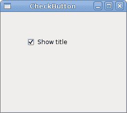
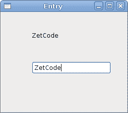
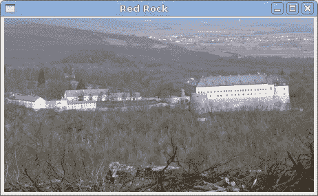

# JavaScript GTK 中的小部件

> 原文： [http://zetcode.com/gui/javascriptgtktutorial/widgets/](http://zetcode.com/gui/javascriptgtktutorial/widgets/)

在 JavaScript GTK 编程教程的这一部分中，我们将介绍一些小部件。

小部件是 GUI 应用程序的基本构建块。 多年来，几个小部件已成为所有 OS 平台上所有工具包中的标准。 例如，按钮，复选框或滚动条。 GTK 工具箱的理念是将小部件的数量保持在最低水平。 将创建更多专门的窗口小部件作为自定义 GTK 窗口小部件。

## 复选框

`CheckButton`是具有两种状态的窗口小部件：打开和关闭。 接通状态通过复选标记显示。 它用来表示一些布尔属性。

```
#!/usr/bin/seed

/*
ZetCode JavaScript GTK tutorial

This program toggles the title of the
window with the CheckButton widget.

author: Jan Bodnar
website: www.zetcode.com
last modified: January 2014
*/

Gtk = imports.gi.Gtk;

Gtk.init(null, null);

Example = new GType({
    parent: Gtk.Window.type,
    name: "Example",
    init: function ()
    {      
        init_ui(this);

        function init_ui(w) {

            w.signal.hide.connect(Gtk.main_quit);
            w.set_default_size(300, 200);
            w.set_title("Check button");
            w.set_position(Gtk.WindowPosition.CENTER);

            var fix = new Gtk.Fixed();

            var cb = new Gtk.CheckButton.with_label("Show title");
            cb.set_active(true);
            cb.signal.clicked.connect(on_clicked);

            fix.put(cb, 50, 50);

            w.add(fix);
            w.show_all();

            function on_clicked(w) {           

              if (w.get_active()) {
                  window.set_title("Check Button");
              } else {
                  window.set_title("");
              }                   
            }    
        }
    }
});

var window = new Example();
Gtk.main();

```

根据`CheckButton`的状态，我们将在窗口的标题栏中显示标题。

```
var cb = new Gtk.CheckButton.with_label("Show title");

```

`CheckButton`小部件已创建。 小部件的构造函数采用一个参数，即标签。 标签显示在复选框旁边。

```
cb.set_active(true);

```

默认情况下标题是可见的，因此我们默认情况下选中复选按钮。

```
cb.signal.clicked.connect(on_clicked);

```

如果我们单击复选框小部件，则会发出单击的信号。 我们将`on_clicked()`方法挂接到信号上。

```
if (w.get_active()) {
    window.set_title("Check Button");
} else {
    window.set_title("");
}  

```

如果选中该按钮，我们将显示标题。 `get_active()`方法用于确定检查按钮的状态。 `set_title()`方法用于设置窗口的标题。 为了清除窗口的标题，我们使用一个空字符串。



Figure: CheckButton

## 标签

`Label`小部件显示文本。 此小部件不支持用户交互。

```
#!/usr/bin/seed

/*
ZetCode JavaScript GTK tutorial

This example demonstrates the Label widget.

author: Jan Bodnar
website: www.zetcode.com
last modified: January 2014
*/

Gtk = imports.gi.Gtk;

Gtk.init(null, null);

var lyrics = "Meet you downstairs in the bar and heard\n\
your rolled up sleeves and your skull t-shirt\n\
You say why did you do it with him today?\n\
and sniff me out like I was Tanqueray\n\
\n\
cause you're my fella, my guy\n\
hand me your stella and fly\n\
by the time I'm out the door\n\
you tear men down like Roger Moore\n\
\n\
I cheated myself\n\
like I knew I would\n\
I told ya, I was trouble\n\
you know that I'm no good";

Example = new GType({
    parent: Gtk.Window.type,
    name: "Example",
    init: function()
    {
        init_ui(this);

        function init_ui(w) {

            w.signal.hide.connect(Gtk.main_quit);
            w.set_default_size(250, 200);
            w.set_title("You know I'm no Good");
            w.set_position(Gtk.WindowPosition.CENTER);

            w.set_border_width(10);
            var label = new Gtk.Label.c_new(lyrics);

            w.add(label);        
            w.show_all();
        }
    }    
});

var window = new Example();
Gtk.main();

```

该代码示例在窗口上显示了一些歌词。

```
var lyrics = "Meet you downstairs in the bar and heard\n\
your rolled up sleeves and your skull t-shirt\n\

```

我们创建多行文本。 在 JavaScript 中，多行文本由以换行符和反斜杠结尾的文本行组成。 反斜杠使 JavaScript 中的字符串可以跨越多个源代码行。 换行符在更多行中显示字符串。

```
w.set_border_width(10);

```

`Label`周围有一些空白。

```
var label = new Gtk.Label.c_new(lyrics);            
w.add(label); 

```

`Label`小部件已创建并添加到窗口。


Figure: Label Widget

## 条目

`Entry`是单行文本输入字段。 该小部件用于输入文本数据。

```
#!/usr/bin/seed

/*
ZetCode JavaScript GTK tutorial

This example demonstrates the Entry widget.

author: Jan Bodnar
website: www.zetcode.com
last modified: January 2014
*/

Gtk = imports.gi.Gtk;

Gtk.init(null, null);

Example = new GType({
    parent: Gtk.Window.type,
    name: "Example",
    init: function()
    {      
        init_ui(this);

        function init_ui(w) {

            w.signal.hide.connect(Gtk.main_quit);
            w.set_default_size(250, 200);
            w.set_title("Entry");
            w.set_position(Gtk.WindowPosition.CENTER);

            var fixed = new Gtk.Fixed();

            var label = new Gtk.Label.c_new("...");
            fixed.put(label, 60, 40);

            var entry = new Gtk.Entry();
            fixed.put(entry, 60, 100);

            entry.signal.key_release_event.connect(function(sender) {  
                label.set_text(sender.text);     
                return false;
            });

            w.add(fixed);
            w.show_all();         
        }
    }    
});

var window = new Example();
Gtk.main();

```

此示例显示了条目小部件和标签。 我们输入的文本将立即显示在标签小部件中。

```
var entry = new Gtk.Entry();

```

`Entry`小部件已创建。

```
entry.signal.key_release_event.connect(function(sender) {  
    label.set_text(sender.text);     
    return false;
});

```

我们将匿名方法插入`Entry`小部件的`key_release_event`。 我们通过`text`属性从窗口小部件中获取文本并将其设置为标签。



Figure: Entry Widget

## 图片

`Image`小部件在窗口上显示图像。

```
#!/usr/bin/seed

/*
ZetCode JavaScript GTK tutorial

This example demonstrates the Image widget.

author: Jan Bodnar
website: www.zetcode.com
last modified: January 2014
*/

Gtk = imports.gi.Gtk;

Gtk.init(null, null);

Example = new GType({
    parent: Gtk.Window.type,
    name: "Example",
    init: function()
    {
        init_ui(this);

        function init_ui(w) {

            w.signal.hide.connect(Gtk.main_quit);
            w.set_default_size(250, 200);
            w.set_title("You know I'm no Good");
            w.set_position(Gtk.WindowPosition.CENTER);

            w.set_border_width(2);

            var image = new Gtk.Image.from_file("redrock.png");

            w.add(image);        
            w.show_all();
        }
    }    
});

var window = new Example();
Gtk.main();

```

在我们的示例中，我们在窗口上显示图像。

```
w.set_border_width(2);

```

我们在图像周围放置了一些空边框。

```
var image = new Gtk.Image.from_file("redrock.png");

```

`Image`小部件已创建。 小部件会自行处理错误。 如果无法加载图像，它将显示一个损坏的图标。

```
w.add(image); 

```

小部件已添加到容器中。



Figure: Image widget

在 JavaScript GTK 教程的这一章中，我们展示了一些基本的小部件。