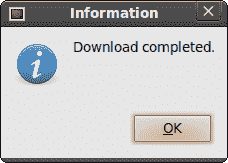
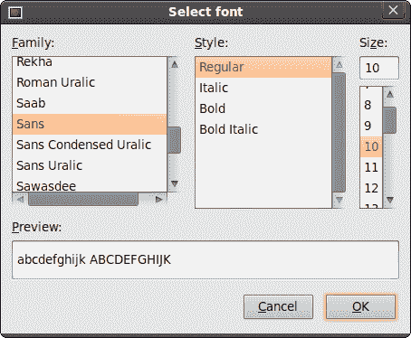

# JavaScript GTK 中的对话框

> 原文： [http://zetcode.com/gui/javascriptgtktutorial/dialogs/](http://zetcode.com/gui/javascriptgtktutorial/dialogs/)

在 JavaScript GTK 编程教程的这一部分中，我们将介绍对话框。

对话框窗口或对话框是大多数现代 GUI 应用程序必不可少的部分。 对话被定义为两个或更多人之间的对话。 在计算机应用程序中，对话框是一个窗口，用于与应用程序“对话”。 对话框用于输入数据，修改数据，更改应用程序设置等。对话框是用户与计算机程序之间进行通信的重要手段。

## 消息框

消息对话框是方便的对话框，可向应用程序的用户提供消息。 该消息包含文本和图像数据。

```
#!/usr/bin/seed

/*
ZetCode JavaScript GTK tutorial

This example demonstrates a
Message dialog

author: Jan Bodnar
website: www.zetcode.com
last modified: July 2011
*/

Gtk = imports.gi.Gtk;

Gtk.init(null, null);

Example = new GType({
    parent: Gtk.Window.type,
    name: "Example",
    init: function ()
    {
        init_ui(this);       

        function init_ui(w) {

            w.signal.hide.connect(Gtk.main_quit);
            w.set_default_size(250, 200);
            w.set_title("Message dialog");
            w.set_position(Gtk.WindowPosition.CENTER);           

            var fixed = new Gtk.Fixed();

            var infoButton = new Gtk.Button.with_label("Information");
            fixed.put(infoButton, 30, 20);

            infoButton.signal.clicked.connect(on_info);            

            w.add(fixed);
            w.show_all(); 
        }            

        function on_info() {

            var md = new Gtk.MessageDialog({modal:true, title:"Information",
                message_type:Gtk.MessageType.INFO,
                buttons:Gtk.ButtonsType.OK, text:"Download completed."});

            md.run();
            md.destroy();
        }
    }   

});

var window = new Example();
Gtk.main();

```

我们在窗口上显示一个按钮。 当我们单击按钮时，会显示一条信息消息。

```
var infoButton = new Gtk.Button.with_label("Information"); 

```

这是一个按钮，当我们单击它时将显示一个对话框。

```
function on_info() {

    var md = new Gtk.MessageDialog({modal:true, title:"Information",
        message_type:Gtk.MessageType.INFO,
        buttons:Gtk.ButtonsType.OK, text:"Download completed."});

    md.run();
    md.destroy();
}

```

如果单击信息按钮，将显示“信息”对话框。 `Gtk.MessageType.INFO`指定对话框的类型。 `Gtk.ButtonsType.OK`指定对话框中将显示哪些按钮。 最后一个参数是显示的消息。 该对话框使用`run()`方法显示。 程序员还必须调用`destroy()`或`hide()`方法。



Figure: Message dialog

## 关于对话

`AboutDialog`显示有关应用程序的信息。 它可以显示徽标，应用程序名称，版本，版权，网站或许可证信息。 也有可能对作者，文档撰写者，翻译者和艺术家予以赞扬。

```
#!/usr/bin/seed

/*
ZetCode JavaScript GTK tutorial

This example demonstrates the
AboutDialog dialog.

author: Jan Bodnar
website: www.zetcode.com
last modified: July 2011
*/

Gtk = imports.gi.Gtk;
GdkPixbuf = imports.gi.GdkPixbuf;

Gtk.init(null, null);

Example = new GType({
    parent: Gtk.Window.type,
    name: "Example",
    init: function ()
    {
        init_ui(this);

        function init_ui(w) {

            w.signal.hide.connect(Gtk.main_quit);
            w.set_default_size(250, 200);
            w.set_title("About dialog");
            w.set_position(Gtk.WindowPosition.CENTER);   

            var button = new Gtk.Button.with_label("About");
            button.set_size_request(80, 30);        
            button.signal.clicked.connect(on_clicked);        
            var fix = new Gtk.Fixed();
            fix.put(button, 20, 20);

            w.add(fix);        

            w.show_all(); 
        }            

        function on_clicked() {

            var about = new Gtk.AboutDialog();
            about.set_program_name("Battery");
            about.set_version("0.1");
            about.set_copyright("(c) Jan Bodnar");
            about.set_comments("Battery is a simple tool for battery checking");
            about.set_website("http://www.zetcode.com");
            about.set_logo(new GdkPixbuf.Pixbuf.from_file("battery.png"));
            about.run();
            about.destroy();
    }
    }   

});

var window = new Example();
Gtk.main();

```

该代码示例使用具有某些功能的`AboutDialog`。

```
var about = new Gtk.AboutDialog();

```

我们创建`AboutDialog`的实例。

```
about.set_program_name("Battery");
about.set_version("0.1");
about.set_copyright("(c) Jan Bodnar");

```

在这里，我们指定程序的名称，版本和版权。

```
about.set_logo(new GdkPixbuf.Pixbuf.from_file("battery.png"));

```

此行创建徽标。


Figure: AboutDialog

## FontSelectionDialog

`FontSelectionDialog`是用于选择字体的对话框。 它通常用于进行一些文本编辑或格式化的应用程序中。

```
#!/usr/bin/seed

/*
ZetCode JavaScript GTK tutorial

This example works with the
FontSelectionDialog.

author: Jan Bodnar
website: www.zetcode.com
last modified: July 2011
*/

Gtk = imports.gi.Gtk;
Pango = imports.gi.Pango;

Gtk.init(null, null);

Example = new GType({
    parent: Gtk.Window.type,
    name: "Example",
    init: function ()
    {

        init_ui(this);

        var label;

        function init_ui(w) {

            w.signal.hide.connect(Gtk.main_quit);
            w.set_default_size(350, 150);
            w.set_title("Font selection");
            w.set_position(Gtk.WindowPosition.CENTER);

            w.set_border_width(10);
            var text = "The only victory over love is flight."
            label = new Gtk.Label.c_new(text);
            var button = new Gtk.Button.with_label("Select font");

            button.signal.clicked.connect(on_clicked);

            var fix = new Gtk.Fixed();
            fix.put(button, 100, 30);
            fix.put(label, 30, 90);

            w.add(fix);       
            w.show_all();             
        }

        function on_clicked() {

            var fdia = new Gtk.FontSelectionDialog.c_new("Select font");
            var response = fdia.run();

            if (response == Gtk.ResponseType.OK) {
                var fname = fdia.get_font_name();
                var font_desc = Pango.Font.description_from_string(fname);
                if (font_desc)
                    label.modify_font(font_desc);        
            }

            fdia.destroy();
        }       
    }                   
});

var window = new Example();
Gtk.main();

```

在代码示例中，我们有一个按钮和一个标签。 单击按钮显示`FontSelectionDialog`。

```
var fdia = new Gtk.FontSelectionDialog.c_new("Select font");

```

我们创建`FontSelectionDialog`。

```
if (response == Gtk.ResponseType.OK) {
    var fname = fdia.get_font_name();
    var font_desc = Pango.Font.description_from_string(fname);
    if (font_desc)
        label.modify_font(font_desc);        
}

```

如果单击“确定”按钮，则标签小部件的字体将更改为我们在对话框中选择的字体。



Figure: FontSelectionDialog

在 JavaScript GTK 教程的这一部分中，我们介绍了对话框。