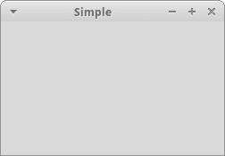
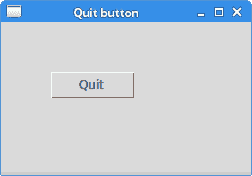

# Tkinter 简介

> 原文： [http://zetcode.com/tkinter/introduction/](http://zetcode.com/tkinter/introduction/)

在 Tkinter 教程的这一部分中，我们介绍 Tkinter 工具包并创建我们的第一个程序。

本教程的目的是帮助您开始使用 Tkinter 工具包。

## Tkinter

Tkinter 是与 Tk GUI 工具包的 Python 绑定。 Tk 是 Tcl 语言的原始 GUI 库。 Tkinter 被实现为 Python 封装程序，围绕着嵌入在 Python 解释器中的完整 Tcl 解释器。 还有其他几种流行的 Python GUI 工具箱。 最受欢迎的是 wxPython，PyQt 和 PyGTK。

## Python

 Python 是一种通用的，动态的，面向对象的编程语言。 Python 语言的设计目的强调程序员的生产力和代码可读性。 Python 最初是由 Guido van Rossum 开发的。 它于 1991 年首次发布。Python 受 ABC，Haskell，Java，Lisp，Icon 和 Perl 编程语言的启发。 Python 是一种高级，通用，多平台，解释性语言。 Python 是一种简约语言。 它最明显的特征之一是它不使用分号或括号。 Python 使用缩进代替。 目前，Python 有两个主要分支：Python 2.x 和 Python3.x。 Python 3.x 打破了与早期版本 Python 的向后兼容性。 它的创建是为了纠正该语言的某些设计缺陷并使该语言更简洁。 本教程使用 Python 2.x 编写。 大多数代码是用 Python 2.x 版本编写的。 软件基础和程序员将需要一些时间才能迁移到 Python3.x。 今天，Python 由世界各地的一大批志愿者维护。 Python 是开源软件。

对于那些想学习编程的人来说，Python 是一个理想的起点。

Python 编程语言支持多种编程样式。 它不会强迫程序员采用特定的范例。 Python 支持面向对象和过程编程。 对功能编程的支持也很有限。

Python 编程语言的官方网站是 [python.org](http://python.org)

## Pillow

Pillow 是一个 Python 库，用于打开，操作和保存许多不同的图像文件格式。 本教程中的某些示例使用 Pillow。

```py
$ sudo apt-get install python-pil.imagetk

```

在 Debian Linux 上，我们可以使用其软件包管理器安装 Pillow。

```py
$ yum install python-imaging

```

在使用 RPM 软件包格式的系统上，我们使用上述命令安装 Pillow。

```py
$ pip install pillow

```

或者，我们可以使用`pip`安装枕头。

## Tkinter 的简单例子

在第一个示例中，我们在屏幕上显示一个基本窗口。

`simple.py`

```py
#!/usr/bin/env python3

"""
ZetCode Tkinter tutorial

This script shows a simple window
on the screen.

Author: Jan Bodnar
Last modified: April 2019
Website: www.zetcode.com
"""

from tkinter import Tk, BOTH
from tkinter.ttk import Frame

class Example(Frame):

    def __init__(self):
        super().__init__()

        self.initUI()

    def initUI(self):

        self.master.title("Simple")
        self.pack(fill=BOTH, expand=1)

def main():

    root = Tk()
    root.geometry("250x150+300+300")
    app = Example()
    root.mainloop()

if __name__ == '__main__':
    main()

```

尽管这段代码很小，但是应用窗口可以做很多事情。 可以调整大小，最大化或最小化。 随之而来的所有复杂性对应用程序员都是隐藏的。

```py
from tkinter import Tk, BOTH
from tkinter.ttk import Frame

```

在这里，我们导入`Tk`和`Frame`类，以及`BOTH`常量。 `Tk`类用于创建根窗口。 `Frame`是其他小部件的容器。

```py
class Example(Frame):

    def __init__(self):
        super().__init__()

```

我们的示例类继承自`Frame`容器窗口小部件。 在`__init__()`构造函数方法中，我们称为继承类的构造函数。

```py
self.initUI()

```

我们将用户界面的创建委托给`initUI()`方法。

```py
self.master.title("Simple")

```

我们使用`title()`方法设置窗口的标题。 `master`属性可访问根窗口（Tk）。

```py
self.pack(fill=BOTH, expand=1)

```

`pack()`方法是 Tkinter 中的三个几何管理器之一。 它将小部件组织成水平和垂直框。 这里，我们将通过`self`属性访问的`Frame`小部件放置到 Tk 根窗口中。 它向两个方向扩展。 换句话说，它占用了根窗口的整个客户端空间。

```py
root = Tk()

```

根窗口已创建。 根窗口是我们程序中的主应用窗口。 它具有标题栏和边框。 这些由窗口管理器提供。 必须在任何其他小部件之前创建它。

```py
root.geometry("250x150+300+300")

```

`geometry()`方法设置窗口的大小并将其放置在屏幕上。 前两个参数是窗口的宽度和高度。 最后两个参数是 x 和 y 屏幕坐标。

```py
app = Example()

```

在这里，我们创建应用类的实例。

```py
root.mainloop()

```

最后，我们进入主循环。 事件处理从这一点开始。 mainloop 从窗口系统接收事件，并将其分配给应用小部件。 当我们单击标题栏的关闭按钮或调用`quit()`方法时，它将终止。



Figure: Simple window

## Tkinter 居中窗口

该脚本使屏幕上的窗口居中。

`center_window.py`

```py
#!/usr/bin/env python3

"""
ZetCode Tkinter tutorial

This script centers a small
window on the screen.

Author: Jan Bodnar
Last modified: April 2019
Website: www.zetcode.com
"""

from tkinter import Tk, BOTH
from tkinter.ttk import Frame

class Example(Frame):

    def __init__(self):
        super().__init__()

        self.initUI()

    def initUI(self):

        self.master.title("Centered window")
        self.pack(fill=BOTH, expand=1)
        self.centerWindow()

    def centerWindow(self):

        w = 290
        h = 150

        sw = self.master.winfo_screenwidth()
        sh = self.master.winfo_screenheight()

        x = (sw - w)/2
        y = (sh - h)/2
        self.master.geometry('%dx%d+%d+%d' % (w, h, x, y))

def main():

    root = Tk()
    ex = Example()
    root.mainloop()

if __name__ == '__main__':
    main()

```

我们需要有窗口的大小和屏幕的大小，才能将窗口放置在监视器屏幕的中央。

```py
w = 290
h = 150

```

这些是应用窗口的宽度和高度值。

```py
sw = self.master.winfo_screenwidth()
sh = self.master.winfo_screenheight()

```

我们确定屏幕的宽度和高度。

```py
x = (sw - w)/2
y = (sh - h)/2

```

我们计算所需的 x 和 y 坐标。

```py
self.master.geometry('%dx%d+%d+%d' % (w, h, x, y))

```

最后，使用`geometry()`方法将窗口放置在屏幕中央。

## Tkinter 退出按钮

在本章的最后一个示例中，我们创建一个具有退出按钮的应用。 当我们按下按钮时，应用终止。

`quit_button.py`

```py
#!/usr/bin/env python3

"""
ZetCode Tkinter tutorial

This program creates a Quit
button. When we press the button,
the application terminates.

Author: Jan Bodnar
Last modified: April 2019
Website: www.zetcode.com
"""

from tkinter import Tk, BOTH
from tkinter.ttk import Frame, Button, Style

class Example(Frame):

    def __init__(self):
        super().__init__()

        self.initUI()

    def initUI(self):

        self.style = Style()
        self.style.theme_use("default")

        self.master.title("Quit button")
        self.pack(fill=BOTH, expand=1)

        quitButton = Button(self, text="Quit",
            command=self.quit)
        quitButton.place(x=50, y=50)

def main():

    root = Tk()
    root.geometry("250x150+300+300")
    app = Example()
    root.mainloop()

if __name__ == '__main__':
    main()

```

我们在窗口上放置一个`Button`。 单击该按钮将终止该应用。

```py
from tkinter.ttk import Frame, Button, Style

```

Tkinter 支持小部件的主题。 主题的窗口小部件可以从`ttk`模块导入。 在撰写本文时，并非所有小部件都可使用。 例如，到目前为止，不支持菜单或列表框。

```py
self.style = Style()
self.style.theme_use("default")

```

我们为小部件应用主题。 一些受支持的主题是蛤，默认，替代或经典。

```py
quitButton = Button(self, text="Quit",
    command=self.quit)

```

我们创建`Button`小部件的实例。 此按钮的父级是`Frame`容器。 我们为按钮和命令提供标签。 该命令指定了当我们按下按钮时调用的方法。 在我们的例子中，调用`quit()`方法，该方法将终止应用。

```py
quitButton.place(x=50, y=50)

```

我们使用`place`几何图形管理器将按钮定位在绝对坐标中-从窗口的左上角起 50x50 px。



Figure: Quit button

本节是 Tkinter 工具包的介绍。