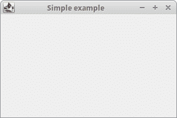
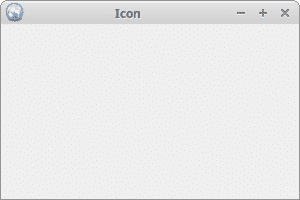
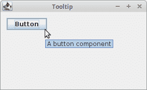
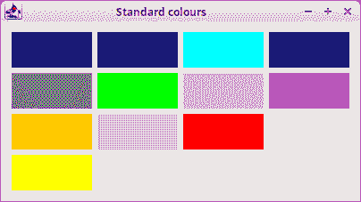
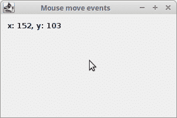

# Java Swing 首个程序

> 原文： [http://zetcode.com/tutorials/javaswingtutorial/firstprograms/](http://zetcode.com/tutorials/javaswingtutorial/firstprograms/)

在本章中，我们将对第一个 Swing 程序进行编程。 我们创建了第一个简单的应用，展示了如何使用“退出”按钮终止应用，显示框架图标，显示工具提示，使用助记符以及显示标准颜色。

[Tweet](https://twitter.com/share) 

Java Swing 组件是 Java Swing 应用的基本构建块。 在本章中，我们将使用`JFrame`，`JButton`和`JLabel`组件。 `JFrame`是带有标题和边框的顶层窗口。 它用于组织其他组件，通常称为子组件。

`JButton`是用于执行动作的按钮。 `JLabel`是用于支付短文本字符串或图像或两者的组件。

## 第一个 Swing 示例

第一个示例在屏幕上显示一个基本窗口。

`com/zetcode/SimpleEx.java`

```java
package com.zetcode;

import java.awt.EventQueue;
import javax.swing.JFrame;

public class SimpleEx extends JFrame {

    public SimpleEx() {

        initUI();
    }

    private void initUI() {

        setTitle("Simple example");
        setSize(300, 200);
        setLocationRelativeTo(null);
        setDefaultCloseOperation(EXIT_ON_CLOSE);
    }

    public static void main(String[] args) {

        EventQueue.invokeLater(() -> {

            var ex = new SimpleEx();
            ex.setVisible(true);
        });
    }
}

```

尽管这段代码很短，但是应用窗口可以做很多事情。 可以调整大小，最大化或最小化。 随之而来的所有复杂性对应用程序员都是隐藏的。

```java
import java.awt.EventQueue;
import javax.swing.JFrame;

```

在这里，我们导入将在代码示例中使用的 Swing 类。

```java
public class SimpleEx extends JFrame {

```

`SimpleEx`继承自`JFrame`组件。 `JFrame`是顶级容器。 容器的基本目的是容纳应用的组件。

```java
public SimpleEx() {

    initUI();
}

```

好的编程习惯是不要将应用代码放入构造函数中，而是将任务委托给特定的方法。

```java
setTitle("Simple example");

```

在这里，我们使用`setTitle()`方法设置窗口的标题。

```java
setSize(300, 200);

```

`setSize()`将窗口的大小调整为 300 像素宽和 200 像素高。

```java
setLocationRelativeTo(null);

```

这条线使窗口在屏幕上居中。

```java
setDefaultCloseOperation(EXIT_ON_CLOSE);

```

如果单击标题栏的“关闭”按钮，则此`setDefaultCloseOperation()`将关闭窗口。 默认情况下，如果我们单击按钮，则不会发生任何事情。

```java
EventQueue.invokeLater(() -> {

    var ex = new SimpleEx();
    ex.setVisible(true);
});

```

我们创建代码示例的实例，并使它在屏幕上可见。 `invokeLater()`方法将应用放置在 Swing 事件队列中。 它用于确保所有 UI 更新都是并发安全的。 换句话说，这是为了防止 GUI 在某些情况下挂起。



Figure: Simple example

## `JButton`示例

在下一个示例中，我们将有一个按钮。 当我们单击按钮时，应用终止。

`com/zetcode/QuitButtonEx.java`

```java
package com.zetcode;

import javax.swing.GroupLayout;
import javax.swing.JButton;
import javax.swing.JComponent;
import javax.swing.JFrame;
import java.awt.EventQueue;

public class QuitButtonEx extends JFrame {

    public QuitButtonEx() {

        initUI();
    }

    private void initUI() {

        var quitButton = new JButton("Quit");

        quitButton.addActionListener((event) -> System.exit(0));

        createLayout(quitButton);

        setTitle("Quit button");
        setSize(300, 200);
        setLocationRelativeTo(null);
        setDefaultCloseOperation(EXIT_ON_CLOSE);
    }

    private void createLayout(JComponent... arg) {

        var pane = getContentPane();
        var gl = new GroupLayout(pane);
        pane.setLayout(gl);

        gl.setAutoCreateContainerGaps(true);

        gl.setHorizontalGroup(gl.createSequentialGroup()
                .addComponent(arg[0])
        );

        gl.setVerticalGroup(gl.createSequentialGroup()
                .addComponent(arg[0])
        );
    }

    public static void main(String[] args) {

        EventQueue.invokeLater(() -> {

            var ex = new QuitButtonEx();
            ex.setVisible(true);
        });
    }
}

```

我们将`JButton`放置在窗口上，然后向该按钮添加一个动作监听器。

```java
var quitButton = new JButton("Quit");

```

在这里，我们创建一个按钮组件。 此构造函数将字符串标签作为参数。

```java
quitButton.addActionListener((event) -> System.exit(0));

```

我们将一个动作监听器插入按钮。 该操作通过调用`System.exit()`方法来终止应用。

```java
createLayout(quitButton);

```

子组件需要放入容器中。 我们将任务委托给`createLayout()`方法。

```java
var pane = getContentPane();
var gl = new GroupLayout(pane);
pane.setLayout(gl);

```

`JFrame`的内容窗格是放置子组件的区域。 子级由专门的不可见组件（称为布局管理器）组织。 内容窗格的默认布局管理器是`BorderLayout`管理器。 这个管理器很简单。 在本教程中，我们使用`GroupLayout`管理器，它功能更强大，更灵活。

```java
gl.setAutoCreateContainerGaps(true);

```

`setAutoCreateContainerGaps()`方法会在组件和容器边缘之间产生间隙。 空间或间隙是每个应用设计的重要组成部分。

```java
gl.setHorizontalGroup(gl.createSequentialGroup()
        .addComponent(arg[0])
);

gl.setVerticalGroup(gl.createSequentialGroup()
        .addComponent(arg[0])
);

```

`GroupLayout`管理器独立定义每个尺寸的布局。 第一步，我们沿着水平轴布置组件； 在另一步骤中，我们沿垂直轴布置组件。 在两种布局中，我们都可以顺序或并行排列组件。 在水平布局中，一行组件称为顺序组，而一列组件称为并行组。 在垂直布局中，一列组件称为顺序组，一排组件称为并行组。

在我们的示例中，我们只有一个按钮，因此布局非常简单。 对于每个尺寸，我们将按钮组件作为参数调用`addComponent()`方法。 （必须为两个维度都添加每个子组件。）


Figure: Quit button

## `JFrame`图标

在下面的示例中，我们将在框架上显示一个图标。 它显示在标题栏的左侧。

`com/zetcode/FrameIconEx.java`

```java
package com.zetcode;

import java.awt.EventQueue;
import javax.swing.ImageIcon;
import javax.swing.JFrame;

public class FrameIconEx extends JFrame {

    public FrameIconEx() {

        initUI();
    }

    private void initUI() {

        var webIcon = new ImageIcon("src/resources/web.png");

        setIconImage(webIcon.getImage());

        setTitle("Icon");
        setSize(300, 200);
        setLocationRelativeTo(null);
        setDefaultCloseOperation(EXIT_ON_CLOSE);
    }

    public static void main(String[] args) {

        EventQueue.invokeLater(() -> {

            var ex = new FrameIconEx();
            ex.setVisible(true);
        });
    }
}

```

`ImageIcon`用于创建图标。 `web.png`是一个 22x22 px 的小图像文件。

```java
var webIcon = new ImageIcon("src/resources/web.png");

```

我们从位于项目根目录中的 PNG 文件创建一个`ImageIcon`。

```java
setIconImage(webIcon.getImage());

```

`setIconImage()`设置要显示为该窗口图标的图像。 `getImage()`返回图标的`Image`。



Figure: Icon

## Swing 工具提示

工具提示是内部应用帮助系统的一部分。 如果将鼠标指针悬停在设置了工具提示的对象上，则 Swing 将显示一个小窗口。

`com/zetcode/TooltipEx.java`

```java
package com.zetcode;

import java.awt.EventQueue;
import javax.swing.GroupLayout;
import javax.swing.JButton;
import javax.swing.JComponent;
import javax.swing.JFrame;
import javax.swing.JPanel;

public class TooltipEx extends JFrame {

    public TooltipEx() {

        initUI();
    }

    private void initUI() {

        var btn = new JButton("Button");
        btn.setToolTipText("A button component");

        createLayout(btn);

        setTitle("Tooltip");
        setLocationRelativeTo(null);
        setDefaultCloseOperation(EXIT_ON_CLOSE);
    }

    private void createLayout(JComponent... arg) {

        var pane = (JPanel) getContentPane();
        var gl = new GroupLayout(pane);
        pane.setLayout(gl);

        pane.setToolTipText("Content pane");

        gl.setAutoCreateContainerGaps(true);

        gl.setHorizontalGroup(gl.createSequentialGroup()
                .addComponent(arg[0])
                .addGap(200)
        );

        gl.setVerticalGroup(gl.createSequentialGroup()
                .addComponent(arg[0])
                .addGap(120)
        );

        pack();
    }

    public static void main(String[] args) {

        EventQueue.invokeLater(() -> {

            var ex = new TooltipEx();
            ex.setVisible(true);
        });
    }
}

```

在示例中，我们为框架和按钮设置了一个工具提示。

```java
btn.setToolTipText("A button component");

```

要启用工具提示，我们调用`setTooltipText()`方法。

```java
var pane = (JPanel) getContentPane();
var gl = new GroupLayout(pane);
pane.setLayout(gl);

```

内容窗格是`JPanel`组件的实例。 `getContentPane()`方法返回`Container`类型。 由于设置工具提示需要`JComponent`实例，因此我们将对象投射到`JPanel`。

```java
pane.setToolTipText("Content pane");

```

为内容窗格设置了一个工具提示。

```java
gl.setHorizontalGroup(gl.createSequentialGroup()
        .addComponent(arg[0])
        .addGap(200)
);

gl.setVerticalGroup(gl.createSequentialGroup()
        .addComponent(arg[0])
        .addGap(120)
);

```

我们将`addGap()`方法用于水平和垂直尺寸。 它在按钮的右侧和底部创建了一些空间。 （目的是增加窗口的初始大小。）

```java
pack();

```

`pack()`方法根据其组件的大小自动调整`JFrame`的大小。 它也考虑了定义的空间。 我们的窗口将显示按钮和我们通过`addGap()`方法设置的空间。



Figure: Tooltip

## Swing 助记符

助记符是用于激活支持助记符的组件的快捷键。 例如，它们可以与标签，按钮或菜单项一起使用。

`com/zetcode/MnemonicEx.java`

```java
package com.zetcode;

import javax.swing.GroupLayout;
import javax.swing.JButton;
import javax.swing.JComponent;
import javax.swing.JFrame;
import java.awt.EventQueue;
import java.awt.event.KeyEvent;

public class MnemonicEx extends JFrame {

    public MnemonicEx() {

        initUI();
    }

    private void initUI() {

        var btn = new JButton("Button");
        btn.addActionListener((event) -> System.out.println("Button pressed"));

        btn.setMnemonic(KeyEvent.VK_B);

        createLayout(btn);

        setTitle("Mnemonics");
        setLocationRelativeTo(null);
        setDefaultCloseOperation(EXIT_ON_CLOSE);
    }

    private void createLayout(JComponent... arg) {

        var pane = getContentPane();
        var gl = new GroupLayout(pane);
        pane.setLayout(gl);

        gl.setAutoCreateContainerGaps(true);

        gl.setHorizontalGroup(gl.createSequentialGroup()
                .addComponent(arg[0])
                .addGap(200)
        );

        gl.setVerticalGroup(gl.createParallelGroup()
                .addComponent(arg[0])
                .addGap(200)
        );

        pack();
    }

    public static void main(String[] args) {

        EventQueue.invokeLater(() -> {

            var ex = new MnemonicEx();
            ex.setVisible(true);
        });
    }
}

```

我们有一个带有动作监听器的按钮。 我们为此按钮设置了一个助记符。 可以使用 `Alt` + `B` 键盘快捷键激活。

```java
btn.setMnemonic(KeyEvent.VK_B);

```

`setMnemonic()`方法为按钮设置键盘助记符。 助记键由`KeyEvent`类中的虚拟键代码指定。 助记符与外观的无鼠标修饰符（通常 `Alt` ）结合在一起。

目前，有三种激活按钮的方法：单击鼠标左键， `Alt` + `B` 快捷键以及`空格键` 按钮具有焦点）。 `空间`按键绑定是由 Swing 自动创建的。 （在“金属”外观下，焦点由按钮标签周围的小矩形直观地表示。）

## Swing 标准色

`Color`类定义 13 种颜色值，包括红色，绿色，蓝色和黄色。

`com/zetcode/StandardColoursEx.java`

```java
package com.zetcode;

import javax.swing.GroupLayout;
import javax.swing.JFrame;
import javax.swing.JLabel;
import javax.swing.JPanel;
import java.awt.Color;
import java.awt.Dimension;
import java.awt.EventQueue;
import java.util.ArrayList;

class MyLabel extends JLabel {

    public MyLabel() {
        super("", null, LEADING);
    }

    @Override
    public boolean isOpaque() {
        return true;
    }
}

public class StandardColoursEx extends JFrame {

    public StandardColoursEx() {

        initUI();
    }

    private void initUI() {

        Color[] stdCols = { Color.black, Color.blue, Color.cyan,
                Color.darkGray, Color.gray, Color.green, Color.lightGray,
                Color.magenta, Color.orange, Color.pink, Color.red,
                Color.white, Color.yellow };

        var labels = new ArrayList<JLabel>();

        for (var col : stdCols) {

            var lbl = createColouredLabel(col);
            labels.add(lbl);
        }

        createLayout(labels.toArray(new JLabel[0]));

        setTitle("Standard colours");
        setLocationRelativeTo(null);
        setDefaultCloseOperation(EXIT_ON_CLOSE);
    }

    private JLabel createColouredLabel(Color col) {

        var lbl = new MyLabel();
        lbl.setMinimumSize(new Dimension(90, 40));
        lbl.setBackground(col);

        return lbl;
    }

    private void createLayout(JLabel[] labels) {

        var pane = (JPanel) getContentPane();
        var gl = new GroupLayout(pane);
        pane.setLayout(gl);

        pane.setToolTipText("Content pane");

        gl.setAutoCreateContainerGaps(true);
        gl.setAutoCreateGaps(true);

        gl.setHorizontalGroup(gl.createParallelGroup()
                .addGroup(gl.createSequentialGroup()
                        .addComponent(labels[0])
                        .addComponent(labels[1])
                        .addComponent(labels[2])
                        .addComponent(labels[3]))
                .addGroup(gl.createSequentialGroup()
                        .addComponent(labels[4])
                        .addComponent(labels[5])
                        .addComponent(labels[6])
                        .addComponent(labels[7]))
                .addGroup(gl.createSequentialGroup()
                        .addComponent(labels[8])
                        .addComponent(labels[9])
                        .addComponent(labels[10])
                        .addComponent(labels[11]))
                .addComponent(labels[12])
        );

        gl.setVerticalGroup(gl.createSequentialGroup()
                .addGroup(gl.createParallelGroup()
                        .addComponent(labels[0])
                        .addComponent(labels[1])
                        .addComponent(labels[2])
                        .addComponent(labels[3]))
                .addGroup(gl.createParallelGroup()
                        .addComponent(labels[4])
                        .addComponent(labels[5])
                        .addComponent(labels[6])
                        .addComponent(labels[7]))
                .addGroup(gl.createParallelGroup()
                        .addComponent(labels[8])
                        .addComponent(labels[9])
                        .addComponent(labels[10])
                        .addComponent(labels[11]))
                .addComponent(labels[12])
        );

        pack();
    }

    public static void main(String[] args) {

        EventQueue.invokeLater(() -> {

            var ex = new StandardColoursEx();
            ex.setVisible(true);
        });
    }
}

```

该示例显示了 13 个`JLabel`组件； 每个标签具有不同的背景色。 `JLabel`通常用于显示文本； 但它也可以显示颜色。

```java
class MyLabel extends JLabel {

    public MyLabel() {
        super("", null, LEADING);
    }

    @Override
    public boolean isOpaque() {
        return true;
    }
}

```

`JLabel`组件是具有默认透明背景的特定组件。 为了在标签上绘图，我们重写了`isOpaque()`方法，该方法返回`true`。

```java
Color[] stdCols = { Color.black, Color.blue, Color.cyan,
    Color.darkGray, Color.gray, Color.green, Color.lightGray,
    Color.magenta, Color.orange, Color.pink, Color.red,
    Color.white, Color.yellow };

```

这里我们有一个内置的静态颜色值数组。

```java
var labels = new ArrayList<JLabel>();

for (var col : stdCols) {

    var lbl = createColouredLabel(col);
    labels.add(lbl);
}

```

将创建`JLabel`组件的列表。 使用`createColouredLabel()`方法创建一个新标签。

```java
public JLabel createColouredLabel(Color col) {

    var lbl = new MyLabel();
    lbl.setMinimumSize(new Dimension(90, 40));
    lbl.setBackground(col);

    return lbl;
}

```

`createColouredLabel()`方法创建一个新标签。 我们为标签设置了最小尺寸。 `setBackground()`设置组件的背景色。



Figure: Standard colours

## Swing 鼠标移动事件

`MouseMotionAdapter`用于接收鼠标运动事件。

`com/zetcode/MouseMoveEventEx.java`

```java
package com.zetcode;

import javax.swing.GroupLayout;
import javax.swing.JComponent;
import javax.swing.JFrame;
import javax.swing.JLabel;
import java.awt.Container;
import java.awt.EventQueue;
import java.awt.event.MouseEvent;
import java.awt.event.MouseMotionAdapter;

public class MouseMoveEventEx extends JFrame {

    private JLabel coords;

    public MouseMoveEventEx() {

        initUI();
    }

    private void initUI() {

        coords = new JLabel("");

        createLayout(coords);

        addMouseMotionListener(new MouseMotionAdapter() {

            @Override
            public void mouseMoved(MouseEvent e) {

                super.mouseMoved(e);

                int x = e.getX();
                int y = e.getY();

                var text = String.format("x: %d, y: %d", x, y);

                coords.setText(text);
            }
        });

        setTitle("Mouse move events");
        setSize(300, 200);
        setLocationRelativeTo(null);
        setDefaultCloseOperation(EXIT_ON_CLOSE);
    }

    private void createLayout(JComponent... arg) {

        var pane = getContentPane();
        var gl = new GroupLayout(pane);
        pane.setLayout(gl);

        gl.setAutoCreateContainerGaps(true);

        gl.setHorizontalGroup(gl.createParallelGroup()
                .addComponent(arg[0])
                .addGap(250)
        );

        gl.setVerticalGroup(gl.createSequentialGroup()
                .addComponent(arg[0])
                .addGap(130)
        );

        pack();
    }

    public static void main(String[] args) {
        EventQueue.invokeLater(() -> {
            var ex = new MouseMoveEventEx();
            ex.setVisible(true);
        });
    }
}

```

在示例中，我们在标签组件中显示鼠标指针的坐标。

```java
addMouseMotionListener(new MouseMotionAdapter() {

    @Override
    public void mouseMoved(MouseEvent e) {

        super.mouseMoved(e);

        int x = e.getX();
        int y = e.getY();

        var text = String.format("x: %d, y: %d", x, y);

        coords.setText(text);
    }
});

```

我们重写了适配器的`moseMoved()`方法。 从`MouseEvent`对象中，我们获得鼠标指针的 x 和 y 坐标，构建一个字符串并将其设置为标签。



Figure: Mouse move events

在本章中，我们创建了一些简单的 Java Swing 程序。