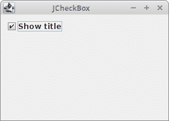
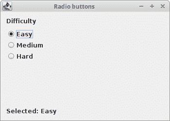
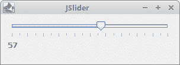
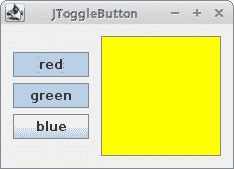
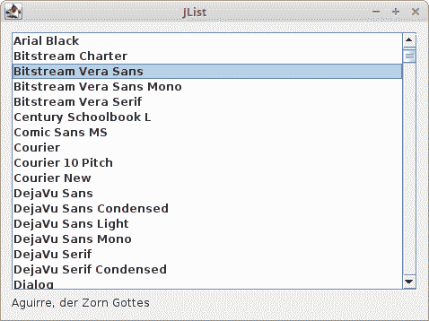
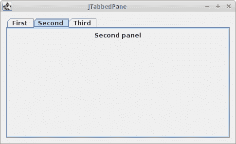
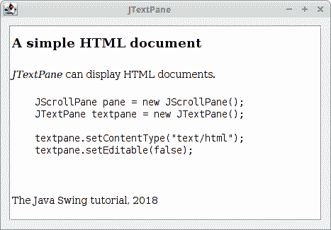

# 基本的 Swing 组件 II

> 原文： [http://zetcode.com/tutorials/javaswingtutorial/basicswingcomponentsII/](http://zetcode.com/tutorials/javaswingtutorial/basicswingcomponentsII/)

在 Java Swing 教程的这一章中，我们将继续描述 Java Swing 组件。

[Tweet](https://twitter.com/share) 

我们提到以下组件：`JCheckBox`，`JRadioButton`，`JSlider`，`JComboBox`，`JProgressBar`，`JToggleButton`，`JList`，`JTabbedPane`，`JTextArea`和`JTextPane`。

## `JCheckBox`

`JCheckBox`是带有标签的框，该标签具有两种状态：开和关。 如果选中此复选框，则在复选框中用勾号表示。 复选框可用于在启动时显示或隐藏启动屏幕，切换工具栏的可见性等。

通过`JCheckBox`可以使用`ActionListener`或`ItemListener`。 通常使用后一种选项。 `ItemListener`是用于接收项目事件的界面。 对处理项目事件感兴趣的类，例如 观察者，实现此接口。 使用组件的`addItemListener()`方法向组件注册观察者对象。 发生项目选择事件时，将调用观察者的`itemStateChanged()`方法。

`CheckBoxEx.java`

```java
package com.zetcode;

import javax.swing.GroupLayout;
import javax.swing.JCheckBox;
import javax.swing.JComponent;
import javax.swing.JFrame;
import java.awt.EventQueue;
import java.awt.event.ItemEvent;
import java.awt.event.ItemListener;

public class CheckBoxEx extends JFrame
        implements ItemListener {

    public CheckBoxEx() {

        initUI();
    }

    private void initUI() {

        var cb = new JCheckBox("Show title", true);
        cb.addItemListener(this);

        createLayout(cb);

        setSize(280, 200);
        setTitle("JCheckBox");
        setLocationRelativeTo(null);
        setDefaultCloseOperation(JFrame.EXIT_ON_CLOSE);
    }

    @Override
    public void itemStateChanged(ItemEvent e) {

        int sel = e.getStateChange();

        if (sel == ItemEvent.SELECTED) {

            setTitle("JCheckBox");
        } else {

            setTitle("");
        }
    }

    private void createLayout(JComponent... arg) {

        var pane = getContentPane();
        var gl = new GroupLayout(pane);
        pane.setLayout(gl);

        gl.setAutoCreateContainerGaps(true);

        gl.setHorizontalGroup(gl.createParallelGroup()
                .addComponent(arg[0])
        );

        gl.setVerticalGroup(gl.createSequentialGroup()
                .addComponent(arg[0])
        );
    }

    public static void main(String[] args) {

        EventQueue.invokeLater(() -> {

            var ex = new CheckBoxEx();
            ex.setVisible(true);
        });
    }
}

```

我们的代码示例根据是否选中复选框来显示或隐藏窗口的标题。

```java
public class CheckBoxEx extends JFrame
        implements ItemListener {

```

我们的应用类实现`ItemListener`。 这意味着该类必须提供`itemStateChanged()`方法，在该方法中我们对项目选择事件做出反应。

```java
var checkbox = new JCheckBox("Show title", true);

```

`JCheckBox`已创建。 此构造函数将文本和复选框的状态作为参数。 最初已选中该复选框。

```java
cb.addItemListener(this);

```

该应用类被注册为复选框选择事件的观察者。

```java
@Override
public void itemStateChanged(ItemEvent e) {

    int sel = e.getStateChange();

    if (sel == ItemEvent.SELECTED) {

        setTitle("JCheckBox");
    } else {

        setTitle("");
    }
}  

```

我们调用`ItemEvent's` `getStateChange()`方法来确定复选框的状态。 `ItemEvent`是一个语义事件，指示已选择或取消选择一项。 它被发送到注册的观察者。 根据复选框的状态，我们使用`setTitle()`方法显示或隐藏窗口的标题。



Figure: JCheckBox

请注意复选框文本周围的蓝色矩形。 它指示此组件具有键盘焦点。 可以使用 `Space` 键选择和取消选中该复选框。

## `JRadioButton`

`JRadioButton`允许用户从一组选项中选择一个独占选项。 它与`ButtonGroup`组件一起使用。

`RadioButtonEx.java`

```java
package com.zetcode;

import javax.swing.ButtonGroup;
import javax.swing.GroupLayout;
import javax.swing.JComponent;
import javax.swing.JFrame;
import javax.swing.JLabel;
import javax.swing.JRadioButton;
import javax.swing.LayoutStyle;
import java.awt.EventQueue;
import java.awt.event.ItemEvent;
import java.awt.event.ItemListener;

import static javax.swing.LayoutStyle.ComponentPlacement.RELATED;

public class RadioButtonEx extends JFrame
        implements ItemListener {

    private JLabel sbar;

    public RadioButtonEx() {

        initUI();
    }

    private void initUI() {

        var lbl = new JLabel("Difficulty");

        var group = new ButtonGroup();

        var rb1 = new JRadioButton("Easy", true);
        var rb2 = new JRadioButton("Medium");
        var rb3 = new JRadioButton("Hard");

        group.add(rb1);
        group.add(rb2);
        group.add(rb3);

        sbar = new JLabel("Selected: Easy");

        rb1.addItemListener(this);
        rb2.addItemListener(this);
        rb3.addItemListener(this);

        createLayout(lbl, rb1, rb2, rb3, sbar);

        setSize(350, 250);
        setTitle("Radio buttons");
        setLocationRelativeTo(null);
        setDefaultCloseOperation(JFrame.EXIT_ON_CLOSE);
    }

    @Override
    public void itemStateChanged(ItemEvent e) {

        int sel = e.getStateChange();

        if (sel == ItemEvent.SELECTED) {

            var button = (JRadioButton) e.getSource();
            var text = button.getText();

            var sb = new StringBuilder("Selected: ");
            sb.append(text);

            sbar.setText(sb.toString());
        }
    }

    private void createLayout(JComponent... arg) {

        var pane = getContentPane();
        var gl = new GroupLayout(pane);
        pane.setLayout(gl);

        gl.setAutoCreateContainerGaps(true);

        gl.setHorizontalGroup(gl.createParallelGroup()
                .addComponent(arg[0])
                .addComponent(arg[1])
                .addComponent(arg[2])
                .addComponent(arg[3])
                .addComponent(arg[4])
        );

        gl.setVerticalGroup(gl.createSequentialGroup()
                .addComponent(arg[0])
                .addPreferredGap(LayoutStyle.ComponentPlacement.UNRELATED)
                .addComponent(arg[1])
                .addComponent(arg[2])
                .addComponent(arg[3])
                .addPreferredGap(RELATED,
                        GroupLayout.DEFAULT_SIZE, Short.MAX_VALUE)
                .addComponent(arg[4])
        );
    }

    public static void main(String[] args) {

        EventQueue.invokeLater(() -> {

            var ex = new RadioButtonEx();
            ex.setVisible(true);
        });
    }
}

```

该示例具有三个单选按钮。 所选单选按钮的值将显示在状态栏中。

```java
var group = new ButtonGroup();

var rb1 = new JRadioButton("Easy", true);
var rb2 = new JRadioButton("Medium");
var rb3 = new JRadioButton("Hard");

group.add(rb1);
group.add(rb2);
group.add(rb3);

```

创建三个`JRadioButtons`并将其放入`ButtonGroup`中。 预选第一个单选按钮。

```java
rb1.addItemListener(this);
rb2.addItemListener(this);
rb3.addItemListener(this);

```

所有三个单选按钮共享一个`ItemListener`。

```java
if (sel == ItemEvent.SELECTED) {

```

当我们选择一个单选按钮时，实际上会触发两个事件：一个事件用于选择，另一个事件用于取消选择。 我们对选择感兴趣。

```java
var button = (JRadioButton) e.getSource();
var text = button.getText();

```

我们使用`getSource()`方法获取事件的来源，并获取单选按钮的文本标签。

```java
var sb = new StringBuilder("Selected: ");
sb.append(text);

sbar.setText(sb.toString());

```

我们构建字符串并将其设置为标签。



Figure: JRadioButtons

## `JSlider`

`JSlider`是一个组件，使用户可以通过在有限的间隔内滑动旋钮来以图形方式选择一个值。 移动滑块的旋钮，将调用滑块的`ChangeListener`的`stateChanged()`方法。

### `HScale`线

`JSlider`可以选择显示其值范围的刻度线。 刻度线由`setMinorTickSpacing()`，`setMajorTickSpacing()`和`setPaintTicks()`方法控制。

`SliderEx.java`

```java
package com.zetcode;

import javax.swing.GroupLayout;
import javax.swing.JComponent;
import javax.swing.JFrame;
import javax.swing.JLabel;
import javax.swing.JSlider;
import javax.swing.event.ChangeEvent;
import java.awt.EventQueue;

public class SliderEx extends JFrame {

    private JSlider slider;
    private JLabel lbl;

    public SliderEx() {

        initUI();
    }

    private void initUI() {

        slider = new JSlider(0, 100, 0);
        slider.setMinorTickSpacing(5);
        slider.setMajorTickSpacing(10);
        slider.setPaintTicks(true);

        slider.addChangeListener((ChangeEvent event) -> {

            int value = slider.getValue();
            lbl.setText(Integer.toString(value));
        });

        lbl = new JLabel("...");

        createLayout(slider, lbl);

        setTitle("JSlider");
        setDefaultCloseOperation(EXIT_ON_CLOSE);
        setLocationRelativeTo(null);
    }

    private void createLayout(JComponent... arg) {

        var pane = getContentPane();
        var gl = new GroupLayout(pane);
        pane.setLayout(gl);

        gl.setAutoCreateContainerGaps(true);
        gl.setAutoCreateGaps(true);

        gl.setHorizontalGroup(gl.createParallelGroup()
                .addComponent(arg[0])
                .addComponent(arg[1])
        );

        gl.setVerticalGroup(gl.createSequentialGroup()
                .addComponent(arg[0])
                .addComponent(arg[1])
        );

        pack();
    }

    public static void main(String[] args) {

        EventQueue.invokeLater(() -> {

            var ex = new SliderEx();
            ex.setVisible(true);
        });
    }
}

```

在代码示例中，从滑块选择的值显示在标签组件中。

```java
slider = new JSlider(0, 100, 0);

```

将使用最小值，最大值和当前值作为参数来创建`JSlider`。

```java
slider.setMinorTickSpacing(5);
slider.setMajorTickSpacing(10);

```

我们将次要刻度线和主要刻度线之间的距离设置为。

```java
slider.setPaintTicks(true);

```

`setPaintTicks()`方法确定是否在滑块上绘制刻度线。

```java
slider.addChangeListener((ChangeEvent event) -> {

    int value = slider.getValue();
    lbl.setText(Integer.toString(value));
});

```

当滑块进行某种更改时，将触发`ChangeEvent`。 我们使用`getValue()`方法获得滑块的当前值，使用`Integer.toString()`将整数转换为字符串，然后使用标签的`setText()`方法将其设置为标签。



Figure: JSlider

### 音量控件

第二个示例使用`JSlider`创建音量控件。

`SliderEx2.java`

```java
package com.zetcode;

import javax.swing.GroupLayout;
import javax.swing.ImageIcon;
import javax.swing.JComponent;
import javax.swing.JFrame;
import javax.swing.JLabel;
import javax.swing.JSlider;
import javax.swing.event.ChangeEvent;
import java.awt.EventQueue;

public class SliderEx2 extends JFrame {

    private JSlider slider;
    private JLabel lbl;

    private ImageIcon mute;
    private ImageIcon min;
    private ImageIcon med;
    private ImageIcon max;

    public SliderEx2() {

        initUI();
    }

    private void initUI() {

        loadImages();

        slider = new JSlider(0, 150, 0);

        slider.addChangeListener((ChangeEvent event) -> {

            int value = slider.getValue();

            if (value == 0) {
                lbl.setIcon(mute);
            } else if (value > 0 && value <= 30) {
                lbl.setIcon(min);
            } else if (value > 30 && value < 80) {
                lbl.setIcon(med);
            } else {
                lbl.setIcon(max);
            }
        });

        lbl = new JLabel(mute, JLabel.CENTER);

        createLayout(slider, lbl);

        setTitle("JSlider");
        setDefaultCloseOperation(EXIT_ON_CLOSE);
        setLocationRelativeTo(null);
    }

    private void loadImages() {

        mute = new ImageIcon("src/resources/mute.png");
        min = new ImageIcon("src/resources/min.png");
        med = new ImageIcon("src/resources/med.png");
        max = new ImageIcon("src/resources/max.png");
    }

    private void createLayout(JComponent... arg) {

        var pane = getContentPane();
        var gl = new GroupLayout(pane);
        pane.setLayout(gl);

        gl.setAutoCreateContainerGaps(true);
        gl.setAutoCreateGaps(true);

        gl.setHorizontalGroup(gl.createSequentialGroup()
                .addComponent(arg[0])
                .addComponent(arg[1])
        );

        gl.setVerticalGroup(gl.createParallelGroup()
                .addComponent(arg[0])
                .addComponent(arg[1])
        );

        pack();
    }

    public static void main(String[] args) {

        EventQueue.invokeLater(() -> {

            var ex = new SliderEx2();
            ex.setVisible(true);
        });
    }
}

```

在代码示例中，我们显示了`JSlider`和`JLabel`组件。 通过拖动滑块，我们可以更改标签组件上的图标。

```java
slider = new JSlider(0, 150, 0);

```

这是一个`JSlider`构造函数。 参数为最小值，最大值和当前值。

```java
private void loadImages() {

    mute = new ImageIcon("src/resources/mute.png");
    min = new ImageIcon("src/resources/min.png");
    med = new ImageIcon("src/resources/med.png");
    max = new ImageIcon("src/resources/max.png");
}

```

在`loadImages()`方法中，我们从磁盘加载图像文件。

```java
slider.addChangeListener((ChangeEvent event) -> {
...
});

```

我们将`ChangeListener`添加到滑块。 在监听器内部，我们确定当前的滑块值并相应地更新标签。


Figure: JSlider as a volume control

## `JComboBox`

`JComboBox`是一个组合了按钮或可编辑字段和下拉列表的组件。 用户可以从下拉列表中选择一个值，该列表应用户的要求出现。 如果使组合框可编辑，则组合框将包含一个可编辑字段，用户可以在其中输入值。

`ComboBoxEx.java`

```java
package com.zetcode;

import javax.swing.GroupLayout;
import javax.swing.JComboBox;
import javax.swing.JComponent;
import javax.swing.JFrame;
import javax.swing.JLabel;
import java.awt.EventQueue;
import java.awt.event.ItemEvent;
import java.awt.event.ItemListener;

import static javax.swing.GroupLayout.Alignment.BASELINE;

public class ComboBoxEx extends JFrame
        implements ItemListener {

    private JLabel display;
    private JComboBox<String> box;
    private String[] distros;

    public ComboBoxEx() {

        initUI();
    }

    private void initUI() {

        distros = new String[]{"Ubuntu", "Redhat", "Arch",
                "Debian", "Mint"};

        box = new JComboBox<>(distros);
        box.addItemListener(this);

        display = new JLabel("Ubuntu");

        createLayout(box, display);

        setTitle("JComboBox");
        setDefaultCloseOperation(JFrame.EXIT_ON_CLOSE);
        setLocationRelativeTo(null);
    }

    private void createLayout(JComponent... arg) {

        var pane = getContentPane();
        var gl = new GroupLayout(pane);
        pane.setLayout(gl);

        gl.setAutoCreateContainerGaps(true);
        gl.setAutoCreateGaps(true);

        gl.setHorizontalGroup(gl.createSequentialGroup()
                .addComponent(arg[0])
                .addComponent(arg[1])
        );

        gl.setVerticalGroup(gl.createParallelGroup(BASELINE)
                .addComponent(arg[0])
                .addComponent(arg[1])
        );

        pack();
    }

    @Override
    public void itemStateChanged(ItemEvent e) {

        if (e.getStateChange() == ItemEvent.SELECTED) {
            display.setText(e.getItem().toString());
        }
    }

    public static void main(String[] args) {

        EventQueue.invokeLater(() -> {

            var ex = new ComboBoxEx();
            ex.setVisible(true);
        });
    }
}

```

在我们的示例中，我们有一个组合框和一个标签。 组合框包含一个字符串列表，这些字符串表示 Linux 发行版的名称。 从组合框中选择的项目显示在标签中。 组合框使用其`ItemListener`来检测更改。

```java
distros = new String[] {"Ubuntu", "Redhat", "Arch", 
    "Debian", "Mint"};

```

`JComboBox`将保存这些字符串值。

```java
display = new JLabel("Ubuntu");

```

显示区域是简单的`JLabel`。 它显示该项目最初显示在组合框中。

```java
box = new JComboBox<>(distros);
box.addItemListener(this);

```

`JComboBox`的构造函数采用 Linux 发行版的字符串数组。 我们将监听器插入创建的对象。

```java
gl.setVerticalGroup(gl.createParallelGroup(BASELINE)
        .addComponent(arg[0])
        .addComponent(arg[1])
);

```

在垂直方向上，两个组件将与其文本的基线对齐。

```java
@Override
public void itemStateChanged(ItemEvent e) {

    if (e.getStateChange() == ItemEvent.SELECTED) {
        display.setText(e.getItem().toString());
    }
}    

```

当用户选择或取消选择一个项目时，将调用`itemStateChanged()`。 我们检查`ItemEvent.SELECTED`状态，并将组合框的所选项目设置为标签。


Figure: JComboBox

## `JProgressBar`

进度条是我们处理冗长的任务时使用的组件。 它具有动画效果，以便用户知道我们的任务正在进行中。 `JProgressBar`组件提供水平或垂直进度条。 初始和最小值为 0，最大值为 100。

`ProgressBarEx.java`

```java
package com.zetcode;

import javax.swing.AbstractAction;
import javax.swing.GroupLayout;
import javax.swing.JButton;
import javax.swing.JComponent;
import javax.swing.JFrame;
import javax.swing.JProgressBar;
import javax.swing.Timer;
import java.awt.EventQueue;
import java.awt.event.ActionEvent;
import java.awt.event.ActionListener;

import static javax.swing.GroupLayout.Alignment.CENTER;

public class ProgressBarEx extends JFrame {

    private Timer timer;
    private JProgressBar progBar;
    private JButton startBtn;
    private final int MAX_VAL = 100;

    public ProgressBarEx() {

        initUI();
    }

    private void initUI() {

        progBar = new JProgressBar();
        progBar.setStringPainted(true);

        startBtn = new JButton("Start");
        startBtn.addActionListener(new ClickAction());

        timer = new Timer(50, new UpdateBarListener());

        createLayout(progBar, startBtn);

        setTitle("JProgressBar");
        setDefaultCloseOperation(EXIT_ON_CLOSE);
        setLocationRelativeTo(null);
    }

    private void createLayout(JComponent... arg) {

        var pane = getContentPane();
        var gl = new GroupLayout(pane);
        pane.setLayout(gl);

        gl.setAutoCreateContainerGaps(true);
        gl.setAutoCreateGaps(true);

        gl.setHorizontalGroup(gl.createSequentialGroup()
                .addComponent(arg[0])
                .addComponent(arg[1])
        );

        gl.setVerticalGroup(gl.createParallelGroup(CENTER)
                .addComponent(arg[0])
                .addComponent(arg[1])
        );

        pack();
    }

    private class UpdateBarListener implements ActionListener {

        @Override
        public void actionPerformed(ActionEvent e) {

            int val = progBar.getValue();

            if (val >= MAX_VAL) {

                timer.stop();
                startBtn.setText("End");
                return;
            }

            progBar.setValue(++val);
        }
    }

    private class ClickAction extends AbstractAction {

        @Override
        public void actionPerformed(ActionEvent e) {

            if (timer.isRunning()) {

                timer.stop();
                startBtn.setText("Start");

            } else if (!"End".equals(startBtn.getText())) {

                timer.start();
                startBtn.setText("Stop");
            }
        }
    }

    public static void main(String[] args) {

        EventQueue.invokeLater(() -> {

            var ex = new ProgressBarEx();
            ex.setVisible(true);
        });
    }
}

```

该示例显示一个进度条和一个按钮。 该按钮将启动和停止进度。

```java
progBar = new JProgressBar();
progBar.setStringPainted(true);

```

在这里，我们创建`JProgressBar`组件。 最小值为 0，最大值为 100，初始值为 0。这是默认值。 `setStringPainted()`方法确定进度条是否显示已完成任务的百分比。

```java
timer = new Timer(50, new UpdateBarListener());

```

计时器对象每 50 毫秒启动一次`UpdateBarListener`。 在监听器内部，我们检查进度条是否达到最大值。

```java
private class UpdateBarListener implements ActionListener {

    @Override
    public void actionPerformed(ActionEvent e) {

        int val = progBar.getValue();

        if (val >= MAX_VAL) {

            timer.stop();
            startBtn.setText("End");
            return;
        }

        progBar.setValue(++val);
    }
}

```

监听器的`actionPerformed()`方法增加进度条的当前值。 如果达到最大值，则计时器停止计时，并且按钮的标签设置为“ End”。

```java
private class ClickAction extends AbstractAction {

    @Override
    public void actionPerformed(ActionEvent e) {

        if (timer.isRunning()) {

            timer.stop();
            startBtn.setText("Start");

        } else if (!"End".equals(startBtn.getText())) {

            timer.start();
            startBtn.setText("Stop");
        }
    }
}

```

该按钮启动或停止计时器。 该按钮的文本会动态更新。 它可以具有“开始”，“停止”或“结束”字符串值。


Figure: JProgressBar

## `JToggleButton`

`JToggleButton`是具有两种状态的按钮：已按下和未按下。 我们通过单击在这两种状态之间切换。 在某些情况下此功能非常合适。

`ToggleButtonEx.java`

```java
package com.zetcode;

import javax.swing.GroupLayout;
import javax.swing.JComponent;
import javax.swing.JFrame;
import javax.swing.JPanel;
import javax.swing.JToggleButton;
import javax.swing.border.LineBorder;
import java.awt.Color;
import java.awt.Dimension;
import java.awt.EventQueue;
import java.awt.event.ActionEvent;
import java.awt.event.ActionListener;

import static javax.swing.GroupLayout.Alignment.CENTER;
import static javax.swing.LayoutStyle.ComponentPlacement.UNRELATED;

public class ToggleButtonEx extends JFrame
        implements ActionListener {

    private JToggleButton redBtn;
    private JToggleButton greenBtn;
    private JToggleButton blueBtn;
    private JPanel display;

    public ToggleButtonEx() {

        initUI();
    }

    private void initUI() {

        redBtn = new JToggleButton("red");
        redBtn.addActionListener(this);

        greenBtn = new JToggleButton("green");
        greenBtn.addActionListener(this);

        blueBtn = new JToggleButton("blue");
        blueBtn.addActionListener(this);

        display = new JPanel();
        display.setPreferredSize(new Dimension(120, 120));
        display.setBorder(LineBorder.createGrayLineBorder());
        display.setBackground(Color.black);

        createLayout(redBtn, greenBtn, blueBtn, display);

        setTitle("JToggleButton");
        setLocationRelativeTo(null);
        setDefaultCloseOperation(JFrame.EXIT_ON_CLOSE);
    }

    private void createLayout(JComponent... arg) {

        var pane = getContentPane();
        var gl = new GroupLayout(pane);
        pane.setLayout(gl);

        gl.setAutoCreateContainerGaps(true);
        gl.setAutoCreateGaps(true);

        gl.setHorizontalGroup(gl.createSequentialGroup()
                .addGroup(gl.createParallelGroup()
                        .addComponent(arg[0])
                        .addComponent(arg[1])
                        .addComponent(arg[2]))
                .addPreferredGap(UNRELATED)
                .addComponent(arg[3])
        );

        gl.setVerticalGroup(gl.createParallelGroup(CENTER)
                .addGroup(gl.createSequentialGroup()
                        .addComponent(arg[0])
                        .addComponent(arg[1])
                        .addComponent(arg[2]))
                .addComponent(arg[3])
        );

        gl.linkSize(redBtn, greenBtn, blueBtn);

        pack();
    }

    @Override
    public void actionPerformed(ActionEvent e) {

        var color = display.getBackground();

        int red = color.getRed();
        int green = color.getGreen();
        int blue = color.getBlue();

        if (e.getActionCommand().equals("red")) {
            if (red == 0) {
                red = 255;
            } else {
                red = 0;
            }
        }

        if (e.getActionCommand().equals("green")) {
            if (green == 0) {
                green = 255;
            } else {
                green = 0;
            }
        }

        if (e.getActionCommand().equals("blue")) {
            if (blue == 0) {
                blue = 255;
            } else {
                blue = 0;
            }
        }

        var setCol = new Color(red, green, blue);
        display.setBackground(setCol);
    }

    public static void main(String[] args) {

        EventQueue.invokeLater(() -> {

            var ex = new ToggleButtonEx();
            ex.setVisible(true);
        });
    }
}

```

该示例具有三个切换按钮和一个面板。 我们将显示面板的背景色设置为黑色。 切换按钮将切换颜色值的红色，绿色和蓝色部分。 背景颜色取决于我们按下的切换按钮。

```java
redBtn = new JToggleButton("red");
redBtn.addActionListener(this);

```

在这里，我们创建一个切换按钮并为其设置一个动作监听器。

```java
display = new JPanel();
display.setPreferredSize(new Dimension(120, 120));
display.setBorder(LineBorder.createGrayLineBorder());
display.setBackground(Color.black);

```

这是显示通过切换按钮混合的颜色值的面板。 我们设置其首选大小（默认值非常小），将边界线更改为灰色，并设置初始背景色。

```java
var color = display.getBackground();

int red = color.getRed();
int green = color.getGreen();
int blue = color.getBlue();

```

在`actionPerformed()`方法中，我们确定显示背景色的当前红色，绿色和蓝色部分。

```java
if (e.getActionCommand().equals("red")) {
    if (red == 0) {
        red = 255;
    } else {
        red = 0;
    }
}

```

我们确定切换了哪个按钮，并相应地更新 RGB 值的颜色部分。

```java
var setCol = new Color(red, green, blue);
display.setBackground(setCol);

```

创建新的颜色，并将显示面板更新为新的颜色。



Figure: JToggleButton

## `JList`组件

`JList`是显示对象列表的组件。 它允许用户选择一项或多项。

`ListEx.java`

```java
package com.zetcode;

import javax.swing.GroupLayout;
import javax.swing.JComponent;
import javax.swing.JFrame;
import javax.swing.JLabel;
import javax.swing.JList;
import javax.swing.JScrollPane;
import java.awt.EventQueue;
import java.awt.Font;
import java.awt.GraphicsEnvironment;

public class ListEx extends JFrame {

    private JLabel label;
    private JScrollPane spane;

    public ListEx() {

        initUI();
    }

    private void initUI() {

        var ge = GraphicsEnvironment.getLocalGraphicsEnvironment();
        var fonts = ge.getAvailableFontFamilyNames();
        var list = new JList(fonts);

        list.addListSelectionListener(e -> {

            if (!e.getValueIsAdjusting()) {

                var name = (String) list.getSelectedValue();
                var font = new Font(name, Font.PLAIN, 12);

                label.setFont(font);
            }
        });

        spane = new JScrollPane();
        spane.getViewport().add(list);

        label = new JLabel("Aguirre, der Zorn Gottes");
        label.setFont(new Font("Serif", Font.PLAIN, 12));

        createLayout(spane, label);

        setTitle("JList");
        setDefaultCloseOperation(EXIT_ON_CLOSE);
        setLocationRelativeTo(null);
    }

    private void createLayout(JComponent... arg) {

        var pane = getContentPane();
        var gl = new GroupLayout(pane);
        pane.setLayout(gl);

        gl.setAutoCreateContainerGaps(true);
        gl.setAutoCreateGaps(true);

        gl.setHorizontalGroup(gl.createParallelGroup()
                .addComponent(arg[0])
                .addComponent(arg[1])

        );

        gl.setVerticalGroup(gl.createSequentialGroup()
                .addComponent(arg[0])
                .addComponent(arg[1])
        );

        pack();
    }

    public static void main(String[] args) {

        EventQueue.invokeLater(() -> {

            var ex = new ListEx();
            ex.setVisible(true);
        });
    }
}

```

在我们的示例中，我们将显示`JList`和`JLabel`组件。 list 组件包含我们系统上所有可用字体系列名称的列表。 如果我们从列表中选择一项，则标签将以所选字体显示。

```java
var ge = GraphicsEnvironment.getLocalGraphicsEnvironment();
var fonts = ge.getAvailableFontFamilyNames();

```

在这里，我们获得系统上所有可能的字体系列名称。

```java
var list = new JList(fonts);

```

我们创建一个`JList`组件。

```java
list.addListSelectionListener(e -> {
    if (!e.getValueIsAdjusting()) {
        ...
    }
});

```

列表选择中的事件已分组。 我们收到选择和取消选择项目的事件。 为了仅过滤选择事件，我们使用`getValueIsAdjusting()`方法。

```java
var name = (String) list.getSelectedValue();
var font = new Font(name, Font.PLAIN, 12);
label.setFont(font);

```

我们得到所选项目并为标签设置新字体。

```java
spane = new JScrollPane();
spane.getViewport().add(list);

```

`JList`可以包含的项目比实际显示在窗口上的项目多。 默认情况下它不可滚动。 我们将列表放入`JScrollPane`以使其可滚动。



Figure: JList

## `JTabbedPane`组件

`JTabbedPane`是允许用户通过单击选项卡在一组组件之间切换的组件。

`TabbedPaneEx.java`

```java
package com.zetcode;

import javax.swing.GroupLayout;
import javax.swing.JComponent;
import javax.swing.JFrame;
import javax.swing.JLabel;
import javax.swing.JPanel;
import javax.swing.JTabbedPane;
import java.awt.EventQueue;

public class TabbedPaneEx extends JFrame {

    public TabbedPaneEx() {

        initUI();
    }

    private void initUI() {

        var tabbedPane = new JTabbedPane();

        tabbedPane.addTab("First", createPanel("First panel"));
        tabbedPane.addTab("Second", createPanel("Second panel"));
        tabbedPane.addTab("Third", createPanel("Third panel"));

        createLayout(tabbedPane);

        setTitle("JTabbedPane");
        setLocationRelativeTo(null);
        setDefaultCloseOperation(EXIT_ON_CLOSE);
    }

    private JPanel createPanel(String text) {

        var panel = new JPanel();
        var lbl = new JLabel(text);
        panel.add(lbl);

        return panel;
    }

    private void createLayout(JComponent... arg) {

        var pane = getContentPane();
        var gl = new GroupLayout(pane);
        pane.setLayout(gl);

        gl.setAutoCreateContainerGaps(true);
        gl.setAutoCreateGaps(true);

        gl.setHorizontalGroup(gl.createSequentialGroup()
                .addComponent(arg[0])
        );

        gl.setVerticalGroup(gl.createParallelGroup()
                .addComponent(arg[0])
        );

        pack();
    }

    public static void main(String[] args) {

        EventQueue.invokeLater(() -> {

            var ex = new TabbedPaneEx();
            ex.setVisible(true);
        });
    }
}

```

在示例中，我们有一个带有三个选项卡的选项卡式窗格。 每个选项卡都显示一个带有标签的面板。

```java
var tabbedPane = new JTabbedPane();

```

创建一个新的`JTabbedPane`。

```java
tabbedPane.addTab("First", createPanel("First panel"));

```

使用`addTab()`方法，我们创建了一个新标签。 第一个参数是选项卡显示的标题。 第二个参数是单击选项卡时要显示的组件。



Figure: JTabbedPane

## `JTextArea`组件

`JTextArea`是显示纯文本的多行文本区域。 它是用于处理文本的轻量级组件。 该组件不处理滚动。 对于此任务，我们使用`JScrollPane`组件。

`TextAreaEx.java`

```java
package com.zetcode;

import javax.swing.GroupLayout;
import javax.swing.JComponent;
import javax.swing.JFrame;
import javax.swing.JScrollPane;
import javax.swing.JTextArea;
import java.awt.Dimension;
import java.awt.EventQueue;

public class TextAreaEx extends JFrame {

    public TextAreaEx() {

        initUI();
    }

    private void initUI() {

        var area = new JTextArea();
        var spane = new JScrollPane(area);

        area.setLineWrap(true);
        area.setWrapStyleWord(true);

        createLayout(spane);

        setTitle("JTextArea");
        setSize(new Dimension(350, 300));
        setDefaultCloseOperation(EXIT_ON_CLOSE);
        setLocationRelativeTo(null);
    }

    private void createLayout(JComponent... arg) {

        var pane = getContentPane();
        var gl = new GroupLayout(pane);
        pane.setLayout(gl);

        gl.setAutoCreateContainerGaps(true);
        gl.setAutoCreateGaps(true);

        gl.setHorizontalGroup(gl.createParallelGroup()
                .addComponent(arg[0])

        );

        gl.setVerticalGroup(gl.createSequentialGroup()
                .addComponent(arg[0])
        );

        pack();
    }

    public static void main(String[] args) {

        EventQueue.invokeLater(() -> {

            var ex = new TextAreaEx();
            ex.setVisible(true);
        });
    }
}

```

该示例显示了一个简单的`JTextArea`组件。

```java
var area = new JTextArea(); 

```

这是`JTextArea`组件的构造函数。

```java
var spane = new JScrollPane(area);

```

为了使文本可滚动，我们将`JTextArea`组件放入`JScrollPane`组件。

```java
area.setLineWrap(true);

```

如果线条太长而无法容纳文本区域的宽度，则`setLineWrap()`会对其进行换行。

```java
area.setWrapStyleWord(true);

```

在这里，我们指定线将如何包装。 在我们的例子中，行将被包裹在单词边界（空白）处。


Figure: JTextArea

## `JTextPane`组件

`JTextPane`组件是用于处理文本的更高级的组件。 该组件可以对文本执行一些复杂的格式化操作。 它也可以显示 HTML 文档。

`test.html`

```java
<!DOCTYPE html>
<html>
<head>
    <title>Simple HTML document</title>
    <meta charset="UTF-8">
    <meta name="viewport" content="width=device-width, initial-scale=1.0">
</head>
<body>
    <h2>A simple HTML document</h2>

    <p>
        <em>JTextPane</em> can display HTML documents.
    </p>

    <br>

    <pre>
    JScrollPane pane = new JScrollPane();
    JTextPane textpane = new JTextPane();

    textpane.setContentType("text/html");
    textpane.setEditable(false);
    </pre>

    <br>
    <p>The Java Swing tutorial, 2018</p>

</body>
</html>

```

这是我们正在加载到`JTextPane`组件中的 HTML 代码。 该组件不处理滚动。

`TextPaneEx.java`

```java
package com.zetcode;

import javax.swing.GroupLayout;
import javax.swing.JComponent;
import javax.swing.JFrame;
import javax.swing.JScrollPane;
import javax.swing.JTextPane;
import java.awt.EventQueue;
import java.io.IOException;
import java.util.logging.Level;
import java.util.logging.Logger;

public class TextPaneEx extends JFrame {

    private JTextPane textPane;

    public TextPaneEx() {

        initUI();
    }

    private void initUI() {

        textPane = new JTextPane();
        var spane = new JScrollPane(textPane);

        textPane.setContentType("text/html");
        textPane.setEditable(false);

        loadFile();

        createLayout(spane);

        setTitle("JTextPane");
        setDefaultCloseOperation(EXIT_ON_CLOSE);
        setLocationRelativeTo(null);
    }

    private void createLayout(JComponent... arg) {

        var pane = getContentPane();
        var gl = new GroupLayout(pane);
        pane.setLayout(gl);

        gl.setAutoCreateContainerGaps(true);
        gl.setAutoCreateGaps(true);

        gl.setHorizontalGroup(gl.createSequentialGroup()
                .addComponent(arg[0])
        );

        gl.setVerticalGroup(gl.createParallelGroup()
                .addComponent(arg[0])
        );

        pack();
    }

    private void loadFile() {

        try {
            var curDir = System.getProperty("user.dir") + "/";
            textPane.setPage("File:///" + curDir + "test.html");
        } catch (IOException ex) {
            Logger.getLogger(this.getName()).log(Level.SEVERE,
                    "Failed to load file", ex);
        }
    }

    public static void main(String[] args) {

        EventQueue.invokeLater(() -> {

            var ex = new TextPaneEx();
            ex.setVisible(true);
        });
    }
}

```

在我们的示例中，我们显示`JTextPane`组件并加载 HTML 文档。 HTML 文档是从当前工作目录加载的。 当我们使用 IDE 时，它是一个项目目录。 该示例显示了组件的格式化功能。

```java
var textpane = new JTextPane(); 

textpane.setContentType("text/html");
textpane.setEditable(false);

```

我们创建一个`JTextPane`组件，将该组件的内容设置为 HTML 文档并禁用编辑。

```java
private void loadFile() {

    try {
        var curDir = System.getProperty("user.dir") + "/";
        textPane.setPage("File:///" + curDir + "test.html");
    } catch (IOException ex) {
        Logger.getLogger(this.getName()).log(Level.SEVERE,
                "Failed to load file", ex);
    }
}

```

在这里，我们确定用户的当前工作目录。 我们将 HTML 文档加载到窗格中。



Figure: JTextPane

在本章中，我们继续介绍基本的 Swing 组件，包括`JCheckBox`，`JRadioButton`，`JSlider`，`JComboBox`，`JProgressBar`，`JToggleButton`，`JList`，`JTabbedPane`，`JTextArea`和 `JTextPane`。