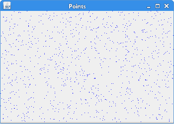
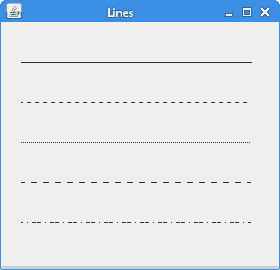
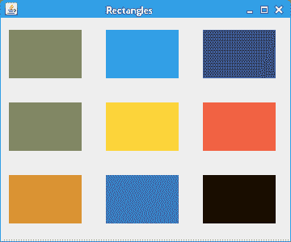
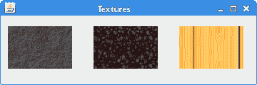
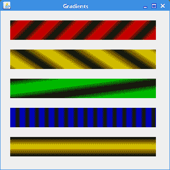

# Swing 中的绘图

> 原文： [http://zetcode.com/tutorials/javaswingtutorial/painting/](http://zetcode.com/tutorials/javaswingtutorial/painting/)

Swing 的绘图系统能够渲染向量图形，图像和轮廓基于字体的文本。

[Tweet](https://twitter.com/share) 

当我们想要更改或增强现有的小部件，或者要从头开始创建自定义小部件时，应用中需要绘图。要进行绘图，我们使用 Swing 工具箱提供的绘图 API。

绘图是在`paintComponent()`方法中完成的。 在绘图过程中，我们使用`Graphics2D`对象。

## Swing 2D 向量图形

有两种不同的计算机图形：向量图形和栅格图形。 栅格图形将图像表示为像素的集合。 向量图形是使用诸如点，线，曲线或多边形之类的几何图元来表示图像。 这些基元是使用数学方程式创建的。

两种类型的计算机图形都有优点和缺点。 向量图形优于栅格的优点是：

*   较小的尺寸
*   无限放大的能力
*   移动，缩放，填充或旋转不会降低图像质量

### 基本类型

*   点数
*   线
*   折线
*   多边形
*   界
*   椭圆
*   花键

## Swing 绘制点

最简单的图形原语是点。 它是窗口上的一个点。 在 Swing 中没有方法可以画点。 要画点，我们使用`drawLine()`方法。 我们使用一分两次。

`PointsEx.java`

```java
package com.zetcode;

import javax.swing.JFrame;
import javax.swing.JPanel;
import java.awt.Color;
import java.awt.EventQueue;
import java.awt.Graphics;
import java.awt.Graphics2D;
import java.util.Random;

class DrawPanel extends JPanel {

    private void doDrawing(Graphics g) {

        var g2d = (Graphics2D) g;

        g2d.setColor(Color.blue);

        for (int i = 0; i <= 1000; i++) {

            var size = getSize();
            var insets = getInsets();

            int w = size.width - insets.left - insets.right;
            int h = size.height - insets.top - insets.bottom;

            var r = new Random();
            int x = Math.abs(r.nextInt()) % w;
            int y = Math.abs(r.nextInt()) % h;
            g2d.drawLine(x, y, x, y);
        }
    }

    @Override
    public void paintComponent(Graphics g) {

        super.paintComponent(g);
        doDrawing(g);
    }
}

public class PointsEx extends JFrame {

    public PointsEx() {

        initUI();
    }

    private void initUI() {

        var drawPanel = new DrawPanel();
        add(drawPanel);

        setSize(350, 250);
        setTitle("Points");
        setLocationRelativeTo(null);
        setDefaultCloseOperation(JFrame.EXIT_ON_CLOSE);
    }

    public static void main(String[] args) {

        EventQueue.invokeLater(() -> {

            var ex = new PointsEx();
            ex.setVisible(true);
        });
    }
}

```

有一点很难观察到。 因此，我们在面板表面上随机绘制了 1000 个点。

```java
class DrawPanel extends JPanel {

```

我们正在自定义绘图面板上绘图，该面板是`JPanel`组件。 绘图面板稍后将添加到`JFrame`组件。

```java
@Override
public void paintComponent(Graphics g) {

    super.paintComponent(g);
    doDrawing(g);
}

```

自定义绘图是在`paintComponent()`方法内部执行的，我们将其覆盖。 `super.paintComponent()`方法调用父类的方法。 准备用于绘图的组件需要做一些必要的工作。 实际图形委托给`doDrawing()`方法。

```java
var g2d = (Graphics2D) g;

```

Swing 中的绘制是在`Graphics2D`对象上完成的。

```java
g2d.setColor(Color.blue);

```

我们将点涂成蓝色。

```java
var size = getSize();
var insets = getInsets();

```

窗口的大小包括边框和标题栏。 我们不在那画。

```java
int w =  size.width - insets.left - insets.right;
int h =  size.height - insets.top - insets.bottom;

```

在这里，我们计算面积，在此我们将有效地绘制点。

```java
var r = new Random();
int x = Math.abs(r.nextInt()) % w;
int y = Math.abs(r.nextInt()) % h;

```

我们得到一个上面计算出的区域大小范围内的随机数。

```java
g2d.drawLine(x, y, x, y);

```

在这里，我们指出了这一点。 如前所述，我们使用`drawLine()`方法。 我们两次指定相同的点。



Figure: Points

## Swing 绘制线

线是简单的图形基元。 它使用两点绘制。

`LinesEx.java`

```java
package com.zetcode;

import java.awt.BasicStroke;
import java.awt.EventQueue;
import java.awt.Graphics;
import java.awt.Graphics2D;
import javax.swing.JFrame;
import javax.swing.JPanel;

class DrawPanel extends JPanel {

    private void doDrawing(Graphics g) {

        var g2d = (Graphics2D) g;

        float[] dash1 = {2f, 0f, 2f};
        float[] dash2 = {1f, 1f, 1f};
        float[] dash3 = {4f, 0f, 2f};
        float[] dash4 = {4f, 4f, 1f};

        g2d.drawLine(20, 40, 250, 40);

        var bs1 = new BasicStroke(1, BasicStroke.CAP_BUTT,
                BasicStroke.JOIN_ROUND, 1.0f, dash1, 2f);

        var bs2 = new BasicStroke(1, BasicStroke.CAP_BUTT,
                BasicStroke.JOIN_ROUND, 1.0f, dash2, 2f);

        var bs3 = new BasicStroke(1, BasicStroke.CAP_BUTT,
                BasicStroke.JOIN_ROUND, 1.0f, dash3, 2f);

        var bs4 = new BasicStroke(1, BasicStroke.CAP_BUTT,
                BasicStroke.JOIN_ROUND, 1.0f, dash4, 2f);

        g2d.setStroke(bs1);
        g2d.drawLine(20, 80, 250, 80);

        g2d.setStroke(bs2);
        g2d.drawLine(20, 120, 250, 120);

        g2d.setStroke(bs3);
        g2d.drawLine(20, 160, 250, 160);

        g2d.setStroke(bs4);
        g2d.drawLine(20, 200, 250, 200);
    }

    @Override
    public void paintComponent(Graphics g) {

        super.paintComponent(g);
        doDrawing(g);
    }
}

public class LinesEx extends JFrame {

    public LinesEx() {

        initUI();
    }

    private void initUI() {

        var drawPanel = new DrawPanel();
        add(drawPanel);

        setSize(280, 270);
        setTitle("Lines");
        setLocationRelativeTo(null);
        setDefaultCloseOperation(JFrame.EXIT_ON_CLOSE);
    }

    public static void main(String[] args) {

        EventQueue.invokeLater(() -> {

            var ex = new LinesEx();
            ex.setVisible(true);
        });
    }
}

```

在示例中，我们绘制了五条线。 第一行使用默认值绘制。 其他将具有不同的粗细。 使用`BasicStroke`类创建笔划。 它为图形基元的轮廓定义了一组基本的渲染属性。

```java
float[] dash1 = { 2f, 0f, 2f };

```

在这里，我们创建一个在笔划对象中使用的破折号。

```java
var bs1 = new BasicStroke(1, BasicStroke.CAP_BUTT, 
    BasicStroke.JOIN_ROUND, 1.0f, dash1, 2f )

```

这段代码创建了一个笔画。 笔划定义线宽，端盖，线连接，斜接限制，破折号和破折号阶段。



Figure: Lines

## Swing 绘制矩形

要绘制矩形，我们使用`drawRect()`方法。 要使用当前颜色填充矩形，我们使用`fillRect()`方法。

`RectanglesEx.java`

```java
package com.zetcode;

import java.awt.Color;
import java.awt.EventQueue;
import java.awt.Graphics;
import java.awt.Graphics2D;
import javax.swing.JFrame;
import javax.swing.JPanel;

class DrawPanel extends JPanel {

    private void doDrawing(Graphics g) {

        var g2d = (Graphics2D) g;

        g2d.setColor(new Color(212, 212, 212));
        g2d.drawRect(10, 15, 90, 60);
        g2d.drawRect(130, 15, 90, 60);
        g2d.drawRect(250, 15, 90, 60);
        g2d.drawRect(10, 105, 90, 60);
        g2d.drawRect(130, 105, 90, 60);
        g2d.drawRect(250, 105, 90, 60);
        g2d.drawRect(10, 195, 90, 60);
        g2d.drawRect(130, 195, 90, 60);
        g2d.drawRect(250, 195, 90, 60);

        g2d.setColor(new Color(125, 167, 116));
        g2d.fillRect(10, 15, 90, 60);

        g2d.setColor(new Color(42, 179, 231));
        g2d.fillRect(130, 15, 90, 60);

        g2d.setColor(new Color(70, 67, 123));
        g2d.fillRect(250, 15, 90, 60);

        g2d.setColor(new Color(130, 100, 84));
        g2d.fillRect(10, 105, 90, 60);

        g2d.setColor(new Color(252, 211, 61));
        g2d.fillRect(130, 105, 90, 60);

        g2d.setColor(new Color(241, 98, 69));
        g2d.fillRect(250, 105, 90, 60);

        g2d.setColor(new Color(217, 146, 54));
        g2d.fillRect(10, 195, 90, 60);

        g2d.setColor(new Color(63, 121, 186));
        g2d.fillRect(130, 195, 90, 60);

        g2d.setColor(new Color(31, 21, 1));
        g2d.fillRect(250, 195, 90, 60);
    }

    @Override
    public void paintComponent(Graphics g) {

        super.paintComponent(g);
        doDrawing(g);
    }
}

public class RectanglesEx extends JFrame {

    public RectanglesEx() {

        initUI();
    }

    private void initUI() {

        var drawPanel = new DrawPanel();
        add(drawPanel);

        setSize(360, 300);
        setTitle("Rectangles");
        setLocationRelativeTo(null);
        setDefaultCloseOperation(JFrame.EXIT_ON_CLOSE);
    }

    public static void main(String[] args) {

        EventQueue.invokeLater(() -> {

            var ex = new RectanglesEx();
            ex.setVisible(true);
        });
    }
}

```

在示例中，我们绘制了九个彩色矩形。

```java
g2d.setColor(new Color(212, 212, 212));
g2d.drawRect(10, 15, 90, 60);
...

```

我们将矩形轮廓的颜色设置为柔和的灰色，以免干扰填充颜色。 要绘制矩形的轮廓，我们使用`drawRect()`方法。 前两个参数是 x 和 y 值。 第三和第四是宽度和高度。

```java
g2d.fillRect(10, 15, 90, 60);

```

为了用颜色填充矩形，我们使用`fillRect()`方法。



Figure: Rectangles

## Swing 使用纹理

纹理是应用于形状的位图图像。 要在 Java 2D 中使用纹理，我们使用`TexturePaint`类。

`TexturesEx.java`

```java
package com.zetcode;

import javax.imageio.ImageIO;
import javax.swing.JFrame;
import javax.swing.JOptionPane;
import javax.swing.JPanel;
import java.awt.EventQueue;
import java.awt.Graphics;
import java.awt.Graphics2D;
import java.awt.Rectangle;
import java.awt.TexturePaint;
import java.awt.image.BufferedImage;
import java.io.File;
import java.io.IOException;

class DrawingPanel extends JPanel {

    private BufferedImage slate;
    private BufferedImage java;
    private BufferedImage pane;

    public DrawingPanel() {

        loadImages();
    }

    private void loadImages() {

        try {

            slate = ImageIO.read(new File("src/resources/slate.png"));
            java = ImageIO.read(new File("src/resources/java.png"));
            pane = ImageIO.read(new File("src/resources/pane.png"));

        } catch (IOException ex) {

            JOptionPane.showMessageDialog(this,
                    "Could not load images", "Error", JOptionPane.ERROR_MESSAGE);
            System.exit(1);
        }
    }

    private void doDrawing(Graphics g) {

        var g2d = (Graphics2D) g.create();

        var slateTp = new TexturePaint(slate, new Rectangle(0, 0, 90, 60));
        var javaTp = new TexturePaint(java, new Rectangle(0, 0, 90, 60));
        var paneTp = new TexturePaint(pane, new Rectangle(0, 0, 90, 60));

        g2d.setPaint(slateTp);
        g2d.fillRect(10, 15, 90, 60);

        g2d.setPaint(javaTp);
        g2d.fillRect(130, 15, 90, 60);

        g2d.setPaint(paneTp);
        g2d.fillRect(250, 15, 90, 60);

        g2d.dispose();
    }

    @Override
    public void paintComponent(Graphics g) {

        super.paintComponent(g);
        doDrawing(g);
    }
}

class TexturesEx extends JFrame {

    public TexturesEx() {

        initUI();
    }

    private void initUI() {

        var drawingPanel = new DrawingPanel();
        add(drawingPanel);

        setTitle("Textures");
        setSize(360, 120);
        setLocationRelativeTo(null);
        setDefaultCloseOperation(JFrame.EXIT_ON_CLOSE);
    }

    public static void main(String[] args) {

        EventQueue.invokeLater(() -> {

            var ex = new TexturesEx();
            ex.setVisible(true);
        });
    }
}

```

在代码示例中，我们用三个不同的纹理填充三个矩形。

```java
private BufferedImage slate;
private BufferedImage java;
private BufferedImage pane;

```

`BufferedImage`是存储在内存中的像素矩形。 它是 Swing 中最重要的图像类型之一。 许多 Swing 方法都返回`BufferedImage`以供使用。

```java
slate = ImageIO.read(new File("src/resources/slate.png"));

```

在这里，我们使用`ImageIO.read()`方法将图像读取到缓冲图像中。 它接受`File`对象并返回`BufferedImage`。

```java
slateTp = new TexturePaint(slate, new Rectangle(0, 0, 90, 60));

```

我们从缓冲图像中创建一个`TexturePaint`类。

```java
g2d.setPaint(slateTp);
g2d.fillRect(10, 15, 90, 60);

```

我们用纹理填充一个矩形。



Figure: Textures

## Swing 使用渐变

在计算机图形学中，渐变是从浅到深或从一种颜色到另一种颜色的阴影的平滑混合。 在 2D 绘图程序和绘图程序中，渐变用于创建彩色背景和特殊效果以及模拟灯光和阴影。

`GradientsEx.java`

```java
package com.zetcode;

import java.awt.Color;
import java.awt.EventQueue;
import java.awt.GradientPaint;
import java.awt.Graphics;
import java.awt.Graphics2D;
import javax.swing.JFrame;
import javax.swing.JPanel;

class DrawPanel extends JPanel {

    private void doDrawing(Graphics g) {

        var g2d = (Graphics2D) g;

        var gp1 = new GradientPaint(5, 5,
                Color.red, 20, 20, Color.black, true);

        g2d.setPaint(gp1);
        g2d.fillRect(20, 20, 300, 40);

        var gp2 = new GradientPaint(5, 25,
                Color.yellow, 20, 2, Color.black, true);

        g2d.setPaint(gp2);
        g2d.fillRect(20, 80, 300, 40);

        var gp3 = new GradientPaint(5, 25,
                Color.green, 2, 2, Color.black, true);

        g2d.setPaint(gp3);
        g2d.fillRect(20, 140, 300, 40);

        var gp4 = new GradientPaint(25, 25,
                Color.blue, 15, 25, Color.black, true);

        g2d.setPaint(gp4);
        g2d.fillRect(20, 200, 300, 40);

        var gp5 = new GradientPaint(0, 0,
                Color.orange, 0, 20, Color.black, true);

        g2d.setPaint(gp5);
        g2d.fillRect(20, 260, 300, 40);
    }

    @Override
    public void paintComponent(Graphics g) {
        super.paintComponent(g);

        doDrawing(g);
    }
}

public class GradientsEx extends JFrame {

    public GradientsEx() {

        initUI();
    }

    private void initUI() {

        var drawPanel = new DrawPanel();
        add(drawPanel);

        setSize(350, 350);
        setTitle("Gradients");
        setLocationRelativeTo(null);
        setDefaultCloseOperation(JFrame.EXIT_ON_CLOSE);
    }

    public static void main(String[] args) {

        EventQueue.invokeLater(() -> {

            var ex = new GradientsEx();
            ex.setVisible(true);
        });
    }
}

```

我们的代码示例展示了五个带有渐变的矩形。

```java
var gp4 = new GradientPaint(25, 25, 
    Color.blue, 15, 25, Color.black, true);

```

要使用渐变，我们使用 Java Swing 的`GradientPaint`类。 通过操纵颜色值和起点，终点，我们可以获得不同类型的渐变。

```java
g2d.setPaint(gp5);

```

调用`setPaint()`方法激活渐变。



Figure: Gradients

## Swing 绘制文字

使用`drawString()`方法进行绘制。 我们指定我们要绘制的字符串以及文本在窗口区域中的位置。

`DrawingTextEx.java`

```java
package com.zetcode;

import javax.swing.JFrame;
import javax.swing.JPanel;
import java.awt.EventQueue;
import java.awt.Font;
import java.awt.Graphics;
import java.awt.Graphics2D;
import java.awt.RenderingHints;

class DrawPanel extends JPanel {

    private void doDrawing(Graphics g) {

        var g2d = (Graphics2D) g;

        var rh = new RenderingHints(
                RenderingHints.KEY_ANTIALIASING,
                RenderingHints.VALUE_ANTIALIAS_ON);

        rh.put(RenderingHints.KEY_RENDERING,
                RenderingHints.VALUE_RENDER_QUALITY);

        g2d.setRenderingHints(rh);

        var font = new Font("URW Chancery L", Font.BOLD, 21);
        g2d.setFont(font);

        g2d.drawString("Not marble, nor the gilded monuments", 20, 30);
        g2d.drawString("Of princes, shall outlive this powerful rhyme;", 20, 60);
        g2d.drawString("But you shall shine more bright in these contents",
                20, 90);
        g2d.drawString("Than unswept stone, besmear'd with sluttish time.",
                20, 120);
        g2d.drawString("When wasteful war shall statues overturn,", 20, 150);
        g2d.drawString("And broils root out the work of masonry,", 20, 180);
        g2d.drawString("Nor Mars his sword, nor war's quick "
                + "fire shall burn", 20, 210);
        g2d.drawString("The living record of your memory.", 20, 240);
        g2d.drawString("'Gainst death, and all oblivious enmity", 20, 270);
        g2d.drawString("Shall you pace forth; your praise shall still "
                + "find room", 20, 300);
        g2d.drawString("Even in the eyes of all posterity", 20, 330);
        g2d.drawString("That wear this world out to the ending doom.", 20, 360);
        g2d.drawString("So, till the judgment that yourself arise,", 20, 390);
        g2d.drawString("You live in this, and dwell in lovers' eyes.", 20, 420);
    }

    @Override
    public void paintComponent(Graphics g) {

        super.paintComponent(g);
        doDrawing(g);
    }
}

public class DrawingTextEx extends JFrame {

    public DrawingTextEx() {

        initUI();
    }

    private void initUI() {

        var drawPanel = new DrawPanel();
        add(drawPanel);

        setSize(500, 470);
        setTitle("Sonnet55");
        setLocationRelativeTo(null);
        setDefaultCloseOperation(JFrame.EXIT_ON_CLOSE);
    }

    public static void main(String[] args) {

        EventQueue.invokeLater(() -> {

            var ex = new DrawingTextEx();
            ex.setVisible(true);
        });
    }
}

```

在我们的示例中，我们在面板组件上绘制了十四行诗。

```java
var rh = new RenderingHints(
    RenderingHints.KEY_ANTIALIASING,
    RenderingHints.VALUE_ANTIALIAS_ON);

rh.put(RenderingHints.KEY_RENDERING, 
    RenderingHints.VALUE_RENDER_QUALITY);

g2d.setRenderingHints(rh);

```

这段代码是为了使我们的文本看起来更好。 我们使用`RenderingHints`应用称为抗锯齿的技术。

```java
var font = new Font("URW Chancery L", Font.BOLD, 21);
g2d.setFont(font);

```

我们为文本选择特定的字体。

```java
g2d.drawString("Not marble, nor the gilded monuments", 20, 30);

```

这是绘制文本的代码。

## Swing 绘制图像

工具包最重要的功能之一就是显示图像的能力。 图像是像素阵列。 每个像素代表给定位置的颜色。 我们可以使用`JLabel`之类的组件来显示图像，也可以使用 Java 2D API 绘制图像。

`DrawImageEx.java`

```java
package com.zetcode;

import javax.swing.ImageIcon;
import javax.swing.JFrame;
import javax.swing.JPanel;
import java.awt.Dimension;
import java.awt.EventQueue;
import java.awt.Graphics;
import java.awt.Graphics2D;
import java.awt.Image;

class DrawPanel extends JPanel {

    private Image myImage;

    public DrawPanel() {

        initPanel();
    }

    private void initPanel() {

        loadImage();
        var dm = new Dimension(myImage.getWidth(null), myImage.getHeight(null));
        setPreferredSize(dm);
    }

    private void loadImage() {

        myImage = new ImageIcon("src/resources/icesid.jpg").getImage();
    }

    private void doDrawing(Graphics g) {

        var g2d = (Graphics2D) g;

        g2d.drawImage(myImage, 0, 0, null);
    }

    @Override
    public void paintComponent(Graphics g) {

        super.paintComponent(g);
        doDrawing(g);
    }
}

public class DrawImageEx extends JFrame {

    public DrawImageEx() {

        initUI();
    }

    private void initUI() {

        var drawPanel = new DrawPanel();
        add(drawPanel);

        setTitle("Image");
        pack();
        setLocationRelativeTo(null);
        setDefaultCloseOperation(JFrame.EXIT_ON_CLOSE);
    }

    public static void main(String[] args) {

        EventQueue.invokeLater(() -> {

            var ex = new DrawImageEx();
            ex.setVisible(true);
        });
    }
}

```

本示例将在面板上绘制图像。 图像适合`JFrame`窗口。

```java
private void initPanel() {

    loadImage();
    var dm = new Dimension(img.getWidth(null), img.getHeight(null));
    setPreferredSize(dm);
}

```

在`initPanel()`方法中，我们称为`loadImage()`方法。 我们确定图像尺寸并设置面板组件的首选尺寸。 这将与`pack()`方法一起显示完全适合窗口的图像。

```java
private void loadImage() {

    myImage = new ImageIcon("src/resources/icesid.jpg").getImage();
}

```

该方法从磁盘加载映像。 我们使用`ImageIcon`类。 此类简化了 Java Swing 中图像的处理。

```java
g2d.drawImage(this.img, 0, 0, null);

```

使用`drawImage()`方法绘制图像。

在本章中，我们使用 Java Swing 进行了一些绘图。 请访问 ZetCode 的 [Java 2D 教程](/gfx/java2d)，以获取有关在 Swing 中绘图的其他信息。